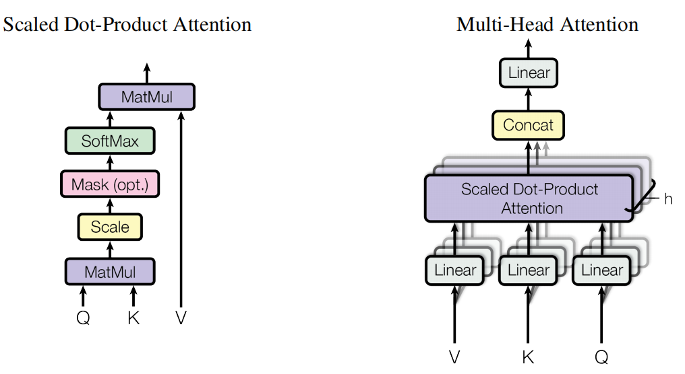
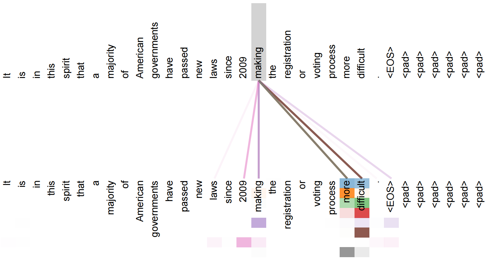
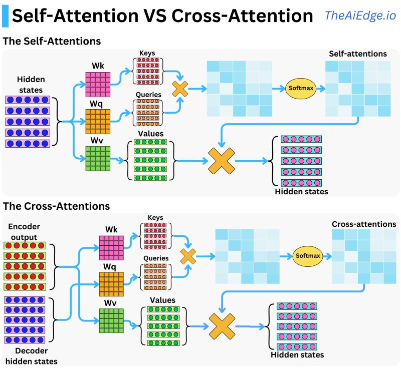
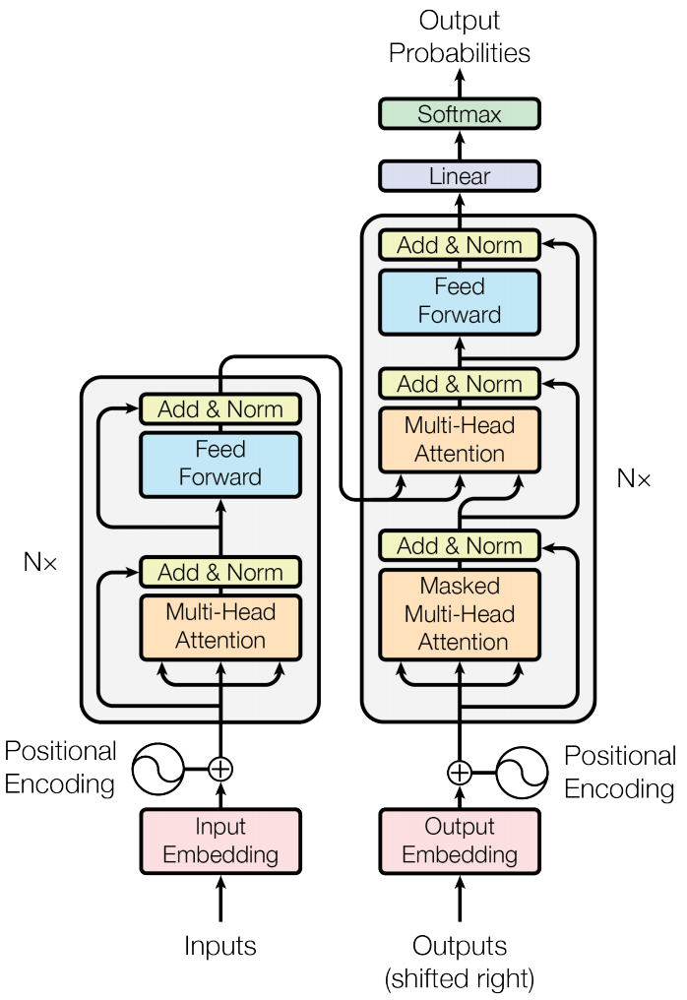
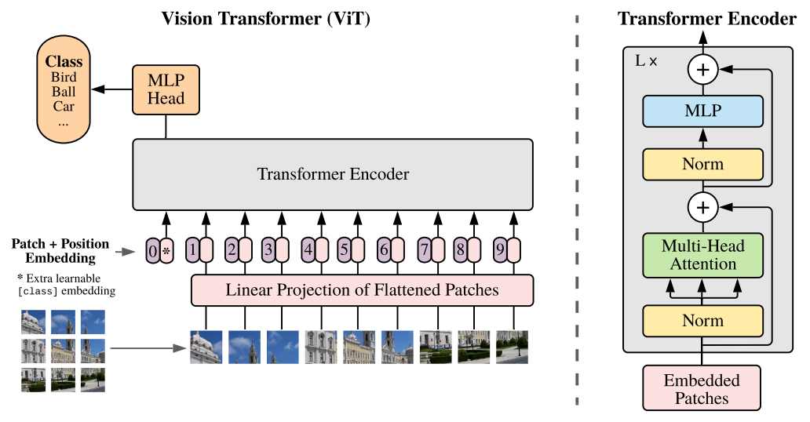
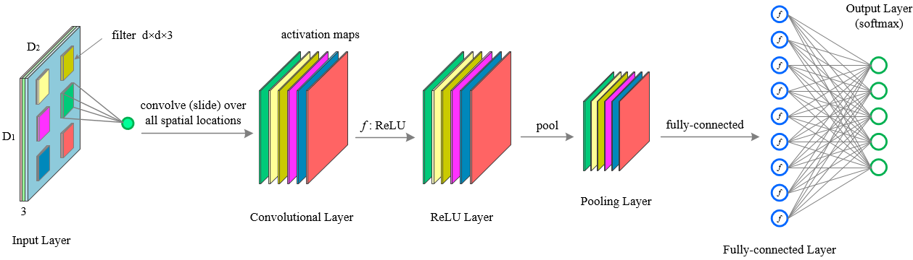
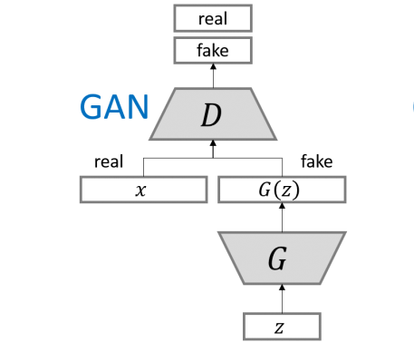
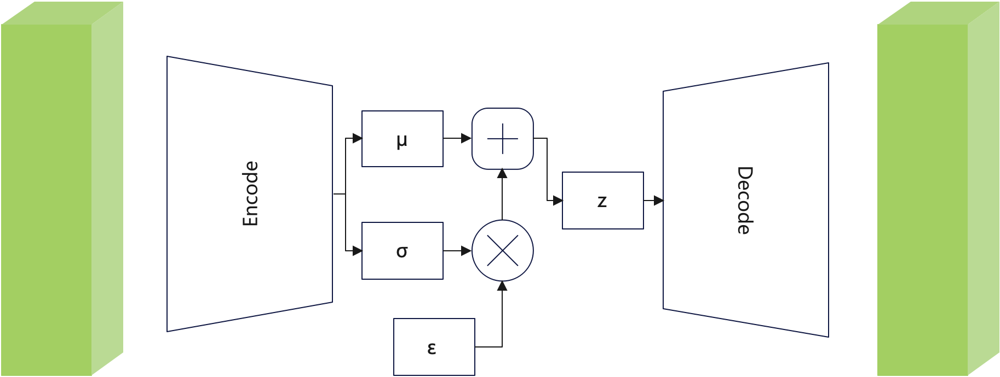
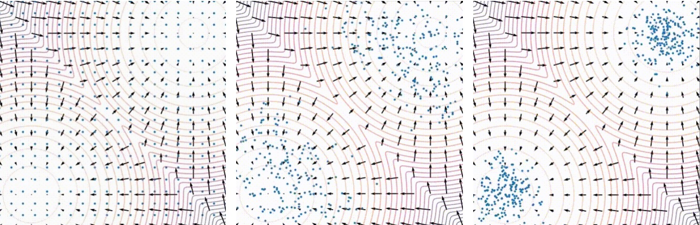
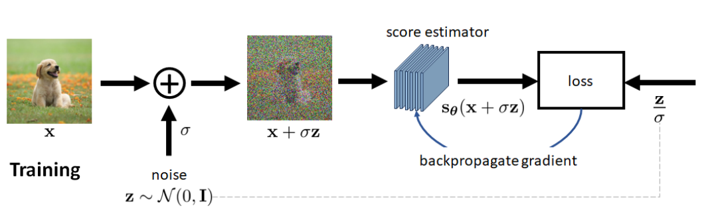

## 1. 从生成式自然语言模型说起
### 1.1 大模型，多“大”算大?
近年来，在AI机器生成的任务中，大模型（Large Model）成为了研究者和开发者关注的焦点。但是大模型的定义很不正规。多“大”算“大”我们并没有合理的定义。我们现在所认为的“大模型”是从自然语言处理（NLP）领域发展出来的。**在自然语言处理任务中，计算机技术对人类语言进行分析，为了理解和生成的各类人类语言任务。**这些任务涵盖了文本分类、情感分析、机器翻译、语音识别、问答系统、文本摘要、语音合成等诸多方面。通过让计算机学习大量文本数据以训练模型，我们能够使计算机执行各种复杂的语言理解和生成任务。从最初的简单神经网络，到后续的循环神经网络（RNN，2010年），再到基于Transformer的“大语言模型”BERT（2018年）、GPT2（2019年）等，自然语言处理任务在每个发展阶段的效果均实现了显著提升。每个阶段的技术进步，均伴随着模型参数规模的扩大、硬件的更新换代以及显卡算力的增强。经历过“2019年中美贸易摩擦”的相关人士皆知，美国对高算力显卡向中国出口的限制，实质上是对中国人工智能产业发展的基础硬件方面做出核心制约。
2021年，大家发现了自然语言模型的“涌现”问题。jason wei 在“**Finetuned Language Models Are Zero-Shot Learners**”论文中，整体分析了“涌现”现象。在这篇论文中，jason wei 提出了一个关键观点，伴随着模型参数数量的增长，只需微调的自然语言大参数模型就能够展现出“零样本学习（Zero-Shot Learners）”的能力。他通过实验展示了这些模型在未见过的任务上也能表现出色，这与传统的机器学习方法形成了鲜明对比。相比起原来海量数据训练的方案，零样本学习是一种更友好的机器学习技术。它允许模型在没有见过某些特定类别样本的情况下，仍然能够识别或理解这些类别。这种技术在处理大量类别或罕见类别的识别任务时特别有用。**本系列文章中，我们可以把拥有这种“涌现”能力的大语言模型，称为大模型。**

（多“大”算大？插图由Flux-dev生成）

### 1.2 Attention机制与Transformer模型

有人说，我们不是有关“计算机视觉”方面的文献吗？怎么先讲“自然语言处理”？因为自从ViT模型提出后，计算机视觉的模型也逐渐Transformer化了，注意力网络模型替代了卷积神经网络成为了计算机视觉的主要部分。Transformer模型最开始被用于自然语言处理，核心思想是通过自注意力（self-attention）机制来捕捉输入数据之间的依赖关系，为了更好地梳理整体技术流程，我们必须从自然语言任务说起。
Transformer结构由Ashish Vaswani等谷歌学者在“Attention Is All You Need”（2017年）论文提出，用于替换卷积神经网络在自然语言处理的底层结构。这种转变使得计算机视觉模型能够更好地捕捉图像中的全局依赖关系，从而提高识别和分类的准确性。这里我们需要解释下Attention机制与Transformer模型。
#### 1.2.1 Attention机制，新的“加权求和”方法
Attention机制，中文称为“注意力机制”。它核心其实是“加权求和”的思想：对不同一个数据序列（如自然语言处理的一句话）不同部分赋予不同大小的权重，权重比较大的部分即为我们想要突出的理解的部分，权重比较小的部分即为我们不想特别关注的部分。如果权重是多维的，我们可以构造出突出不同关注点的权重序列，从而从不同的维度关注到输入数据中的重要部分。那么，这种“权重”怎么是得来的呢？模型训练的结果！又是“加权求和”，卷积神经网络不也是加权求和吗？对，目前我们所有的模型的基础构件都是建立在“加权求和”的基础上。只不过卷积神经网络因为卷积窗口大小的问题天然导致了“感受野不大”的问题，导致数据序列后面的部分看不到前面的部分从而导致整体序列的部分割裂。而Attention机制在创立时就注意到了这一点，直接创造了Cross-Attention（交叉注意力模型），与Self-Attention（自注意力模型）。

 
（小学老师教学“加权求和”知识，插图由Flux-dev生成）

注意力数学模型的定义如下：
$$\text{Attention}(Q, K, V ) = \text{softmax}(\frac{QK^T}{\sqrt{d^k}})V$$
我们看到Attention函数的输入参数有3个变量Q、K、V。
- Q代表Query，即查询向量，它代表了模型当前关注的焦点或问题。我们在使用搜索引擎或使用翻译软件时，在输入框输入的问题就可以看做Query，Q查询向量。
- K代表Key，即键向量，它与查询向量进行比较，用于确定注意力的分布。
- V代表Value，即值向量，它蕴含了信息，是注意力机制最终输出的结果。我们很早接触到了KV键值对的概念。但在Attention机制中，K和V的关系并不局限于一对一或一对多的简单映射。Attention机制能够计算出每个Query与每个Key之间的相关性，进而生成一个加权的Value序列。换句话说在“加权求和”的表示中，Q、K一起计算出权重，而V需要被加权的数据。

Attention公式中，d代表Q的维度。为了防止V的权重解码器计算标准不统一（大数干扰），所以这里使用了softmax函数将V前面的权重全部回归到0到1。

在机器中文翻译英文的翻译任务中，一个Query可以代表当前正在翻译的中文句子，而Key和Value则来自于整个英文词表，模型通过计算Query、Key的乘积可以得到的加权到Value英文序列的权重。从而生成更准确的翻译结果。**这样的Q与K、V不同的Attention操作就是Cross-Attention，即为交叉注意力机制。**

但是有时，我们会将Q、K、V使用同一个编码序列。**这样的Q与K、V相同的Attention操作就是Self-Attention，即为自注意力机制。**这么做是让模型理解输入数据序列的内在含义。例如我们在做阅读理解任务时，我们需要将一篇阅读文章，使用Self-Attention操作用于提取关键信息。在实际使用中Cross-Attention与Self-Attention经常配合使用。

多头注意力（Multi-Head Attention）类似于“卷积神经网络”的“多层感知机”的概念，每个“头”（head）使用不同的线性变换参数独立执行一次计算。这样，模型可以同时关注输入数据的不同部分，从而捕捉到更复杂的依赖关系和语义信息。通过这种方式，多头注意力能够提高模型对数据的理解能力，增强其处理自然语言的能力。

 
（多头机制，图片来自Attention is all you need论文）

 

（Self-Attention对一句话的理解。我们发现“making”这个单词对“make” “more difficult”注意力更强，颜色越深注意力越强。因为我们使用了多“头”权重，所以这里是颜色块用多行表示，每一行代表一次权重训练。图片来自Attention is all you need论文）

 
（Self-Attetion与Cross-Attetion的演示，图片侵权可以更换）
#### 1.2.2 Transformer模型
Transformer模型通过Self-Attention自注意力机制来捕捉输入序列中不同位置之间的依赖关系，从而能够更有效地处理长距离依赖问题。Transformer模型的核心是多层的编码器（encoder）和解码器（decoder），其中编码器负责理解输入文本，解码器则负责生成输出文本。下图为一种常见的Transformer模型结构。Transformer模型的核心优势在于其并行化处理能力和对长距离依赖关系的捕捉能力。与传统的卷积神经网络相比，Transformer模型能够一次性处理整个输入序列不用考虑感受野的问题，大大提高了计算效率。

 
（Transformer模型结构，图片来自Attention is all you need论文）

#### 1.2.3 ViT，Vision Transformer
ViT的提出同样来自谷歌大脑团队Alexey Dosovitskiy等人的论文“AN IMAGE IS WORTH 16X16 WORDS: TRANSFORMERS FOR IMAGE RECOGNITION AT SCALE”（2020年，后面简称“ViT论文”）。在此之前也有很多人将Transformer迁移到图像任务里面，但效果没有这篇文章好。ViT这篇论文彻底抛弃了CNN卷积神经网络的使用，完全将Transformer模型引入到图像识别中。使得图像识别和分类任务的性能得到了显著提升。在论文中作者将图像分割成多个小块，然后将这些小块作为数据序列输入到Transformer模型中，模型能够有效地捕捉图像内部的全局依赖关系。这种全局信息的捕捉能力，使得Transformer模型在处理复杂图像任务时，比传统的卷积神经网络具有更大的优势。

（ViT模型中图像分片方法与Transformer结构设计，图片来自ViT论文）
对ViT的介绍仅限于技术的梳理发展不做深究，因为技术发展会导致很多技术细节会更新换代。如有兴趣，请阅读原文。

#### 1.2.4 自然语言处理与计算机视觉模型基础Transformer化的意义
从2012年AlexNet引领的人工智能深度学习浪潮开始，卷积神经网络CNN成为处理视觉信息的主流工具，计算机视觉（Computer Vision，CV）在这一波浪潮中飞速发展。同时期自然语言处理（Natural Language Processing，NLP）也使用类CNN的RNN工具来进行自己任务的构建。计算机视觉和自然语言处理两学科的亲密互动一直存在。但随着时间的推移，谷歌大脑团队为自然语言处理发明了Transformer模型，以其独特的自注意力机制在处理长距离依赖问题上的优势，为自然语言处理和计算机视觉领域带来了新的视角。同时ViT的创新使Transformer模型在计算机视觉的图像处理任务中展示出了其强大的能力，这不仅仅是模型架构的升级，更是对AI发展新趋势的预测和引领。
此时出现了如下很重要问题：
1. Transformer是否可以为两个领域之间的融合提供了理论基础？
2. 如果计算机视觉和自然语言处理，可以通过Transformer融合，那么计算机语音、计算机视频、光学字符识别等其他领域是否也可以同样Transformer化，最后形成一个大一统的多模态大模型？
我们现在知道了，各个公司已经开始了这样大模型研发。本系列文章阐述不了这么广的内容，仅专注于计算机图像生成这一个方面。后面我们开始详细介绍相关理论，我的目标是争取让大学一年级的学历的人可以看懂相关理论。
## 2. 生成式计算机视觉GAN
故事的开端是一群专注于创作“宅向”漫画师。这些漫画师们日复一日地为粉丝们绘制着他们心目中的“理想伴侣”。然而，漫画界竞争激烈，行业运作模式已发生转变，目前“多女主角”和“女团主题”正成为市场的新宠。漫画师们面临一个不成文的规则：“剧情可以杂乱无章，但后宫角色的数量必须众多。”在漫画中，如果一下创造了九位性格迥异的女性角色，总有一款能够触动读者的心。如果这还不够，还有众多“路人女角色”可供选择。因此，负责设计这些“虚拟伴侣”的漫画师们感到了巨大的压力。他们渴望解脱，梦想着如果有台机器能代为绘图该有多好。图像生成技术的可以适当地解决这种需求。从2015年开始，众多开源项目着手“动漫角色头像生成任务”。有兴趣的在可以github上搜索nagadomi的lbpcascade_animeface项目下载数据集。（当然数据也可以自己搜集。）训练你自己的动漫头像。
这些项目主要利用了一种名为生成对抗网络（Generative Adversarial Networks，GAN）的先进算法，以实现图像的自动生成。从上一篇文章中，我们知道Transformer是在2017年为自然语言处理发明的，所以这时的GAN并没有，并没有使用Attention机制，而是卷积神经网络CNN机制。
### 2.1 以卷积神经网络为基础的GAN网络
卷积神经网络（Convolutional Neural Networks，CNN）在图像处理领域取得了革命性的进展。其独特的结构使得它在处理像素数据时具有天然的优势。CNN通过卷积层、池化层和全连接层的组合，能够自动学习图像的特征表示，从而在图像识别、分类和生成等任务中表现出色。
写卷积神经网络的文章已经太多了，我这里写一下不一样的东西：如何依据数学公式如何设计合适的神经网络，并以生成对抗网络GAN为例进行推导。首先我们先明确各个层次的作用。
- 卷积层（Convolutional Layer，conv）：**负责提取输入数据的局部特征**。通过使用一组可学习的滤波器（或称为卷积核），卷积层能够检测图像中的边缘、角点等简单特征，并在后续的层中组合这些特征以识别更复杂的模式。
- 非线性层（Non-Linear Layer）：**非线性层通常位于卷积层之后，其主要目的是引入非线性激活函数，如ReLU（Rectified Linear Unit）或Sigmoid函数，以增加网络的表达能力**。这种非线性变换使得网络能够学习和模拟复杂的函数映射，从而能够处理非线性可分的数据。通过非线性层，CNN能够捕捉到图像中的非线性特征，这对于图像分类和识别任务至关重要。

- 池化层（Pooling Layer，pool）：**负责降低特征图的空间尺寸，从而减少计算量和防止过拟合**。池化操作通常包括最大池化和平均池化，它们通过选取局部区域内的最大值或平均值来实现特征的下采样。这不仅减少了数据的维度，还保留了重要的特征信息，同时增加了网络对小的平移、旋转和缩放的不变性。

- 全连接层（Fully-connected Layer）：**负责将前面层提取的特征进行整合，形成最终的决策**。全连接层很像改变神经网络输出维度的**适配胶水层**。对于分类网络它常常位于网络的末端，它将卷积层和池化层提取的局部特征映射到样本标记空间。通过学习不同特征组合的权重，全连接层能够对输入数据进行分类或回归分析。在设计全连接层时，需要考虑其神经元的数量，这通常与任务的复杂度和输出类别的数量有关。过多的神经元可能导致过拟合，而过少则可能无法捕捉到足够的信息以做出准确的预测。

（卷积层，非线性层，池化层，全连接层，图片来自斯坦福大学CS231n课程PPT）

接着，我们推理GAN的数学表达。**生成对抗网络**（Generative Adversarial Networks，GAN）由两部分组成：生成器（Generator）和判别器（Discriminator）。生成器负责创建图像，而判别器则尝试区分生成的图像和真实图像。在训练过程中，生成器不断学习如何生成更逼真的图像，而判别器则不断提高其鉴别能力。这种对抗过程推动了生成器的不断进步，最终能够产生高质量的图像。GAN的结构如下表示。

(GAN结构设计)

那么我们可以将GAN先数学化表示：

|     | 输入                | 输出               | 方法                    |
| --- | :---------------- | :--------------- | --------------------- |
| 生成器 | 噪音（假设噪声是$n*n*1$维） | 图片（$N*N*3$维向量）   | $G(z)$                |
| 判别器 | 图片（$N*N*3$维向量）    | 真假图片Bool判断（1维向量） | $D(x_{real})，D(G(z))$ |

从生成器看，从噪声到图片的过程。根据神经网络设计经验，我们可以遵守如下原则设计整体网络：
- 主干过程可以使用卷积层、非线性层堆叠来实现，但这种操作一般是不改变输入输出维度的。
- 如果让输入维度n变成输出维度N，可以使用池化（降维）或反池化（升维）进行处理。一般建议不要连续池化。
- 卷积核的个数建议以”先增后降“的形式降到3维，卷积核个数增加为了做多特征构造器（或提取器），卷积核个数降低为了提取有效特征到最后的目标3。
- 根据VGG论文的方法，卷积核大小建议设置为$3*3$ 。$5*5$的卷积可以用2个$3*3$ 卷积核替代，且参数更低。
- 图片一个像素一般是RGB三维，运算中可以先把他们三通道独立出来，更好计算。
- 每个卷积操作后还有一层非线性操作。如果没有，多层卷积叠起来会统合成一个多项式操作，造成网络退化。
那么生成器整体卷积过程设计如下：

（生成器$D(z)$设计方案 ，从噪声到图像的神经网络搭建。本图片仅仅提供一个搭建思路，不代表没有问题。每个卷积操作后还有一层非线性操作，这里省略了。）

判别器的设计一样遵循如此定义，只不过最后用全连接层解决维度统一的问题。

（判别器$G(x)$设计方案 ，就是简单的图像评分网络。本图片仅仅提供一个搭建思路，不代表没有问题。每个卷积操作后还有一层非线性操作，这里省略了。）这里对卷积神经网络GAN的阐述比较少，GAN网络的训练也是GAN的一门学问。我们这里没有详细描述，因为我们主要进行扩散模型的书写并不打算说GAN，如有需要可以自己看GAN相关论文。但是还有一个问题我们必须要重点说一下：使用什么指标计算生成式图像任务的损失函数呢？
相对熵（relative entropy），或被称为Kullback-Leibler散度（Kullback-Leibler divergence），KL散度。这个指标很重要，后面的理论也是基于这个指标推论的。我们从头开始梳理一下。
### 2.2 从熵到相对熵（KL散度）
#### 2.2.1 熵
熵的原意是对混乱程度的衡量。而在shannon的信息论中，我们拓展了“熵”的意思。按照百度百科的说法：给定一个字符集的概率分布，我们可以设计一种编码，使得表示该字符集组成的字符串平均需要的比特数最少。即，假设这个字符集是 $X$，对$x \in X$ ，其出现概率为$P(x)$  ，那么其最优编码平均需要的比特数等于这个字符集的熵：
$$H(p)=\sum_{x \in X}^{} p(x)*log\frac{1}{p(x)}$$
眼力好的人可以看出来，这很像期望计算公式:$\sum x*p(x)$。对，就是$log\frac{1}{p(x)}$的期望。由于信息论需求是“编码”，所以需要使用$log\frac{1}{p(x)}$来预估编码的位数。如果是二进制，这里的log就以2为底。
这么表示有很大的好处：当所有样本等几率出现的情况下，熵达到最大值（所有可能的事件等概率时不确定性最高）。即**绝对平均，熵最大。**

#### 2.2.2 交叉熵
理想很丰满，现实很闹心。现实是我们不知道真实分布$p(x)$。我们只能通过另一个分布$q(x)$来趋近表示真实分布$p(x)$。此时平均编码长度的期望应该是
$$\sum_{x \in X}^{} p(x)*log\frac{1}{q(x)}$$
我们将其记为$H(p,q)$,称之为p与q的交叉熵。交叉熵（Cross Entropy）是Shannon信息论中一个重要概念，主要用于度量两个概率分布间的差异性信息。
按照熵的公式，我们可以得到这样的结论：
$H(p,q) \geqslant H(p)$，且当q为真实分布p时，等号成立。即当两个分布重合时，交叉熵最小为：$H(p,q)=H(p)$。
#### 2.2.3 从熵，交叉熵再到相对熵
直接看公式，相对熵可以表示为
$$KL(p||q)=H(p,q)-H(p)=\sum_{x \in X}^{} p(x)*log\frac{p(x)}{q(x)} $$

1. 这也就意味着它是非对称的，$KL(P||Q) \neq   KL(Q||P)$
2. 与交叉熵类似，可将真实分布$H(p(x))$视为不变量。
3. 当p，q两个分布重合时，相对熵最小为0。

细心地朋友都意识到了一点，**交叉熵**与**相对熵**的本质一个东西，都是对两个分布的重合度的衡量。但是相对熵更常用，因为它的最小值为0。我们最小化这个值就可以拉近”生成图片“与”真实图片“两个分布。这个分布十分重要，生成图片与真实图片像不像，在计算机层面需要一个明确的评分算法。有了这个分布我们就可以正式开始扩散模型的内容了。
## 3. 初识扩散模型 

### 3.1 扩散模型概述

扩散模型是继生成对抗网络（GAN）后的，在图像合成领域表现更好的生成模型。
扩散模型算法是一种受到热力学中非平衡热力学分支启发的算法，其思想来源是扩散过程。“扩散”的含义很形象，就像一副在水中用染色剂画的简笔画。简笔画落在水中会慢慢扩散开,最后达到完全模糊。扩散模型也是使用这样的原理。“简笔画在水面的扩散过程”可以类比为在图像中持续加入噪声信息。噪声逐渐增加直至图像完全被噪声覆盖的过程，就是我们模拟出图像逐渐模糊的效果。反过来考虑，如果我们从噪声信息出发，不断地有指向性地去噪，就可以生成有意义的图片了。


（树状彩色染色剂在水中开始扩散，图片由FLUX生成）

上述的扩散过程在我们这里的表示如下：通过深度学习方法从纯噪声数据逐渐对数据进行去噪的过程，从单个图像样来看这个过程，扩散过程q就是不断往图像上加噪声直到图像变成一个纯噪声。扩散过程从开始的0到最后的T或从最后的T到开始的0可以看成马尔可夫链结构，中间的p，q操作可以表示状态空间中经过从一个状态到另一个状态的转换的随机过程。逆扩散过程p就是从纯噪声生成一张图像的过程。


(扩散模型过程简述)

在后续的逻辑推演过程中，我们将以基础的数学公式为起点，运用相当于大学二年级水平的理论知识进行深入的推导。（值得注意的是，在某些省份，这些知识内容可能已经被包含在高中课程中）此举旨在使读者能够全面理解扩散模型的整个推理过程。鉴于扩散模型的公式具有一定的复杂性，对于那些更倾向于工程应用而非理论探索的工程型读者，我们建议不必过分纠结于具体的推理细节，只需了解“在特定情境下，公式的输入与输出分别是什么”即可。
目前，扩散模型有多种解释方法：**基于噪声的扩散模型，基于分数的扩散模型，基于微分方程的扩散模型**。三者本质一样，但我建议最好都了解一下，否则论文可能看不懂。鉴于扩散模型的构建过程相当复杂，我们将从核心**变分自编码器（VAE**）开始介绍。通过遵循特定规则的多层VAE的堆叠，可以构建出扩散模型。鉴于这部分内容是全书的核心，我们不会像介绍生成对抗网络（GAN）那样进行简略的阐述，而是将详细解析扩散模型的构建过程。

## 4. 基于噪声的扩散模型：从VAE开始
基于噪声扩散模型（Denoising Diffusion Probabilistic Model，简称DDPM）是一种生成模型，用于生成高质量的图像、音频或其他类型的数据。这种模型通过模拟一个数据样本在噪声的干扰下逐步退化的过程，然后学习如何将这个退化的过程逆转，从而生成新的、干净的数据样本。DDPM的核心思想是，通过一系列的扩散步骤将干净的数据逐步添加噪声，再通过一系列的去噪步骤，从噪声数据中恢复出干净的数据。接下来我们会梳理公式，逐步推理DDPM的相关理论。
### 4.1 证据下界ELBO
在数学领域，"隐变量"这一术语通常用于描述那些不易直接观察或测量的变量。在统计模型或理论框架中，隐变量扮演着解释表象背后深层原因的角色。我们将观测数据$x$与隐变量$z$相结合，构建一个联合分布$p(x,z)$，并定义观测数据$x$的边缘概率为$p(x)$。下面使用基于"似然"原理的生成模型，最大化观测数据$x$的概率$p(x)$。实现这一目标有两种方法。首先我们可以对隐变量 $z$ 求边缘积分：
$$p(x)= \int p(x,z)dz \tag{1.1}$$

或者，我们求助于概率的链式法则：
$$p(x)=\frac {p(x,z)}{p(z|x)} \tag{1.2}$$
公式（1.1）的方案直接通过计算 $p(x)$ 是非常困难的，因为它涉及到所有隐变量 $z$ 的计算，如果模型是以神经网络为代表的复杂模型会非常棘手。公式（1.2）中，$p(x,z)$ 可以认为在隐变量 $z$ 存在的同时具有条件 $x$ 的输出；$p(z|x)$ 是获取隐变量的解码器，用于从观测 $x$ 中预测隐变量 $z$ 。利用公式（1.2），我们就可以推导出 $p(x)$ 的证据下界（Evidence Lower Bound，ELBO）。个人认为“证据下界”不算原理，它仅仅是一种优化思路。“最大化ELBO”即为优化目标函数的下界，记为“ELBO代理目标函数”。当然，最完美的情况就是ELBO完全等价于目标函数。

让我们试着深入推理一下 $p(x)$ 的ELBO。
$$\begin{align} 
\log p(x)& = \log \int p(x,z)dz \tag{1.3}\\ 
&= \log \int \frac {p(x,z)q_\phi(z|x)}{q_\phi(z|x)}dz \tag{1.4}\\
&= \log \mathbb{E}_{q_\phi(z|x)}[\frac{p(x,z)}{q_\phi(z|x)}]  \tag{1.5}\\
&\geq \mathbb{E}_{q_\phi(z|x)}[\log{\frac{p(x,z)}{q_\phi(z|x)}}] \tag{1.6}
 \end{align}$$
公式（1.4）中，引入一个针对参数 $\phi$ 优化的分布 $q_\phi (z|x)$ 。直观地说，它可被认为是一个用 $\phi$ 参数模型来估计给定观测 $x$ 的隐变量 $z$ 的真实分布。它寻求近似真实的后验 $p(z|x)$ 。我们通过调节参数 $\phi$ 来探索“变分自编码器”时，可以控制增加下界以最大化ELBO。

公式（1.5）使用期望的重要定理。若随机变量 $Y$ 符合函数 $Y=g(x)$ ，且 $\int_{-\infty}^{+\infty} g(x)f(x)dx$ 绝对收敛，则有
$$E(Y)=E(g(X)) = \int_{-\infty}^{+\infty} g(x)f(x)dx \tag{1.7}$$我们的大学概率论书籍对此证明一笔带过，因为证明过程特别复杂。请记住这个定理，后面还会使用。请注意，其中 $f(x)$ 要求是概率密度，$g(x)$ 可以不是。

公式（1.6）使用了Jensen不等式。Jenson不等式定义：在不等式中，若 $f(x)$ 为区间  $I$  上的下凸函数，则对于任意 $x_i∈I$ ，在满足$\sum_{i=1}^{n} \lambda_i =1$ 的 $\lambda_i>0(i=1,2,⋯,n)$ 时，下公式成立：
$$f(\sum_{i=1}^n \lambda_i x_i) \leqslant \sum_{i=1}^n \lambda_i f(x_i) \tag{1.8}$$

我们已成功地应用了Jensen不等式来直接推导出我们的下界。然而，这一推导过程本身并未深入揭示问题的本质。具体来说，通过Jensen不等式所获得的结论似乎并没有充分解释为何ELBO（证据下界）确实能够作为真实分布的下界。此外，即便我们确认了ELBO确实是一个下界，这本身也并未阐明为何我们应当以最大化ELBO为目标。为了深入理解证据（真实分布）与ELBO之间的内在联系，让我们重新审视并进行一次更细致的推导：
$$
\begin{align} 
\log p(x)& = \log p(x) \int q_\phi(z|x)dz \tag{1.9}\\ 
&= \int q_\phi(z|x)(\log p(x))dz \tag{1.10}\\
&= \mathbb{E}_{q_\phi(z|x)}[\log{p(x)}]  \tag{1.11}\\
&= \mathbb{E}_{q_\phi(z|x)}[\log{\frac{p(x,z)}{p(z|x)}}] \tag{1.12}\\
&= \mathbb{E}_{q_\phi(z|x)}[\log{\frac{p(x,z)q_\phi(z|x)}{p(z|x)q_\phi(z|x)}}] \tag{1.13} \\
&= \mathbb{E}_{q_\phi(z|x)}[\log{\frac{p(x,z)}{q_\phi(z|x)}}]  + \mathbb{E}_{q_\phi(z|x)}[\log{\frac{q_\phi(z|x)}{p(z|x)}}] \tag{1.14}\\
&= \mathbb{E}_{q_\phi(z|x)}[\log{\frac{p(x,z)}{q_\phi(z|x)}}]  + D_{KL}(q_\phi(z|x)||p(z|x)) \tag{1.15}\\
&\geq \mathbb{E}_{q_\phi(z|x)}[\log{\frac{p(x,z)}{q_\phi(z|x)}}]  \tag{1.16}\\
\end{align}
$$
从公式（1.10-1.11）使用公式（1.7），其中 $q_\phi(z|x)$ 是概率密度函数，对 $z$ 积分等于1。
公式（1.14）到公式（1.15）使用KL散度公式，也称为Kullback-Leibler散度。它是一种衡量两个概率分布差异的度量方法。它是信息论中的一个概念，用于量化两个概率分布P和Q之间的不相似性。其定义为：
$$KL(P||Q)=\int p(x) \log\frac{P(x)}{Q(x)} dx \tag{1.17}$$
这个公式在后面也会用上。KL散度是非对称的，也就是说，$D_{KL}(P∣∣Q)$ 与 $D_{KL}(Q∣∣P)$ 通常是不相等的，同时KL散度必不小于0。
我们从公式（1.15）清楚地观察到，真实分布等于ELBO加上近似后验 $q_\phi(z|x)$ 和真正后验 $p(z|x)$ 之间的KL散度。正是这个KL散度项在第一次推导的公式（1.8）中被Jensen不等式神奇地消除了。当近似后验 $q_\phi(z|x)$ 和真正后验 $p(z|x)$ 相等时Jensen不等式的等号成立。理解这一情形不仅是理解ELBO的关键，也是理解为什么优化ELBO就是的优化目标函数的原因。我们已经深入探究了为何我们致力于最大化ELBO的原因。在引入我们希望建模的隐变量 $z$ 之后，我们的核心目标是掌握并学习那些能够精准描述我们观察到的数据的潜在结构。换言之，我们致力于优化我们的变分近似后验分布 $q_\phi(z|x)$，以便它能够尽可能地贴近真实后验分布  $p(z|x)$。这种匹配通常是通过最小化两者之间的KL散度来实现的，理想情况下，该散度应趋近于零。
然而，直接最小化KL散度存在一定的挑战，因为我们无法直接获得真实后验分布 $p(z|x)$ 的确切形式。在公式（1.15）中，$\log p(x)$ 项是ELBO与KL散度之和，它是一个对于参数 $\phi$ 无关的常数，针对参数 $\phi$ 对ELBO项的任何提升都将不可避免地导致KL散度项的等量减少。因此，“最大化ELBO”可以视为一种代理手段，用以完美地模拟真实的隐后验分布；我们对ELBO的优化越充分，我们的近似后验分布就越接近于真实的后验分布。

### 4.2 变分自编码（Variational Autoencoders， VAE）
变分自编码器（Variational Autoencoder，简称VAE）是一种生成模型，结合了深度学习和概率模型等理论。我们从一系列由 $\phi$ 参数组成的潜在分布中优化最佳的 $q_\phi(z|x)$，这种方案叫“**变分**（variational）”；输入数据会经过一个瓶颈表示后再训练预测自己，这种结构被称为“**自编码器**（autoencoders）”。VAE不仅能够学习数据的有效表示，还能生成新的数据样本。VAE的关键创新在于它使用变分推断来近似复杂的后验分布，并通过最小化KL散度来鼓励潜在空间的结构化。如果 $p(x)$ 是VAE，公式（1.9-1.16）的内容可以复用，同时让我们再进一步分析VAE的 ELBO：
$$
\begin{align} 
\mathbb{E}_{q_\phi(z|x)}[\log\frac{p(x,z)}{q_\phi(z|x)}] &= \mathbb{E}_{q_\phi(z|x)}[\log\frac{p_\theta(x|z)p(z)}{q_\phi(z|x)}] \tag{1.18} \\
&= \mathbb{E}_{q_\phi(z|x)}[\log p_\theta(x|z)] + \mathbb{E}_{q_\phi(z|x)}[\log\frac{p(z)}{q_\phi(z|x)}] \tag{1.19} \\
&= \underbrace{\mathbb{E}_{q_\phi(z|x)}[\log p_\theta(x|z)]}_{重建项} - \underbrace{D_{KL}(q_\phi(z|x)||p(z))}_{先验匹配项} \tag{1.20}
\end{align} 
$$
将公式（1.20）与公式（1.15）作比较，我们发现当 $p(x)$ 是某个确定的VAE时， $p_\theta(x|z)$ 就已经确定了。我们学习了一个可以被视为**编码器**的中间瓶颈分布 $q_\phi(z|x)$ ，它将输入转换为含隐变量的分布。同时，我们学习了一个反向函数 $p_\theta(x|z)$ 作为**解码器**，将给定的隐变量 $z$ 转换为观测值 $x$ 。
公式（1.20）中的两项都有明确的含义：第一项决定我们在变分分布中使用“编码器-解码器结构”重构分布的可能性，这保证了学习到的分布是利用有效隐变量 $z$ 再生的原始数据；第二项记录了学习到的变分分布与持有先验信息的隐变量相似程度。
从VAE定义出发，我们了解如何使用编码器参数 $\phi$ 、解码器参数 $\theta$ 联合优化ELBO。VAE的**编码器**通常选择用具有对角协方差的多元高斯分布来建模，先验通常被选择为标准的多元高斯，如下
$$
\begin{align} 
q_\phi(z|x)&=\mathcal{N}(z; \mu_\phi(x),\sigma^{2}_{\phi}(x)I ) \tag{1.21} \\
p(z)&= \mathcal{N}(z;0,I) \tag{1.22}
\end{align} 
$$

我们利用两个高斯分布的KL散度公式 (23)
$$
D_{KL}(\mathcal{N}(μ_1​,σ_1^2​)||\mathcal{N}(μ_2​,σ_2^2​))
=\log \frac{σ_2}{​σ_1}​​−\frac{1}{2}​+\frac{σ_1^2+(μ_1​-μ_2)^2}{2σ_2^2} \tag{1.23}​
$$
可以直接计算ELBO的KL散度项（公式（1.20）中先验匹配项，prior matching term），还可以用**蒙特卡洛估计**来近似的重建项（reconstruction term，公式（1.20）中重建项）。我们的目标可以重写为
$$
\arg\max_{\phi,\theta} \mathbb{E}_{q_\phi(z|x）}[\log p_\theta(x|z)]−D_{KL}(q_\phi(z|x)||p(z)) \approx \arg \max_{\phi,\theta} \frac{1}{L}\sum_{l=1}^{L} \log p_\theta(x|z^{(l)})−D_{KL}(q_\phi(z|x)||p(z)) \tag{1.24}
$$
>**蒙特卡洛估计**方法的核心思想是利用随机抽样来估计一个不确定的量,这种估计本质上源自大数定理。在期望上我们先考虑公式（1.7）：
$$
\mathbb{E}_{p(x)}[f(x)]=\int_{-\infty}^{+\infty} f(x)p(x)dx
$$
> 如要使用蒙特卡洛方法来估计，我们可以遵循以下步骤：
> 1. 生成随机样本：首先， 根据 $p(x)$ 分布的情况采样一系列随机点 $X_1,…,X_n$ 。
> 2. 计算样本的函数值：接下来，对于每一个随机采样 $X_i$​ ，计算 $f(X_i)$ 的值。
> 3. 期望估计：计算 $Q_n=\frac{1}{n}\sum_{i=1}^nf(X_i)$ 的值即为期望 $\mathbb{E}_{p(x)}[f(x)]$ 的近似值。

公式（1.24）是VAE常见的推理过程。但仅做到这些还不够，为了能够适配深度学习的反向传播算法进行梯度下降，VAE采用**重参数化**技巧。**重参数化**技巧将一个随机变量重写为一个噪声变量的确定性函数。例如，来自正态分布 $x\in \mathcal{N}(x;\mu,\sigma^2)$（其中均值和方差分别为 $\mu$ 和 $\sigma^2$ ）可重写为：
$$
x=\mu + \sigma \epsilon, \epsilon \sim \mathcal{N}(\epsilon;0,I)
$$
这个公式就是高中学到的正态分布标准化 $y=\frac{x-\mu}{\sigma}$。在VAE中，为了解决梯度回传的问题，存在连续梯度。我们将每个隐变量 $z$ 经由“输入$x$ ”和“辅助噪声变量 $\epsilon$ ”包装后计算得到的，如下：
$$
z = \mu_\phi(x) + \sigma_\phi(x) \odot \epsilon, \epsilon \sim \mathcal{N}(\epsilon;0,I) \tag{1.25}
$$
这里⊙表示逐元素乘法。使用这种 $z$ 的重参数化方法根据 $\phi$ 计算出梯度以优化 $\mu_\phi$ 和 $\sigma_\phi$ ，可保证整体流程可导，具体请看图如下：

(VAE模型结构图)


## 5. 基于噪声的扩散模型：多层VAE构建扩散模型
### 5.1 初识HVAE
分层变分自编码器（Hierarchical Variational Autoencoder, HVAE）是变分自编码器（Variational Autoencoder, VAE）的一种扩展，它将VAE单层隐变量模型推广到多个隐变量层级。在这种架构下，较低层的隐变量可以被看作是由更高层、更抽象的隐变量生成的。如图1.3所示。分层变分自编码器（HVAE）相比于传统的变分自编码器（VAE）具有一些显著的优点，主要源于其**更丰富的表示能力**：对于某些复杂的数据分布，单层的VAE可能难以捕捉其全部特性，而HVAE通过多级隐变量可以更好地模拟这些复杂性。HVAE通过增加隐变量的层级，能够捕捉到更复杂的数据结构和模式。每一层可以捕捉到不同级别的抽象特征，从而提供更丰富的数据表示。


	*图1.3. 一个具有T层隐空间的马尔可夫层次变分自编码器。生成过程为一个马尔可夫链，其中每个隐变量 $z_t$ 只从前一个隐变量 $z_{t+1}$ 中生成.*
### 5.2 马尔可夫分层变分自编码器（MHVAE）
在HVAE 中，通常具有 T 个层级的模型，每层的隐变量都依赖于前面那层所有的隐变量。但是在这项工作中，我们专注于一种特殊情况，称为马尔可夫分层变分自编码器（Markovian Hierarchical Variational Autoencoder，MHVAE）。在 MHVAE 中，生成过程是一个马尔可夫链，也就是说，从上层到下层的每个转换都是马尔可夫过程的，即每个隐变量 $z_t$ 的解码只会依赖于前一层隐变量 $z_{t+1}$ 。直观地理解，这就是将多个 VAE 层级堆叠在一起，如图1.3所示；另一个适当的术语来描述它，就是递归 VAE。数学上，我们将 MHVAE 的联合分布和后验表示为：
$$
\begin{align}
p(x, z_{1:T}) &= p (z_T )p_θ(x|z_1) \prod_{t=2}^T p_θ(z_{t−1}|z_t) \tag{1.26} \\
q_\phi(z_{1:T}|x) &= q_\phi(z_1|x) \prod^T_{t=2} q_\phi(z_t|z_{t−1}) \tag{1.27}
\end{align}
$$
公式（1.26，1.27）与公式（1.21，1.22）可以比较着看。同样带入ELBO公式公式（1.式（3-6）改写为：
$$
 \begin{align} 
\log p(x)& = \log \int p(x,z_{1:T})dz_{1:T} \tag{1.28}\\ 
&= \log \int \frac {p(x,z_{1:T})q_\phi(z_{1:T}|x)}{q_\phi(z_{1:T}|x)}dz \tag{1.29}\\
&= \log \mathbb{E}_{q_\phi(z_{1:T}|x)}[\frac{p(x,z_{1:T})}{q_\phi(z_{1:T}|x)}]  \tag{1.30}\\
&\geq \mathbb{E}_{q_\phi(z_{1:T}|x)}[\log{\frac{p(x,z_{1:T})}{q_\phi(z_{1:T}|x)}}] \tag{1.31} \\
&=\mathbb{E}_{q_\phi(z_{1:T}|x)}[\log{\frac{p (z_T )p_θ(x|z_1) \prod_{t=2}^T p_θ(z_{t−1}|z_t)}{q_\phi(z_1|x) \prod^T_{t=2} q_\phi(z_t|z_{t−1})}}] \tag{1.32}
 \end{align}
$$
当研究MHVAE时，这个目标可以进一步分解为多个可解释的组件。但单纯从公式（1.32）来看，在没有额外约束条件的情况下，我们无法处理复杂的连乘。我们将额外设置三个约束条件，来做下一轮公式推导。
### 5.3 变分扩散模型（VDM）：具有三约束的MHVAE
我们将MHVAE赋予三个约束条件：
1. 每层隐变量维度与数据维度完全相等。
2. 每层隐编码器的结构不是学习得来的，而是预定义的线性高斯模型。换句话说，它是以前一层输出为中心的高斯分布。
3. 隐编码器的高斯参数随时间变化，使得最终时刻 $T$ 的潜在分布是标准高斯分布。
具有这三点约束的马尔可夫变分自编码器（MHVAE）可以被视为变分扩散模型（Variational Diffusion Model，VDM）。让我们详细说明这些假设的含义：

根据第一条规则约束，我们可以将真实数据样本和隐变量都表示为 $x_t$，其中 $t=0$ 时表示真实数据样本，$t∈[1,T]$ 表示第 $t$ 层级的隐变量。VDM的后验与MHVAE的后验相似（如公式（1.27）），但现在应该重写为：
$$
q(x_{1:T}|x_0) = \prod^T_{t=1}q(x_t|x_{t−1}) \tag{1.33}
$$
根据第二条规则约束，编码器中每层隐变量的分布都是围绕其前一个层级隐变量的高斯分布。与MHVAE不同，每个时间步长 $t$ 处的编码器结构设置成高斯模型不会被学习，但它的均值和标准差被事先设置。在这里，我们将高斯编码器设置为均值$μ_t(x_t)=\sqrt{α_t}x_{t-1}$和方差$Σ_t(x_t)=(1−α_t)I$。关于这个参数的推理，请暂时不要理会，后面会证明为什么选这个参数，现在你只需知道 $\alpha$ 是一个只与 $t$ 有关并设置在0到1之间的值即可。在数学上，编码器的转换表示为：
$$
q(x_{1:T}|x_0)=\mathcal{N}(x_t;\sqrt{\alpha_t}x_{t-1},(1-\alpha_t)I) \tag{1.34}
$$
根据第三条规则约束，$\alpha_t$ 随时间变化最终使 $p(x_T)$ 的分布是一个标准高斯分布。然后，我们可以更新MHVAE的联合分布（公式26）为：
$$
\begin{align}
p(x_{0:T})&=p(x_T)\prod_{t=1}^T p_\theta (x_{t-1}|x_t) \tag{1.35} \\
\text{where,}& \\
p(x_T)&=\mathcal{N}(x_T;0,I)
\end{align}
$$
综合考虑，这三条约束共同定义了一个过程：随着时间的推移，图像输入逐渐被添加高斯噪声，直至最终完全转变为纯高斯噪声。这一过程的可视化结果在图1.4中得到了展示。


	*图1.4  VDM的直观表达。$x_0$ 代表真实观察到的数据，例如真实图片，$x_T$代表纯高斯噪音，$x_t$ 是 $x_0$ 计算的中间噪声版本 。每个 $q(x_t|x_{t-1})$ 被定义为使用前一轮输出状态作为均值的高斯分布。

在图1.4中，值得注意的是，编码器分布 $q(x_t|x_{t-1})$ 不再由参数 $\phi$ 参数化，根据约束第二条规则，在每个时间步上都被建模为具有明确定义的高斯分布，其均值和方差都是预先设定的。因此，在VDM中，我们主要关注的是学习条件概率 $p_\theta(x_{t-1}|x_t)$ ，这主要用于数据模拟。这样的设计简化了VDM的优化抽样过程。具体来说，我们从纯高斯噪声 $p(x_T)$ 开始抽样，然后通过去噪转换 $p_\theta(x_{t-1}|x_t)$ 迭代地应用 $T$ 步，以生成新的数据 $x_0$。
与其他分层变分自编码器（Hierarchical Variational Autoencoder, HVAE）模型相似，VDM也可以通过最大化证据下界（Evidence Lower Bound, ELBO）来进行优化。其推导过程可以重新整理如下：
$$
\begin{align}
\log p(x)& = \log \int p(x_{0:T})dx_{1:T}  \tag{1.36} \\ 
&= \log \int \frac{p(x_{0:T})q(x_{1:T}|x_0)}{q(x_{1:T}|x_0)}dx_{1:T} \tag{1.37}  \\
&= \log \mathbb{E}_{q(x_{1:T}|x_0)} \Big[\frac{p(x_{0:T})}{q_(x_{1:T}|x_0)} \Big]  \tag{1.38} \\
&\geq \mathbb{E}_{q(x_{1:T}|x_0)} \Big[\log{\frac{p(x_{0:T})}{q(x_{1:T}|x_0)}} \Big] \tag{1.39} \\
&= \mathbb{E}_{q(x_{1:T}|x_0)} \Big[ \log \frac{ p(x_T) \prod_{t=1}^T p_\theta(x_{t-1} | x_t) }{\prod_{t=1}^T q(x_t | x_{t-1})} \Big] \tag{1.40} \\
&= \mathbb{E}_{q(x_{1:T}|x_0)} \Big[ \log \frac{ p(x_T)p_\theta(x_0 | x_1) \prod_{t=2}^T p_\theta(x_{t-1} | x_t) }{q(x_T | x_{T-1})\prod_{t=1}^{T-1} q(x_t | x_{t-1})} \Big] \tag{1.41} \\
&= \mathbb{E}_{q(x_{1:T}|x_0)} \Big[ \log \frac{ p(x_T)p_\theta(x_0 | x_1) \prod_{t=1}^{T-1} p_\theta(x_t | x_{t+1})}{q(x_T | x_{T-1})\prod_{t=1}^{T-1} q(x_t | x_{t-1})} \Big] \tag{1.42} \\
&= \mathbb{E}_{q(x_{1:T}|x_0)} \Big[ \log \frac{ p(x_T)p_\theta(x_0 | x_1)}{q(x_T | x_{T-1})} \Big] + \mathbb{E}_{q(x_{1:T}|x_0)} \Big[\log \prod_{t=1}^{T-1} \frac{p_\theta(x_t | x_{t+1})}{q(x_t | x_{t-1})} \Big] \tag{1.43} \\
&= \mathbb{E}_{q(x_{1:T}|x_0)} [\log p_\theta(x_0 | x_1)] + \mathbb{E}_{q(x_{1:T}|x_0)} \Big[ \log \frac{ p(x_T)}{q(x_T | x_{T-1})} \Big] + \mathbb{E}_{q(x_{1:T}|x_0)} \Big[\sum_{t=1}^{T-1} \log \frac{p_\theta(x_t | x_{t+1})}{q(x_t | x_{t-1})} \Big] \tag{1.44} \\
&= \mathbb{E}_{q(x_{1:T}|x_0)} [\log p_\theta(x_0 | x_1)] + \mathbb{E}_{q(x_{1:T}|x_0)} \Big[ \log \frac{ p(x_T)}{q(x_T | x_{T-1})} \Big] + \sum_{t=1}^{T-1} \mathbb{E}_{q(x_{1:T}|x_0)} \Big[\log \frac{p_\theta(x_t | x_{t+1})}{q(x_t | x_{t-1})} \Big] \tag{1.45} \\
&= \mathbb{E}_{q(x_1|x_0)} [\log p_\theta(x_0 | x_1)] + \mathbb{E}_{q(x_{T-1}，x_T|x_0)} \Big[ \log \frac{ p(x_T)}{q(x_T | x_{T-1})} \Big] + \sum_{t=1}^{T-1} \mathbb{E}_{q(x_{t-1},x_t,x_{t+1}|x_0)} \Big[ \log \frac{p_\theta(x_t | x_{t+1})}{q(x_t | x_{t-1})} \Big] \tag{1.46} \\
&= \underbrace{\mathbb{E}_{q(x_1|x_0)} [\log p_\theta(x_0 | x_1)]}_{重建项} - \underbrace{\mathbb{E}_{q(x_{T-1}|x_0)} [ D_{KL}(q(x_T|x_{T-1})||p(x_T))]}_{先验匹配项}
- \underbrace{\sum_{t=1}^{T-1} \mathbb{E}_{q(x_{t-1},x_{t+1}|x_0)}[D_{KL}(q(x_t|x_{t-1})||p(x_t|x_{t+1}))]}_{一致性项} \tag{1.47**} \\
\end{align}
$$
公式（1.45-1.46）的推理比较复杂，首先经过公式（1.7）将期望展开，这里 $q(x_{1:T}|x_0)$ 代表从 $x_0$ 开始，同时生成 $x_1, x_2,...,x_T$ 。因为这里的目标积分函数是连乘，且可以按照变量切分开，我们也可以拆开积分。
$$
\begin{align}
\mathbb{E}_{q(x_{1:T}|x_0)} [f(x_j)] &= \mathop{\int}_{x_{1:T}} \big[\prod_{t=1}^T q(x_t|x_0) \big]f(x_j)dx_{1:T} \\
&= \big[\prod_{t=1,t≠j}^T \mathop{\int}_{x_t} q(x_t|x_0)dx_t \big] \cdot \mathop{\int}_{x_j}q(x_j|x_0)f(x_j)dx_j \\
&=\big[ \prod_{t=1,t≠j}^T 1 \big] \cdot \mathop{\int}_{x_j}q(x_j|x_0)f(x_j)dx_j \\
&=\mathbb{E}_{q(x_j|x_0)} [f(x_j)] \tag{1.48}
\end{align}
$$
公式（1.48）推理的本质是：非自变量并不会影响函数的期望。它解释了公式（1.47）的重建项推理流程。公式（1.46-1.47）的第二项推理过程如下：
$$
\begin{align}
\mathbb{E}_{q(x_{T-1}，x_T|x_0)} \Big[ \log \frac{ p(x_T)}{q(x_T | x_{T-1})} \Big]&= \iint q(x_{T-1},x_T|x_0) \Big[ \log \frac{p(x_T)}{q(x_T|x_{T-1})}\Big]dx_Tdx_{T-1} \\
&=\iint q(x_{T-1}|x_0)q(x_T|x_{T-1}) \Big[ \log \frac{p(x_T)}{q(x_T|x_{T-1})}\Big]dx_Tdx_{T-1} \\
&=\int q(x_{T-1}|x_0) \Big[\int q(x_T|x_{T-1})\log \frac{p(x_T)}{q(x_T|x_{T-1})}dx_T\Big]dx_{T-1} \\
&= \int q(x_{T-1}|x_0)[-D_{KL}(q(x_T|x_{T-1})||p(x_T))]dx_{T-1}\\
&=-\mathbb{E}_{q(x_{T-1}|x_0)} [ D_{KL}(q(x_T|x_{T-1})||p(x_T))] \tag{1.49}
\end{align}
$$
第三项一致项的推理过程与公式（1.49）类似。

推导出的VDM的ELBO可以从其三个组成部分进行一轮解释：
1. 第一项 $\mathbb{E}_{q(x_1|x_0)} [\log p_\theta(x_0 | x_1)]$ 被称作重建项（reconstruction term）。它衡量了在给定一步隐变量的情况下，原始数据样本的对数概率。“重建项”一术语在传统的变分自编码器（VAE）中也存在，并可以通过类似的训练方法进行优化。
2. 第二项 $\mathbb{E}_{q(x_{T-1}|x_0)} [ D_{KL}(q(x_T|x_{T-1})||p(x_T))]$ 被称为先验匹配项（prior matching term）。当最终的隐变量 $x_T$ 分布与高斯先验相匹配时，即隐变量接近纯高斯噪声，这一项达到最小化。**这一项不需要进行优化，因为它不包含可训练的参数。** 我们可以理解为，随着时间步 T 的增加，最终的分布会趋近于高斯分布，从而使得这一项的影响逐渐减小。
3. 第三项 $\mathbb{E}_{q(x_{t-1},x_{t+1}|x_0)}[D_{KL}(q(x_t|x_{t-1})||p(x_t|x_{t+1}))]$ 被称为一致性项（consistency term）。在每个中间时间步骤上，它要求从更噪声的图像进行去噪处理的结果应该与从更清晰的图像进行加噪处理的结果相匹配，即从前向和后向过程都要保持一致。在数学上，这通过KL散度来体现。当训练 $p_θ(x_t|x_{t+1})$ 使其与定义在公式（1.33）中的高斯分布 $q(x_t|x_{t−1})$ 相匹配时，这一项被最小化。

	*图1.5 对于每个中间隐变量 $x_t$，匹配上面的后验 $p_θ(x_t|x_{t+1})$ 与之前的 $q(x_t|x_{t−1})$ 推理。VDM可以利用此方法进行优化 。在这个图中，对于每个中间的 $x_t$，我们最小化由粉色和绿色箭头表示的两分布之间的差异。*

根据这个公式（1.47）推导，VDM的ELBO所有项都可以通过期望值进行计算，因此可以使用蒙特卡洛估计来近似计算。然而，实际上使用我们刚刚推导出来的项来优化ELBO可能不是最优的；因为一致性项是对每个时间步骤计算两个随机变量 $\{x_{t−1},x_{t+1}\}$ 的期望，其蒙特卡洛估计的方差可能高于仅使用一个随机变量的项的方差。因为按照马尔可夫原理，随机变量 $\{x_{t−1},x_{t+1}\}$ 没有相连，是独立分布的。我们应该推导ELBO的一个变形，其中每个项应该是只计算一次的随机变量的期望。
VDM推理方案是将编码器的转换重写为 $q(x_t|x_{t−1})=q(x_t|x_{t−1},x_0)$ ，由于马尔可夫性质 $x_0$ 对 $x_{t−1},x_t$ 是独立同分布，这种修改转换看起来没有任何实际变动，但是却对后续推理公式开创了新思路。根据贝叶斯规则，我们可以将每个转换重写为：
$$
q(x_t|x_{t−1})=q(x_t|x_{t−1},x_0)=\frac{q(x_{t-1}|x_t,x_0)q(x_t|x_0)}{q(x_{t-1}|x_0)} \tag{1.50}
$$
有了这个新的公式，我们重新开始公式（1.41）中的ELBO推导可得：
$$
\begin{align}
\log p(x)&\geq \mathbb{E}_{q(x_{1:T}|x_0)} \Big[\log{\frac{p(x_{0:T})}{q(x_{1:T}|x_0)}} \Big] \tag{1.51} \\
&= \mathbb{E}_{q(x_{1:T}|x_0)} \Big[ \log \frac{ p(x_T) \prod_{t=1}^T p_\theta(x_{t-1} | x_t) }{\prod_{t=1}^T q(x_t | x_{t-1})} \Big] \tag{1.52} \\
&= \mathbb{E}_{q(x_{1:T}|x_0)} \Big[ \log \frac{ p(x_T)p_\theta(x_0 | x_1) \prod_{t=2}^T p_\theta(x_{t-1} | x_t) }{q(x_1 | x_0) \prod_{t=2}^{T} q(x_t | x_{t-1})} \Big] \tag{1.53} \\
&= \mathbb{E}_{q(x_{1:T}|x_0)} \Big[ \log \frac{ p(x_T)p_\theta(x_0 | x_1) \prod_{t=2}^T p_\theta(x_{t-1} | x_t) }{q(x_1 | x_0)\prod_{t=2}^{T} q(x_t | x_{t-1},x_0)} \Big] \tag{1.54} \\
&= \mathbb{E}_{q(x_{1:T}|x_0)} \Big[ \log \frac{ p(x_T)p_\theta(x_0 | x_1) }{q(x_1 | x_0)} + \log \prod_{t=2}^{T} \frac{p_\theta(x_{t-1} | x_t)}{ q(x_t | x_{t-1},x_0)} \Big] \tag{1.55} \\
&= \mathbb{E}_{q(x_{1:T}|x_0)} \Big[ \log \frac{ p(x_T)p_\theta(x_0 | x_1) }{q(x_1 | x_0)} + \log \prod_{t=2}^{T} \frac{p_\theta(x_{t-1} | x_t)}{\frac{q(x_{t-1}|x_t,x_0)q(x_t|x_0)}{q(x_{t-1}|x_0)}} \Big] \tag{1.56} \\
&= \mathbb{E}_{q(x_{1:T}|x_0)} \Big[ \log \frac{ p(x_T)p_\theta(x_0 | x_1) }{q(x_1 | x_0)} + \log \prod_{t=2}^{T} \frac{p_\theta(x_{t-1} | x_t)}{\frac{q(x_{t-1}|x_t,x_0) \cancel{q(x_t|x_0)}}{\cancel{q(x_{t-1}|x_0)}}} \Big] \tag{1.57} \\
&= \mathbb{E}_{q(x_{1:T}|x_0)} \Big[ \log \frac{ p(x_T)p_\theta(x_0 | x_1) }{\cancel{q(x_1 | x_0)}} + \log\frac{\cancel{q(x_1|x_0)}}{q(x_T|x_0)} +\log \prod_{t=2}^{T} \frac{p_\theta(x_{t-1} | x_t)}{q(x_{t-1}|x_t,x_0)} \Big] \tag{1.58} \\
&= \mathbb{E}_{q(x_{1:T}|x_0)} \Big[ \log \frac{ p(x_T)p_\theta(x_0 | x_1) }{q(x_T | x_0)}  + \sum_{t=2}^{T}  \log  \frac{p_\theta(x_{t-1} | x_t)}{q(x_{t-1}|x_t,x_0)} \Big] \tag{1.59} \\
&= \mathbb{E}_{q(x_{1:T}|x_0)} [ \log p_\theta(x_0 | x_1)] + \mathbb{E}_{q(x_{1:T}|x_0)} \Big[ \log \frac{p(x_T)}{q(x_T | x_0)}\Big]  + \sum_{t=2}^{T} \mathbb{E}_{q(x_{1:T}|x_0)} \Big[ \log \frac{p_\theta(x_{t-1} | x_t)}{q(x_{t-1}|x_t,x_0)} \Big] \tag{1.60} \\
&= \mathbb{E}_{q(x_{1}|x_0)} [ \log p_\theta(x_0 | x_1)] + \mathbb{E}_{q(x_{T}|x_0)} \Big[ \log \frac{p(x_T)}{q(x_T | x_0)}\Big]  + \sum_{t=2}^{T} \mathbb{E}_{q(x_t,x_{t-1}|x_0)} \Big[ \log \frac{p_\theta(x_{t-1} | x_t)}{q(x_{t-1}|x_t,x_0)} \Big] \tag{1.61} \\
&= \underbrace{\mathbb{E}_{q(x_{1}|x_0)} [ \log p_\theta(x_0 | x_1)]}_{重建项} -   \underbrace{D_{KL}(q(x_T|x_0)||p(x_T))}_{先验匹配项} - \underbrace{\sum_{t=2}^{T} \mathbb{E}_{q(x_t|x_0)} [D_{KL}(q(x_{t-1}|x_t,x_0)||p_\theta(x_{t-1}|x_t))]}_{去噪匹配项} \tag{1.62}
\end{align}
$$

我们重新地对ELBO进行了解释，并可以通过一次只计算一个随机变量的期望来进行估计。这种形式也有一个优雅的解释，当我们仔细检查每个单独的项时，就会揭示出：
1. $\mathbb{E}_{q(x_{1}|x_0)} [ \log p_\theta(x_0 | x_1)]$ 是重建项（reconstruction term），与传统VAE中的ELBO类似，这个项可以使用蒙特卡洛估计进行近似和优化。
2. $D_{KL}(q(x_T|x_0)||p(x_T))$ 代表最终加入噪声的分布与标准高斯先验（$p(x_T)$ 已经变成标准高斯噪声了）之间的接近程度。
3. $\mathbb{E}_{q(x_t|x_0)} [D_{KL}(q(x_{t-1}|x_t,x_0)||p_\theta(x_{t-1}|x_t))]$ 是去噪匹配项（denoising matching term）。我们希望学习去噪步骤$p_θ(x_{t−1}|x_t,x_0)$ 去近似ground-truth真实去噪转换步骤 $q(x_{t−1}|x_t,x_0)$ 。由于 $q(x_{t−1}|x_t,x_0)$ 可以作为一个ground-truth信号。它定义了如何将带噪声的图像 $x_t$ 去噪成完全图像 $x_0$。当两种去噪分布尽可能地匹配时，这个KL散度项就会被最小化。

我们发现， $\mathbb{E}_{q(x_t|x_0)} [D_{KL}(q(x_{t-1}|x_t,x_0)||p_\theta(x_{t-1}|x_t))]$ 去噪匹配项的计算程度直接决定了ELBO的计算程度。这也和我们朴素思想一致：尽可能地将**近似去噪分布** $p_θ(x_{t−1}|x_t)$ 与**真值去噪分布** $q(x_{t−1}|x_t,x_0)$ 相匹配，才能做好生成模型的预测。接下来我们将获取去噪匹配项的各个条件来进行该项的计算。
### 5.4 除了从VDM三约束外，新加噪条件
VDM的第一条规则约束中，我们设置每个时间步长 $t$ 处的编码器结构设置成均值$μ_t(x_t)=\sqrt{α_t}x_{t-1}$和方差$Σ_t(x_t)=(1−α_t)I$。这个条件其实是设计出来的，其灵感来源于图片逐渐加噪的逻辑。我们认为 $t$ 层隐变量的既来源于 $t-1$ 层的 $x_{t-1}$ 又来源于噪声 $\epsilon$ 。我们将其相加，样本 $x_t∼q(x_t|x_{t−1})$ 可以改写为：
$$
\begin{align}
x_t = \sqrt{\alpha_t}x_{t-1} + \sqrt{1-\alpha_t}\epsilon \tag{1.63} \\
\text{with}: \epsilon \sim \mathcal{N}(\epsilon;0,I) 
\end{align}
$$
 在$x_{t-1}$ 与噪声 $\epsilon$ 前面的是关于 $\alpha$ 参数，此设计的目的有二：其一使各时间步隐变量 $x_t$ 重参数化，方便使用神经网络的求导过程；其二是方便后续推理计算。我们推理到：
$$
\begin{align}
x_t&=\sqrt{\alpha_t}x_{t-1}+\sqrt{1-\alpha_t}\epsilon_{t-1}^* \tag{1.64} \\
&=\sqrt{\alpha_t}(\sqrt{\alpha_{t-1}}x_{t-2}+\sqrt{1-\alpha_{t-1}}\epsilon_{t-2}^*)+\sqrt{1-\alpha_t}\epsilon_{t-1}^* \tag{1.65} \\
&=\sqrt{\alpha_t\alpha_{t-1}}x_{t-2}+\sqrt{\alpha_t-\alpha_t\alpha_{t-1}}\epsilon_{t-2}^*+\sqrt{1-\alpha_t}\epsilon_{t-1}^* \tag{1.66} \\
&=\sqrt{\alpha_t\alpha_{t-1}}x_{t-2}+ \sqrt{\sqrt{\alpha_t-\alpha_t\alpha_{t-1}}^2+\sqrt{1-\alpha_t}^2}\epsilon_{t-2}\tag{1.67} \\
&=\sqrt{\alpha_t\alpha_{t-1}}x_{t-2}+ \sqrt{\alpha_t-\alpha_t\alpha_{t-1}+1-\alpha_t}\epsilon_{t-2}\tag{1.68} \\
&=\sqrt{\alpha_t\alpha_{t-1}}x_{t-2}+ \sqrt{1-\alpha_t\alpha_{t-1}}\epsilon_{t-2}\tag{1.69} \\
&=... \tag{1.70} \\
&=\sqrt{\prod_{i=1}^t \alpha_i}x_0 + \sqrt{1-\prod_{i=1}^t \alpha_i}\epsilon_0 \tag{1.71} \\
&=\sqrt{\overline{\alpha}_t}x_0 + \sqrt{1-\overline{\alpha}_t}\epsilon_0 \tag{1.72} \\
&\sim \mathcal{N}(x_t;\sqrt{\bar{\alpha}_t}x_0,(1-\bar{\alpha}_t)I) \tag{1.73}
\end{align}
$$
这里的 $\bar\alpha_t = \prod_{i=1}^t \alpha_i$ ，代指连乘，而不是平均值的意思。**这些 $\alpha$ 系数在每个时间步长上是已知且固定的；它们要么被固定为超参数，要么被视为某种网络推理的结果。**
从公式（1.73）中得出，$x_t$ 可以直接从真实图像中算出来。在公式（1.67）中，我们利用了两个独立高斯随机变量相加的高斯分布计算方法。其结果仍然是一个均值为均值之和（这里为0）、方差为方差之和的高斯分布。 $\sqrt{1−α_t}\epsilon_{t-1}^*$ 可解释为从高斯分布 $\mathcal{N}(0,(1−\alpha_t)I)$ 中取样， $\sqrt{\alpha_t-\alpha_t\alpha_{t-1}}\epsilon_{t-2}^*$ 可解释为从高斯分布 $\mathcal{N}(0,(α_t−α_tα_{t−1})I)$ 中取样，因此我们可以将它们的和视为从高斯分布 $\mathcal{N}(0,(1−α_t+α_t−α_tα_{t−1})I)=\mathcal{N}(0,(1−α_tα_{t−1})I)$ 中取样得到的随机变量。即为公式（1.69）的 $\sqrt{1−α_tα_{t−1}}\epsilon_{t−2}$ 项。
现在回到公式（1.50），我们已经知道了 $q(x_t|x_0)$ 和 $q(x_{t−1}|x_0)$ 的形式，我们可以通过将其代入贝叶斯规则展开来继续计算 $q(x_{t−1}|x_t,x_0)$ ：
$$
\begin{align}
q(x_{t−1}|x_t,x_0) &= \frac{q(x_t|x_{t−1}, x_0)q(x_{t−1}|x_0)}{q(x_t|x_0)} \tag{1.74}\\
&=\frac{\mathcal{N}({{x}}_t;\sqrt{{\alpha}_t}{{x}}_{t-1},(1-{\alpha}_t){{I}})\mathcal{N}({{x}}_{t-1};\sqrt{\bar{{\alpha}}_{t-1}}{{x}}_{0},(1-\bar{{\alpha}}_{t-1}){{I}})}{\mathcal{N}({{x}}_{t};\sqrt{\bar{{\alpha}}_{t}}{{x}}_{0},(1-\bar{{\alpha}}_{t}){{I}})} \tag{1.75} \\
&\propto \exp\left\{ -\left[\frac{({{x}}_t-\sqrt{{\alpha}_t}{{x}}_{t-1})^2}{2(1-{\alpha}_t)}+\frac{({{x}}_{t-1}-\sqrt{\bar{{\alpha}}_{t-1}}{{x}}_{0})^2}{2(1-\bar{{\alpha}}_{t-1})}-\frac{({{x}}_{t}-\sqrt{\bar{{\alpha}}_{t}}{{x}}_{0})^2}{2(1-\bar{{\alpha}}_{t})}\right]\right\} \tag{1.76}\\
&= \exp\left\{ -\frac{1}{2}\left[\frac{({{x}}_t-\sqrt{{\alpha}_t}{{x}}_{t-1})^2}{1-{\alpha}_t}+\frac{({{x}}_{t-1}-\sqrt{\bar{{\alpha}}_{t-1}}{{x}}_{0})^2}{1-\bar{{\alpha}}_{t-1}}-\frac{({{x}}_{t}-\sqrt{\bar{{\alpha}}_{t}}{{x}}_{0})^2}{1-\bar{{\alpha}}_{t}}\right]\right\} \tag{1.77}\\
&= \exp\left\{ -\frac{1}{2}\left[\frac{-2\sqrt{{\alpha}_t}{{x}}_t {{x}}_{t-1}+{\alpha}_t {{x}}_{t-1}^2}{1-{\alpha}_t}+\frac{{{x}}_{t-1}^2 2\sqrt{\bar{{\alpha}}_{t-1}}{{x}}_{t-1}{{x}}_{0}}{1-\bar{{\alpha}}_{t-1}} +C({{x}}_t,{{x}}_0)\right]\right\} \tag{1.78}\\
& \propto \exp\left\{ -\frac{1}{2}\left[-\frac{2\sqrt{{\alpha}_t}{{x}}_t {{x}}_{t-1}}{1-{\alpha}_t} + \frac{{\alpha}_t {{x}}_{t-1}^2}{1-{\alpha}_t} + \frac{{{x}}_{t-1}^2}{1-\bar{{\alpha}}_{t-1}} - \frac{2\sqrt{\bar{{\alpha}}_{t-1}}{{x}}_{t-1}{{x}}_{0}}{1-\bar{{\alpha}}_{t-1}}\right]\right\} \tag{1.79}\\
&=\exp\left\{ -\frac{1}{2}\left[\left(\frac{{\alpha}_t }{1-{\alpha}_t} + \frac{1}{1-\bar{{\alpha}}_{t-1}}\right){{x}}_{t-1}^2 - 2\left(\frac{\sqrt{{\alpha}_t}{{x}}_t}{1-{\alpha}_t} + \frac{\sqrt{\bar{{\alpha}}_{t-1}}{{x}}_{0}}{1-\bar{{\alpha}}_{t-1}}\right) {{x}}_{t-1}\right]\right\} \tag{1.80}\\
&=\exp\left\{ -\frac{1}{2}\left[\frac{{\alpha}_t(1-\bar{{\alpha}}_{t-1})+1-{\alpha}_t}{(1-{\alpha}_t)(1-\bar{{\alpha}}_{t-1})}{{x}}_{t-1}^2 -  2\left(\frac{\sqrt{{\alpha}_t}{{x}}_t}{1-{\alpha}_t} + \frac{\sqrt{\bar{{\alpha}}_{t-1}}{{x}}_{0}}{1-\bar{{\alpha}}_{t-1}}\right) {{x}}_{t-1}\right]\right\} \tag{1.81}\\
&=\exp\left\{ -\frac{1}{2}\left[\frac{{\alpha}_t-\bar{{\alpha}}_{t}+1-{\alpha}_t}{(1-{\alpha}_t)(1-\bar{{\alpha}}_{t-1})}{{x}}_{t-1}^2 - 2\left(\frac{\sqrt{{\alpha}_t}{{x}}_t}{1-{\alpha}_t} + \frac{\sqrt{\bar{{\alpha}}_{t-1}}{{x}}_{0}}{1-\bar{{\alpha}}_{t-1}}\right) {{x}}_{t-1}\right]\right\} \tag{1.82}\\
&=\exp\left\{ -\frac{1}{2}\left[\frac{1-\bar{{\alpha}}_{t}}{(1-{\alpha}_t)(1-\bar{{\alpha}}_{t-1})}{{x}}_{t-1}^2 - 2\left(\frac{\sqrt{{\alpha}_t}{{x}}_t}{1-{\alpha}_t} + \frac{\sqrt{\bar{{\alpha}}_{t-1}}{{x}}_{0}}{1-\bar{{\alpha}}_{t-1}}\right) {{x}}_{t-1}\right]\right\} \tag{1.83}\\
&={\exp\left\{ -\frac{1}{2} \left(\frac{1-\bar{{\alpha}}_{t}}{(1-{\alpha}_t)(1-\bar{{\alpha}}_{t-1})} \right) {\left[x_{t-1}^2 - 2\frac{\left(\frac{\sqrt{{\alpha}_t}{{x}}_t}{1-{\alpha}_t} + \frac{\sqrt{\bar{{\alpha}}_{t-1}}{{x}}_{0}}{1-\bar{{\alpha}}_{t-1}}\right)}{\frac{1-\bar{\alpha}_t}{(1-\alpha)(1-\bar{\alpha}_{t-1})}} x_{t-1}\right]}\right\}} \tag{1.84}\\
&={\exp\left\{ -\frac{1}{2} \left(\frac{1-\bar{{\alpha}}_{t}}{(1-{\alpha}_t)(1-\bar{{\alpha}}_{t-1})} \right) {\left[x_{t-1}^2 - 2\frac{\left(\frac{\sqrt{{\alpha}_t}{{x}}_t}{1-{\alpha}_t} + \frac{\sqrt{\bar{{\alpha}}_{t-1}}{{x}}_{0}}{1-\bar{{\alpha}}_{t-1}}\right)(1-\alpha)(1-\bar{\alpha}_{t-1}) }{1-\bar{\alpha}_t} x_{t-1}\right]}\right\}} \tag{1.85}\\
&=\exp\left\{ -\frac{1}{2} \left(\frac{1}{\frac{(1-{\alpha}_t)(1-\bar{{\alpha}}_{t-1})}{1-\bar{{\alpha}}_{t}}} \right)\\ \quad \left[ {{x}}_{t-1}^2-2\frac{\sqrt{{\alpha}_t}(1-\bar{{\alpha}}_{t-1}){{x}}_t+\sqrt{\bar{{\alpha}}_{t-1}}(1-{\alpha}_t){{x}}_{0}}{1-\bar{{\alpha}}_{t}} {{x}}_{t-1}\right]\right\} \tag{1.86}\\
&\propto \mathcal{N}({{x}}_{t-1};\underbrace{\frac{\sqrt{{\alpha}_t}(1-\bar{{\alpha}}_{t-1}){{x}}_t+\sqrt{\bar{{\alpha}}_{t-1}}(1-{\alpha}_t){{x}}_{0}}{1-\bar{{\alpha}}_{t}}}_{{{\mu}}_q({{x}}_t,{{x}}_0)},\underbrace{\frac{(1-{\alpha}_t)(1-\bar{{\alpha}}_{t-1})}{1-\bar{{\alpha}}_{t}} {{I}}}_{{{\Sigma}}_{q}(t)}) \tag{1.87}
\end{align} 
$$

在公式（1.78）中，$C(x_t,x_0)$仅由 $x_t$ 、$x_0$和 $\alpha$ 值的组合计算得出，是关于 $x_{t−1}$ 的常数项。因此在公式（1.79）中用正比符号，非等号。
这样我们知道了 $q(x_{t−1}|x_t,x_0)$ 服从正态分布，其中均值方差如下：
$$
\begin{align}
\mu_q(x_t,x_0)&=\frac{\sqrt{{\alpha}_t}(1-\bar{{\alpha}}_{t-1}){{x}}_t+\sqrt{\bar{{\alpha}}_{t-1}}(1-{\alpha}_t){{x}}_{0}}{1-\bar{{\alpha}}_{t}} \tag{1.88} \\
σ_q^2(t)&=\frac{(1-{\alpha}_t)(1-\bar{{\alpha}}_{t-1})}{1-\bar{{\alpha}}_{t}} \tag{1.89}
\end{align}
$$
我们已经得到了 $q(x_{t−1}|x_t,x_0)$ 的表示，接下来我们就要让**近似去噪分布** $p_θ(x_{t−1}|x_t)$ 近似 **真值去噪分布** $q(x_{t−1}|x_t,x_0)$ 了。这也符合了公式（1.62）第三项，我们要最小化两者的KL散度。
### 5.5 VDM的优化方案
如公式（1.62）所示，VDM的优化方案主要在去噪匹配项 $\mathbb{E}_{q(x_t|x_0)} [D_{KL}(q(x_{t-1}|x_t,x_0)||p_\theta(x_{t-1}|x_t))]$ 上。计算这个公式之前，我们要先获取两个高斯分布的KL散度公式。因为现在隐变量编解码的格式为矩阵，且每层隐变量维度与数据维度完全相等。所以公式（1.23）在VDM上的多维改造如下：
$$
D_{KL}(\mathcal{N}(x;\mu_x,\Sigma_x)||\mathcal{N}(y;\mu_y,\Sigma_y))=\frac{1}{2}\Big[\log \frac{\Sigma_y}{\Sigma_x} -d+ tr(\Sigma_y^{-1}\Sigma_x) + (\mu_y-\mu_x)^T\Sigma_y^{-1}(\mu_y-\mu_x)\Big]
$$
上面公式中的 $d$ 代表矩阵维度，因为后面推理会消去，所以不去引申。
在优化KL散度的例子中，根据上面的公式，优化KL散度项可以归结为最小化两个分布的均值之差，请看推理过程：
$$
\begin{align}
&~~~~~\arg\min_{{{\theta}}} D_{\text{KL}}(q({{x}}_{t-1}|{{x}}_t,{{x}}_0)\Vert p_{{\theta}}({{x}}_{t-1}|{{x}}_t)) \\
&=\arg\min_{{{\theta}}} D_{\text{KL}}(\mathcal{N} ({{x}}_{t-1}; {\mu}_q, Σ_q(t)) \Vert \mathcal{N} ({{x}}_{t-1}; {\mu}_{{\theta}}, Σ_q(t))) \tag{1.90} \\
&={\arg\min_{{{\theta}}} \frac{1} {2} \left[ \log \frac{|Σ_q(t)|} {|Σ_q(t)|} − d +\\ tr(Σ_q^{−1}(t) Σ_q(t)) + ({\mu}_{{\theta}} − {\mu}_q)^\top Σ^{−1}_q ({\mu}_{{\theta}} − {\mu}_q) \right] }\tag{1.91}\\
&=\arg\min_{{{\theta}}} \frac{1} {2} \left[ \log 1− d + d + ({\mu}_{{\theta}} − {\mu}_q)^\top Σ^{−1}_q ({\mu}_{{\theta}} − {\mu}_q) \right] \tag{1.92}\\
&=\arg\min_{{{\theta}}} \frac{1} {2} \left[ ({\mu}_{{\theta}} − {\mu}_q)^\top Σ^{−1}_q ({\mu}_{{\theta}} − {\mu}_q) \right] \tag{1.93}\\
&=\arg\min_{{{\theta}}} \frac{1} {2} \left[ ({\mu}_{{\theta}} − {\mu}_q)^\top (σ_q^2 (t) {{I}})^{-1} ({\mu}_{{\theta}} − {\mu}_q) \right] \tag{1.94}\\
&=\arg\min_{{{\theta}}} \frac{1}{2σ_q^2 (t)} \left[ \Vert {\mu}_{{\theta}} − {\mu}_q \Vert_2^2 \right] \tag{1.95}\\
\end{align}
$$

这里 $\mu_\theta$ 是 $p_θ(x_{t−1}|x_t)$ 的均值。$\Vert \cdot \Vert_2^2$ 代表第二范式，可以简单认为是平方和后开方运算，计算两个元素间距离时常常使用它。此时需要再次强调一下我们的核心目标：
**用未知 $x_0$ 值的近似去噪分布 $p_θ(x_{t−1}|x_t)$ 来近似已知原始图片 $x_0$ 的真值去噪分布 $q(x_{t−1}|x_t,x_0)$ 。** 
整体过程需要从均值到方差的“仿造”，那么该 $μ_θ(x_t,t)$ ，根据公式（1.88）我们可以写作：
$$
\mu_\theta(x_t,t)=\frac{\sqrt{{\alpha}_t}(1-\bar{{\alpha}}_{t-1}){{x}}_t+\sqrt{\bar{{\alpha}}_{t-1}}(1-{\alpha}_t)\hat{x}_\theta(x_t,t)}{1-\bar{{\alpha}}_{t}} \tag{1.96}
$$
其中，$\hat{x}_θ(x_t,t)$ 可以认为是由神经网络建模，该神经网络试图从含噪图像 $x_t$ 和时间索引 $t$ 来预测 $x_0$。然后，公式（1.95）可以优化为：
$$
\begin{align}
&~~~~\arg\min_{{{\theta}}} D_{\text{KL}}(q({{x}}_{t-1}|{{x}}_t,{{x}}_0)\Vert p_{{\theta}}({{x}}_{t-1}|{{x}}_t))\\
&=\arg\min_{{{\theta}}} \frac{1}{2σ_q^2 (t)} \left[ \Vert {\mu}_{{\theta}} − {\mu}_q \Vert_2^2 \right] \\
&=\arg\min_{{{\theta}}} \frac{1} {2σ_q^2 (t)} \left[\left \Vert\frac{\sqrt{{\alpha}_t}(1-\bar{{\alpha}}_{t-1}){{x}}_t+\sqrt{\bar{{\alpha}}_{t-1}}(1-{\alpha}_t)\hat{{{x}}}_{{{\theta}} }({{x}}_t,t)}{1-\bar{{\alpha}}_{t}}\\ -\frac{\sqrt{{\alpha}_t}(1-\bar{{\alpha}}_{t-1}){{x}}_t+\sqrt{\bar{{\alpha}}_{t-1}}(1-{\alpha}_t){{x}}_{0}}{1-\bar{{\alpha}}_{t}} \right \Vert_2^2\right] \tag{1.97}\\
&=\arg\min_{{{\theta}}} \frac{1} {2σ_q^2 (t)} \left[\left \Vert\frac{\sqrt{\bar{{\alpha}}_{t-1}}(1-{\alpha}_t)\hat{{{x}}}_{{{\theta}} }({{x}}_t,t)}{1-\bar{{\alpha}}_{t}}-\frac{\sqrt{\bar{{\alpha}}_{t-1}}(1-{\alpha}_t){{x}}_{0}}{1-\bar{{\alpha}}_{t}} \right \Vert_2^2\right] \tag{1.98}\\
&=\arg\min_{{{\theta}}} \frac{1} {2σ_q^2 (t)} \left[\left \Vert\frac{\sqrt{\bar{{\alpha}}_{t-1}}(1-{\alpha}_t)}{1-\bar{{\alpha}}_{t}}(\hat{{{x}}}_{{{\theta}} }({{x}}_t,t)-{{x}}_{0}) \right \Vert_2^2\right] \tag{1.99}\\
&=\arg\min_{{{\theta}}} \frac{1} {2σ_q^2 (t)}\frac{\bar{{\alpha}}_{t-1}(1-{\alpha}_t)^2}{(1-\bar{{\alpha}}_{t})^2} \left[\left \Vert\hat{{{x}}}_{{{\theta}} }({{x}}_t,t)-{{x}}_{0} \right \Vert_2^2\right] \tag{1.100}\\
\end{align}
$$
由此可知，优化VDM就是训练一个神经网络，目的是从一张被纯噪声图片中，逐渐恢复出它原本清晰的样子。我们也可以把公式（1.89）方差公式带入公式（1.100）我们得到
$$
\begin{align}
&~~~~\arg\min_{{{\theta}}} D_{\text{KL}}(q({{x}}_{t-1}|{{x}}_t,{{x}}_0)\Vert p_{{\theta}}({{x}}_{t-1}|{{x}}_t))\\
&=\arg\min_{{{\theta}}} \frac{1} {2σ_q^2 (t)}\frac{\bar{{\alpha}}_{t-1}(1-{\alpha}_t)^2}{(1-\bar{{\alpha}}_{t})^2} \left[\left \Vert\hat{{{x}}}_{{{\theta}} }({{x}}_t,t)-{{x}}_{0} \right \Vert_2^2\right] \tag{1.101}\\
&=\arg\min_{{{\theta}}} \frac{1} {2\frac{(1-{\alpha}_t)(1-\bar{{\alpha}}_{t-1})}{1-\bar{{\alpha}}_{t}} }\frac{\bar{{\alpha}}_{t-1}(1-{\alpha}_t)^2}{(1-\bar{{\alpha}}_{t})^2} \left[\left \Vert\hat{{x}}_{{\theta} }({x}_t,t)-{x}_{0} \right \Vert_2^2\right] \tag{1.102}\\
&=\arg\min_{{{\theta}}} \frac{1}{2}\frac{\bar{\alpha}_{t-1}(1-{\alpha}_t)}{(1-\bar{\alpha}_{t-1})(1-\bar{{\alpha}}_{t}) } \left[\left \Vert\hat{{x}}_{{\theta} }({x}_t,t)-{x}_{0} \right \Vert_2^2\right]  \tag{1.103}\\
&=\arg\min_{{{\theta}}} \frac{1}{2}\frac{\bar{\alpha}_{t-1}-\bar{\alpha}_t}{(1-\bar{\alpha}_{t-1})(1-\bar{{\alpha}}_{t}) } \left[\left \Vert\hat{{x}}_{{\theta} }({x}_t,t)-{x}_{0} \right \Vert_2^2\right] \tag{1.104}\\
\end{align}
$$

从（1.104）公式上看，我们的让神经网络 $\hat{x}_θ(x_t,t)$ 建模，在各个时间 $t$ 时都趋近于 $x_0$ 即可。推理到这里，我们发现好像什么也没说。对！这种公式虽理论上可行但一般不用，因为让各个时间段的神经网络都趋近于原图 $x_0$ 会使神经网络更不容易收敛。我们在实际计算时经常用其他的方法做优化。后面，我们会介绍多种方式修改这个优化函数，建议大家都了解一下，当前论文都是基于这几种优化方式来优化整个网络的。
 
## 6. 基于噪声的扩散模型：DDPM
在上文中，我们得知扩散模型来源于物理学的扩散过程。在生成模型中，它演化为从高斯纯噪声数据逐渐对数据进行去噪的过程。如果从单个图像过程的观点来讨论，扩散过程是不断往图像上加噪声直到图像变成一个纯噪声，扩散过程从开头到最后是一个马尔可夫链，该过程由 $q_\phi(x_t|x_{t-1})$ 来标记。又因为VDM第二条约束规则，因为均值和方差是预先设定的高斯分布，该过程不再由参数 $\phi$ 参数化，故记为 $q(x_t|x_{t-1})$ 。逆扩散过程是从纯噪声生成一张图像的过程，该过程用 $p_\theta(x_{t-1}|x_t)$ 来标记。整体过程如下图 

（扩散过程）
我们使用刚刚推导出来的扩散模型基础进行推论，并结合原始实现代码DDPM，理论联合实际进行详细讲解。本段主要部分解读自《Denoising Diffusion Probabilistic Models》[2] 
### 6.1 前向过程-混入噪声
在推理之前，我们先重点回顾一下上一节的内容。
1. $x_0$ 为原始图像，$x_t$ 为加t步噪声后的图像，噪声加到最后（第T步）为 $x_T$ 
2. 图像加噪声为 $q(x_t|x_{t-1})$ 操作，意为从 $x_{t-1}$ 加噪声成 $x_t$ ；图像降噪为 $p_\theta(x_{t-1}|x_t)$ 操作，意为从 $x_t$ 降噪声成 $x_{t-1}$ 
3. 每一时间步加噪声 $\epsilon_t$（或去噪声）都有参数对 $\alpha_t$ ，其中有 $0<\beta_t<<\alpha_t<1$ ，且 $\beta_t+\alpha_t=1$ 。DDPM在这里多一个 $\beta_t$ 参数，为了方便记录。
那么，图像加噪过程就很直接，根据第一章第一节的公式（1.63）
$$
\begin{align}
x_t = \sqrt{\alpha_t}x_{t-1} + \sqrt{1-\alpha_t}\epsilon_t  \tag{1.105} \\
\text{with}: \epsilon_t \sim \mathcal{N}(\epsilon;0,I) 
\end{align}
$$
同理，经过公式（1.64-1.73）的计算推理，可以得到：
$$
\begin{align}
x_t&=\sqrt{\alpha_t}x_{t-1}+\sqrt{1-\alpha_t}\epsilon_{t-1}^*  \\
&=\sqrt{\bar{\alpha}_t}x_0 + \sqrt{1-\bar{\alpha}_t}\epsilon_0  \tag{1.106} \\
q(x_t)&=q(x_t|x_0)\sim \mathcal{N}(x_t;\sqrt{\bar{\alpha}_t}x_0,(1-\bar{\alpha}_t)I) \tag{1.107}
\end{align}
$$
这一段对应的python的代码也很直接。其中 (sqrt_alphas_cumprod, t) 就是 $\sqrt{\bar{\alpha}_t}$ ，(sqrt_one_minus_alphas_cumprod, t) 就是 $\sqrt{1-\bar{\alpha}_t}$ 。
```python
def q_sample(self, x_start, t, noise=None):
	noise = default(noise, lambda: torch.randn_like(x_start))
	return (
		extract(self.sqrt_alphas_cumprod, t, x_start.shape) * x_start +
		extract(self.sqrt_one_minus_alphas_cumprod, t, x_start.shape) * noise
	)
```
### 6.2 后向过程
回顾第一章第1节的VDM的通用ELBO推导公式（1.51-1.62），
$$
\begin{align}
\log p(x)&\geq  \mathbb{E}_{q(x_{1:T}|x_0)} \Big[\log{\frac{p(x_{0:T})}{q(x_{1:T}|x_0)}} \Big] \\
&= \underbrace{\mathbb{E}_{q(x_{1}|x_0)} [ \log p_\theta(x_0 | x_1)]}_{重建项} -   \underbrace{D_{KL}(q(x_T|x_0)||p(x_T))}_{先验匹配项} - \underbrace{\sum_{t=2}^{T} \mathbb{E}_{q(x_t|x_0)} [D_{KL}(q(x_{t-1}|x_t,x_0)||p_\theta(x_{t-1}|x_t))]}_{去噪匹配项}
\end{align}
$$
我们知道 $\mathbb{E}_{q(x_t|x_0)} [D_{KL}(q(x_{t-1}|x_t,x_0)||p_\theta(x_{t-1}|x_t))]$ 是与时间 $t$ 直接有关的去噪匹配项，计算程度直接决定了ELBO的计算程度。我们希望尽可能地将**近似去噪分布** $p_θ(x_{t−1}|x_t)$ 与**真值去噪分布** $q(x_{t−1}|x_t,x_0)$ 相匹配，才能做好生成模型的预测。同时 在VDM中的公式（1.74-1.87）我们知道：
$$
q(x_{t−1}|x_t,x_0)\propto \mathcal{N}({{x}}_{t-1};\underbrace{\frac{\sqrt{{\alpha}_t}(1-\bar{{\alpha}}_{t-1}){{x}}_t+\sqrt{\bar{{\alpha}}_{t-1}}(1-{\alpha}_t){{x}}_{0}}{1-\bar{{\alpha}}_{t}}}_{{{\mu}}_q({{x}}_t,{{x}}_0)},\underbrace{\frac{(1-{\alpha}_t)(1-\bar{{\alpha}}_{t-1})}{1-\bar{{\alpha}}_{t}} {{I}}}_{{{\Sigma}}_{q}(t)}) \tag{1.108}
$$
我们注意到均值，方差可写做：
$$
\begin{align}
\mu_q(x_t,x_0)&=\frac{\sqrt{{\alpha}_t}(1-\bar{{\alpha}}_{t-1}){{x}}_t+\sqrt{\bar{{\alpha}}_{t-1}}(1-{\alpha}_t){{x}}_{0}}{1-\bar{{\alpha}}_{t}}  \tag{1.109} \\
σ_q^2(t)&=\frac{(1-{\alpha}_t)(1-\bar{{\alpha}}_{t-1})}{1-\bar{{\alpha}}_{t}} \tag{1.110}
\end{align} 
$$
在等式（1.72） $x_t =\sqrt{\overline{\alpha}_t}x_0 + \sqrt{1-\overline{\alpha}_t}\epsilon_0$中，将 $x_0$ 的推导变成：
$$
x_0 = \frac{x_t-\sqrt{1-\bar{\alpha}_t}\epsilon_0}{\sqrt{\bar{\alpha}_t}} \tag{1.111}
$$
带入均值可得
$$
\begin{align}
\mu_q(x_t,x_0)&=\frac{\sqrt{{\alpha}_t}(1-\bar{{\alpha}}_{t-1}){{x}}_t+\sqrt{\bar{{\alpha}}_{t-1}}(1-{\alpha}_t)\frac{x_t-\sqrt{1-\bar{\alpha}_t}\epsilon_0}{\sqrt{\bar{\alpha}_t}}}{1-\bar{{\alpha}}_{t}} \\
&= \frac{1}{\sqrt{\alpha_t}}x_t - \frac{1-{\alpha}_t}{\sqrt{1-\bar{{\alpha}}_t}\sqrt{\alpha_t}}\epsilon_0 \tag{1.112}
\end{align}
$$
我们根据模仿原则，用未知 $x_0$ 值的**近似去噪分布** $p_θ(x_{t−1}|x_t)$ 来近似已知原始图片 $x_0$ 的**真值去噪分布** $q(x_{t−1}|x_t,x_0)$ ，设置近视去噪均值 $\mu_\theta(x_t,t)$ 为：
$$
\mu_\theta(x_t,t) = \frac{1}{\sqrt{\alpha_t}}x_t - \frac{1-{\alpha}_t}{\sqrt{1-\bar{{\alpha}}_t}\sqrt{\alpha_t}}\hat{\epsilon}_\theta(x_t,t) \tag{1.113}
$$
其中 $\hat{\epsilon}_θ(x_t,t)$ 这种带尖角帽的参数依然是用神经网络模拟的噪声网络，根据噪声预测的优化策略，我们有
$$
\begin{align}
&~~~~\arg\min_{{{\theta}}} D_{\text{KL}}(q({{x}}_{t-1}|{{x}}_t,{{x}}_0)\Vert p_{{\theta}}({{x}}_{t-1}|{{x}}_t))\\
&=\arg\min_{{{\theta}}} D_{\text{KL}}(\mathcal{N} ({{x}}_{t-1}; μ_q, Σ_q(t)) \Vert \mathcal{N} ({{x}}_{t-1}; μ_{{\theta}}, Σ_q(t))) \\
&=\arg\min_{{{\theta}}} \frac{1}{2σ_q^2 (t)} \left[ \Vert {\mu}_{{\theta}} − {\mu}_q \Vert_2^2 \right] \\
&=\arg\min_{{{\theta}}} \frac{1}{2σ_q^2 (t)} \left[ \Big\Vert \frac{1}{\sqrt{\alpha_t}}x_t - \frac{1-{\alpha}_t}{\sqrt{1-\bar{{\alpha}}_t}\sqrt{\alpha_t}}\hat{\epsilon}_\theta(x_t,t) − \frac{1}{\sqrt{\alpha_t}}x_t + \frac{1-{\alpha}_t}{\sqrt{1-\bar{{\alpha}}_t}\sqrt{\alpha_t}}\epsilon_0 \Big\Vert_2^2 \right] \\
&=\arg\min_{{{\theta}}} \frac{1}{2σ_q^2 (t)} \left[ \Big\Vert \frac{1-{\alpha}_t}{\sqrt{1-\bar{{\alpha}}_t}\sqrt{\alpha_t}}\epsilon_0 - \frac{1-{\alpha}_t}{\sqrt{1-\bar{{\alpha}}_t}\sqrt{\alpha_t}}\hat{\epsilon}_\theta(x_t,t) \Big\Vert_2^2 \right]  \\
&=\arg\min_{{{\theta}}} \frac{1}{2σ_q^2 (t)} \left[ \Big\Vert \frac{1-{\alpha}_t}{\sqrt{1-\bar{{\alpha}}_t}\sqrt{\alpha_t}}(\epsilon_0 - \hat{\epsilon}_\theta(x_t,t)) \Big\Vert_2^2 \right]  \\
&=\arg\min_{{{\theta}}} \frac{1}{2σ_q^2 (t)} \frac{(1-{\alpha}_t)^2}{(1-\bar{{\alpha}}_t)\alpha_t} \left[ \Big\Vert (\epsilon_0 - \hat{\epsilon}_\theta(x_t,t)) \Big\Vert_2^2 \right] \tag{1.114} \\
\end{align}
$$
此时我们发现只要通过拉进 $\epsilon_t$ 与 $\epsilon_\theta(x_t,t)$ 的距离的方式就可以训练参数 $\theta$。所以，我们利用噪声间MSE Loss 即可完成优化损失函数的设计：
$$ \mathcal{Loss} =  ||\epsilon_t-\epsilon_\theta(\sqrt{\bar{\alpha}_t}x_0+\sqrt{1-\bar{\alpha}_t}\epsilon_t,t)||^2 \tag{1.115}
$$
### 6.3 DDPM训练过程

| 训练过程伪代码                                                                                                                                                  |
| -------------------------------------------------------------------------------------------------------------------------------------------------------- |
| 1: repeat                                                                                                                                                |
| 2:    $x_0 \sim q(x_0),t\sim \text{Uniform}(\{1,2,...,T\}),\epsilon \sim \mathcal{N}(0,I)$                                                               |
| 3:    使用梯度下降逐步优化 $\nabla_\theta \left\|\epsilon_t-\epsilon_\theta\left(\sqrt{\bar{\alpha}_t} x_0+\sqrt{1-\bar{\alpha}_t} \epsilon_t, t\right)\right\|^2$ |
| 4: until 收敛                                                                                                                                              |
表1.1 训练过程伪代码
上表1.1为原论文的训练过程，该过程比较简单：
1.  循环直到收敛
	1. 从数据集中选取 $x_0$ ，这就是原始图片；随机选取时间戳 t，它代表扩散模型需要扩散的轮数；生成t个高斯噪声，每个都是 $\epsilon_t\in\mathcal{N}(0, \mathbf{I})$
	2. 调用模型 $ϵ_θ$（这里是UNet网络）预估 $\epsilon_\theta\left(\sqrt{\bar{\alpha}_t} x_0+\sqrt{1-\bar{\alpha}_t} \epsilon_t, t\right)$
	3. 计算噪声之间的 MSE Loss: $\mathcal{Loss} =  \left\|\epsilon_t-\epsilon_\theta\left(\sqrt{\bar{\alpha}_t} x_0+\sqrt{1-\bar{\alpha}_t} \epsilon_t, t\right)\right\|^2$ 并梯度下降优化UNet网络。
对应python 训练代码如下：
```python
class GaussianDiffusionTrainer(nn.Module):
    def __init__(self, model, beta_1, beta_T, T):
        super().__init__()

        self.model = model # Unet网络
        self.T = T

        self.register_buffer(
            'betas', torch.linspace(beta_1, beta_T, T).double())
        alphas = 1. - self.betas
        alphas_bar = torch.cumprod(alphas, dim=0)

        # calculations for diffusion q(x_t | x_{t-1}) and others
        self.register_buffer(
            'sqrt_alphas_bar', torch.sqrt(alphas_bar))
        self.register_buffer(
            'sqrt_one_minus_alphas_bar', torch.sqrt(1. - alphas_bar))

    def forward(self, x_0):
        """
        Algorithm 1.
        """
        t = torch.randint(self.T, size=(x_0.shape[0], ), device=x_0.device)
        noise = torch.randn_like(x_0)
        x_t = (
            extract(self.sqrt_alphas_bar, t, x_0.shape) * x_0 +
            extract(self.sqrt_one_minus_alphas_bar, t, x_0.shape) * noise)
        loss = F.mse_loss(self.model(x_t, t), noise, reduction='none')
        return loss
```
### 6.4 DDPM推理过程
根据（1.108，1.111）的公式更改了一下。
$$
\begin{align}
q(x_{t−1}|x_t,x_0) &\propto \mathcal{N}({{x}}_{t-1};\frac{\sqrt{{\alpha}_t}(1-\bar{{\alpha}}_{t-1}){{x}}_t+\sqrt{\bar{{\alpha}}_{t-1}}(1-{\alpha}_t){{x}}_{0}}{1-\bar{{\alpha}}_{t}},\frac{(1-{\alpha}_t)(1-\bar{{\alpha}}_{t-1})}{1-\bar{{\alpha}}_{t}} {{I}})  \\
&=\mathcal{N}({{x}}_{t-1};\frac{1}{\sqrt{\alpha_t}}(x_t - \frac{1-{\alpha}_t}{\sqrt{1-\bar{{\alpha}}_t}}\epsilon_0),\frac{(1-{\alpha}_t)(1-\bar{{\alpha}}_{t-1})}{1-\bar{{\alpha}}_{t}} {{I}})  \\
\end{align}
$$
此时，在我们再次强调一下我们的核心目标：
用未知 $x_0$ 原始值的**近似去噪分布** $p_θ(x_{t−1}|x_t)$ 来近似已知原始图片 $x_0$ 的**真值去噪分布** $q(x_{t−1}|x_t,x_0)$ 
那么 $p_θ(x_{t−1}|x_t)$ 可以尽可能的仿作：
$$
p_\theta({x}_{t-1} \vert {x}_t) = \mathcal{N}(\frac{1}{\sqrt{\alpha_t}}(x_t-\frac{1-\alpha_t}{\sqrt{1-\bar{\alpha}_t}} \epsilon_\theta(x_t,t)),\frac{(1-{\alpha}_t)(1-\bar{{\alpha}}_{t-1})}{1-\bar{{\alpha}}_{t}}I)
$$
我们知道 $x_{t-1} \sim p_\theta(x_{t-1}|x_t)$ ，按照初中的规则，我们可以将其化为正态分布的格式，步骤如下：
$$
\begin{align}
& \frac{x_{t-1} - \mu}{\sigma} \sim \mathcal{N}(0,I)=z \\
& x_{t-1} = \mu + \sigma z \\
& x_{t-1} =\frac{1}{\sqrt{\alpha_t}}(x_t-\frac{1-\alpha_t}{\sqrt{1-\bar{\alpha}_t}} \epsilon_\theta(x_t,t)) + \frac{(1-\alpha)(1 - \bar{\alpha}_{t-1})}{1 - \bar{\alpha}_t}  z \tag{1.116}
\end{align}
$$
在DDPM中，用一个新的符号 $z$ 代替标准正态分布噪声，虽然本质与 $\epsilon$ 相同，但实际含义不一样。伪代码如表1.2所示：

| 前向推理采样算法伪代码                                                                                                                      |
| -------------------------------------------------------------------------------------------------------------------------------- |
| 1: $x_T \sim \mathcal{N}(0,I)$                                                                                                   |
| 2: for $t=T,...,1$ do:                                                                                                           |
| 3:     $z \sim \mathcal{N}(0,I)$ if $t>1$ ， else $z=0$                                                                           |
| 4:     $x_{t-1} =\frac{1}{\sqrt{\alpha_t}}(x_t-\frac{1- \alpha_t}{\sqrt{1-\bar{\alpha}_t}} \epsilon_\theta(x_t,t)) + \sigma_t z$ |
| 5: end for                                                                                                                       |
| 6: return $x_0$                                                                                                                  |
表1.2 采样算法伪代码

此时已经训练出来了 $\epsilon_θ$ （这里是UNet网络），所以在下面的推理过程中 $ϵ_θ(x_t,t)$ 是已知的。假设我用推理的过程中扩散T步，那么从T步开始逆向回推，每一步有如下操作：
1. 初始化最终的扩散状态 $x_T$ 为纯高斯噪声，从这个状态开始进行反推。
2. 从 $t=T$ 步开始，每步减一，直到 $t=1$ ：
	1. 如果是最后一轮循环 $t=1$ ，噪声 $z = 0$ ；如果 $t > 1$ 时，即可取随机噪声 $z\in\mathcal{N}(0, \mathbf{I})$ 。
	2. 因为公式（1.116）推论 $x_{t-1} =\frac{1}{\sqrt{\alpha_t}}(x_t-\frac{1-\alpha_t}{\sqrt{1-\bar{\alpha}_t}} \epsilon_\theta(x_t,t)) + \frac{(1-\alpha)(1 - \bar{\alpha}_{t-1})}{1 - \bar{\alpha}_t}  z$

3. 最后一步返回 $x_0$
对应的python代码如下，同样很清晰：
```python
class GaussianDiffusionSampler(nn.Module):
    def __init__(self, model, beta_1, beta_T, T):
        super().__init__()

        self.model = model # Unet
        self.T = T

        self.register_buffer('betas', torch.linspace(beta_1, beta_T, T).double())
        alphas = 1. - self.betas
        alphas_bar = torch.cumprod(alphas, dim=0)
        alphas_bar_prev = F.pad(alphas_bar, [1, 0], value=1)[:T]

        self.register_buffer('coeff1', torch.sqrt(1. / alphas))
        self.register_buffer('coeff2', self.coeff1 * (1. - alphas) / torch.sqrt(1. - alphas_bar))

        self.register_buffer('posterior_var', self.betas * (1. - alphas_bar_prev) / (1. - alphas_bar))

    def predict_xt_prev_mean_from_eps(self, x_t, t, eps):
        assert x_t.shape == eps.shape
        return (
            extract(self.coeff1, t, x_t.shape) * x_t -
            extract(self.coeff2, t, x_t.shape) * eps
        )

    def p_mean_variance(self, x_t, t):
        # below: only log_variance is used in the KL computations
        var = torch.cat([self.posterior_var[1:2], self.betas[1:]])
        var = extract(var, t, x_t.shape)

        eps = self.model(x_t, t)
        xt_prev_mean = self.predict_xt_prev_mean_from_eps(x_t, t, eps=eps)

        return xt_prev_mean, var

    def forward(self, x_T):
        """
        Algorithm 2.
        """
        x_t = x_T
        for time_step in reversed(range(self.T)):
            print(time_step)
            t = x_t.new_ones([x_T.shape[0], ], dtype=torch.long) * time_step
            mean, var= self.p_mean_variance(x_t=x_t, t=t)
            # no noise when t == 0
            if time_step > 0:
                noise = torch.randn_like(x_t)
            else:
                noise = 0
            x_t = mean + torch.sqrt(var) * noise # μ+σ*z
            assert torch.isnan(x_t).int().sum() == 0, "nan in tensor."
        x_0 = x_t
        return torch.clip(x_0, -1, 1)
```


## 7.  基于分数的扩散模型：SMLD
基于分数匹配郎之万动力方程的扩散模型（Score-Matching Langevin Dynamics，SMLD）也是一种用于机器学习和统计物理领域的数学生成模型。这种模型结合了分数匹配和郎之万动力方程，用于估计概率分布的梯度（即“分数”），并以此来生成新的数据样本。分数匹配是一种统计推断方法，用于估计概率分布的导数，而郎之万动力方程是一种物理方程，描述了粒子在随机力作用下的运动。将这两种方法结合，可以有效地模拟复杂数据分布，并在机器学习中用于生成模型。

这部分内容主要源于NCSN （Noise Conditional Score Networks）论文[2]，这是宋飏发表在 NeurIPS2019 上面的文章，比DDPM那篇文章还要早。宋飏博士认为现有的生成模型可以大体分为两种[3]：**基于似然的模型**与**隐式生成模型**。基于似然的模型要么为似然的计算对模型结构做很强的限制，要么依赖目标函数来做“近似极大似然”的训练。而隐式生成模型要求对抗训练，模型不稳定很容易崩溃。为了规避这些问题，宋飏博士选择从大量被噪声扰动的数据分布中学习分数函数（score function），即“**斯坦因分数**（Stein score）”。并使用朗之万动力学（Langevin dynamics）的方法从估计的数据分布中进行采样来生成新的样本。这样得到的生成模型通常称为“**基于分数的生成模型**”（Score-based Generative Models，SGM）。本节不是要解析 NCSN 论文，而是要借宋飏博士的观点介绍“分数生成”的概念。

### 7.1 “分数”的起源
传统生成模型的目标就是要得到数据的分布。例如一个数据集 ${x_1, x_2, ..., x_N}$ 的数据的概率密度分布（注意，这里是概率密度分布，PDF）为 $p(x)$ 。起初我们认为初始的数据是杂乱的，随机的，我们可以记为：
$$
p_{\theta}({x}) = \frac{e^{-f_{\theta}({x})}}{C_{\theta}},f_{\theta}({x})\in \mathbb{R} \tag{1.117}\\
$$
$\theta$ 是参数用于建模， $f_{\theta}$ 被称为核心能量模型（energy-based model）。这个函数型就很像高斯函数 $f(x)=\frac{1}{σ \sqrt{2π}} \cdot e^{\frac{-(x - μ)^2} {2σ^2}}$ 。我们首先计算基于 $x$ 的导数为：
$$
\nabla _{{x}}\log(p_{\theta}({x})) = -\nabla _{{x}}f _{\theta}({x}) - \nabla _{{x}}\log C_{\theta} = -\nabla _{{x}}f _{\theta}({x}) \tag{1.118} \\
$$
这里 $\nabla _{{x}}\log C_{\theta}=0$ 。公式2.2的 $-\nabla _{{x}}f _{\theta}({x})$ 在这里称为“斯坦因分数”（Stein score）再相关论文中，简称为“分数”（score）。这里要明确一下，我们是对 $x$ 求导而不是类似于“极大似然计算参数”的对 $\theta$ 求导。如果对 $\theta$ 求导，我们会发现后面又多了一个更难求解的 $C_\theta$ 项。除此之外，我们在这里更关注的是数据 $x$ 采样。
其原因要从“分数”具体意义解释。从数学的角度出发来看，“分数”是一个“矢(向)量场”(vector field) 。向量的方向是：对于输入数据(样本)来说，其对数概率密度增长最快的方向。如果在采样过程中沿着分数的方向走，就能够走到数据分布的高概率密度区域，最终生成的样本就会符合原数据分布。由此可知，之所以我们更关注数据 $x$ 采样，是因为，我们可以通过采样，让样本分布更趋近于“矢(向)量场”分布。
现在我们想要训练一个神经网络来估计出“分数”的分布。假设用 $s_\theta({x})$ 训练神经网络的分数，同理 $\theta$ 是代表神经网络。我们可以距离L2损失函数来最小化真实的score function，如下：
$$\mathcal{Loss} = \mathbb{E}_{p({x})}[||\nabla _{{x}}\log p_\theta({x}) - {s} _{\theta}({x})||^{2}] \tag{1.119}$$
反向梯度更新神经网络 $\theta$ 权重。这种求解方案可以叫**显式分数匹配损失**（ESM），加了”显式“二字就是为了与后面更常用的“**去噪分数匹配**”（DSM）区分。
### 7.2  基于分数的扩散模型
#### 7.2.1  郎之万动力学采样方法
上面关于分数的解释是通用的说法，我们在这上面加上条件，考虑一个不断地做布朗运动的分布，我们该如何模仿其过程？这就涉及到描述物理学中布朗运动（悬浮在液体或气体中的微小颗粒所做的无规则运动）的微分方程**朗之万动力学**（Langevin dynamics）方程。
概括地来说，该方法首先从先验分布随机采样一个初始样本，然后利用模型估计出来的分数逐渐将样本向数据分布的高概率密度区域靠近。为保证生成结果的多样性，我们需要采样过程带有随机性。当经过中所述的分数匹配方法训练深度生成模型后，可以使用具有迭代过程的朗之万动力学采样方法从分布中来生成新的样本。
朗之万动力学推理过程很复杂，且属于物理的知识，这里不再过多描述。采样过程描述：假设初始数据满足先验分布 $x_0 \sim \pi(x)$ ，然后使用迭代过程
$$
\begin{align*}
x_{t+1}&=x_t+\frac{\epsilon}{2}\nabla _{x}\log  p\left( x \right) +\sqrt{\epsilon}\boldsymbol{z}_t, t=0,1,2,\cdots ,T\\
&=x_t+{\tau}\nabla _{x}\log  p\left( x \right) +\sqrt{2\tau}\boldsymbol{z}_t, t=0,1,2,\cdots ,T \tag{1.120}\\
\end{align*}
$$
当 $\frac{\epsilon}{2}=\tau$ 时上面的公式等价。其中， $z_i \sim \mathcal{N}(0,I)$ 为标准高斯分布，可以看成是噪声的概念，$\epsilon,\tau$ 是可以看成步长。虽然物理定义不同，但“朗之万动力学公式”本质与“随机梯度下降”，“泰勒公式展开”实际上是同源的。例如我们在高等数学中学到的泰勒展开公式如下：
$$
\begin{align}
f(x+\epsilon)=f(x)+f^{'}(x)\epsilon+\frac{1}{2}f^{''}(x)\epsilon^2+o(\epsilon^3)
\end{align}
$$
再看“梯度下降”的公式：
$$
\begin{align}
f(k-\epsilon) =f(k)  - \epsilon * f'(k) \\
x_{k+1} = x_k - \epsilon*f'(k)
\end{align}
$$
为了适配“梯度下降”负梯度求最小值的逻辑，这里的 $\epsilon$ 是个负值。但是这并不否认“泰勒公式展开”同源的概念。为什么总是“泰勒公式展开”在起关键作用？其本质在于泰勒公式是在一步步靠近极值，且越靠近极值，梯度越等于0越不更新。所以以后我们在极值附近考虑问题时，可以优先考虑“泰勒公式展开”方案。
因为有 $\sqrt{2\tau}z_t$ 项的作用，“朗之万动力学公式”不是紧贴极值采样，而是在极值附近采样；而且由于 $z_t$ 的随机作用，采样会随机的聚合在极值附近。这种随机作用也导致了已知的当前状态与未来或过去的状态都无关，这是典型的马尔可夫性。下图是模拟“郎之万动力过程”在两个高斯分布中采样的结果。结合公式（1.120）中，当 $t \rightarrow \infty$ 时，$\epsilon \rightarrow 0$ ，最终生成的样本 $x_t$ 将会服从原数据分布 $q_{data}(x)$，趋于某一个特定值。这说明扩散过程是收敛的马尔可夫过程，整体收敛于的采样分布。

（从左到右，图片模拟的是使用“郎之万动力学”在两个高斯分布中采样，最后采样的结果（右图）很符合原始两个峰值的高斯分布）

> [!Note]
> 此时有了一个想法，和基于噪声的扩散模型一样，我们可以想象将“郎之万动力学”公式中描述物体一步一步的布朗运动过程作为从“图片到噪声”的一步一步扩散过程。

#### 7.2.2 基于加噪分数优化的郎之万动力方程
前面的想法将“郎之万动力学”公式中描述物体一步一步的布朗运动过程作为从“图片到噪声”的一步一步扩散过程“。在NCSN论文里面有集中体现。作者将每一步 $x$ 采样加上不同的噪声 $\sigma$，来模拟每一步的过程。在一步布朗运动中，我们从标准高斯分布 $\mathcal{N}(0,𝐼)$ 中采样随机噪声𝜖，然后乘上我们预定义的 $𝜎$ ，接着加到样本 $𝑥$ 中，从而就能得到加噪后的样本 $\tilde{𝑥}$。这样做有两个好处：
- 这模拟了一步的布朗运动的过程。同时与基于噪声的扩散模型，在思路上等同了。在下文我们会介绍两者的关系
- 解决低概率密度区域 score 估计不准确的问题，同时解决了模型不容易收敛的问题。（这种分布对于VAE也有同样的问题。）同时宋飏博士举了一个例子，如果原图加上噪声后（如下图），那么采样选中的几率会大大增加，剩下的就是平滑移动的问题。

	（原图增加噪声后，采样选中的几率会大大增加，蓝色为采样命中的区域，剩下的事情就是最小化的操作了。 图片来自宋飏博客（https://yang-song.net/blog/2021/score/））


我们构建新分布为：
$$\begin{align}
q_{\sigma}(\tilde{x}) &=\int q_σ(\tilde{x}|x) q_{data}(x) dx \tag{1.121} \\
& = \int \mathcal{N}(\tilde{x}|x,σ^2I)q_{data}(x) dx \tag{1.122}\\
\text{and} ~ \tilde{x}&=x+\sigma\epsilon, ~ \epsilon\sim \mathcal{N}(0,I) \tag{1.123} \\
\end{align}$$
上式中，$x$ 代表原始图片，$\tilde{x}$ 代表加载后的图片公式（1.121）的积分是代表采样，有些地方会看到公式（1.122）的形式，把引入噪声的 $\sigma$ 明确表示出来。**我们知道 $q_{data}$ 函数其实就是 $q_σ$ ，只不过是通过分布采样得到函数。** $q_{data}(x)$ 代表需要原始数据的分布。$q_σ(\tilde{x}|x) \sim \mathcal{N}(\tilde{x}|x,σ^2I)$ 表示加噪扰动数据分布。$q_{\sigma}(\tilde{x})$ 就是我们构建的新分布。
> [!Note]
> 说明：宋飏博士在论文与blog有不同的标记方法。论文用的是 $q_{\sigma}(x)$ ，代表与 $p(x)$ 不同；blog上用的是 $p_{\sigma}(x)$ ，为了在后面从公式上直接替换 $q_{data}(x)$ 。两者都没有错，就是解释不同。在本节中，我们先不用看重 $q$，$p$过程区别。

NCSN本质上还是个基于分数优化的模型。按照公式（1.119）的写法，这里是训练一个条件分数网络 $s_{\theta}( \tilde{x},\sigma )$ 来估计扰动数据的分布，即 
$$
\frac{1}{2}\mathbb{E}_{q_σ(\tilde{x})}
\Big[\Vert s_{\theta}( \tilde{x},\sigma ) - \nabla _{\tilde{x}} \log q_σ(\tilde{x})\Vert_2^2\Big] \tag{1.124}
$$
我们依据DSM论文[4]，得到以下的推导公式
$$
\begin{align}
& ~~~~ \frac{1}{2}\mathbb{E}_{q_σ(\tilde{x})}
\Big[\Vert s_{\theta}( \tilde{x},\sigma ) - \nabla _{\tilde{x}} \log q_σ(\tilde{x})\Vert_2^2\Big] \tag{1.125} \\
&=\frac{1}{2}\int {q_σ(\tilde{x})}
\Big[\Vert s_{\theta}( \tilde{x},\sigma ) - \frac{1}{q_σ(\tilde{x})}\frac{\partial q_σ(\tilde{x})}{\partial \tilde{x}} \Vert_2^2\Big] d\tilde{x}\\
&=\frac{1}{2}\int 
\Big[\Vert {q_σ(\tilde{x})}s_{\theta}( \tilde{x},\sigma ) - \frac{\partial q_σ(\tilde{x})}{\partial \tilde{x}} \Vert_2^2\Big] d\tilde{x}\\
&=\frac{1}{2}\int 
\Big[\Vert {q_σ(\tilde{x})}s_{\theta}( \tilde{x},\sigma ) - \frac{\partial \int q_σ(\tilde{x}|x) q_σ(x) dx}{\partial \tilde{x}} \Vert_2^2\Big] d\tilde{x} \\
&=\frac{1}{2}\int 
\Big[\Vert {q_σ(\tilde{x})}s_{\theta}( \tilde{x},\sigma ) - \int \frac{\partial q_σ(\tilde{x}|x)}{\partial \tilde{x}} q_σ(x) dx \Vert_2^2\Big] d\tilde{x} \\
&=\frac{1}{2}\int 
\Big[\Vert {\int q_σ(\tilde{x}|x) q_σ(x) dx} \cdot s_{\theta}( \tilde{x},\sigma ) - \int q_σ(\tilde{x}|x) q_σ(x)\frac{\partial \log q_σ(\tilde{x}|x)}{\partial \tilde{x}} dx \Vert_2^2\Big] d\tilde{x} \\
&=\frac{1}{2}\int_{\tilde{x}} \int_x q_σ(\tilde{x}|x) q_σ(x) 
\Big[\Vert s_{\theta}( \tilde{x},\sigma ) - \frac{\partial \log q_σ(\tilde{x}|x)}{\partial \tilde{x}}\Vert_2^2\Big] dx d\tilde{x} \\
&= \frac{1}{2}\mathbb{E}_{q_σ(\tilde{x}|x) q_σ(x) }
\Big[\Vert s_{\theta}( \tilde{x},\sigma ) - \nabla _{\tilde{x}} \log q_σ(\tilde{x}|x)\Vert_2^2\Big] \tag{1.126}
\end{align}
$$
公式（1.126）就是去噪声分数匹配（Denoising Score Matching，DSM）的损失函数。整个推理过程看起来比较无聊，但的确告诉了我们损失函数的解法。去噪分数匹配方法是在计算噪声条件分数网络（NCSN） 中默认的计算方法[3]。
这里面还有一个潜在推理。当 $x$ 是 $D$ 维（如果 $f(x)$ 是一维高斯，下面结果会更容易得出了，这里不做解释。），即 ${x}\in \mathbb{R} ^D$ 时，由多维高斯分布 $f( \mathbf{x} ) = \frac{1}{(2\pi)^{\frac{D}{2}} | Σ |^{\frac{1}{2}}} e^{- \frac{1}{2}( x - μ )^T Σ^{-1}(x - μ)}$  可得:
$$
\begin{align}
\nabla _{\tilde{x}} \log q_σ(\tilde{x}|x) &= \nabla _{\tilde{x}}(C - \frac{1}{2}(\tilde{x} - x )^T Σ^{-1}(\tilde{x} - x)) \\
&= -Σ^{-1}(\tilde{x} - x) \\
&= -\begin{bmatrix} 𝜎_{1}^2 & & & \\ & 𝜎_{2}^2 & & \\ & & \ddots &\\ & & &𝜎_{d}^2 \end{bmatrix}^{-1} (\tilde{x} - x) \tag{1.127}\\
&= - \frac{\tilde{x} - x}{𝜎^2} \tag{1.128} \\
&= - \frac{\epsilon}{𝜎} \tag{1.129}
\end{align}
$$
 ，将（1.128）（1.129）带入公式（2.10）可以写为如下形式：
$$
\begin{align}
& ~~~~ \frac{1}{2}\mathbb{E}_{q_σ(\tilde{x}|x) q_{data}(x) }
\Big[\Vert s_{\theta}( \tilde{x},\sigma ) - \nabla _{\tilde{x}} \log q_σ(\tilde{x}|x)\Vert_2^2\Big] \\
&= \frac{1}{2}\mathbb{E}_{q_σ(\tilde{x}|x)}\mathbb{E}_{q_{data}(x)}
\Big[\Big\Vert s_{\theta}( \tilde{x},\sigma ) + \frac{\tilde{x}-x}{σ^2}\Big\Vert_2^2\Big] \\ 
&= \frac{1}{2}\mathbb{E}_{q_{data}(x)}\mathbb{E}_{\tilde{x} \sim \mathcal{N}(\tilde{x}|x,σ^2I)}
\Big[\Big\Vert s_{\theta}( \tilde{x},\sigma ) + \frac{\tilde{x}-x}{σ^2}\Big\Vert_2^2\Big] \tag{1.130} \\
&= \frac{1}{2}\mathbb{E}_{q_{data}(x)}\mathbb{E}_{\tilde{x} \sim \mathcal{N}(\tilde{x}|x,σ^2I)}
\Big[\Big\Vert s_{\theta}( \tilde{x},\sigma ) + \frac{\epsilon}{σ}\Big\Vert_2^2\Big]  \\
& =\mathcal{l}(\theta;\sigma) \tag{1.131}
\end{align}
$$
一搬来讲，我们推导（1.130）就停了，但是为了给后面的内容搭桥，我们多写了一步。具体怎么使用后面再介绍。宋飏博士实验发现 $s_{\theta}( \tilde{x},\sigma )$ 正比于 $\frac{1}{\sigma}$ 。真正在使用时，论文使用的是这个函数是把里面的  $\frac{1}{\sigma}$  提出来，如下公式，这样期望里面的值就与方差无关了。
$$\frac{1}{2σ^2}\mathbb{E}_{q_{data}(x)}\mathbb{E}_{\tilde{x} \sim \mathcal{N}(\tilde{x}|x,σ^2I)}
\Big[\Big\Vert σ*s_{\theta}( \tilde{x},\sigma ) + \epsilon\Big\Vert_2^2\Big]$$


（ $s_\theta$ 代表需要训练的噪声，噪声分数匹配模型训练。图片来自”Tutorial on Diffusion Models for Imaging and Vision“ ）


#### 7.2.3 退火朗之万动力学采样（annealed Langevin dynamics）
在7.7.2里面，我们介绍了一步”郎之万动力方程“的噪声分数推理，NCSN 使用了多个噪声级别，我们将其推广开来。
我们有如下表示表示：有 $L$ 个递增的 $𝜎_1>𝜎_2>⋯>𝜎_L>0$ ，分布 $q(X)$ 与每个高斯噪声 $\sigma\epsilon \sim \mathcal{N}(0,𝜎_i^2I),i=1,2,⋯,L$ 结合成受扰动的分布。这里的 $𝜎_L$ 要足够小，$𝜎_1$ 的尺度大概为所有训练数据点两两之间的最大距离，𝐿 一般是几百到几千的范围。这种采样方法越往后，噪声越小（退火），所以叫退火朗之万动力学采样（annealed Langevin dynamics）。直观来看，按照噪声递减的顺序来采样是因为，一开始噪声先大一些，能够让数据先移动到高密度区域，之后噪声再小一些，可以让数据在高密度区域能更精准地移动到更加符合数据分布的位置。
如下是退火朗之万动力学采样（annealed Langevin dynamics）的算法流程：

| 退火朗之万动力学采样伪代码                                                                                                  |
| -------------------------------------------------------------------------------------------------------------- |
| 已知：$\{\sigma_i\}_{i=1}^L,\epsilon,T$                                                                           |
| 1:  初始化 $x_0$ 为随机分布                                                                                            |
| 2:  for i=1 to L:        # 模拟退火算法，噪声从大到小                                                                       |
| 3:        $\alpha_i = \epsilon \cdot \frac{\sigma_i^2}{\sigma_L^2}$     # $\alpha$ 是步长，从大到小。类似梯度下降，开始找方向，后面微调  |
| 4:        for t =1 to T:  # 每个步长都经过T步郎之万采样                                                                     |
| 5:             Draw $z_t \sim \mathcal{N}(0,I)$                                                                |
| 6:             $x_{t}=x_{t-1}+\frac{\alpha_i}{2}s_{\theta}(x_{t-1},\sigma_i) +\sqrt{\alpha_i}\boldsymbol{z}_t$ |
| 7:        $x_0=x_t$                                                                                            |
| 8.  return $x_T$   # 注意，这里的 $x_T$代表真实图像                                                                        |

论文的发表相对较早，大家在论文复现中还遇到了一些不尽如人意的情况，包括但不限于“损失函数不收敛”、“模型预测分数不精确”以及“生成结果与原始数据分布存在较大偏差”等问题。所以我们没有进一步讲解“源码与训练过程”，因为我们只是想让大家理解扩散模型的发展过程。

### 7.3 基于”分数“与基于”噪声“的扩散模型具有统一性
介绍完“分数”的扩散生成模型基础知识，我们回到基于噪声的扩散模型DDPM的理论上。我们引入 Tweedie 公式。
>[!Tweedie 公式]
> Tweedie 公式来自贝叶斯估计。贝叶斯估计的问题定义为根据一些观测数据 $𝑥$ 来估计未知参数 $𝜃$，如果用均方误差(MSE)损失函数来衡量估计的准确性的话，我们将问题建模为：
> $$L= \mathbb{E}[(\hat{\theta}(x)-\theta)^2]$$
> 整个问题本质其实就是求解， $x$ 的条件下， $\theta$ 值的期望：
> $$\hat{\theta}(x)=\mathbb{E}[\theta|x]=\int \theta p(\theta|x)d\theta \tag{1.132}$$
> 而Tweedie公式，就是一种估计 $\theta$ 的方案。假设 $p(x|\theta)=\mathcal{N}(\theta,\sigma^2)$，可以通过观测数据估计出参数𝜎，则有：
> $$\begin{align}
 \hat{\theta}(x)=\mathbb{E}[\theta|x] &=\int \theta p(\theta|x)d\theta \\
 &= x+\sigma^2\frac{d}{dx} \log p(x) \tag{1.133}
 \end{align}$$
> 这个公式的优点是一直保有着 $𝑝(𝜃)$ 的雏形而没有探究它的具体样子。此公式专供已知方差，求不出来均值时使用。从数学上讲，对于满足高斯分布的变量 $𝑧 \sim \mathcal{𝑁}(𝑧;μ_𝑧,Σ_𝑧)$，Tweedie 公式如下：
> $$\mathbb{E}[𝜇_z|z]=z+𝛴_z ∇_z \log⁡ p(z) \tag{1.134}$$

利用Tweedie 公式此时我们构造出了”分数“公式。我们从前文的推理 $q(x_t|x_0)=\mathcal{N}(x_t;\sqrt{\bar{\alpha}_t}x_0,(1-\bar{\alpha}_t)I)$ 开始，尝试将上面的推论用到之前VDM的推理。利用Tweedie公式，我们得出：
$$\mathbb{𝐸}[𝜇_{x_t}|x_t]=x_t+(1-\bar{\alpha}_t)∇_{x_t} \log⁡ 𝑝(x_t) \tag{1.135}$$

这么做的目的是我们发现公式 $q(x_t|x_0)=\mathcal{N}(x_t;\sqrt{\bar{\alpha}_t}x_0,(1-\bar{\alpha}_t)I)$  里面“方差很好求，均值太难求（因为有$x_0$）“。我们有必要避免较少对均值的的使用，如有必要还需要对均值给出一种新的形式。为了符号的简洁性，我们将 $∇_{x_t}\log p(x_t)$ 写为 $∇ \log p(x_t)$ 。根据 Tweedie 公式，由 $𝑥_𝑡$ 生成的真实均值 $μ_{𝑥_𝑡}=\sqrt{\bar{α}_t}𝑥_0$ ，可定义为：
$$
\begin{align}
\sqrt{\bar{α}_t}𝑥_0 &= x_t+(1-\bar{\alpha}_t)∇_{x_t} \log⁡ 𝑝(x_t) \tag{1.136} \\
\therefore x_0 &= \frac{x_t+(1-\bar{\alpha}_t)∇_{x_t} \log⁡ 𝑝(x_t)} {\sqrt{\bar{α}_t}} \tag{1.137}
\end{align}
$$
然后，我们可以将公式（1.137）再次代入我们的真实去噪转移均值 $μ_𝑞(𝑥_𝑡,𝑥_0)$并推导出新的形式：
$$
\begin{align}
\mu_q(x_t,x_0) &=\frac{\sqrt{{\alpha}_t}(1-\bar{{\alpha}}_{t-1}){{x}}_t+\sqrt{\bar{{\alpha}}_{t-1}}(1-{\alpha}_t){{x}}_{0}}{1-\bar{{\alpha}}_{t}} 
\tag{1.138} \\
&= \frac{\sqrt{{\alpha}_t}(1-\bar{{\alpha}}_{t-1}){{x}}_t+\sqrt{\bar{{\alpha}}_{t-1}}(1-{\alpha}_t)\frac{x_t+(1-\bar{\alpha}_t)∇ \log⁡ 𝑝(x_t)} {\sqrt{\bar{α}_t}} }{1-\bar{{\alpha}}_{t}}  \\
&= \frac{\sqrt{{\alpha}_t}(1-\bar{{\alpha}}_{t-1}){{x}}_t+(1-{\alpha}_t)\frac{x_t+(1-\bar{\alpha}_t)∇ \log⁡ 𝑝(x_t)} {\sqrt{α_t}} }{1-\bar{\alpha}_{t}} \\
&= \frac{\sqrt{{\alpha}_t}(1-\bar{{\alpha}}_{t-1}){{x}}_t}{1-\bar{\alpha}_{t}} +
\frac{(1-{\alpha}_t)x_t}{(1-\bar{\alpha}_{t})\sqrt{α_t}} + \frac{(1-\alpha_t)(1-\bar{\alpha}_t)∇ \log⁡ 𝑝(x_t) }{(1-\bar{\alpha}_{t})\sqrt{α_t}}  \\
&= \Big(\frac{\sqrt{{\alpha}_t}(1-\bar{{\alpha}}_{t-1})}{1-\bar{\alpha}_{t}} +
\frac{1-{\alpha}_t}{(1-\bar{\alpha}_{t})\sqrt{α_t}} \Big)x_t+ \frac{1-\alpha_t}{\sqrt{α_t}}∇ \log⁡ 𝑝(x_t)  \\
&= \Big(\frac{{\alpha}_t(1-\bar{{\alpha}}_{t-1})}{(1-\bar{\alpha}_{t})\sqrt{{\alpha}_t}} +
\frac{1-{\alpha}_t}{(1-\bar{\alpha}_{t})\sqrt{α_t}} \Big)x_t+ \frac{1-\alpha_t}{\sqrt{α_t}}∇ \log⁡ 𝑝(x_t) \\
&= \frac{{\alpha}_t -\bar{{\alpha}}_{t}+ 1-{\alpha}_t}{(1-\bar{\alpha}_{t})\sqrt{α_t}}x_t+ \frac{1-\alpha_t}{\sqrt{α_t}}∇ \log⁡ 𝑝(x_t)  \\
&= \frac{ 1-\bar{{\alpha}}_{t}}{(1-\bar{\alpha}_{t})\sqrt{α_t}}x_t+ \frac{1-\alpha_t}{\sqrt{α_t}}∇ \log⁡ 𝑝(x_t) \\
&= \frac{ 1}{\sqrt{α_t}}x_t+ \frac{1-\alpha_t}{\sqrt{α_t}}∇ \log⁡ 𝑝(x_t) \tag{1.139} \\
\end{align}
$$
因此，我们可以设置近视去噪均值 $\mu_\theta(x_t,t)$ 为：
$$
\mu_\theta(x_t,t) = \frac{1}{\sqrt{\alpha_t}}x_t - \frac{1-{\alpha}_t}{\sqrt{1-\bar{{\alpha}}_t}\sqrt{\alpha_t}}s_\theta(x_t,t) \tag{1.140}
$$
相应的优化问题可以变为：
$$
\begin{align}
&~~~~\arg\min_{{{\theta}}} D_{\text{KL}}(q({{x}}_{t-1}|{{x}}_t,{{x}}_0)\Vert p_{{\theta}}({{x}}_{t-1}|{{x}}_t))\\
&=\arg\min_{{{\theta}}} D_{\text{KL}}(\mathcal{N} ({{x}}_{t-1}; μ_q, Σ_q(t)) \Vert \mathcal{N} ({{x}}_{t-1}; μ_{{\theta}}, Σ_q(t))) \tag{1.141} \\
&=\arg\min_{{{\theta}}} \frac{1}{2σ_q^2 (t)} \left[ \Big\Vert \frac{1}{\sqrt{\alpha_t}}x_t + \frac{1-{\alpha}_t}{\sqrt{\alpha_t}}s_\theta(x_t,t) − \frac{1}{\sqrt{\alpha_t}}x_t - \frac{1-{\alpha}_t}{\sqrt{\alpha_t}}∇ \log⁡ 𝑝(x_t)\Big\Vert_2^2 \right]  \\
&=\arg\min_{{{\theta}}} \frac{1}{2σ_q^2 (t)} \left[ \Big\Vert  \frac{1-{\alpha}_t}{\sqrt{\alpha_t}}s_\theta(x_t,t) - \frac{1-{\alpha}_t}{\sqrt{\alpha_t}}∇ \log⁡ 𝑝(x_t)\Big\Vert_2^2 \right] \\
&=\arg\min_{{{\theta}}} \frac{1}{2σ_q^2 (t)} \left[ \Big\Vert  \frac{1-{\alpha}_t}{\sqrt{\alpha_t}}(s_\theta(x_t,t) - ∇ \log⁡ 𝑝(x_t))\Big\Vert_2^2 \right] \\
&=\arg\min_{{{\theta}}} \frac{1}{2σ_q^2 (t)} \frac{(1-{\alpha}_t)^2}{\alpha_t} \left[\Vert s_\theta(x_t,t) - ∇ \log⁡ 𝑝(x_t)\Vert_2^2 \right] \tag{1.142} \\
\end{align}
$$
这里，$s_θ(x_t, t)$ 可以是一个神经网络，用来学习预测分数函数（score function） $∇_{x_t} \log  p(x_t)$。 $∇_{x_t} \log  p(x_t)$ 就是分数函数， 其性质后面会详细阐述。敏锐的读者会注意到，分数函数 $∇ \log⁡ p(x_t)$ 在形式上与源噪声 $𝜖_0$ 非常相似。将Tweedie公式（1.137）与重参数化技巧公式（1.111）结合起来，可以明确地展示这一点：
$$
\begin{align}
x_0 = \frac{x_t+(1-\bar{\alpha}_t)∇ \log⁡ 𝑝(x_t)} {\sqrt{\bar{α}_t}} &= \frac{x_t-\sqrt{1-\bar{\alpha}_t}\epsilon_0}{\sqrt{\bar{\alpha}_t}} \tag{1.143} \\
\therefore (1-\bar{\alpha}_t)∇ \log⁡ 𝑝(x_t) &= -\sqrt{1-\bar{\alpha}_t}\epsilon_0 \tag{1.144} \\
∇ \log⁡ 𝑝(x_t) &= - \frac{1}{\sqrt{1-\bar{\alpha}_t}}\epsilon_0 \tag{1.145} \\
\end{align}
$$

不管是从郎之万公式得到的公式（1.128）
$$
\begin{align}
\nabla _{\tilde{x}} \log q_σ(\tilde{x}|x) &= - \frac{\epsilon}{𝜎} \\
q(x_t|x_0)&=\mathcal{N}(x_t;\sqrt{\bar{\alpha}_t}x_0,(1-\bar{\alpha}_t)I)
\end{align}
$$
还是Tweedie公式得到的 $∇ \log⁡ 𝑝(x_t) = - \frac{1}{\sqrt{1-\bar{\alpha}_t}}\epsilon_0$ 我们都能得到
$$
\arg\min_{{{\theta}}} D_{\text{KL}}(q({{x}}_{t-1}|{{x}}_t,{{x}}_0)\Vert p_{{\theta}}({{x}}_{t-1}|{{x}}_t)) = \arg\min_{{{\theta}}} \frac{1}{2σ_q^2 (t)} \frac{(1-{\alpha}_t)^2}{\alpha_t} \left[\Vert s_\theta(x_t,t) + \frac{1}{\sqrt{1-\bar{\alpha}_t}}\epsilon_0 \Vert_2^2 \right]
$$
从目前来讲，我们用数学证明证实了：学习神经网络预测原始图像 $𝑥_0$；学习神经网络预测源噪声 $𝜖_0$；学习一定噪声水平下的图像分数函数 $∇ \log⁡ p(x_t)$。都可以优化VDM函数。我们在看论文时如果遇到某些人用一种方法推理，请不要惊慌。其实内部原理是一样的。


## 8. 基于微分方程的扩散模型
到目前为止，我们已经从DDPM，SMLD两个视角导出了扩散模型扩散的方案。在本节中，我们将通过微分方程介绍扩散模型的第三种视角，也是前两种视角的统一格式。


[1] Jonathan Ho, Ajay Jain, Pieter Abbeel. Denoising Diffusion Probabilistic Models. arXiv preprint  arXiv:2006.11239v2.
[2] Yang Song, Jascha Sohl-Dickstein, Diederik P. Kingma, Abhishek Kumar, Stefano Ermon, Ben Poole. Score-Based Generative Modeling through Stochastic Differential Equations. arXiv:2011.13456
[3] Yang Song, and Stefano Ermon. Generative Modeling by Estimating Gradients of the Data Distribution. arXiv:1907.05600
[4] Pascal Vincent. A Connection Between Score Matching and Denoising Autoencoders