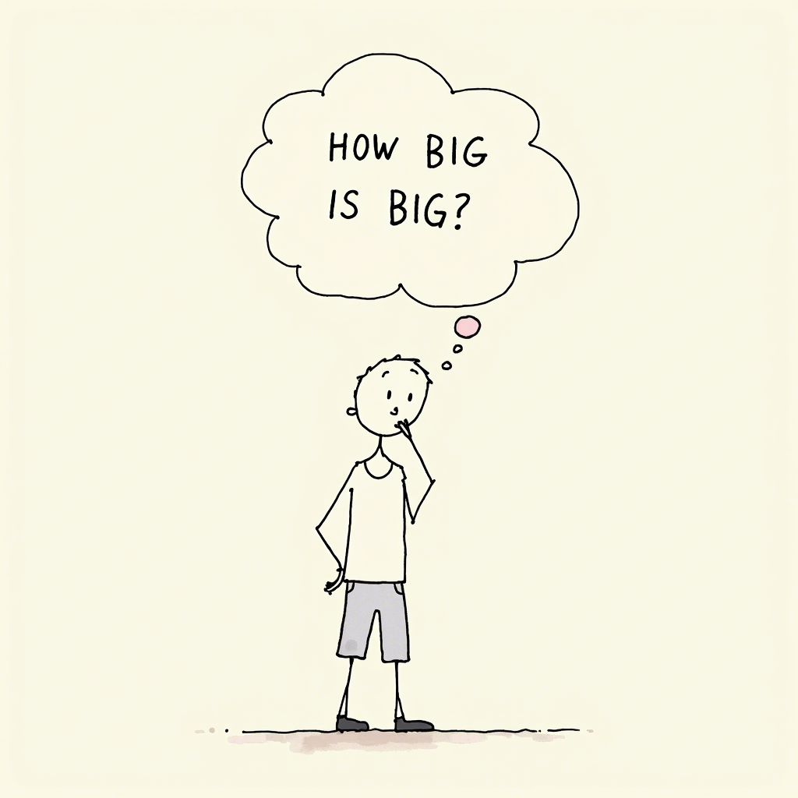
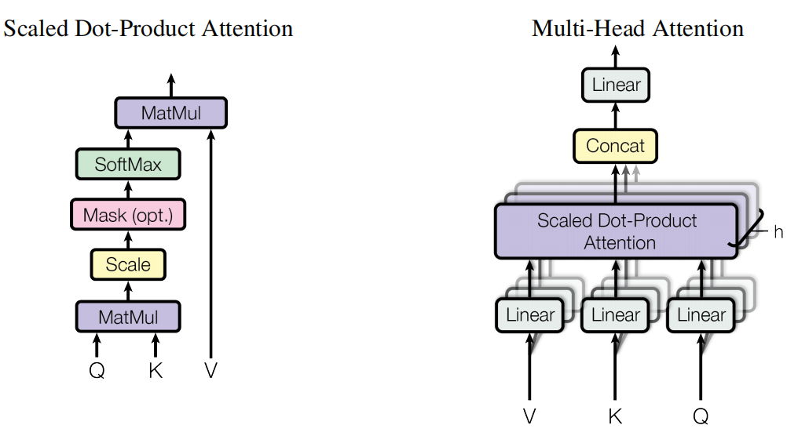
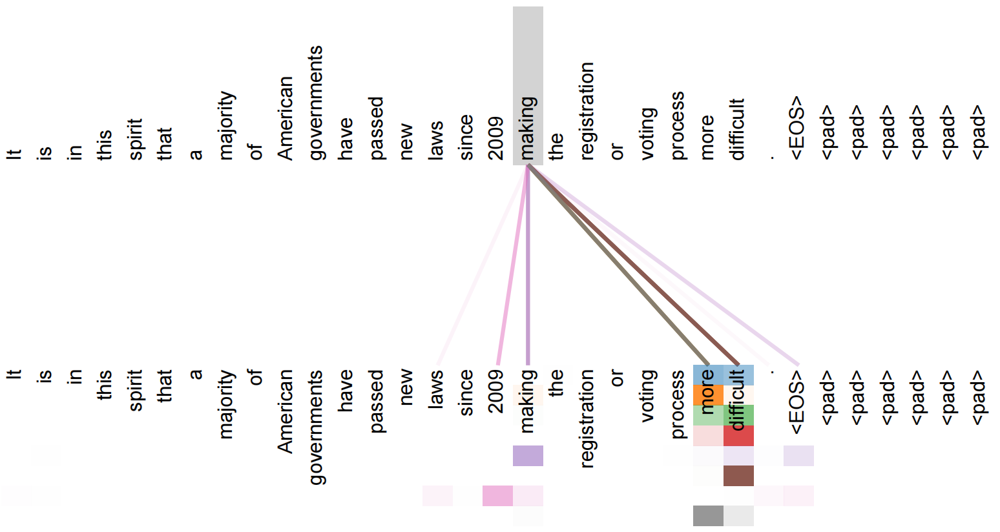
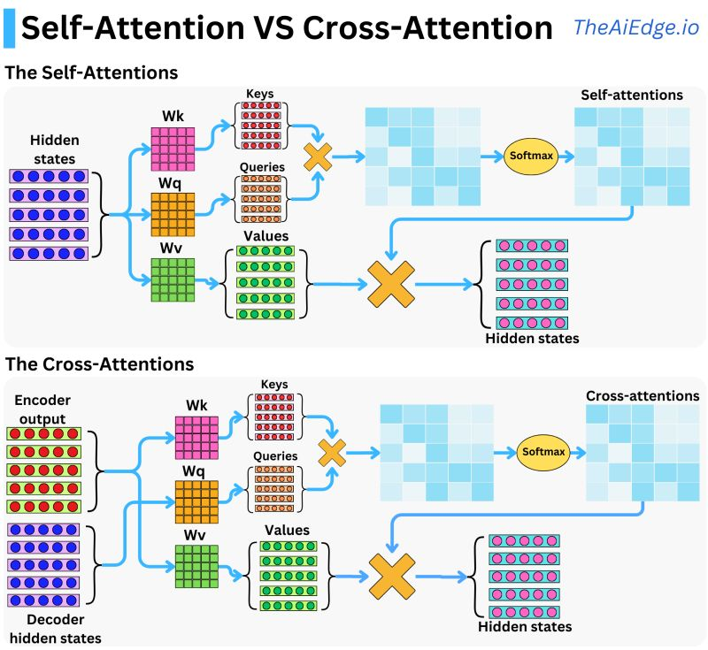
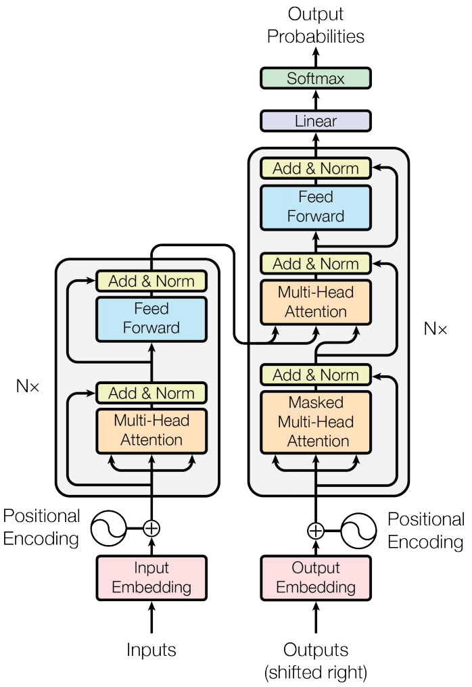
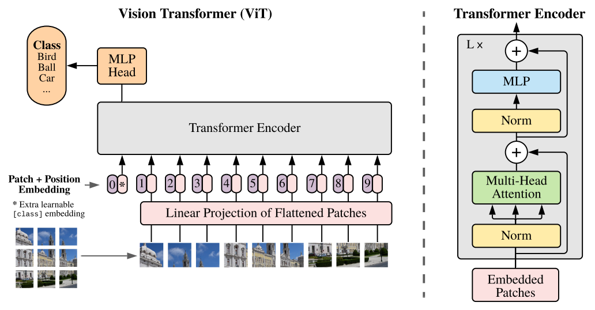

### 1.1 大模型，多“大”算大?
近年来，在AI机器生成的任务中，大模型（Large Model）成为了研究者和开发者关注的焦点。但是大模型的定义很不正规。多“大”算“大”我们并没有合理的定义。我们现在所认为的“大模型”是从自然语言处理（NLP）领域发展出来的。**在自然语言处理任务中，计算机技术对人类语言进行分析，为了理解和生成的各类人类语言任务。**这些任务涵盖了文本分类、情感分析、机器翻译、语音识别、问答系统、文本摘要、语音合成等诸多方面。通过让计算机学习大量文本数据以训练模型，我们能够使计算机执行各种复杂的语言理解和生成任务。从最初的简单神经网络，到后续的循环神经网络（RNN，2010年），再到基于Transformer的“大语言模型”BERT（2018年）、GPT2（2019年）等，自然语言处理任务在每个发展阶段的效果均实现了显著提升。每个阶段的技术进步，均伴随着模型参数规模的扩大、硬件的更新换代以及显卡算力的增强。经历过“2019年中美贸易摩擦”的相关人士皆知，美国对高算力显卡向中国出口的限制，实质上是对中国人工智能产业发展的基础硬件方面做出核心制约。
2021年，大家发现了自然语言模型的“涌现”问题。jason wei 在“**Finetuned Language Models Are Zero-Shot Learners**”论文中，整体分析了“涌现”现象。在这篇论文中，jason wei 提出了一个关键观点，伴随着模型参数数量的增长，只需微调的自然语言大参数模型就能够展现出“零样本学习（Zero-Shot Learners）”的能力。他通过实验展示了这些模型在未见过的任务上也能表现出色，这与传统的机器学习方法形成了鲜明对比。相比起原来海量数据训练的方案，零样本学习是一种更友好的机器学习技术。它允许模型在没有见过某些特定类别样本的情况下，仍然能够识别或理解这些类别。这种技术在处理大量类别或罕见类别的识别任务时特别有用。**本系列文章中，我们可以把拥有这种“涌现”能力的大语言模型，称为大模型。**

（多“大”算大？插图由Flux-dev生成）

### 1.2 Attention机制与Transformer模型

有人说，我们不是有关“计算机视觉”方面的文献吗？怎么先讲“自然语言处理”？因为自从ViT模型提出后，计算机视觉的模型也逐渐Transformer化了，注意力网络模型替代了卷积神经网络成为了计算机视觉的主要部分。Transformer模型最开始被用于自然语言处理，核心思想是通过自注意力（self-attention）机制来捕捉输入数据之间的依赖关系，为了更好地梳理整体技术流程，我们必须从自然语言任务说起。
Transformer结构由Ashish Vaswani等谷歌学者在“Attention Is All You Need”（2017年）论文提出，用于替换卷积神经网络在自然语言处理的底层结构。这种转变使得计算机视觉模型能够更好地捕捉图像中的全局依赖关系，从而提高识别和分类的准确性。这里我们需要解释下Attention机制与Transformer模型。
#### 1.2.1 Attention机制，新的“加权求和”方法
Attention机制，中文称为“注意力机制”。它核心其实是“加权求和”的思想：对不同一个数据序列（如自然语言处理的一句话）不同部分赋予不同大小的权重，权重比较大的部分即为我们想要突出的理解的部分，权重比较小的部分即为我们不想特别关注的部分。如果权重是多维的，我们可以构造出突出不同关注点的权重序列，从而从不同的维度关注到输入数据中的重要部分。那么，这种“权重”怎么是得来的呢？模型训练的结果！又是“加权求和”，卷积神经网络不也是加权求和吗？对，目前我们所有的模型的基础构件都是建立在“加权求和”的基础上。只不过卷积神经网络因为卷积窗口大小的问题天然导致了“感受野不大”的问题，导致数据序列后面的部分看不到前面的部分从而导致整体序列的部分割裂。而Attention机制在创立时就注意到了这一点，直接创造了Cross-Attention（交叉注意力模型），与Self-Attention（自注意力模型）。

 
（小学老师教学“加权求和”知识，插图由Flux-dev生成）

注意力数学模型的定义如下：
$$\text{Attention}(Q, K, V ) = \text{softmax}(\frac{QK^T}{\sqrt{d^k}})V$$
我们看到Attention函数的输入参数有3个变量Q、K、V。
- Q代表Query，即查询向量，它代表了模型当前关注的焦点或问题。我们在使用搜索引擎或使用翻译软件时，在输入框输入的问题就可以看做Query，Q查询向量。
- K代表Key，即键向量，它与查询向量进行比较，用于确定注意力的分布。
- V代表Value，即值向量，它蕴含了信息，是注意力机制最终输出的结果。我们很早接触到了KV键值对的概念。但在Attention机制中，K和V的关系并不局限于一对一或一对多的简单映射。Attention机制能够计算出每个Query与每个Key之间的相关性，进而生成一个加权的Value序列。换句话说在“加权求和”的表示中，Q、K一起计算出权重，而V需要被加权的数据。

Attention公式中，d代表Q的维度。为了防止V的权重解码器计算标准不统一（大数干扰），所以这里使用了softmax函数将V前面的权重全部回归到0到1。

在机器中文翻译英文的翻译任务中，一个Query可以代表当前正在翻译的中文句子，而Key和Value则来自于整个英文词表，模型通过计算Query、Key的乘积可以得到的加权到Value英文序列的权重。从而生成更准确的翻译结果。**这样的Q与K、V不同的Attention操作就是Cross-Attention，即为交叉注意力机制。**

但是有时，我们会将Q、K、V使用同一个编码序列。**这样的Q与K、V相同的Attention操作就是Self-Attention，即为自注意力机制。**这么做是让模型理解输入数据序列的内在含义。例如我们在做阅读理解任务时，我们需要将一篇阅读文章，使用Self-Attention操作用于提取关键信息。在实际使用中Cross-Attention与Self-Attention经常配合使用。

多头注意力（Multi-Head Attention）类似于“卷积神经网络”的“多层感知机”的概念，每个“头”（head）使用不同的线性变换参数独立执行一次计算。这样，模型可以同时关注输入数据的不同部分，从而捕捉到更复杂的依赖关系和语义信息。通过这种方式，多头注意力能够提高模型对数据的理解能力，增强其处理自然语言的能力。

 
（多头机制，图片来自Attention is all you need论文）

 

（Self-Attention对一句话的理解。我们发现“making”这个单词对“make” “more difficult”注意力更强，颜色越深注意力越强。因为我们使用了多“头”权重，所以这里是颜色块用多行表示，每一行代表一次权重训练。图片来自Attention is all you need论文）

 
（Self-Attetion与Cross-Attetion的演示，图片侵权可以更换）
#### 1.2.2 Transformer模型
Transformer模型通过Self-Attention自注意力机制来捕捉输入序列中不同位置之间的依赖关系，从而能够更有效地处理长距离依赖问题。Transformer模型的核心是多层的编码器（encoder）和解码器（decoder），其中编码器负责理解输入文本，解码器则负责生成输出文本。下图为一种常见的Transformer模型结构。Transformer模型的核心优势在于其并行化处理能力和对长距离依赖关系的捕捉能力。与传统的卷积神经网络相比，Transformer模型能够一次性处理整个输入序列不用考虑感受野的问题，大大提高了计算效率。

 
（Transformer模型结构，图片来自Attention is all you need论文）

#### 1.2.3 ViT，Vision Transformer
ViT的提出同样来自谷歌大脑团队Alexey Dosovitskiy等人的论文“AN IMAGE IS WORTH 16X16 WORDS: TRANSFORMERS FOR IMAGE RECOGNITION AT SCALE”（2020年，后面简称“ViT论文”）。在此之前也有很多人将Transformer迁移到图像任务里面，但效果没有这篇文章好。ViT这篇论文彻底抛弃了CNN卷积神经网络的使用，完全将Transformer模型引入到图像识别中。使得图像识别和分类任务的性能得到了显著提升。在论文中作者将图像分割成多个小块，然后将这些小块作为数据序列输入到Transformer模型中，模型能够有效地捕捉图像内部的全局依赖关系。这种全局信息的捕捉能力，使得Transformer模型在处理复杂图像任务时，比传统的卷积神经网络具有更大的优势。

（ViT模型中图像分片方法与Transformer结构设计，图片来自ViT论文）
对ViT的介绍仅限于技术的梳理发展不做深究，因为技术发展会导致很多技术细节会更新换代。如有兴趣，请阅读原文。

#### 1.2.4 自然语言处理与计算机视觉模型基础Transformer化的意义
从2012年AlexNet引领的人工智能深度学习浪潮开始，卷积神经网络CNN成为处理视觉信息的主流工具，计算机视觉（Computer Vision，CV）在这一波浪潮中飞速发展。同时期自然语言处理（Natural Language Processing，NLP）也使用类CNN的RNN工具来进行自己任务的构建。计算机视觉和自然语言处理两学科的亲密互动一直存在。但随着时间的推移，谷歌大脑团队为自然语言处理发明了Transformer模型，以其独特的自注意力机制在处理长距离依赖问题上的优势，为自然语言处理和计算机视觉领域带来了新的视角。同时ViT的创新使Transformer模型在计算机视觉的图像处理任务中展示出了其强大的能力，这不仅仅是模型架构的升级，更是对AI发展新趋势的预测和引领。
此时出现了如下很重要问题：
1. Transformer是否可以为两个领域之间的融合提供了理论基础？
2. 如果计算机视觉和自然语言处理，可以通过Transformer融合，那么计算机语音、计算机视频、光学字符识别等其他领域是否也可以同样Transformer化，最后形成一个大一统的多模态大模型？
我们现在知道了，各个公司已经开始了这样大模型研发。本系列文章阐述不了这么广的内容，仅专注于计算机图像生成这一个方面。后面我们开始详细介绍相关理论，我的目标是争取让大学一年级的学历的人可以看懂相关理论。
