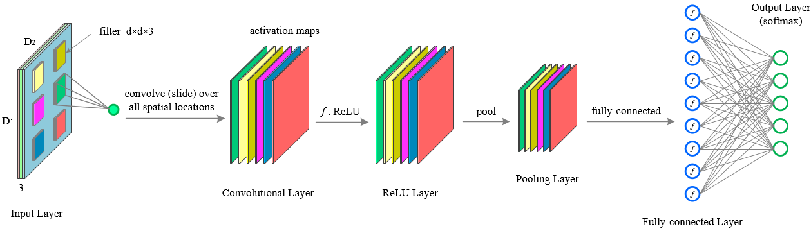
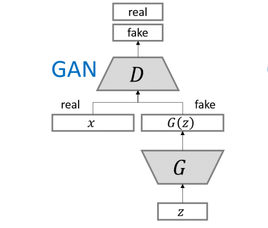

故事的开端是一群专注于创作“宅向”漫画师。这些漫画师们日复一日地为粉丝们绘制着他们心目中的“理想伴侣”。然而，漫画界竞争激烈，行业运作模式已发生转变，目前“多女主角”和“女团主题”正成为市场的新宠。漫画师们面临一个不成文的规则：“剧情可以杂乱无章，但后宫角色的数量必须众多。”在漫画中，如果一下创造了九位性格迥异的女性角色，总有一款能够触动读者的心。如果这还不够，还有众多“路人女角色”可供选择。因此，负责设计这些“虚拟伴侣”的漫画师们感到了巨大的压力。他们渴望解脱，梦想着如果有台机器能代为绘图该有多好。图像生成技术的可以适当地解决这种需求。从2015年开始，众多开源项目着手“动漫角色头像生成任务”。有兴趣的在可以github上搜索nagadomi的lbpcascade_animeface项目下载数据集。（当然数据也可以自己搜集。）训练你自己的动漫头像。
这些项目主要利用了一种名为生成对抗网络（Generative Adversarial Networks，GAN）的先进算法，以实现图像的自动生成。从上一篇文章中，我们知道Transformer是在2017年为自然语言处理发明的，所以这时的GAN并没有，并没有使用Attention机制，而是卷积神经网络CNN机制。
### 2.1 以卷积神经网络为基础的GAN网络
卷积神经网络（Convolutional Neural Networks，CNN）在图像处理领域取得了革命性的进展。其独特的结构使得它在处理像素数据时具有天然的优势。CNN通过卷积层、池化层和全连接层的组合，能够自动学习图像的特征表示，从而在图像识别、分类和生成等任务中表现出色。
写卷积神经网络的文章已经太多了，我这里写一下不一样的东西：如何依据数学公式如何设计合适的神经网络，并以生成对抗网络GAN为例进行推导。首先我们先明确各个层次的作用。
- 卷积层（Convolutional Layer，conv）：**负责提取输入数据的局部特征**。通过使用一组可学习的滤波器（或称为卷积核），卷积层能够检测图像中的边缘、角点等简单特征，并在后续的层中组合这些特征以识别更复杂的模式。
- 非线性层（Non-Linear Layer）：**非线性层通常位于卷积层之后，其主要目的是引入非线性激活函数，如ReLU（Rectified Linear Unit）或Sigmoid函数，以增加网络的表达能力**。这种非线性变换使得网络能够学习和模拟复杂的函数映射，从而能够处理非线性可分的数据。通过非线性层，CNN能够捕捉到图像中的非线性特征，这对于图像分类和识别任务至关重要。

- 池化层（Pooling Layer，pool）：**负责降低特征图的空间尺寸，从而减少计算量和防止过拟合**。池化操作通常包括最大池化和平均池化，它们通过选取局部区域内的最大值或平均值来实现特征的下采样。这不仅减少了数据的维度，还保留了重要的特征信息，同时增加了网络对小的平移、旋转和缩放的不变性。

- 全连接层（Fully-connected Layer）：**负责将前面层提取的特征进行整合，形成最终的决策**。全连接层很像改变神经网络输出维度的**适配胶水层**。对于分类网络它常常位于网络的末端，它将卷积层和池化层提取的局部特征映射到样本标记空间。通过学习不同特征组合的权重，全连接层能够对输入数据进行分类或回归分析。在设计全连接层时，需要考虑其神经元的数量，这通常与任务的复杂度和输出类别的数量有关。过多的神经元可能导致过拟合，而过少则可能无法捕捉到足够的信息以做出准确的预测。

（卷积层，非线性层，池化层，全连接层，图片来自斯坦福大学CS231n课程PPT）

接着，我们推理GAN的数学表达。**生成对抗网络**（Generative Adversarial Networks，GAN）由两部分组成：生成器（Generator）和判别器（Discriminator）。生成器负责创建图像，而判别器则尝试区分生成的图像和真实图像。在训练过程中，生成器不断学习如何生成更逼真的图像，而判别器则不断提高其鉴别能力。这种对抗过程推动了生成器的不断进步，最终能够产生高质量的图像。GAN的结构如下表示。

(GAN结构设计)

那么我们可以将GAN先数学化表示：

|     | 输入                | 输出               | 方法                    |
| --- | :---------------- | :--------------- | --------------------- |
| 生成器 | 噪音（假设噪声是$n*n*1$维） | 图片（$N*N*3$维向量）   | $G(z)$                |
| 判别器 | 图片（$N*N*3$维向量）    | 真假图片Bool判断（1维向量） | $D(x_{real})，D(G(z))$ |

从生成器看，从噪声到图片的过程。根据神经网络设计经验，我们可以遵守如下原则设计整体网络：
- 主干过程可以使用卷积层、非线性层堆叠来实现，但这种操作一般是不改变输入输出维度的。
- 如果让输入维度n变成输出维度N，可以使用池化（降维）或反池化（升维）进行处理。一般建议不要连续池化。
- 卷积核的个数建议以”先增后降“的形式降到3维，卷积核个数增加为了做多特征构造器（或提取器），卷积核个数降低为了提取有效特征到最后的目标3。
- 根据VGG论文的方法，卷积核大小建议设置为$3*3$ 。$5*5$的卷积可以用2个$3*3$ 卷积核替代，且参数更低。
- 图片一个像素一般是RGB三维，运算中可以先把他们三通道独立出来，更好计算。
- 每个卷积操作后还有一层非线性操作。如果没有，多层卷积叠起来会统合成一个多项式操作，造成网络退化。
那么生成器整体卷积过程设计如下：

（生成器$D(z)$设计方案 ，从噪声到图像的神经网络搭建。本图片仅仅提供一个搭建思路，不代表没有问题。每个卷积操作后还有一层非线性操作，这里省略了。）

判别器的设计一样遵循如此定义，只不过最后用全连接层解决维度统一的问题。

（判别器$G(x)$设计方案 ，就是简单的图像评分网络。本图片仅仅提供一个搭建思路，不代表没有问题。每个卷积操作后还有一层非线性操作，这里省略了。）这里对卷积神经网络GAN的阐述比较少，GAN网络的训练也是GAN的一门学问。我们这里没有详细描述，因为我们主要进行扩散模型的书写并不打算说GAN，如有需要可以自己看GAN相关论文。但是还有一个问题我们必须要重点说一下：使用什么指标计算生成式图像任务的损失函数呢？
相对熵（relative entropy），或被称为Kullback-Leibler散度（Kullback-Leibler divergence），KL散度。这个指标很重要，后面的理论也是基于这个指标推论的。我们从头开始梳理一下。
### 2.2 从熵到相对熵（KL散度）
#### 2.2.1 熵
熵的原意是对混乱程度的衡量。而在shannon的信息论中，我们拓展了“熵”的意思。按照百度百科的说法：给定一个字符集的概率分布，我们可以设计一种编码，使得表示该字符集组成的字符串平均需要的比特数最少。即，假设这个字符集是 $X$，对$x \in X$ ，其出现概率为$P(x)$  ，那么其最优编码平均需要的比特数等于这个字符集的熵：
$$H(p)=\sum_{x \in X}^{} p(x)*log\frac{1}{p(x)}$$
眼力好的人可以看出来，这很像期望计算公式:$\sum x*p(x)$。对，就是$log\frac{1}{p(x)}$的期望。由于信息论需求是“编码”，所以需要使用$log\frac{1}{p(x)}$来预估编码的位数。如果是二进制，这里的log就以2为底。
这么表示有很大的好处：当所有样本等几率出现的情况下，熵达到最大值（所有可能的事件等概率时不确定性最高）。即**绝对平均，熵最大。**

#### 2.2.2 交叉熵
理想很丰满，现实很闹心。现实是我们不知道真实分布$p(x)$。我们只能通过另一个分布$q(x)$来趋近表示真实分布$p(x)$。此时平均编码长度的期望应该是
$$\sum_{x \in X}^{} p(x)*log\frac{1}{q(x)}$$
我们将其记为$H(p,q)$,称之为p与q的交叉熵。交叉熵（Cross Entropy）是Shannon信息论中一个重要概念，主要用于度量两个概率分布间的差异性信息。
按照熵的公式，我们可以得到这样的结论：
$H(p,q) \geqslant H(p)$，且当q为真实分布p时，等号成立。即当两个分布重合时，交叉熵最小为：$H(p,q)=H(p)$。
#### 2.2.3 从熵，交叉熵再到相对熵
直接看公式，相对熵可以表示为
$$KL(p||q)=H(p,q)-H(p)=\sum_{x \in X}^{} p(x)*log\frac{p(x)}{q(x)} $$

1. 这也就意味着它是非对称的，$KL(P||Q) \neq   KL(Q||P)$
2. 与交叉熵类似，可将真实分布$H(p(x))$视为不变量。
3. 当p，q两个分布重合时，相对熵最小为0。

细心地朋友都意识到了一点，**交叉熵**与**相对熵**的本质一个东西，都是对两个分布的重合度的衡量。但是相对熵更常用，因为它的最小值为0。我们最小化这个值就可以拉近”生成图片“与”真实图片“两个分布。这个分布十分重要，生成图片与真实图片像不像，在计算机层面需要一个明确的评分算法。有了这个分布我们就可以正式开始扩散模型的内容了。

