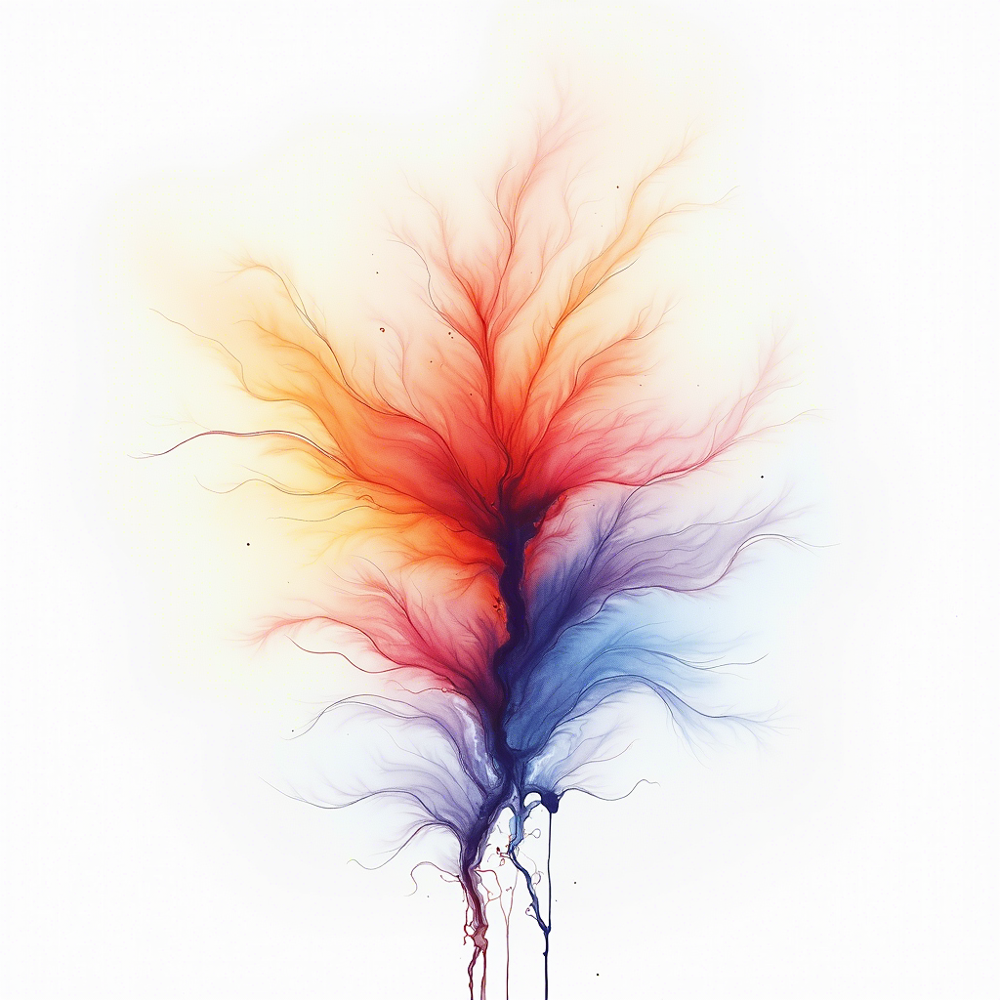

### 3.1 扩散模型概述

扩散模型是继生成对抗网络（GAN）后的，在图像合成领域表现更好的生成模型。

扩散模型算法是一种受到热力学中非平衡热力学分支启发的算法，其思想来源是扩散过程。“扩散”的含义很形象，就像一副在水中用染色剂画的简笔画。简笔画落在水中会慢慢扩散开,最后达到完全模糊。扩散模型也是使用这样的原理。“简笔画在水面的扩散过程”可以类比为在图像中持续加入噪声信息。噪声逐渐增加直至图像完全被噪声覆盖的过程，就是我们模拟出图像逐渐模糊的效果。反过来考虑，如果我们从噪声信息出发，不断地有指向性地去噪，就可以生成有意义的图片了。

（树状彩色染色剂在水中开始扩散，图片由FLUX生成）

上述的扩散过程在我们这里的表示如下：通过深度学习方法从纯噪声数据逐渐对数据进行去噪的过程，从单个图像样来看这个过程，扩散过程q就是不断往图像上加噪声直到图像变成一个纯噪声。扩散过程从开始的0到最后的T或从最后的T到开始的0可以看成马尔可夫链结构，中间的p，q操作可以表示状态空间中经过从一个状态到另一个状态的转换的随机过程。逆扩散过程p就是从纯噪声生成一张图像的过程。

(扩散模型过程简述)

在后续的逻辑推演过程中，我们将以基础的数学公式为起点，运用相当于大学二年级水平的理论知识进行深入的推导。（值得注意的是，在某些省份，这些知识内容可能已经被包含在高中课程中）此举旨在使读者能够全面理解扩散模型的整个推理过程。鉴于扩散模型的公式具有一定的复杂性，对于那些更倾向于工程应用而非理论探索的工程型读者，我们建议不必过分纠结于具体的推理细节，只需了解“在特定情境下，公式的输入与输出分别是什么”即可。
目前，扩散模型有两种解释方法：基于似然的说明方法，基于分数的说明方法，两者本质一样，但我建议最好都了解一下，否则论文可能看不懂。鉴于扩散模型的构建过程相当复杂，我们将从“基于似然解释”的核心**变分自编码器（VAE**）开始介绍。通过遵循特定规则的多层VAE的堆叠，可以构建出扩散模型。鉴于这部分内容是全书的核心，我们不会像介绍生成对抗网络（GAN）那样进行简略的阐述，而是将详细解析扩散模型的构建过程。