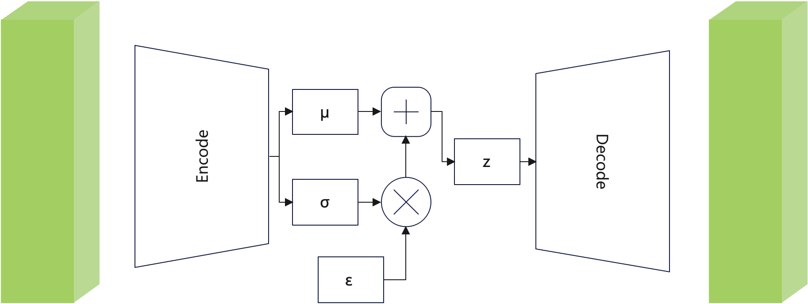

### 4.1 证据下界ELBO
在数学领域，"隐变量"这一术语通常用于描述那些不易直接观察或测量的变量。在统计模型或理论框架中，隐变量扮演着解释表象背后深层原因的角色。我们将观测数据$x$与隐变量$z$相结合，构建一个联合分布$p(x,z)$，并定义观测数据$x$的边缘概率为$p(x)$。下面使用基于"似然"原理的生成模型，最大化观测数据$x$的概率$p(x)$。实现这一目标有两种方法。首先我们可以对隐变量 $z$ 求边缘积分：
$$p(x)= \int p(x,z)dz \tag{1.1}$$

或者，我们求助于概率的链式法则：
$$p(x)=\frac {p(x,z)}{p(z|x)} \tag{1.2}$$
公式（1.1）的方案直接通过计算 $p(x)$ 是非常困难的，因为它涉及到所有隐变量 $z$ 的计算，如果模型是以神经网络为代表的复杂模型会非常棘手。公式（1.2）中，$p(x,z)$ 可以认为在隐变量 $z$ 存在的同时具有条件 $x$ 的输出；$p(z|x)$ 是获取隐变量的解码器，用于从观测 $x$ 中预测隐变量 $z$ 。利用公式（1.2），我们就可以推导出 $p(x)$ 的证据下界（Evidence Lower Bound，ELBO）。个人认为“证据下界”不算原理，它仅仅是一种优化思路。“最大化ELBO”即为优化目标函数的下界，记为“ELBO代理目标函数”。当然，最完美的情况就是ELBO完全等价于目标函数。

让我们试着深入推理一下 $p(x)$ 的ELBO。
$$\begin{align} 
\log p(x)& = \log \int p(x,z)dz \tag{1.3}\\ 
&= \log \int \frac {p(x,z)q_\phi(z|x)}{q_\phi(z|x)}dz \tag{1.4}\\
&= \log \mathbb{E}_{q_\phi(z|x)}[\frac{p(x,z)}{q_\phi(z|x)}]  \tag{1.5}\\
&\geq \mathbb{E}_{q_\phi(z|x)}[\log{\frac{p(x,z)}{q_\phi(z|x)}}] \tag{1.6}
 \end{align}$$
公式（1.4）中，引入一个针对参数 $\phi$ 优化的分布 $q_\phi (z|x)$ 。直观地说，它可被认为是一个用 $\phi$ 参数模型来估计给定观测 $x$ 的隐变量 $z$ 的真实分布。它寻求近似真实的后验 $p(z|x)$ 。我们通过调节参数 $\phi$ 来探索“变分自编码器”时，可以控制增加下界以最大化ELBO。

公式（1.5）使用期望的重要定理。若随机变量 $Y$ 符合函数 $Y=g(x)$ ，且 $\int_{-\infty}^{+\infty} g(x)f(x)dx$ 绝对收敛，则有
$$E(Y)=E(g(X)) = \int_{-\infty}^{+\infty} g(x)f(x)dx \tag{1.7}$$我们的大学概率论书籍对此证明一笔带过，因为证明过程特别复杂。请记住这个定理，后面还会使用。请注意，其中 $f(x)$ 要求是概率密度，$g(x)$ 可以不是。

公式（1.6）使用了Jensen不等式。Jenson不等式定义：在不等式中，若 $f(x)$ 为区间  $I$  上的下凸函数，则对于任意 $x_i∈I$ ，在满足$\sum_{i=1}^{n} \lambda_i =1$ 的 $\lambda_i>0(i=1,2,⋯,n)$ 时，下公式成立：
$$f(\sum_{i=1}^n \lambda_i x_i) \leqslant \sum_{i=1}^n \lambda_i f(x_i) \tag{1.8}$$

我们已成功地应用了Jensen不等式来直接推导出我们的下界。然而，这一推导过程本身并未深入揭示问题的本质。具体来说，通过Jensen不等式所获得的结论似乎并没有充分解释为何ELBO（证据下界）确实能够作为真实分布的下界。此外，即便我们确认了ELBO确实是一个下界，这本身也并未阐明为何我们应当以最大化ELBO为目标。为了深入理解证据（真实分布）与ELBO之间的内在联系，让我们重新审视并进行一次更细致的推导：
$$
\begin{align} 
\log p(x)& = \log p(x) \int q_\phi(z|x)dz \tag{1.9}\\ 
&= \int q_\phi(z|x)(\log p(x))dz \tag{1.10}\\
&= \mathbb{E}_{q_\phi(z|x)}[\log{p(x)}]  \tag{1.11}\\
&= \mathbb{E}_{q_\phi(z|x)}[\log{\frac{p(x,z)}{p(z|x)}}] \tag{1.12}\\
&= \mathbb{E}_{q_\phi(z|x)}[\log{\frac{p(x,z)q_\phi(z|x)}{p(z|x)q_\phi(z|x)}}] \tag{1.13} \\
&= \mathbb{E}_{q_\phi(z|x)}[\log{\frac{p(x,z)}{q_\phi(z|x)}}]  + \mathbb{E}_{q_\phi(z|x)}[\log{\frac{q_\phi(z|x)}{p(z|x)}}] \tag{1.14}\\
&= \mathbb{E}_{q_\phi(z|x)}[\log{\frac{p(x,z)}{q_\phi(z|x)}}]  + D_{KL}(q_\phi(z|x)||p(z|x)) \tag{1.15}\\
&\geq \mathbb{E}_{q_\phi(z|x)}[\log{\frac{p(x,z)}{q_\phi(z|x)}}]  \tag{1.16}\\
\end{align}
$$
从公式（1.10-1.11）使用公式（1.7），其中 $q_\phi(z|x)$ 是概率密度函数，对 $z$ 积分等于1。
公式（1.14）到公式（1.15）使用KL散度公式，也称为Kullback-Leibler散度。它是一种衡量两个概率分布差异的度量方法。它是信息论中的一个概念，用于量化两个概率分布P和Q之间的不相似性。其定义为：
$$KL(P||Q)=\int p(x) \log\frac{P(x)}{Q(x)} dx \tag{1.17}$$
这个公式在后面也会用上。KL散度是非对称的，也就是说，$D_{KL}(P∣∣Q)$ 与 $D_{KL}(Q∣∣P)$ 通常是不相等的，同时KL散度必不小于0。
我们从公式（1.15）清楚地观察到，真实分布等于ELBO加上近似后验 $q_\phi(z|x)$ 和真正后验 $p(z|x)$ 之间的KL散度。正是这个KL散度项在第一次推导的公式（1.8）中被Jensen不等式神奇地消除了。当近似后验 $q_\phi(z|x)$ 和真正后验 $p(z|x)$ 相等时Jensen不等式的等号成立。理解这一情形不仅是理解ELBO的关键，也是理解为什么优化ELBO就是的优化目标函数的原因。我们已经深入探究了为何我们致力于最大化ELBO的原因。在引入我们希望建模的隐变量 $z$ 之后，我们的核心目标是掌握并学习那些能够精准描述我们观察到的数据的潜在结构。换言之，我们致力于优化我们的变分近似后验分布 $q_\phi(z|x)$，以便它能够尽可能地贴近真实后验分布  $p(z|x)$。这种匹配通常是通过最小化两者之间的KL散度来实现的，理想情况下，该散度应趋近于零。
然而，直接最小化KL散度存在一定的挑战，因为我们无法直接获得真实后验分布 $p(z|x)$ 的确切形式。在公式（1.15）中，$\log p(x)$ 项是ELBO与KL散度之和，它是一个对于参数 $\phi$ 无关的常数，针对参数 $\phi$ 对ELBO项的任何提升都将不可避免地导致KL散度项的等量减少。因此，“最大化ELBO”可以视为一种代理手段，用以完美地模拟真实的隐后验分布；我们对ELBO的优化越充分，我们的近似后验分布就越接近于真实的后验分布。

### 4.2 变分自编码（Variational Autoencoders， VAE）
变分自编码器（Variational Autoencoder，简称VAE）是一种生成模型，结合了深度学习和概率模型等理论。我们从一系列由 $\phi$ 参数组成的潜在分布中优化最佳的 $q_\phi(z|x)$，这种方案叫“**变分**（variational）”；输入数据会经过一个瓶颈表示后再训练预测自己，这种结构被称为“**自编码器**（autoencoders）”。VAE不仅能够学习数据的有效表示，还能生成新的数据样本。VAE的关键创新在于它使用变分推断来近似复杂的后验分布，并通过最小化KL散度来鼓励潜在空间的结构化。如果 $p(x)$ 是VAE，公式（1.9-1.16）的内容可以复用，同时让我们再进一步分析VAE的 ELBO：
$$
\begin{align} 
\mathbb{E}_{q_\phi(z|x)}[\log\frac{p(x,z)}{q_\phi(z|x)}] &= \mathbb{E}_{q_\phi(z|x)}[\log\frac{p_\theta(x|z)p(z)}{q_\phi(z|x)}] \tag{1.18} \\
&= \mathbb{E}_{q_\phi(z|x)}[\log p_\theta(x|z)] + \mathbb{E}_{q_\phi(z|x)}[\log\frac{p(z)}{q_\phi(z|x)}] \tag{1.19} \\
&= \underbrace{\mathbb{E}_{q_\phi(z|x)}[\log p_\theta(x|z)]}_{重建项} - \underbrace{D_{KL}(q_\phi(z|x)||p(z))}_{先验匹配项} \tag{1.20}
\end{align} 
$$
将公式（1.20）与公式（1.15）作比较，我们发现当 $p(x)$ 是某个确定的VAE时， $p_\theta(x|z)$ 就已经确定了。我们学习了一个可以被视为**编码器**的中间瓶颈分布 $q_\phi(z|x)$ ，它将输入转换为含隐变量的分布。同时，我们学习了一个反向函数 $p_\theta(x|z)$ 作为**解码器**，将给定的隐变量 $z$ 转换为观测值 $x$ 。
公式（1.20）中的两项都有明确的含义：第一项决定我们在变分分布中使用“编码器-解码器结构”重构分布的可能性，这保证了学习到的分布是利用有效隐变量 $z$ 再生的原始数据；第二项记录了学习到的变分分布与持有先验信息的隐变量相似程度。
从VAE定义出发，我们了解如何使用编码器参数 $\phi$ 、解码器参数 $\theta$ 联合优化ELBO。VAE的**编码器**通常选择用具有对角协方差的多元高斯分布来建模，先验通常被选择为标准的多元高斯，如下
$$
\begin{align} 
q_\phi(z|x)&=\mathcal{N}(z; \mu_\phi(x),\sigma^{2}_{\phi}(x)I ) \tag{1.21} \\
p(z)&= \mathcal{N}(z;0,I) \tag{1.22}
\end{align} 
$$

我们利用两个高斯分布的KL散度公式 (23)
$$
D_{KL}(\mathcal{N}(μ_1​,σ_1^2​)||\mathcal{N}(μ_2​,σ_2^2​))
=\log \frac{σ_2}{​σ_1}​​−\frac{1}{2}​+\frac{σ_1^2+(μ_1​-μ_2)^2}{2σ_2^2} \tag{1.23}​
$$
可以直接计算ELBO的KL散度项（公式（1.20）中先验匹配项，prior matching term），还可以用**蒙特卡洛估计**来近似的重建项（reconstruction term，公式（1.20）中重建项）。我们的目标可以重写为
$$
\arg\max_{\phi,\theta} \mathbb{E}_{q_\phi(z|x）}[\log p_\theta(x|z)]−D_{KL}(q_\phi(z|x)||p(z)) \approx \arg \max_{\phi,\theta} \frac{1}{L}\sum_{l=1}^{L} \log p_\theta(x|z^{(l)})−D_{KL}(q_\phi(z|x)||p(z)) \tag{1.24}
$$
>**蒙特卡洛估计**方法的核心思想是利用随机抽样来估计一个不确定的量,这种估计本质上源自大数定理。在期望上我们先考虑公式（1.7）：
$$
\mathbb{E}_{p(x)}[f(x)]=\int_{-\infty}^{+\infty} f(x)p(x)dx
$$
> 如要使用蒙特卡洛方法来估计，我们可以遵循以下步骤：
> 1. 生成随机样本：首先， 根据 $p(x)$ 分布的情况采样一系列随机点 $X_1,…,X_n$ 。
> 2. 计算样本的函数值：接下来，对于每一个随机采样 $X_i$​ ，计算 $f(X_i)$ 的值。
> 3. 期望估计：计算 $Q_n=\frac{1}{n}\sum_{i=1}^nf(X_i)$ 的值即为期望 $\mathbb{E}_{p(x)}[f(x)]$ 的近似值。

公式（1.24）是VAE常见的推理过程。但仅做到这些还不够，为了能够适配深度学习的反向传播算法进行梯度下降，VAE采用**重参数化**技巧。**重参数化**技巧将一个随机变量重写为一个噪声变量的确定性函数。例如，来自正态分布 $x\in \mathcal{N}(x;\mu,\sigma^2)$（其中均值和方差分别为 $\mu$ 和 $\sigma^2$ ）可重写为：
$$
x=\mu + \sigma \epsilon, \epsilon \sim \mathcal{N}(\epsilon;0,I)
$$
这个公式就是高中学到的正态分布标准化 $y=\frac{x-\mu}{\sigma}$。在VAE中，为了解决梯度回传的问题，存在连续梯度。我们将每个隐变量 $z$ 经由“输入$x$ ”和“辅助噪声变量 $\epsilon$ ”包装后计算得到的，如下：
$$
z = \mu_\phi(x) + \sigma_\phi(x) \odot \epsilon, \epsilon \sim \mathcal{N}(\epsilon;0,I) \tag{1.25}
$$
这里⊙表示逐元素乘法。使用这种 $z$ 的重参数化方法根据 $\phi$ 计算出梯度以优化 $\mu_\phi$ 和 $\sigma_\phi$ ，可保证整体流程可导，具体请看图如下：

(VAE模型结构图)

