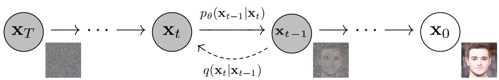

在上文中，我们得知扩散模型来源于物理学的扩散过程。在生成模型中，它演化为从高斯纯噪声数据逐渐对数据进行去噪的过程。如果从单个图像过程的观点来讨论，扩散过程是不断往图像上加噪声直到图像变成一个纯噪声，扩散过程从开头到最后是一个马尔可夫链，该过程由 $q_\phi(x_t|x_{t-1})$ 来标记。又因为VDM第二条约束规则，因为均值和方差是预先设定的高斯分布，该过程不再由参数 $\phi$ 参数化，故记为 $q(x_t|x_{t-1})$ 。逆扩散过程是从纯噪声生成一张图像的过程，该过程用 $p_\theta(x_{t-1}|x_t)$ 来标记。整体过程如下图 

（扩散过程）

我们使用刚刚推导出来的扩散模型基础进行推论，并结合原始实现代码DDPM，理论联合实际进行详细讲解。本段主要部分解读自《Denoising Diffusion Probabilistic Models》[2] 
### 6.1 前向过程-混入噪声
在推理之前，我们先重点回顾一下上一节的内容。
1. $x_0$ 为原始图像，$x_t$ 为加t步噪声后的图像，噪声加到最后（第T步）为 $x_T$ 
2. 图像加噪声为 $q(x_t|x_{t-1})$ 操作，意为从 $x_{t-1}$ 加噪声成 $x_t$ ；图像降噪为 $p_\theta(x_{t-1}|x_t)$ 操作，意为从 $x_t$ 降噪声成 $x_{t-1}$ 
3. 每一时间步加噪声 $\epsilon_t$（或去噪声）都有参数对 $\alpha_t$ ，其中有 $0<\beta_t<<\alpha_t<1$ ，且 $\beta_t+\alpha_t=1$ 。DDPM在这里多一个 $\beta_t$ 参数，为了方便记录。
那么，图像加噪过程就很直接，根据第一章第一节的公式（1.63）
$$
\begin{align}
x_t = \sqrt{\alpha_t}x_{t-1} + \sqrt{1-\alpha_t}\epsilon_t  \tag{1.105} \\
\text{with}: \epsilon_t \sim \mathcal{N}(\epsilon;0,I) 
\end{align}
$$
同理，经过公式（1.64-1.73）的计算推理，可以得到：
$$
\begin{align}
x_t&=\sqrt{\alpha_t}x_{t-1}+\sqrt{1-\alpha_t}\epsilon_{t-1}^*  \\
&=\sqrt{\bar{\alpha}_t}x_0 + \sqrt{1-\bar{\alpha}_t}\epsilon_0  \tag{1.106} \\
q(x_t)&=q(x_t|x_0)\sim \mathcal{N}(x_t;\sqrt{\bar{\alpha}_t}x_0,(1-\bar{\alpha}_t)I) \tag{1.107}
\end{align}
$$
这一段对应的python的代码也很直接。其中 (sqrt_alphas_cumprod, t) 就是 $\sqrt{\bar{\alpha}_t}$ ，(sqrt_one_minus_alphas_cumprod, t) 就是 $\sqrt{1-\bar{\alpha}_t}$ 。
```python
def q_sample(self, x_start, t, noise=None):
	noise = default(noise, lambda: torch.randn_like(x_start))
	return (
		extract(self.sqrt_alphas_cumprod, t, x_start.shape) * x_start +
		extract(self.sqrt_one_minus_alphas_cumprod, t, x_start.shape) * noise
	)
```
### 6.2 后向过程
回顾第一章第1节的VDM的通用ELBO推导公式（1.51-1.62），
$$
\begin{align}
\log p(x)&\geq  \mathbb{E}_{q(x_{1:T}|x_0)} \Big[\log{\frac{p(x_{0:T})}{q(x_{1:T}|x_0)}} \Big] \\
&= \underbrace{\mathbb{E}_{q(x_{1}|x_0)} [ \log p_\theta(x_0 | x_1)]}_{重建项} -   \underbrace{D_{KL}(q(x_T|x_0)||p(x_T))}_{先验匹配项} - \underbrace{\sum_{t=2}^{T} \mathbb{E}_{q(x_t|x_0)} [D_{KL}(q(x_{t-1}|x_t,x_0)||p_\theta(x_{t-1}|x_t))]}_{去噪匹配项}
\end{align}
$$
我们知道 $\mathbb{E}_{q(x_t|x_0)} [D_{KL}(q(x_{t-1}|x_t,x_0)||p_\theta(x_{t-1}|x_t))]$ 是与时间 $t$ 直接有关的去噪匹配项，计算程度直接决定了ELBO的计算程度。我们希望尽可能地将**近似去噪分布** $p_θ(x_{t−1}|x_t)$ 与**真值去噪分布** $q(x_{t−1}|x_t,x_0)$ 相匹配，才能做好生成模型的预测。同时 在VDM中的公式（1.74-1.87）我们知道：
$$
q(x_{t−1}|x_t,x_0)\propto \mathcal{N}({{x}}_{t-1};\underbrace{\frac{\sqrt{{\alpha}_t}(1-\bar{{\alpha}}_{t-1}){{x}}_t+\sqrt{\bar{{\alpha}}_{t-1}}(1-{\alpha}_t){{x}}_{0}}{1-\bar{{\alpha}}_{t}}}_{{{\mu}}_q({{x}}_t,{{x}}_0)},\underbrace{\frac{(1-{\alpha}_t)(1-\bar{{\alpha}}_{t-1})}{1-\bar{{\alpha}}_{t}} {{I}}}_{{{\Sigma}}_{q}(t)}) \tag{1.108}
$$
我们注意到均值，方差可写做：
$$
\begin{align}
\mu_q(x_t,x_0)&=\frac{\sqrt{{\alpha}_t}(1-\bar{{\alpha}}_{t-1}){{x}}_t+\sqrt{\bar{{\alpha}}_{t-1}}(1-{\alpha}_t){{x}}_{0}}{1-\bar{{\alpha}}_{t}}  \tag{1.109} \\
σ_q^2(t)&=\frac{(1-{\alpha}_t)(1-\bar{{\alpha}}_{t-1})}{1-\bar{{\alpha}}_{t}} \tag{1.110}
\end{align} 
$$
在等式（1.72） $x_t =\sqrt{\overline{\alpha}_t}x_0 + \sqrt{1-\overline{\alpha}_t}\epsilon_0$中，将 $x_0$ 的推导变成：
$$
x_0 = \frac{x_t-\sqrt{1-\bar{\alpha}_t}\epsilon_0}{\sqrt{\bar{\alpha}_t}} \tag{1.111}
$$
带入均值可得
$$
\begin{align}
\mu_q(x_t,x_0)&=\frac{\sqrt{{\alpha}_t}(1-\bar{{\alpha}}_{t-1}){{x}}_t+\sqrt{\bar{{\alpha}}_{t-1}}(1-{\alpha}_t)\frac{x_t-\sqrt{1-\bar{\alpha}_t}\epsilon_0}{\sqrt{\bar{\alpha}_t}}}{1-\bar{{\alpha}}_{t}} \\
&= \frac{1}{\sqrt{\alpha_t}}x_t - \frac{1-{\alpha}_t}{\sqrt{1-\bar{{\alpha}}_t}\sqrt{\alpha_t}}\epsilon_0 \tag{1.112}
\end{align}
$$
我们根据模仿原则，用未知 $x_0$ 值的**近似去噪分布** $p_θ(x_{t−1}|x_t)$ 来近似已知原始图片 $x_0$ 的**真值去噪分布** $q(x_{t−1}|x_t,x_0)$ ，设置近视去噪均值 $\mu_\theta(x_t,t)$ 为：
$$
\mu_\theta(x_t,t) = \frac{1}{\sqrt{\alpha_t}}x_t - \frac{1-{\alpha}_t}{\sqrt{1-\bar{{\alpha}}_t}\sqrt{\alpha_t}}\hat{\epsilon}_\theta(x_t,t) \tag{1.113}
$$
其中 $\hat{\epsilon}_θ(x_t,t)$ 这种带尖角帽的参数依然是用神经网络模拟的噪声网络，根据噪声预测的优化策略，我们有
$$
\begin{align}
&~~~~\arg\min_{{{\theta}}} D_{\text{KL}}(q({{x}}_{t-1}|{{x}}_t,{{x}}_0)\Vert p_{{\theta}}({{x}}_{t-1}|{{x}}_t))\\
&=\arg\min_{{{\theta}}} D_{\text{KL}}(\mathcal{N} ({{x}}_{t-1}; μ_q, Σ_q(t)) \Vert \mathcal{N} ({{x}}_{t-1}; μ_{{\theta}}, Σ_q(t))) \\
&=\arg\min_{{{\theta}}} \frac{1}{2σ_q^2 (t)} \left[ \Vert {\mu}_{{\theta}} − {\mu}_q \Vert_2^2 \right] \\
&=\arg\min_{{{\theta}}} \frac{1}{2σ_q^2 (t)} \left[ \Big\Vert \frac{1}{\sqrt{\alpha_t}}x_t - \frac{1-{\alpha}_t}{\sqrt{1-\bar{{\alpha}}_t}\sqrt{\alpha_t}}\hat{\epsilon}_\theta(x_t,t) − \frac{1}{\sqrt{\alpha_t}}x_t + \frac{1-{\alpha}_t}{\sqrt{1-\bar{{\alpha}}_t}\sqrt{\alpha_t}}\epsilon_0 \Big\Vert_2^2 \right] \\
&=\arg\min_{{{\theta}}} \frac{1}{2σ_q^2 (t)} \left[ \Big\Vert \frac{1-{\alpha}_t}{\sqrt{1-\bar{{\alpha}}_t}\sqrt{\alpha_t}}\epsilon_0 - \frac{1-{\alpha}_t}{\sqrt{1-\bar{{\alpha}}_t}\sqrt{\alpha_t}}\hat{\epsilon}_\theta(x_t,t) \Big\Vert_2^2 \right]  \\
&=\arg\min_{{{\theta}}} \frac{1}{2σ_q^2 (t)} \left[ \Big\Vert \frac{1-{\alpha}_t}{\sqrt{1-\bar{{\alpha}}_t}\sqrt{\alpha_t}}(\epsilon_0 - \hat{\epsilon}_\theta(x_t,t)) \Big\Vert_2^2 \right]  \\
&=\arg\min_{{{\theta}}} \frac{1}{2σ_q^2 (t)} \frac{(1-{\alpha}_t)^2}{(1-\bar{{\alpha}}_t)\alpha_t} \left[ \Big\Vert (\epsilon_0 - \hat{\epsilon}_\theta(x_t,t)) \Big\Vert_2^2 \right] \tag{1.114} \\
\end{align}
$$
此时我们发现只要通过拉进 $\epsilon_t$ 与 $\epsilon_\theta(x_t,t)$ 的距离的方式就可以训练参数 $\theta$。所以，我们利用噪声间MSE Loss 即可完成优化损失函数的设计：
$$ \mathcal{Loss} =  ||\epsilon_t-\epsilon_\theta(\sqrt{\bar{\alpha}_t}x_0+\sqrt{1-\bar{\alpha}_t}\epsilon_t,t)||^2 \tag{1.115}
$$
### 6.3 DDPM训练过程

| 训练过程伪代码                                                                                                                                                  |
| -------------------------------------------------------------------------------------------------------------------------------------------------------- |
| 1: repeat                                                                                                                                                |
| 2:    $x_0 \sim q(x_0),t\sim \text{Uniform}(\{1,2,...,T\}),\epsilon \sim \mathcal{N}(0,I)$                                                               |
| 3:    使用梯度下降逐步优化 $\nabla_\theta \left\|\epsilon_t-\epsilon_\theta\left(\sqrt{\bar{\alpha}_t} x_0+\sqrt{1-\bar{\alpha}_t} \epsilon_t, t\right)\right\|^2$ |
| 4: until 收敛                                                                                                                                              |
表1.1 训练过程伪代码
上表1.1为原论文的训练过程，该过程比较简单：
1.  循环直到收敛
	1. 从数据集中选取 $x_0$ ，这就是原始图片；随机选取时间戳 t，它代表扩散模型需要扩散的轮数；生成t个高斯噪声，每个都是 $\epsilon_t\in\mathcal{N}(0, \mathbf{I})$
	2. 调用模型 $ϵ_θ$（这里是UNet网络）预估 $\epsilon_\theta\left(\sqrt{\bar{\alpha}_t} x_0+\sqrt{1-\bar{\alpha}_t} \epsilon_t, t\right)$
	3. 计算噪声之间的 MSE Loss: $\mathcal{Loss} =  \left\|\epsilon_t-\epsilon_\theta\left(\sqrt{\bar{\alpha}_t} x_0+\sqrt{1-\bar{\alpha}_t} \epsilon_t, t\right)\right\|^2$ 并梯度下降优化UNet网络。
对应python 训练代码如下：
```python
class GaussianDiffusionTrainer(nn.Module):
    def __init__(self, model, beta_1, beta_T, T):
        super().__init__()

        self.model = model # Unet网络
        self.T = T

        self.register_buffer(
            'betas', torch.linspace(beta_1, beta_T, T).double())
        alphas = 1. - self.betas
        alphas_bar = torch.cumprod(alphas, dim=0)

        # calculations for diffusion q(x_t | x_{t-1}) and others
        self.register_buffer(
            'sqrt_alphas_bar', torch.sqrt(alphas_bar))
        self.register_buffer(
            'sqrt_one_minus_alphas_bar', torch.sqrt(1. - alphas_bar))

    def forward(self, x_0):
        """
        Algorithm 1.
        """
        t = torch.randint(self.T, size=(x_0.shape[0], ), device=x_0.device)
        noise = torch.randn_like(x_0)
        x_t = (
            extract(self.sqrt_alphas_bar, t, x_0.shape) * x_0 +
            extract(self.sqrt_one_minus_alphas_bar, t, x_0.shape) * noise)
        loss = F.mse_loss(self.model(x_t, t), noise, reduction='none')
        return loss
```
### 6.4 DDPM推理过程
根据（1.108，1.111）的公式更改了一下。
$$
\begin{align}
q(x_{t−1}|x_t,x_0) &\propto \mathcal{N}({{x}}_{t-1};\frac{\sqrt{{\alpha}_t}(1-\bar{{\alpha}}_{t-1}){{x}}_t+\sqrt{\bar{{\alpha}}_{t-1}}(1-{\alpha}_t){{x}}_{0}}{1-\bar{{\alpha}}_{t}},\frac{(1-{\alpha}_t)(1-\bar{{\alpha}}_{t-1})}{1-\bar{{\alpha}}_{t}} {{I}})  \\
&=\mathcal{N}({{x}}_{t-1};\frac{1}{\sqrt{\alpha_t}}(x_t - \frac{1-{\alpha}_t}{\sqrt{1-\bar{{\alpha}}_t}}\epsilon_0),\frac{(1-{\alpha}_t)(1-\bar{{\alpha}}_{t-1})}{1-\bar{{\alpha}}_{t}} {{I}})  \\
\end{align}
$$
此时，在我们再次强调一下我们的核心目标：
用未知 $x_0$ 原始值的**近似去噪分布** $p_θ(x_{t−1}|x_t)$ 来近似已知原始图片 $x_0$ 的**真值去噪分布** $q(x_{t−1}|x_t,x_0)$ 
那么 $p_θ(x_{t−1}|x_t)$ 可以尽可能的仿作：
$$
p_\theta({x}_{t-1} \vert {x}_t) = \mathcal{N}(\frac{1}{\sqrt{\alpha_t}}(x_t-\frac{1-\alpha_t}{\sqrt{1-\bar{\alpha}_t}} \epsilon_\theta(x_t,t)),\frac{(1-{\alpha}_t)(1-\bar{{\alpha}}_{t-1})}{1-\bar{{\alpha}}_{t}}I)
$$
我们知道 $x_{t-1} \sim p_\theta(x_{t-1}|x_t)$ ，按照初中的规则，我们可以将其化为正态分布的格式，步骤如下：
$$
\begin{align}
& \frac{x_{t-1} - \mu}{\sigma} \sim \mathcal{N}(0,I)=z \\
& x_{t-1} = \mu + \sigma z \\
& x_{t-1} =\frac{1}{\sqrt{\alpha_t}}(x_t-\frac{1-\alpha_t}{\sqrt{1-\bar{\alpha}_t}} \epsilon_\theta(x_t,t)) + \frac{(1-\alpha)(1 - \bar{\alpha}_{t-1})}{1 - \bar{\alpha}_t}  z \tag{1.116}
\end{align}
$$
在DDPM中，用一个新的符号 $z$ 代替标准正态分布噪声，虽然本质与 $\epsilon$ 相同，但实际含义不一样。伪代码如表1.2所示：

| 前向推理采样算法伪代码                                                                                                                      |
| -------------------------------------------------------------------------------------------------------------------------------- |
| 1: $x_T \sim \mathcal{N}(0,I)$                                                                                                   |
| 2: for $t=T,...,1$ do:                                                                                                           |
| 3:     $z \sim \mathcal{N}(0,I)$ if $t>1$ ， else $z=0$                                                                           |
| 4:     $x_{t-1} =\frac{1}{\sqrt{\alpha_t}}(x_t-\frac{1- \alpha_t}{\sqrt{1-\bar{\alpha}_t}} \epsilon_\theta(x_t,t)) + \sigma_t z$ |
| 5: end for                                                                                                                       |
| 6: return $x_0$                                                                                                                  |
表1.2 采样算法伪代码

此时已经训练出来了 $\epsilon_θ$ （这里是UNet网络），所以在下面的推理过程中 $ϵ_θ(x_t,t)$ 是已知的。假设我用推理的过程中扩散T步，那么从T步开始逆向回推，每一步有如下操作：
1. 初始化最终的扩散状态 $x_T$ 为纯高斯噪声，从这个状态开始进行反推。
2. 从 $t=T$ 步开始，每步减一，直到 $t=1$ ：
	1. 如果是最后一轮循环 $t=1$ ，噪声 $z = 0$ ；如果 $t > 1$ 时，即可取随机噪声 $z\in\mathcal{N}(0, \mathbf{I})$ 。
	2. 因为公式（1.116）推论 $x_{t-1} =\frac{1}{\sqrt{\alpha_t}}(x_t-\frac{1-\alpha_t}{\sqrt{1-\bar{\alpha}_t}} \epsilon_\theta(x_t,t)) + \frac{(1-\alpha)(1 - \bar{\alpha}_{t-1})}{1 - \bar{\alpha}_t}  z$

3. 最后一步返回 $x_0$
对应的python代码如下，同样很清晰：
```python
class GaussianDiffusionSampler(nn.Module):
    def __init__(self, model, beta_1, beta_T, T):
        super().__init__()

        self.model = model # Unet
        self.T = T

        self.register_buffer('betas', torch.linspace(beta_1, beta_T, T).double())
        alphas = 1. - self.betas
        alphas_bar = torch.cumprod(alphas, dim=0)
        alphas_bar_prev = F.pad(alphas_bar, [1, 0], value=1)[:T]

        self.register_buffer('coeff1', torch.sqrt(1. / alphas))
        self.register_buffer('coeff2', self.coeff1 * (1. - alphas) / torch.sqrt(1. - alphas_bar))

        self.register_buffer('posterior_var', self.betas * (1. - alphas_bar_prev) / (1. - alphas_bar))

    def predict_xt_prev_mean_from_eps(self, x_t, t, eps):
        assert x_t.shape == eps.shape
        return (
            extract(self.coeff1, t, x_t.shape) * x_t -
            extract(self.coeff2, t, x_t.shape) * eps
        )

    def p_mean_variance(self, x_t, t):
        # below: only log_variance is used in the KL computations
        var = torch.cat([self.posterior_var[1:2], self.betas[1:]])
        var = extract(var, t, x_t.shape)

        eps = self.model(x_t, t)
        xt_prev_mean = self.predict_xt_prev_mean_from_eps(x_t, t, eps=eps)

        return xt_prev_mean, var

    def forward(self, x_T):
        """
        Algorithm 2.
        """
        x_t = x_T
        for time_step in reversed(range(self.T)):
            print(time_step)
            t = x_t.new_ones([x_T.shape[0], ], dtype=torch.long) * time_step
            mean, var= self.p_mean_variance(x_t=x_t, t=t)
            # no noise when t == 0
            if time_step > 0:
                noise = torch.randn_like(x_t)
            else:
                noise = 0
            x_t = mean + torch.sqrt(var) * noise # μ+σ*z
            assert torch.isnan(x_t).int().sum() == 0, "nan in tensor."
        x_0 = x_t
        return torch.clip(x_0, -1, 1)
```
