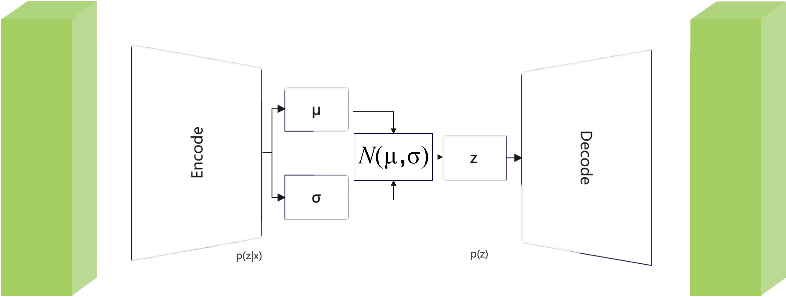

去噪扩散模型（Denoising Diffusion Probabilistic Model，简称DDPM）是一种生成模型，用于生成高质量的图像、音频或其他类型的数据。这种模型通过模拟一个数据样本在噪声的干扰下逐步退化的过程，然后学习如何将这个退化的过程逆转，从而生成新的、干净的数据样本。DDPM的核心思想是，通过一系列的扩散步骤将干净的数据逐步添加噪声，此过程称为加噪过程；再通过一系列的去噪步骤，从噪声数据中恢复出干净的数据，此过程称为去噪过程。令人更欣喜地是后半部分去噪过程，即“**从初始纯噪声变为图像、音频或其他类型的数据的过程**”。这部分就是我们生成的数据的核心。这半部分的生成过程，我们称为“**去噪过程**”或者“**采样过程**”。不过**采样过程**的这一说法常用于获得模型后的数据生成过程；而**去噪过程**使用场景就更广泛。
如果你了解木雕，我们可以用木雕的过程来对比扩散模型过程。从原始木头（对应初始纯噪声，有原始，又随机，又无波澜）变成五彩花木雕（对应生成数据）的过程可以认为是“扩散模型的去噪过程”。如果反过来，从五彩花木雕变成原始木头（有点高科技）就是“扩散模型的加噪过程”。

（木头变木雕的过程）

因为内容很重要，本内容需要持续更新3节，逐步推理DDPM的相关理论。
- 第一节（**1.4 基于噪声的扩散模型：从VAE开始**）：DDPM的基础知识。主要内容包括ELBO，VAE。
- 第二节（**1.5 基于噪声的扩散模型：多层VAE构建扩散模型**）：DDPM基础结构。该部分记录如何从DDPM的基础知识搭建起DDPM。
- 第三节（**1.6 基于噪声的扩散模型：DDPM**）：DDPM实例与伪代码。
之后我们再讲解其他种类的扩散模型。因此本节先从DDPM的基础知识讲起。该内容单看与DDPM无任何关系，是很早以前的卷积神经网络都在用的基础理论，但为了DDPM的流程推导需要。

### 1.4.1 证据下界ELBO
在数学领域，"隐变量"这一术语通常用于描述那些不易直接观察或测量的变量。在统计模型或理论框架中，隐变量扮演着解释表象背后深层原因的角色。我们将观测数据$x$与隐变量$z$？相结合，构建一个联合概率分布 $p(x,z)$ ，定义观测数据$x$的边缘概率为 $p(x)$ 。上面两种概率有两种转换关系。我们考虑如果对 $p(x,z)$ 中隐变量 $z$ 求边缘积分将 $z$ 的各种影响加起来，则自然变成了 $p(x)$：
$$p(x)= \int p(x,z)\mathrm{d}z \tag{1.4.1}$$

或者，我们求助于概率的链式法则：
$$p(x)=\frac {p(x,z)}{p(z|x)} \tag{1.4.2}$$
公式（1.4.1）的方案涉及到所有隐变量 $z$ 的计算，在后面的推理中我们会经常借鉴。公式（1.4.2）的本质就是条件概率公式，$p(x,z)$ 可以认为在隐变量 $z$ 存在的同时具有条件 $x$ 的输出；$p(z|x)$ 是获取隐变量的解码器，用于从 $x$ 中预测隐变量 $z$ 。利用公式（1.4.2），我们就可以推导出 $p(x)$ 的证据下界（Evidence Lower Bound，ELBO）的概念。

> [!证据下界]
> 证据下界是变分推断中的一个核心概念，它为后验概率的近似提供了一个下界。简单来说，证据下界（ELBO）是在我们处理一些概率问题时，用来帮助我们估算和理解某些难以计算的概率的一个工具。想象一下我们有一堆图片数据 $x$ ，每张图片都有**无法描述的特征** $z$ 。假如我们对“**无法描述的特征**”感兴趣，想要得到 $p(z|x)$ 这样的后验概率，可以使用最大化**证据下界**法 。
> 
> 笔者认为“证据下界”不算原理，它仅仅是一种优化思路。“最大化ELBO”即为优化目标函数的下界，记为“ELBO代理目标函数”。当然，最完美的情况就是ELBO完全等价于目标函数。下面我就要推理。

之后的文章如果出现上面格式，可以看成对整体文章的补充。

#### 1.4.1.1 ELBO公式推导与含义
让我们试着深入推理一下 $p(x)$ 的ELBO。
$$\begin{align} 
\log p(x)& = \log \int p(x,z)\mathrm{d}z \\ 
&= \log \int \frac {p(x,z)p_\phi(z|x)}{p_\phi(z|x)}\mathrm{d}z \tag{1.4.3}\\
&= \log \mathbb{E}_{p_\phi(z|x)}[\frac{p(x,z)}{p_\phi(z|x)}]  \tag{1.4.4}\\
&\geq \mathbb{E}_{p_\phi(z|x)}[\log{\frac{p(x,z)}{p_\phi(z|x)}}] \tag{1.4.5}
 \end{align}$$
 
公式（1.4.3）中，引入一个针对参数 $\phi$ 的模型分布 $p_\phi (z|x)$ 。直观地说，它可被认为是一个用 $\phi$ 参数模型来估计给定观测 $x$ 的隐变量 $z$ 的真实分布。它寻求近似真实的后验 $p(z|x)$ 。我们通过调节参数 $\phi$ 来探索“变分自编码器”时，可以控制增加下界以最大化ELBO。

> [!大学教科书不证明的定理]
公式（1.4.4）使用期望重要定理。这是大学《概率论与数理统计》教科书中著名的不证明的定理。我这里也不想证明，因为看过证明过程后感觉的确有些复杂。这里单纯复述下。若随机变量 $Y$ 符合函数 $Y=g(x)$ ，且 $\int_{-\infty}^{+\infty} g(x)f(x)dx$ 绝对收敛，则有
$$E(Y)=E(g(X)) = \int_{-\infty}^{+\infty} g(x)f(x)\mathrm{d}x \tag{1.4.6}$$
请记住这个定理，后面会非常频繁地使用。请注意，其中 $f(x)$ 要求是概率密度，$g(x)$ 可以不是。

>[!Jensen不等式]
公式（1.4.5）使用了Jensen不等式。Jenson不等式定义：在不等式中，若 $f(x)$ 为区间  $I$  上的下凸函数，则对于任意 $x_i∈I$ ，在满足$\sum_{i=1}^{n} \lambda_i =1$ 的 $\lambda_i>0(i=1,2,⋯,n)$ 时，下公式成立：
$$f(\sum_{i=1}^n \lambda_i x_i) \leqslant \sum_{i=1}^n \lambda_i f(x_i)$$

#### 1.4.1.2 ELBO公式再次推理
我们已成功地应用了Jensen不等式在公式（1.4.5）直接推导出ELBO函数就是 $\mathbb{E}_{p_\phi(z|x)}[\log{\frac{p(x,z)}{p_\phi(z|x)}}]$ 。同时公式（1.4.5）也是教科书常见的公式。然而，这一推导过程本身并未深入揭示问题的本质。具体来说，通过Jensen不等式所获得的结论似乎并没有充分解释为何ELBO（证据下界）确实能够作为真实分布的下界。此外，即便我们确认了ELBO确实是一个下界，这本身也并未阐明为何我们应当以最大化ELBO为目标。为了深入理解证据（真实分布）与ELBO之间的内在联系，让我们重新审视并进行一次更细致的推导：
$$
\begin{align} 
\log p(x)& = \log p(x) \int p_\phi(z|x)\mathrm{d}z \tag{1.4.7}\\ 
&= \int p_\phi(z|x)(\log p(x))\mathrm{d}z \\
&= \mathbb{E}_{p_\phi(z|x)}[\log{p(x)}]  \tag{1.4.8}\\
&= \mathbb{E}_{p_\phi(z|x)}[\log{\frac{p(x,z)}{p(z|x)}}] \\
&= \mathbb{E}_{p_\phi(z|x)}[\log{\frac{p(x,z)p_\phi(z|x)}{p(z|x)p_\phi(z|x)}}] \\
&= \mathbb{E}_{p_\phi(z|x)}[\log{\frac{p(x,z)}{p_\phi(z|x)}}]  + \mathbb{E}_{p_\phi(z|x)}[\log{\frac{p_\phi(z|x)}{p(z|x)}}] \tag{1.4.9}\\
&= \mathbb{E}_{p_\phi(z|x)}[\log{\frac{p(x,z)}{p_\phi(z|x)}}]  + D_{KL}(p_\phi(z|x)||p(z|x)) \tag{1.4.10}\\
&\geq \mathbb{E}_{p_\phi(z|x)}[\log{\frac{p(x,z)}{p_\phi(z|x)}}] \\
\end{align}
$$
公式（1.4.7）， $p_\phi(z|x)$ 对 $z$ 积分等于1。
公式（1.4.8），就是公式（1.4.6）著名公式的应用。
公式（1.4.9）到公式（1.4.10）使用KL散度公式，就是前面说的Kullback-Leibler散度。只不过这次不同于 1.3节中的离散形式，而是连续积分的形式：
$$D_{KL}(P||Q)=\int p(x) \log\frac{P(x)}{Q(x)} \mathrm{d}x \tag{1.4.11}$$
这个连续形式的KL散度公式在后面也会频繁使用。而且1.3节中提到过过，KL散度必不小于0。
我们从公式（1.4.10）清楚地观察到，真实分布等于ELBO加上近似后验 $p_\phi(z|x)$ 和真正后验 $p(z|x)$ 之间的KL散度。正是这个KL散度项在上一次推导的公式（1.4.5）中被Jensen不等式神奇地消除了。但在公式（1.4.10）的角度看，当近似后验 $p_\phi(z|x)$ 和真正后验 $p(z|x)$ 相等时Jensen不等式的等号成立。
理解这一情形不仅是理解ELBO的关键。我们已经深入探究了为何我们致力于最大化ELBO的原因。如果我们最大化ELBO，就能够让近似后验分布 $p_\phi(z|x)$ 贴近真实后验分布  $p(z|x)$ ，即压迫KL散度使其趋近于零。我们对ELBO的优化越充分，我们的近似后验分布就越接近于真实的后验分布。

### 1.4.2 变分自编码（Variational Autoencoders， VAE）
变分自编码器（Variational Autoencoder，简称VAE）是一种生成模型，结合了深度学习和概率模型等理论。我们从一系列由 $\phi$ 参数组成的潜在分布中，寻找并优化出最佳的 $p_\phi(z|x)$ ，这种方案叫**变分**（variational）；输入数据会训练一个以 $\theta$ 为参数的分布 $p_\theta(x|z)$ 来预测自己，这种结构被称为**自编码器**（autoencoders）。VAE的关键创新在于它使用变分推断来近似复杂的后验分布，并通过最小化KL散度来鼓励潜在空间的结构化。假设 $p(x)$ 是VAE，我们进一步分析 $p(x)$ 的 ELBO，如下：
$$
\begin{align} 
\mathbb{E}_{p_\phi(z|x)}[\log\frac{p(x,z)}{p_\phi(z|x)}] &= \mathbb{E}_{p_\phi(z|x)}[\log\frac{p_\theta(x|z)p(z)}{p_\phi(z|x)}] \\
&= \mathbb{E}_{p_\phi(z|x)}[\log p_\theta(x|z)] + \mathbb{E}_{p_\phi(z|x)}[\log\frac{p(z)}{p_\phi(z|x)}]  \\
&= \underbrace{\mathbb{E}_{p_\phi(z|x)}[\log p_\theta(x|z)]}_{重建项} - \underbrace{D_{KL}(p_\phi(z|x)||p(z))}_{先验匹配项} \tag{1.4.12}
\end{align} 
$$
公式（1.4.12）中的两项各有含义。第一项叫重建项，它决定我们在变分分布中，使用“编码器 - 解码器”重构分布的可能性。这能保证学习到的分布，是利用有效隐变量 $z$ 再生的原始数据；第二项叫现先验匹配项，它记录学习到的变分分布 $p_\phi(z|x)$ 与持有先验信息的隐变量 $p(z)$ 的相似程度。
这里，我们学习了一个分布 $p_\phi(z|x)$ ，它把输入 $x$ 转换为含隐变量 $z$ 的分布。同时，还学习了一个预测分布 $p_\theta(x|z)$ ，将给定的隐变量 $z$ 转换为观测值 $x$ 。在这个标准的“**编码器 - 解码器**”结构的模型中，$p_\theta(x|z)$ 可看成编码器，$p_\phi(z|x)$ 可看成解码器。 

> [!变分与编码器的关系]
> 上面内容有个从“变分”到“编码器”无缝切换。有必要再阐述一下。
> 从数学的角度来看，在变分自编码器（VAE）中，“变分”的概念源于变分推断，这是一种统计方法，主要用于近似复杂的后验分布。其核心思想在于，通过不断优化变分分布与真实分布之间的差异，实现对复杂分布的高效计算。通俗来讲，我们可以将其理解为“用简单分布对潜分布建模”。这是一种“分布建模”的思想。
> 从计算机工程的视角来看，VAE 前半部分结构是十分经典的编码器。不过，它与传统自编码器也存在一些区别。传统自编码器对潜在变量的处理往往是确定性的，而 VAE 引入了概率分布的概念，把潜在变量 $z$ 视为一个随机变量，并假设它服从某种特定的概率分布。具体而言，就是在前文所提到的“由 $\phi$ 参数组成的潜在分布中，寻找并优化出最佳的 $p_\phi(z|x)$ ”。
#### 1.4.2.1 VAE的ELBO求解
从“**变分**”与“**自编码**”的定义出发，我们了解如何使用编码器参数 $\phi$ 、解码器参数 $\theta$ 联合优化VAE的ELBO公式（1.4.12）。）

我们利用**蒙特卡洛估计**来近似的重建项（reconstruction term，公式（1.4.12）中重建项）。因此我们的VAE的ELBO目标重写公式（1.4.13）：
$$\begin{align}
\arg\max_{\phi,\theta} \mathbb{E}_{p_\phi(z|x)}[\log p_\theta(x|z)]−D_{KL}(p_\phi(z|x)||p(z)) \\
\approx \arg \max_{\phi,\theta} \frac{1}{L}\sum_{l=1}^{L} \log p_\theta(x|z^{(l)})−D_{KL}(p_\phi(z|x)||p(z)) \tag{1.4.13}
\end{align}$$
如果我们训练了编码器 $\phi$ 和解码器 $\theta$，我们就很容易得到下面的公式：
$$\begin{align}
p_\phi(z|x)&=\mathcal{N}(z; \mu_\phi(x),\sigma^{2}_{\phi}(x)I )  \\
p(z)&= \mathcal{N}(z;0,I)
\end{align}$$
利用上面这些取值与“两个高斯分布的KL散度”，我们可以直接计算出 $D_{KL}(p_\phi(z|x)||p(z))$ 了。但这里我不想算。因为我们知道只要让 $p_\phi(z|x),p(z)$ 两者尽量相似就可以。因此下面我们设计两个分布，尽可能的让 $p_\phi(z|x),p(z)$ 分布相等。

> [!两个高斯分布的KL散度]
> $$D_{KL}(\mathcal{N}(μ_1​,σ_1^2​)||\mathcal{N}(μ_2​,σ_2^2​))
=\log \frac{σ_2}{​σ_1}​​−\frac{1}{2}​+\frac{σ_1^2+(μ_1​-μ_2)^2}{2σ_2^2} ​$$

>[!蒙特卡洛估计]
>**蒙特卡洛估计**方法的核心思想是利用随机抽样来估计一个不确定的量,这种估计本质上源自大数定理。在期望上我们先考虑公式（1.4.6）：
>$$\mathbb{E}_{p(x)}[f(x)]=\int_{-\infty}^{+\infty} f(x)p(x)dx$$
> 如要使用蒙特卡洛方法来估计，我们可以遵循以下步骤：
> 1. 生成随机样本：首先， 根据 $p(x)$ 分布的情况采样一系列随机点 $X_1,…,X_n$ 。
> 2. 计算样本的函数值：接下来，对于每一个随机采样 $X_i$​ ，计算 $f(X_i)$ 的值。
> 3. 期望估计：计算 $Q_n=\frac{1}{n}\sum_{i=1}^nf(X_i)$ 的值即为期望 $\mathbb{E}_{p(x)}[f(x)]$ 的近似值。

#### 1.4.2.2 VAE的结构设计
公式（1.4.13）是VAE常见的ELBO目标函数。如果按照这条公式设计网络，则神经网络的设计可以是如下形式：

(初版VAE模型结构图)
左边编码器代表 $p_\phi(z|x)$，右边代表解码器 $p(z)$。解码器部分由 $\theta$ 训练得出，因此写作 $p_\theta(z)$ 也可行。由于要让左右两边分布相同，在算出左边解码器的均值、方差后，我们的第一反应是进行 $\mathcal{N}(\mu,\sigma)$ 采样，然后将采样结果传给解码器作为输入。 。。（此处省略100字）

其实第一反应错误很正常。你在神经网络里搞个随机采样，函数可导就奇怪了！

怎么办？去掉采样操作，采用**重参数化**技巧，将一个随机变量重写为一个噪声变量的确定性函数。例如，来自正态分布 $x\in \mathcal{N}(x;\mu,\sigma^2)$（其中均值和方差分别为 $\mu$ 和 $\sigma^2$ ）可重写为：
$$
x=\mu + \sigma \epsilon, \epsilon \sim \mathcal{N}(\epsilon;0,I)
$$
这个公式就是高中学到的正态分布标准化 $y=\frac{x-\mu}{\sigma}$。在VAE中，为了解决梯度回传的问题，存在连续梯度。我们将每个隐变量 $z$ 经由“输入$x$ ”和“辅助噪声变量 $\epsilon$ ”包装后计算得到的，如下：
$$
z = \mu_\phi(x) + \sigma_\phi(x) \odot \epsilon, \epsilon \sim \mathcal{N}(\epsilon;0,I)
$$
这里⊙表示逐元素乘法。使用这种 $z$ 的重参数化方法根据 $\phi$ 计算出梯度以优化 $\mu_\phi$ 和 $\sigma_\phi$ ，可保证整体流程可导，具体请看图如下：

(VAE模型结构图)

