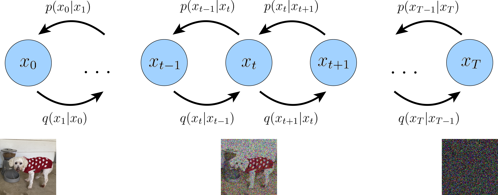

### 1.5.1 初识HVAE
分层变分自编码器（Hierarchical Variational Autoencoder, HVAE）是变分自编码器（Variational Autoencoder, VAE）的一种扩展。它把VAE的单层隐变量模型推广到多个隐变量层级。在这种架构下，较低层的隐变量可看作由更高层、更抽象的隐变量生成。如下图所示。分层变分自编码器（HVAE）相比传统的变分自编码器（VAE）有一些显著优点，主要源于其**更丰富的表示能力**。对于某些复杂的数据分布，单层的VAE可能难以捕捉其全部特性，而HVAE通过多级隐变量，能更好地模拟这些复杂性。HVAE通过增加隐变量的层级，能捕捉到更复杂的数据结构和模式。每一层可以捕捉到不同级别的抽象特征，从而提供更丰富的数据表示。简而言之，还是深度学习那一套思想：层越深越强大。

（一个具有T层隐空间的马尔可夫层次变分自编码器。生成过程为一个马尔可夫链，其中每个隐变量 $z_t$ 只从前一个隐变量 $z_{t+1}$ 中生成。）

> [!Warning]
> 
注意从本节开始，我们会根据功能区分 $p,q$ ：$p$ 函数表示“从隐藏数据推断到真实数据”的过程；$q$ 函数表示“从真实数据到隐藏数据”的过程。但两者本质相同，都是条件概率。

### 1.5.2 马尔可夫分层变分自编码器（MHVAE）
> [!马尔可夫过程]
> 马尔可夫过程是具有马尔可夫性质的随机过程。即给定当前状态，未来状态的条件概率分布只依赖于当前状态，而与过去的历史状态无关。用数学语言表示为：对于随机过程 ${X(t);t \in T}$，如果对于任意的 $n$ 和 $t_1<t_2<...<t_n<t$ ，以及任意的状态 $x_1,x_2,...,x_n<x$ ，有:
> $$P(X(t)=x|X(t_1)=x_1,X(t_1)=x_1,...,X(t_n)=x_n) =P(X(t)=x|X(t_n)=x_n)$$ 
> 则称随机过程 ${X(t);t \in T}$为马尔可夫过程，这一序列就形成马尔可夫链。

在HVAE 中，我们假设有 $T$ 个隐藏层级的模型，每层的隐变量都依赖于前面那层所有的隐变量。但是在这项工作中，我们专注于一种特殊情况，称为马尔可夫分层变分自编码器（Markovian Hierarchical Variational Autoencoder，MHVAE）。在 MHVAE 中，生成过程是一个马尔可夫链，也就是说，从上层到下层的每个转换都是马尔可夫过程的，即每个隐变量 $z_t$ 的解码只会依赖于前一层隐变量 $z_{t+1}$ 。直观地理解，这就是将多个 VAE 层级堆叠在一起；另一个适当的术语来描述它，就是递归 VAE。数学上，我们将 MHVAE 的联合分布和后验表示为：
$$
\begin{align}
p(x, z_{1:T}) &= p (z_T )p_θ(x|z_1) \prod_{t=2}^T p_θ(z_{t−1}|z_t) \tag{1.5.1} \\
q_\phi(z_{1:T}|x) &= q_\phi(z_1|x) \prod^T_{t=2} q_\phi(z_t|z_{t−1}) \tag{1.5.2}
\end{align}
$$
>[!Note]
>说到这里，我们需要停一停。因为此处相似的变量比较多，我们需要知道各个变量是什么意思，否则会发生变量混淆错误。
>- $p(x, z_{1:T})$ ，代表 $x,z_1,z_2,...,z_T$ 的联合分布过程。
>- $p(z_T)$ ：代表最底层的隐变量特征$z_T$ 分布过程。
>- $p_θ(x|z_1)$ ：代表在 $z_1$ 存在的情况下，$x$ 的分布。该分布依靠模型 $\theta$ 来预测 。
>- $q_\phi(z_1|x)$ ：代表在 $x$ 存在的情况下，隐变量 $z_1$ 的分布。该分布依靠模型 $\phi$ 来预测
>
后面我们面对复杂数学公式“**眼晕**”理解不了时，可以按照上面的流程，一点一点地说出每个公式的含义，然后再理解。虽然速度有点慢，不至于做不了理解。至于“**晕**”的问题，那是心理作用，自行处理。不过一般有过一次成功理解的经历，也没有什么可怕的了。

上一节中，我们推理VAE的过程完全依靠ELBO公式加持，多层VAE这里也一样。公式（1.4.1）可改写为：
$$
 \begin{align} 
\log p(x)& = \log \int p(x,z_{1:T})dz_{1:T} \tag{}\\ 
&= \log \int \frac {p(x,z_{1:T})q_\phi(z_{1:T}|x)}{q_\phi(z_{1:T}|x)}dz \tag{}\\
&= \log \mathbb{E}_{q_\phi(z_{1:T}|x)}[\frac{p(x,z_{1:T})}{q_\phi(z_{1:T}|x)}]  \tag{}\\
&\geq \mathbb{E}_{q_\phi(z_{1:T}|x)}[\log{\frac{p(x,z_{1:T})}{q_\phi(z_{1:T}|x)}}] \tag{} \\
&=\mathbb{E}_{q_\phi(z_{1:T}|x)}[\log{\frac{p (z_T )p_θ(x|z_1) \prod_{t=2}^T p_θ(z_{t−1}|z_t)}{q_\phi(z_1|x) \prod^T_{t=2} q_\phi(z_t|z_{t−1})}}] \tag{1.5.3}
 \end{align}
$$
当研究MHVAE时，这个目标可以进一步分解为多个可解释的组件。但单纯从公式（1.5.3）来看，在没有额外约束条件的情况下，我们无法处理复杂的连乘。我们将额外设置三个约束条件，来做下一轮公式推导。

### 1.5.3 变分扩散模型（VDM）：具有三约束的MHVAE
#### 1.5.3.1 三个约束条件
我们给MHVAE设定三个约束条件：
1. 每层隐变量维度与数据维度完全相等。
2. 每层隐编码器的结构并非通过学习得到，而是预定义的线性高斯模型（又叫正态分布模型，后面按需求也会混用）。也就是说，它是以在前一层的输出为中心的高斯分布。
3. 隐编码器的高斯参数会随时间变化，这样在最终时刻 $T$ 时，潜在分布成为标准高斯分布。
具备这三点约束的马尔可夫变分自编码器（MHVAE），可看作是变分扩散模型（Variational Diffusion Model，VDM）。下面我们详细说明这些假设的含义。

- 根据第一条规则约束，我们可以将真实数据样本和隐变量都表示为 $x$，其中 $t=0$ 时表示真实数据样本，$t∈[1,T]$ 表示第 $t$ 层级的隐变量。从 $x_0$ 推理到 $x_T$ 自然对应着前面的 $q_\phi(z_1|x)$ 。因此VDM的后验与MHVAE的后验相似（如公式（1.5.2）），但现在应该重写为以 $q$ 为主的条件概率：
$$
q(x_{1:T}|x_0) = \prod^T_{t=1}q(x_t|x_{t−1}) \tag{1.5.4}
$$
- 根据第二条规则约束，编码器中每层隐变量的分布，都是围绕其前一层级隐变量的高斯分布。即每层都是上一层的加噪。与MHVAE不同，每个时间步长$t$处的编码器结构，设置成高斯模型，该模型不会被学习，但它的均值和标准差会事先设定。这里，我们将高斯编码器设置为均值$μ_t(x_t)=\sqrt{α_t}x_{t - 1}$，方差$Σ_t(x_t)=(1−α_t)I$。关于这个参数的推理，暂时不用理会，后面会证明为何选这个参数。现在只需知道，$\alpha$是一个只与$t$有关，且设置在0到1之间的值。在数学上，编码器的转换表示为：
$$
q(x_{1:T}|x_0)=\mathcal{N}(x_t;\sqrt{\alpha_t}x_{t-1},(1-\alpha_t)I) \tag{1.5.5}
$$
> [!Warning]
> 
> **请一定注意，后面我们不会用“隐变量”的说法，而是用“加噪，去噪”的说法，主要源于第二条约束**。在实际使用时，我们常常设置 $T=1000$ ，目的就是让最后的阶段 $x_T$ 几乎等同于纯噪声。同时这种“加噪，降噪”的说法也适用于其他种类的扩模散型。

- 根据第三条规则约束，$\alpha_t$ 随时间变化最终使 $p(x_T)$ 的分布（对应最深层隐变量分布）是一个标准高斯分布。因此，我们可以更新MHVAE的联合分布（如公式（1.5.1））为：
$$\begin{align}
p(x_{0:T})&=p(x_T)\prod_{t=1}^T p_\theta (x_{t-1}|x_t) \tag{1.5.6} \\
\text{where,}~~ p(x_T)&=\mathcal{N}(x_T;0,I)
\end{align}$$
综合考虑，这三条约束共同定义了一个过程：随着时间的推移，图像输入逐渐被添加高斯噪声，直至最终完全转变为纯高斯噪声。这一过程的可视化结果在图1.4中得到了展示。

（VDM的直观表达。$x_0$ 代表真实观察到的数据，例如真实图片，$x_T$代表纯高斯噪音，$x_t$ 是 $x_0$ 计算的中间噪声版本 。每个 $q(x_t|x_{t-1})$ 被定义为使用前一轮输出状态作为均值的高斯分布。）

#### 1.5.3.2 三个约束条件下的ELBO
值得注意的是，我们从纯高斯噪声 $p(x_T)$ 开始抽样，然后通过去噪转换 $p(x_{t-1}|x_t)$ 迭代地应用 $T$ 步，以生成新的数据 $x_0$。这种多层去噪的方法令大家很兴奋。与其他分层变分自编码器（Hierarchical Variational Autoencoder, HVAE）模型相似，VDM也可以通过最大化证据下界（Evidence Lower Bound, ELBO）来进行优化，确保生成的图片与原始图片的一致性。其推导过程可以重新整理如下：
$$\begin{align}
\log p(x)& = \log \int p(x_{0:T})dx_{1:T}  \tag{} \\ 
&= \log \int \frac{p(x_{0:T})q(x_{1:T}|x_0)}{q(x_{1:T}|x_0)}dx_{1:T} \tag{}  \\
&= \log \mathbb{E}_{q(x_{1:T}|x_0)} \Big[\frac{p(x_{0:T})}{q_(x_{1:T}|x_0)} \Big]  \tag{} \\
&\geq \mathbb{E}_{q(x_{1:T}|x_0)} \Big[\log{\frac{p(x_{0:T})}{q(x_{1:T}|x_0)}} \Big] \tag{} \\
&= \mathbb{E}_{q(x_{1:T}|x_0)} \Big[ \log \frac{ p(x_T) \prod_{t=1}^T p_\theta(x_{t-1} | x_t) }{\prod_{t=1}^T q(x_t | x_{t-1})} \Big] \tag{} \\
&= \mathbb{E}_{q(x_{1:T}|x_0)} \Big[ \log \frac{ p(x_T)p_\theta(x_0 | x_1) \prod_{t=2}^T p_\theta(x_{t-1} | x_t) }{q(x_T | x_{T-1})\prod_{t=1}^{T-1} q(x_t | x_{t-1})} \Big] \tag{} \\
&= \mathbb{E}_{q(x_{1:T}|x_0)} \Big[ \log \frac{ p(x_T)p_\theta(x_0 | x_1) \prod_{t=1}^{T-1} p_\theta(x_t | x_{t+1})}{q(x_T | x_{T-1})\prod_{t=1}^{T-1} q(x_t | x_{t-1})} \Big] \tag{} \\
&= \mathbb{E}_{q(x_{1:T}|x_0)} \Big[ \log \frac{ p(x_T)p_\theta(x_0 | x_1)}{q(x_T | x_{T-1})} \Big] + \mathbb{E}_{q(x_{1:T}|x_0)} \Big[\log \prod_{t=1}^{T-1} \frac{p_\theta(x_t | x_{t+1})}{q(x_t | x_{t-1})} \Big] \tag{} \\
&= \mathbb{E}_{q(x_{1:T}|x_0)} [\log p_\theta(x_0 | x_1)] + \mathbb{E}_{q(x_{1:T}|x_0)} \Big[ \log \frac{ p(x_T)}{q(x_T | x_{T-1})} \Big] + \mathbb{E}_{q(x_{1:T}|x_0)} \Big[\sum_{t=1}^{T-1} \log \frac{p_\theta(x_t | x_{t+1})}{q(x_t | x_{t-1})} \Big] \tag{} \\
&= \mathbb{E}_{q(x_{1:T}|x_0)} [\log p_\theta(x_0 | x_1)] + \mathbb{E}_{q(x_{1:T}|x_0)} \Big[ \log \frac{ p(x_T)}{q(x_T | x_{T-1})} \Big] + \sum_{t=1}^{T-1} \mathbb{E}_{q(x_{1:T}|x_0)} \Big[\log \frac{p_\theta(x_t | x_{t+1})}{q(x_t | x_{t-1})} \Big] \tag{1.5.7} \\
&= \mathbb{E}_{q(x_1|x_0)} [\log p_\theta(x_0 | x_1)] + \mathbb{E}_{q(x_{T-1}，x_T|x_0)} \Big[ \log \frac{ p(x_T)}{q(x_T | x_{T-1})} \Big] + \sum_{t=1}^{T-1} \mathbb{E}_{q(x_{t-1},x_t,x_{t+1}|x_0)} \Big[ \log \frac{p_\theta(x_t | x_{t+1})}{q(x_t | x_{t-1})} \Big] \tag{1.5.8} \\
&= \underbrace{\mathbb{E}_{q(x_1|x_0)} [\log p_\theta(x_0 | x_1)]}_{重建项} - \underbrace{\mathbb{E}_{q(x_{T-1}|x_0)} [ D_{KL}(q(x_T|x_{T-1})||p(x_T))]}_{先验匹配项}
- \underbrace{\sum_{t=1}^{T-1} \mathbb{E}_{q(x_{t-1},x_{t+1}|x_0)}[D_{KL}(q(x_t|x_{t-1})||p_\theta(x_t|x_{t+1}))]}_{一致性项} \tag{1.5.9} \\
\end{align}$$

请注意，这里我们先不要考虑 $p_\theta(x_{t-1} | x_t)$ 与 $p(x_{t-1} | x_t)$ 的区别。因为如果模型 $\theta$ 训练得好，两者的逻辑是相等的，关于怎么训练那是下一节要说的事。上面一系列公式的推理比较复杂。我们将根据公式（1.4.9）的结构，将公式分为三个项的推理。

- 第一项重建项推理：主要在 公式（1.5.7-1.5.8）第一项体现。经过大学概率论著名不证明期望公式（1.4.6）将期望展开，这里 $q(x_{1:T}|x_0)$ 代表从 $x_0$ 开始，同时生成 $x_1, x_2,...,x_T$ 。因为这里的目标积分函数是连乘，且可以按照变量切分开，我们也可以拆开积分。
$$\begin{align}
\mathbb{E}_{q(x_{1:T}|x_0)} [f(x_j)] &= \mathop{\int}_{x_{1:T}} \big[\prod_{t=1}^T q(x_t|x_0) \big]f(x_j)dx_{1:T} \\
&= \big[\prod_{t=1,t≠j}^T \mathop{\int}_{x_t} q(x_t|x_0)dx_t \big] \cdot \mathop{\int}_{x_j}q(x_j|x_0)f(x_j)dx_j \\
&=\big[ \prod_{t=1,t≠j}^T 1 \big] \cdot \mathop{\int}_{x_j}q(x_j|x_0)f(x_j)dx_j \\
&=\mathbb{E}_{q(x_j|x_0)} [f(x_j)] \tag{1.5.10}
\end{align}$$

公式（1.5.10）揭露了一个本质：非自变量并不会影响函数的期望。它也同时解释了公式（1.5.7-1.5.8）的重建项推理流程。

- 第二项先验匹配项推理：主要在公式（1.5.8-1.5.9）第二项体现。
$$\begin{align}
\mathbb{E}_{q(x_{T-1}，x_T|x_0)} \Big[ \log \frac{ p(x_T)}{q(x_T | x_{T-1})} \Big]&= \iint q(x_{T-1},x_T|x_0) \Big[ \log \frac{p(x_T)}{q(x_T|x_{T-1})}\Big]dx_Tdx_{T-1} \\
&=\iint q(x_{T-1}|x_0)q(x_T|x_{T-1}) \Big[ \log \frac{p(x_T)}{q(x_T|x_{T-1})}\Big]dx_Tdx_{T-1} \\
&=\int q(x_{T-1}|x_0) \Big[\int q(x_T|x_{T-1})\log \frac{p(x_T)}{q(x_T|x_{T-1})}dx_T\Big]dx_{T-1} \\
&= \int q(x_{T-1}|x_0)[-D_{KL}(q(x_T|x_{T-1})||p(x_T))]dx_{T-1}\\
&=-\mathbb{E}_{q(x_{T-1}|x_0)} [ D_{KL}(q(x_T|x_{T-1})||p(x_T))] \tag{1.5.11}
\end{align}$$

第三项一致项的推理过程与公式（1.5.11）类似，这里暂时不额外介绍了。

我们推导出的VDM的ELBO（公式（1.5.9））可以从其三个组成部分进行再一轮解释：
- 第一项 $\mathbb{E}_{q(x_1|x_0)} [\log p_\theta(x_0 | x_1)]$ 被称作重建项（reconstruction term）。它衡量了在给定一步隐变量的情况下，原始数据样本的对数概率。“重建项”一术语在传统的变分自编码器（VAE）中也存在，并可以通过类似的训练方法进行优化。
- 第二项 $\mathbb{E}_{q(x_{T-1}|x_0)} [ D_{KL}(q(x_T|x_{T-1})||p(x_T))]$ 被称为先验匹配项（prior matching term）。当最终的隐变量 $x_T$ 分布与高斯先验相匹配时，即隐变量接近纯高斯噪声，这一项达到最小化。**这一项不需要进行优化，因为它不包含可训练的参数。** 我们可以理解为，随着时间步 T 的增加，最终的分布会趋近于高斯分布，从而使得这一项的影响逐渐减小。
- 第三项 $\mathbb{E}_{q(x_{t-1},x_{t+1}|x_0)}[D_{KL}(q(x_t|x_{t-1})||p_\theta(x_t|x_{t+1}))]$ 被称为一致性项（consistency term）。在每个中间时间步骤上，它要求从更噪声的图像进行去噪处理的结果应该与从更清晰的图像进行加噪处理的结果相匹配，即从前向和后向过程都要保持一致。在数学上，这通过KL散度来体现。当训练 $p_θ(x_t|x_{t+1})$ （这里代表使用 $\theta$ 训练的模型）使其与定义在公式（1.5.4）中的高斯分布 $q(x_t|x_{t−1})$ 相匹配时，这一项被最小化。

（对于每个中间隐变量 $x_t$，匹配上面的后验 $p(x_t|x_{t+1})$ 与之前的 $q(x_t|x_{t−1})$ 推理。VDM可以利用此方法进行优化 。在这个图中，对于每个中间的 $x_t$，我们最小化由粉色和绿色箭头表示的两分布之间的差异。）

#### 1.5.3.3 VDM的ELBO更合理的推导方案
根据公式（1.5.9）推导，VDM的ELBO所有项都可以通过期望值进行计算，因此可以使用蒙特卡洛估计来近似计算。然而，实际上使用我们刚刚推导出来的项来优化ELBO可能不是最优的；因为一致性项是对每个时间步骤计算两个随机变量 $\{x_{t−1},x_{t+1}\}$ 的期望，其蒙特卡洛估计的方差可能高于仅使用一个随机变量的项的方差。因为按照马尔可夫原理，随机变量 $\{x_{t−1},x_{t+1}\}$ 没有相连，是独立分布的。我们应该推导ELBO的一个变形，其中每个项应该是只计算一次的随机变量的期望。
VDM推理方案是将编码器的转换重写为 $q(x_t|x_{t−1})=q(x_t|x_{t−1},x_0)$ ，由于马尔可夫性质 $x_0$ 对 $x_{t−1},x_t$ 是独立同分布，这种修改转换看起来没有任何实际变动，但是却对后续推理公式开创了新思路。根据贝叶斯规则，我们可以将每个转换重写为：
$$
q(x_t|x_{t−1})=q(x_t|x_{t−1},x_0)=\frac{q(x_{t-1}|x_t,x_0)q(x_t|x_0)}{q(x_{t-1}|x_0)} \tag{1.5.12}
$$
有了这个新的公式，我们重新开始VDE的ELBO推导：
$$
\begin{align}
\log p(x)&\geq \mathbb{E}_{q(x_{1:T}|x_0)} \Big[\log{\frac{p(x_{0:T})}{q(x_{1:T}|x_0)}} \Big] \tag{} \\
&= \mathbb{E}_{q(x_{1:T}|x_0)} \Big[ \log \frac{ p(x_T) \prod_{t=1}^T p_\theta(x_{t-1} | x_t) }{\prod_{t=1}^T q(x_t | x_{t-1})} \Big] \tag{} \\
&= \mathbb{E}_{q(x_{1:T}|x_0)} \Big[ \log \frac{ p(x_T)p_\theta(x_0 | x_1) \prod_{t=2}^T p_\theta(x_{t-1} | x_t) }{q(x_1 | x_0) \prod_{t=2}^{T} q(x_t | x_{t-1})} \Big] \tag{} \\
&= \mathbb{E}_{q(x_{1:T}|x_0)} \Big[ \log \frac{ p(x_T)p_\theta(x_0 | x_1) \prod_{t=2}^T p_\theta(x_{t-1} | x_t) }{q(x_1 | x_0)\prod_{t=2}^{T} q(x_t | x_{t-1},x_0)} \Big] \tag{} \\
&= \mathbb{E}_{q(x_{1:T}|x_0)} \Big[ \log \frac{ p(x_T)p_\theta(x_0 | x_1) }{q(x_1 | x_0)} + \log \prod_{t=2}^{T} \frac{p_\theta(x_{t-1} | x_t)}{ q(x_t | x_{t-1},x_0)} \Big] \tag{} \\
&= \mathbb{E}_{q(x_{1:T}|x_0)} \Big[ \log \frac{ p(x_T)p_\theta(x_0 | x_1) }{q(x_1 | x_0)} + \log \prod_{t=2}^{T} \frac{p_\theta(x_{t-1} | x_t)}{\frac{q(x_{t-1}|x_t,x_0)q(x_t|x_0)}{q(x_{t-1}|x_0)}} \Big] \tag{} \\
&= \mathbb{E}_{q(x_{1:T}|x_0)} \Big[ \log \frac{ p(x_T)p_\theta(x_0 | x_1) }{q(x_1 | x_0)} + \log \prod_{t=2}^{T} \frac{p_\theta(x_{t-1} | x_t)}{\frac{q(x_{t-1}|x_t,x_0) \cancel{q(x_t|x_0)}}{\cancel{q(x_{t-1}|x_0)}}} \Big] \tag{} \\
&= \mathbb{E}_{q(x_{1:T}|x_0)} \Big[ \log \frac{ p(x_T)p_\theta(x_0 | x_1) }{\cancel{q(x_1 | x_0)}} + \log\frac{\cancel{q(x_1|x_0)}}{q(x_T|x_0)} +\log \prod_{t=2}^{T} \frac{p_\theta(x_{t-1} | x_t)}{q(x_{t-1}|x_t,x_0)} \Big] \tag{} \\
&= \mathbb{E}_{q(x_{1:T}|x_0)} \Big[ \log \frac{ p(x_T)p_\theta(x_0 | x_1) }{q(x_T | x_0)}  + \sum_{t=2}^{T}  \log  \frac{p_\theta(x_{t-1} | x_t)}{q(x_{t-1}|x_t,x_0)} \Big] \tag{} \\
&= \mathbb{E}_{q(x_{1:T}|x_0)} [ \log p_\theta(x_0 | x_1)] + \mathbb{E}_{q(x_{1:T}|x_0)} \Big[ \log \frac{p(x_T)}{q(x_T | x_0)}\Big]  + \sum_{t=2}^{T} \mathbb{E}_{q(x_{1:T}|x_0)} \Big[ \log \frac{p_\theta(x_{t-1} | x_t)}{q(x_{t-1}|x_t,x_0)} \Big] \tag{} \\
&= \mathbb{E}_{q(x_{1}|x_0)} [ \log p_\theta(x_0 | x_1)] + \mathbb{E}_{q(x_{T}|x_0)} \Big[ \log \frac{p(x_T)}{q(x_T | x_0)}\Big]  + \sum_{t=2}^{T} \mathbb{E}_{q(x_t,x_{t-1}|x_0)} \Big[ \log \frac{p_\theta(x_{t-1} | x_t)}{q(x_{t-1}|x_t,x_0)} \Big] \tag{} \\
&= \underbrace{\mathbb{E}_{q(x_{1}|x_0)} [ \log p_\theta(x_0 | x_1)]}_{重建项} -   \underbrace{D_{KL}(q(x_T|x_0)||p(x_T))}_{先验匹配项} - \underbrace{\sum_{t=2}^{T} \mathbb{E}_{q(x_t|x_0)} [D_{KL}(q(x_{t-1}|x_t,x_0)||p_\theta(x_{t-1}|x_t))]}_{去噪匹配项} \tag{1.5.13}
\end{align}
$$

我们重新地对ELBO进行了推导，并可以通过一次只计算一个随机变量的期望来进行估计。这种形式也有一个优雅的解释，当我们仔细检查每个单独的项时，就会揭示出：
- 【可忽略项】 $\mathbb{E}_{q(x_{1}|x_0)} [ \log p_\theta(x_0 | x_1)]$ 是重建项（reconstruction term），与传统VAE中的ELBO类似，这个项可以使用蒙特卡洛估计进行近似和优化。但是针对于一个固定结构的VDM，因此此项为常数，优化时不考虑。
- 【可忽略项】 $D_{KL}(q(x_T|x_0)||p(x_T))$ 代表最终递归层的分布与标准高斯先验（$p(x_T)$ 已经变成标准高斯噪声了）之间的接近程度。因为第二条约束，我们需要最后一层 $x_T$ 无线趋近于标准高斯分布，因此此项还是为常数，优化时不考虑。
- $\mathbb{E}_{q(x_t|x_0)} [D_{KL}(q(x_{t-1}|x_t,x_0)||p_\theta(x_{t-1}|x_t))]$ 是去噪匹配项（denoising matching term）。我们希望学习去噪步骤$p_θ(x_{t−1}|x_t,x_0)$ 去近似ground-truth真实去噪转换步骤 $q(x_{t−1}|x_t,x_0)$ 。由于 $q(x_{t−1}|x_t,x_0)$ 可以作为一个ground-truth信号。它定义了如何将带噪声的图像 $x_t$ 去噪成完全图像 $x_0$。当两种去噪分布尽可能地匹配时，这个KL散度项就会被最小化。

我们最终发现，只有 $\mathbb{E}_{q(x_t|x_0)} [D_{KL}(q(x_{t-1}|x_t,x_0)||p_\theta(x_{t-1}|x_t))]$ 去噪匹配项的计算程度，直接决定了ELBO的计算程度。这与我们的朴素想法一致：尽可能使**近似去噪分布** $p_θ(x_{t−1}|x_t)$ 与**真值去噪分布** $q(x_{t−1}|x_t,x_0)$ 相匹配。只有这样，才能做好生成模型的预测。接下来，我们将获取去噪匹配项的各个条件，以进行该项的计算。 
### 1.5.4 三约束外的新加噪条件
VDM的第一条规则约束中，我们设置每个时间步长 $t$ 处的编码器结构设置成均值$μ_t(x_t)=\sqrt{α_t}x_{t-1}$和方差$Σ_t(x_t)=(1−α_t)I$。这个条件其实是设计出来的，其灵感来源于图片逐渐加噪的逻辑。我们认为 $t$ 层隐变量的既来源于 $t-1$ 层的 $x_{t-1}$ 又来源于噪声 $\epsilon$ 。我们将其相加，样本 $x_t∼q(x_t|x_{t−1})$ 可以改写为：
$$\begin{align}
x_t = \sqrt{\alpha_t}x_{t-1} + \sqrt{1-\alpha_t}\epsilon \tag{1.5.14} \\
\text{with}: \epsilon \sim \mathcal{N}(\epsilon;0,I) 
\end{align}$$
 在$x_{t-1}$ 与噪声 $\epsilon$ 前面的是关于 $\alpha$ 参数，此设计的目的有二：其一使各时间步隐变量 $x_t$ 重参数化，方便使用神经网络的求导过程；其二是方便后续推理计算。我们推理到：
$$
\begin{align}
x_t&=\sqrt{\alpha_t}x_{t-1}+\sqrt{1-\alpha_t}\epsilon_{t-1}^* \tag{} \\
&=\sqrt{\alpha_t}(\sqrt{\alpha_{t-1}}x_{t-2}+\sqrt{1-\alpha_{t-1}}\epsilon_{t-2}^*)+\sqrt{1-\alpha_t}\epsilon_{t-1}^* \tag{} \\
&=\sqrt{\alpha_t\alpha_{t-1}}x_{t-2}+\sqrt{\alpha_t-\alpha_t\alpha_{t-1}}\epsilon_{t-2}^*+\sqrt{1-\alpha_t}\epsilon_{t-1}^* \tag{} \\
&=\sqrt{\alpha_t\alpha_{t-1}}x_{t-2}+ \sqrt{\sqrt{\alpha_t-\alpha_t\alpha_{t-1}}^2+\sqrt{1-\alpha_t}^2}\epsilon_{t-2}\tag{1.5.15} \\
&=\sqrt{\alpha_t\alpha_{t-1}}x_{t-2}+ \sqrt{\alpha_t-\alpha_t\alpha_{t-1}+1-\alpha_t}\epsilon_{t-2}\tag{} \\
&=\sqrt{\alpha_t\alpha_{t-1}}x_{t-2}+ \sqrt{1-\alpha_t\alpha_{t-1}}\epsilon_{t-2}\tag{1.5.16} \\
&=... \tag{} \\
&=\sqrt{\prod_{i=1}^t \alpha_i}x_0 + \sqrt{1-\prod_{i=1}^t \alpha_i}\epsilon_0 \tag{} \\
&=\sqrt{\overline{\alpha}_t}x_0 + \sqrt{1-\overline{\alpha}_t}\epsilon_0 \tag{} \\
&\sim \mathcal{N}(x_t;\sqrt{\bar{\alpha}_t}x_0,(1-\bar{\alpha}_t)I) \tag{1.5.17}
\end{align}
$$
这里的 $\bar\alpha_t = \prod_{i=1}^t \alpha_i$ ，代指连乘，而不是平均值的意思。**这些 $\alpha$ 系数在每个时间步长上是已知且固定的；它们要么被固定为超参数，要么被视为某种网络推理的结果。**
从公式（1.5.17）中得出，$x_t$ 可以直接从真实图像中算出来。
在公式（1.5.15）中，我们利用了两个独立高斯随机变量相加的高斯分布计算方法。其结果仍然是一个均值为均值之和（这里为0）、方差为方差之和的高斯分布。 $\sqrt{1−α_t}\epsilon_{t-1}^*$ 可解释为从高斯分布 $\mathcal{N}(0,(1−\alpha_t)I)$ 中取样， $\sqrt{\alpha_t-\alpha_t\alpha_{t-1}}\epsilon_{t-2}^*$ 可解释为从高斯分布 $\mathcal{N}(0,(α_t−α_tα_{t−1})I)$ 中取样，因此我们可以将它们的和视为从高斯分布 $\mathcal{N}(0,(1−α_t+α_t−α_tα_{t−1})I)=\mathcal{N}(0,(1−α_tα_{t−1})I)$ 中取样得到的随机变量。即为公式（1.5.16）的 $\sqrt{1−α_tα_{t−1}}\epsilon_{t−2}$ 项。
现在回到公式（1.5.12），我们已经知道了 $q(x_t|x_0)$ 和 $q(x_{t−1}|x_0)$ 的形式，我们可以通过将其代入贝叶斯规则展开来继续计算 $q(x_{t−1}|x_t,x_0)$ ：
$$
\begin{align}
q(x_{t−1}|x_t,x_0) &= \frac{q(x_t|x_{t−1}, x_0)q(x_{t−1}|x_0)}{q(x_t|x_0)} \tag{}\\
&=\frac{\mathcal{N}({{x}}_t;\sqrt{{\alpha}_t}{{x}}_{t-1},(1-{\alpha}_t){{I}})\mathcal{N}({{x}}_{t-1};\sqrt{\bar{{\alpha}}_{t-1}}{{x}}_{0},(1-\bar{{\alpha}}_{t-1}){{I}})}{\mathcal{N}({{x}}_{t};\sqrt{\bar{{\alpha}}_{t}}{{x}}_{0},(1-\bar{{\alpha}}_{t}){{I}})} \tag{} \\
&\propto \exp\left\{ -\left[\frac{({{x}}_t-\sqrt{{\alpha}_t}{{x}}_{t-1})^2}{2(1-{\alpha}_t)}+\frac{({{x}}_{t-1}-\sqrt{\bar{{\alpha}}_{t-1}}{{x}}_{0})^2}{2(1-\bar{{\alpha}}_{t-1})}-\frac{({{x}}_{t}-\sqrt{\bar{{\alpha}}_{t}}{{x}}_{0})^2}{2(1-\bar{{\alpha}}_{t})}\right]\right\} \tag{}\\
&= \exp\left\{ -\frac{1}{2}\left[\frac{({{x}}_t-\sqrt{{\alpha}_t}{{x}}_{t-1})^2}{1-{\alpha}_t}+\frac{({{x}}_{t-1}-\sqrt{\bar{{\alpha}}_{t-1}}{{x}}_{0})^2}{1-\bar{{\alpha}}_{t-1}}-\frac{({{x}}_{t}-\sqrt{\bar{{\alpha}}_{t}}{{x}}_{0})^2}{1-\bar{{\alpha}}_{t}}\right]\right\} \tag{}\\
&= \exp\left\{ -\frac{1}{2}\left[\frac{-2\sqrt{{\alpha}_t}{{x}}_t {{x}}_{t-1}+{\alpha}_t {{x}}_{t-1}^2}{1-{\alpha}_t}+\frac{{{x}}_{t-1}^2 2\sqrt{\bar{{\alpha}}_{t-1}}{{x}}_{t-1}{{x}}_{0}}{1-\bar{{\alpha}}_{t-1}} +C({{x}}_t,{{x}}_0)\right]\right\} \tag{1.5.18}\\
& \propto \exp\left\{ -\frac{1}{2}\left[-\frac{2\sqrt{{\alpha}_t}{{x}}_t {{x}}_{t-1}}{1-{\alpha}_t} + \frac{{\alpha}_t {{x}}_{t-1}^2}{1-{\alpha}_t} + \frac{{{x}}_{t-1}^2}{1-\bar{{\alpha}}_{t-1}} - \frac{2\sqrt{\bar{{\alpha}}_{t-1}}{{x}}_{t-1}{{x}}_{0}}{1-\bar{{\alpha}}_{t-1}}\right]\right\} \tag{1.5.19}\\
&=\exp\left\{ -\frac{1}{2}\left[\left(\frac{{\alpha}_t }{1-{\alpha}_t} + \frac{1}{1-\bar{{\alpha}}_{t-1}}\right){{x}}_{t-1}^2 - 2\left(\frac{\sqrt{{\alpha}_t}{{x}}_t}{1-{\alpha}_t} + \frac{\sqrt{\bar{{\alpha}}_{t-1}}{{x}}_{0}}{1-\bar{{\alpha}}_{t-1}}\right) {{x}}_{t-1}\right]\right\} \tag{}\\
&=\exp\left\{ -\frac{1}{2}\left[\frac{{\alpha}_t(1-\bar{{\alpha}}_{t-1})+1-{\alpha}_t}{(1-{\alpha}_t)(1-\bar{{\alpha}}_{t-1})}{{x}}_{t-1}^2 -  2\left(\frac{\sqrt{{\alpha}_t}{{x}}_t}{1-{\alpha}_t} + \frac{\sqrt{\bar{{\alpha}}_{t-1}}{{x}}_{0}}{1-\bar{{\alpha}}_{t-1}}\right) {{x}}_{t-1}\right]\right\} \tag{}\\
&=\exp\left\{ -\frac{1}{2}\left[\frac{{\alpha}_t-\bar{{\alpha}}_{t}+1-{\alpha}_t}{(1-{\alpha}_t)(1-\bar{{\alpha}}_{t-1})}{{x}}_{t-1}^2 - 2\left(\frac{\sqrt{{\alpha}_t}{{x}}_t}{1-{\alpha}_t} + \frac{\sqrt{\bar{{\alpha}}_{t-1}}{{x}}_{0}}{1-\bar{{\alpha}}_{t-1}}\right) {{x}}_{t-1}\right]\right\} \tag{}\\
&=\exp\left\{ -\frac{1}{2}\left[\frac{1-\bar{{\alpha}}_{t}}{(1-{\alpha}_t)(1-\bar{{\alpha}}_{t-1})}{{x}}_{t-1}^2 - 2\left(\frac{\sqrt{{\alpha}_t}{{x}}_t}{1-{\alpha}_t} + \frac{\sqrt{\bar{{\alpha}}_{t-1}}{{x}}_{0}}{1-\bar{{\alpha}}_{t-1}}\right) {{x}}_{t-1}\right]\right\} \tag{}\\
&={\exp\left\{ -\frac{1}{2} \left(\frac{1-\bar{{\alpha}}_{t}}{(1-{\alpha}_t)(1-\bar{{\alpha}}_{t-1})} \right) {\left[x_{t-1}^2 - 2\frac{\left(\frac{\sqrt{{\alpha}_t}{{x}}_t}{1-{\alpha}_t} + \frac{\sqrt{\bar{{\alpha}}_{t-1}}{{x}}_{0}}{1-\bar{{\alpha}}_{t-1}}\right)}{\frac{1-\bar{\alpha}_t}{(1-\alpha)(1-\bar{\alpha}_{t-1})}} x_{t-1}\right]}\right\}} \tag{}\\
&={\exp\left\{ -\frac{1}{2} \left(\frac{1-\bar{{\alpha}}_{t}}{(1-{\alpha}_t)(1-\bar{{\alpha}}_{t-1})} \right) {\left[x_{t-1}^2 - 2\frac{\left(\frac{\sqrt{{\alpha}_t}{{x}}_t}{1-{\alpha}_t} + \frac{\sqrt{\bar{{\alpha}}_{t-1}}{{x}}_{0}}{1-\bar{{\alpha}}_{t-1}}\right)(1-\alpha)(1-\bar{\alpha}_{t-1}) }{1-\bar{\alpha}_t} x_{t-1}\right]}\right\}} \tag{}\\
&=\exp\left\{ -\frac{1}{2} \left(\frac{1}{\frac{(1-{\alpha}_t)(1-\bar{{\alpha}}_{t-1})}{1-\bar{{\alpha}}_{t}}} \right)\\ \quad \left[ {{x}}_{t-1}^2-2\frac{\sqrt{{\alpha}_t}(1-\bar{{\alpha}}_{t-1}){{x}}_t+\sqrt{\bar{{\alpha}}_{t-1}}(1-{\alpha}_t){{x}}_{0}}{1-\bar{{\alpha}}_{t}} {{x}}_{t-1}\right]\right\} \tag{}\\
&\propto \mathcal{N}({{x}}_{t-1};\underbrace{\frac{\sqrt{{\alpha}_t}(1-\bar{{\alpha}}_{t-1}){{x}}_t+\sqrt{\bar{{\alpha}}_{t-1}}(1-{\alpha}_t){{x}}_{0}}{1-\bar{{\alpha}}_{t}}}_{{{\mu}}_q({{x}}_t,{{x}}_0)},\underbrace{\frac{(1-{\alpha}_t)(1-\bar{{\alpha}}_{t-1})}{1-\bar{{\alpha}}_{t}} {{I}}}_{{{\Sigma}}_{q}(t)}) \tag{1.5.20}
\end{align} 
$$

在公式（1.5.18）中，$C(x_t,x_0)$仅由 $x_t$ 、$x_0$和 $\alpha$ 值的组合计算得出，是关于 $x_{t−1}$ 的常数项。因此在公式（1.5.19）中用正比符号，非等号。
这样我们知道了 $q(x_{t−1}|x_t,x_0)$ 服从正态分布，其中均值方差如下：
$$
\begin{align}
\mu_q(x_t,x_0)&=\frac{\sqrt{{\alpha}_t}(1-\bar{{\alpha}}_{t-1}){{x}}_t+\sqrt{\bar{{\alpha}}_{t-1}}(1-{\alpha}_t){{x}}_{0}}{1-\bar{{\alpha}}_{t}} \tag{1.5.21} \\
σ_q^2(t)&=\frac{(1-{\alpha}_t)(1-\bar{{\alpha}}_{t-1})}{1-\bar{{\alpha}}_{t}} \tag{1.5.22}
\end{align}
$$
我们已经得到了 $q(x_{t−1}|x_t,x_0)$ 的表示，接下来我们就要让**近似去噪分布** $p_θ(x_{t−1}|x_t)$ 近似 **真值去噪分布** $q(x_{t−1}|x_t,x_0)$ 了。这也符合了公式（1.5.13）的第三项“去噪匹配项”，最小化两者的KL散度。
### 5.5 VDM的优化方案
如公式（1.5.13）所示，VDM的优化方案主要在去噪匹配项 $\mathbb{E}_{q(x_t|x_0)} [D_{KL}(q(x_{t-1}|x_t,x_0)||p_\theta(x_{t-1}|x_t))]$ 上。计算这个公式之前，我们要先获取两个高斯分布的KL散度公式。因为现在隐变量编解码的格式为矩阵，且每层隐变量维度与数据维度完全相等。所以根据我们在1.4节中提到的“**两个正态分布的KL散度的公式**”，去噪匹配项上的KL散度可改造如下：
$$
D_{KL}(\mathcal{N}(x;\mu_x,\Sigma_x)||\mathcal{N}(y;\mu_y,\Sigma_y))=\frac{1}{2}\Big[\log \frac{\Sigma_y}{\Sigma_x} -d+ tr(\Sigma_y^{-1}\Sigma_x) + (\mu_y-\mu_x)^T\Sigma_y^{-1}(\mu_y-\mu_x)\Big]
$$
上面公式中的 $d$ 代表矩阵维度，因为后面推理会消去，所以不去引申。
在优化KL散度的例子中，根据上面的公式，优化KL散度项可以归结为最小化两个分布的均值之差，请看推理过程：
$$
\begin{align}
&~~~~~\arg\min_{{{\theta}}} D_{\text{KL}}(q({{x}}_{t-1}|{{x}}_t,{{x}}_0)\Vert p_{{\theta}}({{x}}_{t-1}|{{x}}_t)) \\
&=\arg\min_{{{\theta}}} D_{\text{KL}}(\mathcal{N} ({{x}}_{t-1}; {\mu}_q, Σ_q(t)) \Vert \mathcal{N} ({{x}}_{t-1}; {\mu}_{{\theta}}, Σ_q(t))) \tag{} \\
&={\arg\min_{{{\theta}}} \frac{1} {2} \left[ \log \frac{|Σ_q(t)|} {|Σ_q(t)|} − d +\\ tr(Σ_q^{−1}(t) Σ_q(t)) + ({\mu}_{{\theta}} − {\mu}_q)^\top Σ^{−1}_q ({\mu}_{{\theta}} − {\mu}_q) \right] }\tag{}\\
&=\arg\min_{{{\theta}}} \frac{1} {2} \left[ \log 1− d + d + ({\mu}_{{\theta}} − {\mu}_q)^\top Σ^{−1}_q ({\mu}_{{\theta}} − {\mu}_q) \right] \tag{}\\
&=\arg\min_{{{\theta}}} \frac{1} {2} \left[ ({\mu}_{{\theta}} − {\mu}_q)^\top Σ^{−1}_q ({\mu}_{{\theta}} − {\mu}_q) \right] \tag{}\\
&=\arg\min_{{{\theta}}} \frac{1} {2} \left[ ({\mu}_{{\theta}} − {\mu}_q)^\top (σ_q^2 (t) {{I}})^{-1} ({\mu}_{{\theta}} − {\mu}_q) \right] \tag{}\\
&=\arg\min_{{{\theta}}} \frac{1}{2σ_q^2 (t)} \left[ \Vert {\mu}_{{\theta}} − {\mu}_q \Vert_2^2 \right] \tag{1.5.23}\\
\end{align}
$$

这里 $\mu_\theta$ 是 $p_θ(x_{t−1}|x_t)$ 的均值。$\Vert \cdot \Vert_2^2$ 代表第二范式，可以简单认为是平方和后开方运算，计算两个元素间距离时常常使用它。此时需要再次强调一下我们的核心目标：
**用未知 $x_0$ 值的近似去噪分布 $p_θ(x_{t−1}|x_t)$ 来近似已知原始图片 $x_0$ 的真值去噪分布 $q(x_{t−1}|x_t,x_0)$ 。** 
整体过程需要从均值到方差的“仿造”，那么该 $μ_θ(x_t,t)$ ，根据公式（1.5.12）我们可以写作：
$$
\mu_\theta(x_t,t)=\frac{\sqrt{{\alpha}_t}(1-\bar{{\alpha}}_{t-1}){{x}}_t+\sqrt{\bar{{\alpha}}_{t-1}}(1-{\alpha}_t)\hat{x}_\theta(x_t,t)}{1-\bar{{\alpha}}_{t}} \tag{1.5.24}
$$
其中，$\hat{x}_θ(x_t,t)$ 可以认为是由神经网络建模，该神经网络试图从含噪图像 $x_t$ 和时间索引 $t$ 来预测 $x_0$。然后，公式（1.5.23）可以优化为：
$$
\begin{align}
&~~~~\arg\min_{{{\theta}}} D_{\text{KL}}(q({{x}}_{t-1}|{{x}}_t,{{x}}_0)\Vert p_{{\theta}}({{x}}_{t-1}|{{x}}_t)) \tag{}\\
&=\arg\min_{{{\theta}}} \frac{1}{2σ_q^2 (t)} \left[ \Vert {\mu}_{{\theta}} − {\mu}_q \Vert_2^2 \right] \tag{}\\
&=\arg\min_{{{\theta}}} \frac{1} {2σ_q^2 (t)} \left[\left \Vert\frac{\sqrt{{\alpha}_t}(1-\bar{{\alpha}}_{t-1}){{x}}_t+\sqrt{\bar{{\alpha}}_{t-1}}(1-{\alpha}_t)\hat{{{x}}}_{{{\theta}} }({{x}}_t,t)}{1-\bar{{\alpha}}_{t}}\\ -\frac{\sqrt{{\alpha}_t}(1-\bar{{\alpha}}_{t-1}){{x}}_t+\sqrt{\bar{{\alpha}}_{t-1}}(1-{\alpha}_t){{x}}_{0}}{1-\bar{{\alpha}}_{t}} \right \Vert_2^2\right] \tag{}\\
&=\arg\min_{{{\theta}}} \frac{1} {2σ_q^2 (t)} \left[\left \Vert\frac{\sqrt{\bar{{\alpha}}_{t-1}}(1-{\alpha}_t)\hat{{{x}}}_{{{\theta}} }({{x}}_t,t)}{1-\bar{{\alpha}}_{t}}-\frac{\sqrt{\bar{{\alpha}}_{t-1}}(1-{\alpha}_t){{x}}_{0}}{1-\bar{{\alpha}}_{t}} \right \Vert_2^2\right] \tag{}\\
&=\arg\min_{{{\theta}}} \frac{1} {2σ_q^2 (t)} \left[\left \Vert\frac{\sqrt{\bar{{\alpha}}_{t-1}}(1-{\alpha}_t)}{1-\bar{{\alpha}}_{t}}(\hat{{{x}}}_{{{\theta}} }({{x}}_t,t)-{{x}}_{0}) \right \Vert_2^2\right] \tag{}\\
&=\arg\min_{{{\theta}}} \frac{1} {2σ_q^2 (t)}\frac{\bar{{\alpha}}_{t-1}(1-{\alpha}_t)^2}{(1-\bar{{\alpha}}_{t})^2} \left[\left \Vert\hat{{{x}}}_{{{\theta}} }({{x}}_t,t)-{{x}}_{0} \right \Vert_2^2\right] \tag{1.5.25}\\
\end{align}
$$
由此可知，优化VDM就是训练一个神经网络，目的是从一张被纯噪声图片中，逐渐恢复出它原本清晰的样子。我们也可以把公式（1.5.22）方差公式带入公式（1.5.25）我们得到
$$
\begin{align}
&~~~~\arg\min_{{{\theta}}} D_{\text{KL}}(q({{x}}_{t-1}|{{x}}_t,{{x}}_0)\Vert p_{{\theta}}({{x}}_{t-1}|{{x}}_t))\\
&=\arg\min_{{{\theta}}} \frac{1} {2σ_q^2 (t)}\frac{\bar{{\alpha}}_{t-1}(1-{\alpha}_t)^2}{(1-\bar{{\alpha}}_{t})^2} \left[\left \Vert\hat{{{x}}}_{{{\theta}} }({{x}}_t,t)-{{x}}_{0} \right \Vert_2^2\right] \tag{}\\
&=\arg\min_{{{\theta}}} \frac{1} {2\frac{(1-{\alpha}_t)(1-\bar{{\alpha}}_{t-1})}{1-\bar{{\alpha}}_{t}} }\frac{\bar{{\alpha}}_{t-1}(1-{\alpha}_t)^2}{(1-\bar{{\alpha}}_{t})^2} \left[\left \Vert\hat{{x}}_{{\theta} }({x}_t,t)-{x}_{0} \right \Vert_2^2\right] \tag{}\\
&=\arg\min_{{{\theta}}} \frac{1}{2}\frac{\bar{\alpha}_{t-1}(1-{\alpha}_t)}{(1-\bar{\alpha}_{t-1})(1-\bar{{\alpha}}_{t}) } \left[\left \Vert\hat{{x}}_{{\theta} }({x}_t,t)-{x}_{0} \right \Vert_2^2\right]  \tag{}\\
&=\arg\min_{{{\theta}}} \frac{1}{2}\frac{\bar{\alpha}_{t-1}-\bar{\alpha}_t}{(1-\bar{\alpha}_{t-1})(1-\bar{{\alpha}}_{t}) } \left[\left \Vert\hat{{x}}_{{\theta} }({x}_t,t)-{x}_{0} \right \Vert_2^2\right] \tag{1.5.26}\\
\end{align}
$$

从（1.5.26）公式上看，我们的让神经网络 $\hat{x}_θ(x_t,t)$ 建模，在各个时间 $t$ 时都趋近于 $x_0$ 即可。推理到这里，我们发现好像什么也没说。对！这种公式虽理论上可行但一般不用，因为让各个时间段的神经网络都趋近于原图 $x_0$ 会使神经网络更不容易收敛。我们在实际计算时经常用其他的方法做优化。后面，我们会介绍多种方式修改这个优化函数，建议大家都了解一下，当前论文都是基于这几种优化方式来优化整个网络的。
 