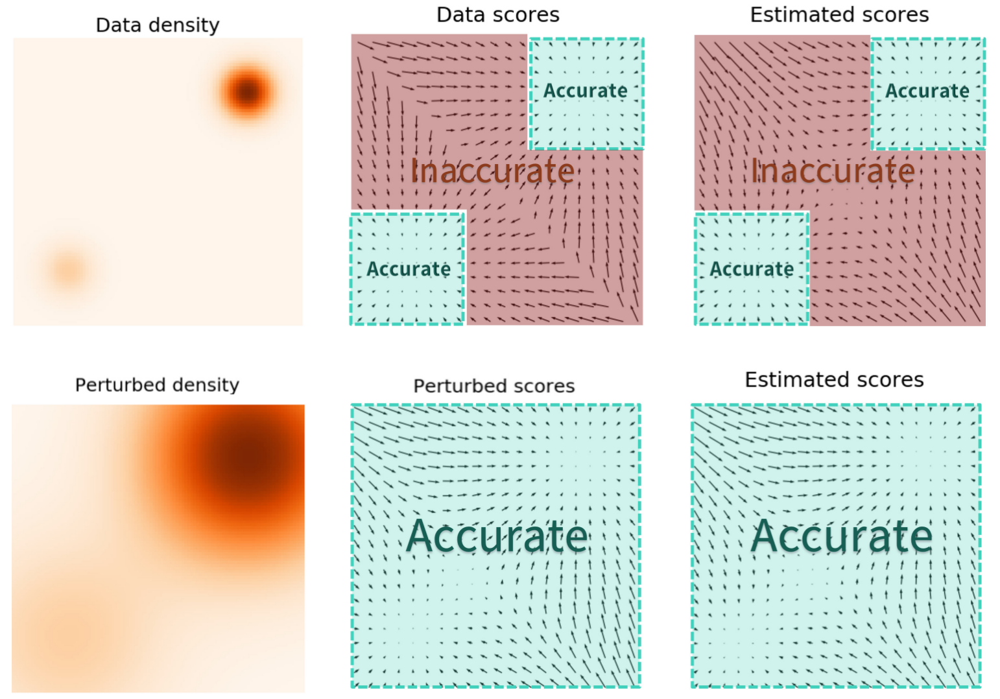
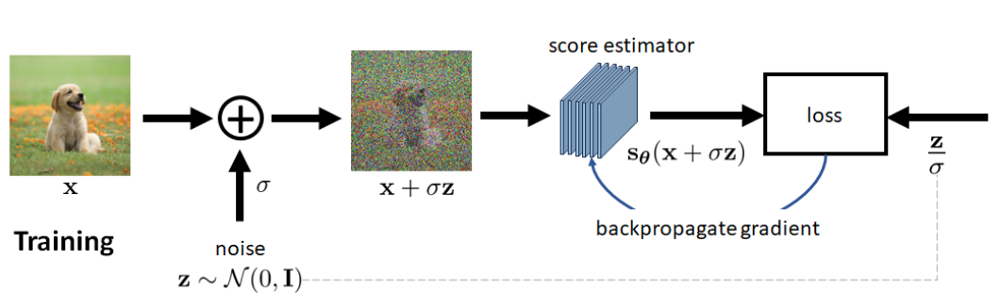
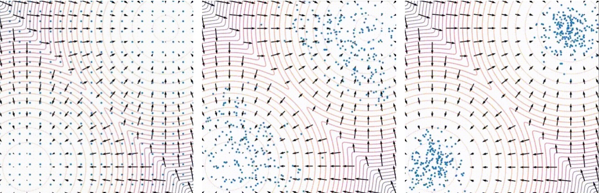

基于分数匹配郎之万动力方程的扩散模型（Score-Matching Langevin Dynamics，SMLD）也是一种用于机器学习和统计物理领域的数学生成模型。这种模型结合了**分数匹配**和**郎之万动力方程**，用于估计概率分布的梯度（即“分数”），并以此来生成新的数据样本。整体分为两个过程。
- 分数模型训练过程。由分数匹配方法进行训练，该方法目前主要由两种方法进行：“显示分数匹配”，“去噪分数匹配”。我们主要使用噪声分数匹配方法。噪声分数匹配核心过程是用一组不同的高斯噪声序列对数据进行干扰：通过训练一个以噪声为条件的深度神经网络模型，来计算出噪声数据分布的分数匹配函数。
- 采样生成过程。采样过程主要由郎之万动力方程生成得到的，此方法的局限性就是在数据密度较低的区域采样，其估计结果不会十分准确，从而不能有效地获得高质量样本，因此NCSN算法做出了一定更改，成为了现在分数匹配扩散模型的样子。
本部分内容主要源于NCSN （Noise Conditional Score Networks）论文[2]，这是宋飏发表在 NeurIPS2019 上面的文章，比DDPM那篇文章还要早。**因此，理解本节的一个前提是：不要按DDPM的逻辑套SMLD。**
下面我们介绍一下SMLD项目的背景：宋飏博士认为现有的生成模型可以大体分为两种[3]：**基于似然的模型**与**隐式生成模型**。
- 基于似然的生成模型试图学习一个使观察数据样本可能性最大化的模型。这包括自回归模型、规范化流和变分自动编码器（VAEs）。
- 隐式生成模型（当时是指GAN）要求对抗训练，且模型不稳定很容易崩溃。

为了规避这些问题，宋飏博士选择了一种新的生成模式：**基于能量的生成模型**。在这里，分布被学习成一个任意的能量函数，然后被归一化。基于**分数函数（Score-based） 的生成模型**就很像这种模式；但他不是学习能量函数本身，而是学习能量模型的分数，从而进行神经网络建模。从大量被噪声扰动的数据分布中学习分数函数，又成为**斯坦因分数**（Stein score）。在SMLD的实际使用时，它与**朗之万动力学**（Langevin dynamics）一起使用，为了从估计的数据分布中进行采样来生成新的样本。这样得到的生成模型通常称为“**基于分数的生成模型**”（Score-based Generative Models，SGM）。本文中，我们借助“去噪分数匹配”，“郎之万动力方程”这两个知识点搭建SMLD模型。同时我们声明：在本节中提到的“基于分数的扩散模型”默认就是SMLD。

### 1.7.1 “分数”的起源
传统生成模型的目标就是要得到数据的分布。例如一个数据集 ${x_1, x_2, ..., x_N}$ 的数据的概率密度分布（注意，这里是概率密度分布，PDF）为 $p(x)$ 。起初我们认为初始的数据是杂乱的，随机的，我们可以记为：
$$
p_{\theta}({x}) = \frac{e^{-f_{\theta}({x})}}{C_{\theta}},f_{\theta}({x})\in \mathbb{R} \tag{1.7.1}\\
$$
$\theta$ 是参数用于建模， $f_{\theta}$ 被称为核心能量模型（energy-based model）。这个函数型就很像高斯函数 $f(x)=\frac{1}{σ \sqrt{2π}} \cdot e^{\frac{-(x - μ)^2} {2σ^2}}$ 。我们首先计算基于 $x$ 的导数为：
$$
\nabla _{{x}}\log(p_{\theta}({x})) = -\nabla _{{x}}f _{\theta}({x}) - \nabla _{{x}}\log C_{\theta} = -\nabla _{{x}}f _{\theta}({x}) \tag{1.7.2} \\
$$
这里 $\nabla _{{x}}\log C_{\theta}=0$ 。公式（1.7.2）里， $-\nabla _{{x}}f _{\theta}({x})$ 称为“斯坦因分数”（Stein score），在本论文中被简称为“**分数**”（score）。这里要明确一下，我们这里对 $x$ 求导而不是类似于“极大似然计算参数”的对 $\theta$ 求导。如果对 $\theta$ 求导，我们会发现后面又多了一个更难求解的 $C_\theta$ 项。除此之外，我们在这里更关注的是数据 $x$ 采样。
从数学角度看，“分数”是一个“矢（向）量场”（vector field）。向量的方向是：对于输入数据（样本），其对数概率密度增长最快的方向。在采样过程中，若沿着分数的方向走，就能走到数据分布的高概率密度区域，最终生成的样本会符合原数据分布。由此可知，我们更关注数据 $x$ 采样，是因为通过采样，可让样本分布更趋近于“矢（向）量场”分布。现在，我们想训练一个神经网络来估计“分数”的分布。假设用 $s_\theta({x})$ 表示训练神经网络的分数，同理，$\theta$ 代表神经网络。我们可以用L2损失函数来最小化真实的score function，如下：
$$\mathcal{Loss} = \mathbb{E}_{p({x})}[||\nabla _{{x}}\log p_\theta({x}) - {s} _{\theta}({x})||^{2}] \tag{1.7.3}$$
我们可以用公式（1.7.3）的损失函数，训练神经网络 $\theta$ 模型。这种求解方案可以叫“**显式分数匹配损失**”（ESM），加了“显式”二字就是为了与后面更常用的“**去噪分数匹配**”（DSM）区分。显式分数匹配的方法使用“核函数”等构造函数，更加直接地求解分数模型。整体过程非常复杂，也不是我们需要的内容，这里暂时不提。我们关心的是使用更方便的“**去噪分数匹配**”方法，直接进行分数模型整体的求解，这就是下面的内容了。

### 1.7.2  基于分数的扩散模型
#### 1.7.2.1  去噪分数匹配（Denoising Score Matching，DSM）
> [!Note]
> 这部分名为“去噪分数匹配”，是根据“采样生成就是去噪过程”这一原则定义的。但是采样的图像却需要使用“增加噪声”的方法来祛除采样的不准确性。在本部分，原本的“去噪分数匹配”没有在公式中明显表明，反而在公式中表现出来的一直是“图片加噪”操作。如果我们明白哪里是去噪，哪里是加噪，那么就会理解这里并不矛盾。
##### 1.7.2.1.1  去噪分数匹配中的加噪操作
在NCSN论文中，作者为了采样更加准确，将每一步 $\mathbf{x}$ 采样加上不同的噪声 $\sigma$，来模拟每一步的过程。在一步布朗运动中，我们从标准高斯分布 $\mathcal{N}(0,𝐼)$ 中采样随机噪声𝜖，然后乘上我们预定义的 $𝜎$ ，接着加到样本 $𝑥$ 中，从而就能得到加噪后的样本 $\tilde{\mathbf{x}}=\mathbf{x}+\sigma\epsilon$。这样“增噪”有两个好处：
- 对布朗运动的过程进行了模拟，在思路方面与“基于噪声的扩散模型”达成了等同。在下文当中，我们将会对两者的关系予以介绍。
- 解决低概率密度区域 score 估计不准确的问题，同时亦解决了模型不易收敛的问题。（此种分布对于 VAE 亦存在同样问题。）这个问题的起源于初始状态没有覆盖整幅图片，最终陷入局部最优，任务失败。同时，宋飏博士举一例子（如下图所示），加入噪声后，采样选中的几率将大大增加，余下的则为平滑移动的问题。

	（原图增加噪声后，采样选中的几率会大大增加，蓝色为采样命中的区域，剩下的事情就是最小化的操作了。 图片来自宋飏博客（https://yang-song.net/blog/2021/score/））
	
> [!Note]
> 
> 提问：加噪对采样为什么有用?
> 答：打个形象的比喻，图片加噪可以认为是油画入水，图像荫开了。如果想把油画中的“小龙女”变成“鲁智深”。直接在原图有点难，因为可改动的区域不大。把“小龙女”油画放在水中，图像荫开了再改就很有效了。
> 提问：不加噪可不可以?
> 答：理论上可行性，但会致使很多区间采样不到，结果有极大的不准确性。因此，我们在后续的考虑中均采用加噪公式。

##### 1.7.2.1.2  去噪分数匹配中的去噪操作
我们构建新分布为：
$$\begin{align}
p_{\sigma}(\tilde{\mathbf{x}}) &=\int p_σ(\tilde{\mathbf{x}}|\mathbf{x}) p_{data}(\mathbf{x}) d\mathbf{x} \tag{1.7.4} \\
& = \int \mathcal{N}(\tilde{\mathbf{x}}|\mathbf{x},σ^2I)p_{data}(\mathbf{x}) d\mathbf{x} \tag{1.7.5}\\
\text{and} ~ \tilde{\mathbf{x}}&=\mathbf{x}+\sigma\epsilon, ~ \epsilon\sim \mathcal{N}(0,I) \tag{1.7.6} \\
\end{align}$$
上式中，$\mathbf{x}$ 代表原始图片，这里用向量表示，$\tilde{\mathbf{x}}$ 代表加载后的图片公式（1.7.4）的积分是代表采样，有些地方会看到公式（1.7.5）的形式，把引入噪声的 $\sigma$ 明确表示出来。**我们知道 $p_{data}$ 函数其实就是 $p_σ$ ，只不过是通过分布采样得到函数。** $p_{data}(\mathbf{x})$ 代表需要原始数据的分布。$p_σ(\tilde{\mathbf{x}}|\mathbf{x}) \sim \mathcal{N}(\tilde{\mathbf{x}}|\mathbf{x},σ^2I)$ 表示加噪扰动数据分布。$p_{\sigma}(\tilde{\mathbf{x}})$ 就是我们构建的新分布。

> [!Note]
> 说明：在上节中，我们用 $p$ 来表示去噪过程，这里也用 $p_{\sigma}(\mathbf{x})$ 表示去噪过程。有人质疑，$p_σ(\tilde{\mathbf{x}}|\mathbf{x})$ 不是从 $\mathbf{x}$ 到 $\tilde{\mathbf{x}}$ 的加噪过程吗，为什么不用 $q$ ？y因为我们最终要做的是去噪，这里的主流程也是去噪。而你所理解的加噪并不是加噪，而是采样操作，只是表现为加噪格式。所以这里带参数 $\sigma$ 的 $p_\sigma$ 来表示。

NCSN本质上还是个基于分数优化的模型。按照公式（1.7.3）的写法，这里是训练一个条件分数网络 $s_{\theta}( \tilde{\mathbf{x}},\sigma )$ 来估计扰动数据的分布，即 
$$
\frac{1}{2}\mathbb{E}_{p_σ(\tilde{\mathbf{x}})}
\Big[\Vert s_{\theta}( \tilde{\mathbf{x}},\sigma ) - \nabla _{\tilde{\mathbf{x}}} \log p_σ(\tilde{\mathbf{x}})\Vert_2^2\Big] \tag{1.7.7}
$$
前面的 $\frac{1}{2}$ 是调和结果用，我们可以不要担心。在DSM论文[4]，得到以下的推导公式
$$
\begin{align}
& ~~~~ \frac{1}{2}\mathbb{E}_{p_σ(\tilde{\mathbf{x}})}
\Big[\Vert s_{\theta}( \tilde{\mathbf{x}},\sigma ) - \nabla _{\tilde{\mathbf{x}}} \log p_σ(\tilde{\mathbf{x}})\Vert_2^2\Big] \tag{1.7.8} \\
&= \frac{1}{2}\mathbb{E}_{p_σ(\tilde{\mathbf{x}}|\mathbf{x}) p_σ(\mathbf{x}) }
\Big[\Vert s_{\theta}( \tilde{\mathbf{x}},\sigma ) - \nabla _{\tilde{\mathbf{x}}} \log p_σ(\tilde{\mathbf{x}}|\mathbf{x})\Vert_2^2\Big] \tag{1.7.9}
\end{align}
$$
公式（1.7.9）就是去噪声分数匹配的损失函数。整个推理过程看起来比较无聊，但的确告诉了我们损失函数的解法。去噪分数匹配方法是在计算噪声条件分数网络（NCSN） 中默认的计算方法[3]。
这里面还有一个潜在推理。当 $\mathbf{x}$ 是 $D$ 维（如果 $f(\mathbf{x})$ 是一维高斯，下面结果会更容易得出了，这里不做解释。），即 ${\mathbf{x}}\in \mathbb{R} ^D$ 时，由多维高斯分布 $f( \mathbf{\mathbf{x}} ) = \frac{1}{(2\pi)^{\frac{D}{2}} | Σ |^{\frac{1}{2}}} e^{- \frac{1}{2}( \mathbf{x} - μ )^T Σ^{-1}(\mathbf{x} - μ)}$  可得:
$$
\begin{align}
\nabla _{\tilde{\mathbf{x}}} \log p_σ(\tilde{\mathbf{x}}|\mathbf{x}) &= \nabla _{\tilde{\mathbf{x}}}(C - \frac{1}{2}(\tilde{\mathbf{x}} - \mathbf{x} )^T Σ^{-1}(\tilde{\mathbf{x}} - \mathbf{x})) \\
&= -Σ^{-1}(\tilde{\mathbf{x}} - \mathbf{x}) \\
&= -\begin{bmatrix} 𝜎_{1}^2 & & & \\ & 𝜎_{2}^2 & & \\ & & \ddots &\\ & & &𝜎_{d}^2 \end{bmatrix}^{-1} (\tilde{\mathbf{x}} - \mathbf{x}) \\
&= - \frac{\tilde{\mathbf{x}} - \mathbf{x}}{𝜎^2} \tag{1.7.10} \\
&= - \frac{\epsilon}{𝜎} \tag{1.7.11}
\end{align}
$$
 ，将（1.7.10）（1.7.11）带入公式（1.7.9）中可以写为如下形式：
$$
\begin{align}
& ~~~~ \frac{1}{2}\mathbb{E}_{p_σ(\tilde{\mathbf{x}}|\mathbf{x}) p_{data}(\mathbf{x}) }
\Big[\Vert s_{\theta}( \tilde{\mathbf{x}},\sigma ) - \nabla _{\tilde{\mathbf{x}}} \log p_σ(\tilde{\mathbf{x}}|\mathbf{x})\Vert_2^2\Big] \\
&= \frac{1}{2}\mathbb{E}_{p_σ(\tilde{\mathbf{x}}|\mathbf{x})}\mathbb{E}_{p_{data}(\mathbf{x})}
\Big[\Big\Vert s_{\theta}( \tilde{\mathbf{x}},\sigma ) + \frac{\tilde{\mathbf{x}}-\mathbf{x}}{σ^2}\Big\Vert_2^2\Big] \\ 
&= \frac{1}{2}\mathbb{E}_{p_{data}(\mathbf{x})}\mathbb{E}_{\tilde{\mathbf{x}} \sim \mathcal{N}(\tilde{\mathbf{x}}|\mathbf{x},σ^2I)}
\Big[\Big\Vert s_{\theta}( \tilde{\mathbf{x}},\sigma ) + \frac{\tilde{\mathbf{x}}-\mathbf{x}}{σ^2}\Big\Vert_2^2\Big] \tag{1.7.12} \\
&= \frac{1}{2}\mathbb{E}_{p_{data}(\mathbf{x})}\mathbb{E}_{\tilde{\mathbf{x}} \sim \mathcal{N}(\tilde{\mathbf{x}}|\mathbf{x},σ^2I)}
\Big[\Big\Vert s_{\theta}( \mathbf{x}+\sigma\epsilon ) + \frac{\epsilon}{σ}\Big\Vert_2^2\Big] \tag{1.7.13}\\
& =\mathcal{l}(\theta;\sigma) 
\end{align}
$$
一搬来讲，我们推导（1.7.12）就停了，但是为了给后面的内容搭桥，我们多写了一步。具体怎么使用后面再介绍。宋飏博士实验发现 $s_{\theta}( \tilde{\mathbf{x}},\sigma )$ 正比于 $\frac{1}{\sigma}$ 。真正在使用时，论文使用的是这个函数是把里面的  $\frac{1}{\sigma}$  提出来，如下公式，这样期望里面的值就与方差无关了。
$$\frac{1}{2σ^2}\mathbb{E}_{p_{data}(\mathbf{x})}\mathbb{E}_{\tilde{\mathbf{x}} \sim \mathcal{N}(\tilde{\mathbf{x}}|\mathbf{x},σ^2I)}
\Big[\Big\Vert σ*s_{\theta}( \mathbf{x}+\sigma\epsilon) + \epsilon\Big\Vert_2^2\Big] \tag{1.7.14}$$
>[!Note]
这里还要说下，不同的文献会对这里的参数做些许调整。因为我们的最终目的是利用训练出来的分数模型 $s_{\theta}( \mathbf{x}+\sigma\epsilon)$ 来采样生成图像。所以公式（1.7.12，1.7.13）在不同文献中都可能使用。同时我们还对公式的期望符号 $\mathbb{E}$ 进行忽略，只考虑期望里面的部分为0作为损失函数即可：
$$σ*s_{\theta}( \mathbf{x}+\sigma\epsilon) + \epsilon = 0$$
也就是说拿到 $s_{\theta}( \mathbf{x}+\sigma\epsilon)$ 训练的模型后，我们可以得到基于分数模型的加噪公式：
$$\tilde{\mathbf{x}}=\mathbf{x}-\sigma^2 s_{\theta}( \mathbf{x}+\sigma\epsilon)$$
以及基于分数模型的去噪公式：
$$\mathbf{x} = \tilde{\mathbf{x}}+\sigma^2 s_{\theta}( \mathbf{x}+\sigma\epsilon)$$

那么整体训练结构该如何搭建呢？如下图所示。

（ 噪声分数匹配模型训练，其中$s_\theta$ 代表需要训练的噪声。图片来自”Tutorial on Diffusion Models for Imaging and Vision“ ）
上图的内容需要从左往右看：一副原始图像 $\mathbf{x}$ 加上方差为 $\sigma$ 的噪声 $\mathbf{z}$ ，就是我们需要训练的模型 $s_{\theta}( \mathbf{x}+\sigma \mathbf{z})$ 的输入；模型 $s_{\theta}( \mathbf{x}+\sigma \mathbf{z})$ 的输出与 $\frac{\mathbf{z}}{\sigma}$ 计算损失函数，即是公式（1.7.13）的内容。
既然训练得到了分数模型 $s_{\theta}(\mathbf{x})$ ，基于分数模型的图像生成网络本应是大团圆结局。但是根据DDPM的经验，我们知道一次去噪的效果很差。我们可以把上述“基于分数模型的去噪公式”逻辑上等价于“基于分数模型扩散模型的VAE”（可以这么理解），那么“加入特定条件的多轮VAE形成DDPM”就是在逻辑上等价于“多轮基于分数模型的去噪模型形成SMLD”。如何进行多轮去噪，这就是郎之万动力学（Langevin dynamics）采样方法的事情了。
#### 1.7.2.2 郎之万动力学（Langevin dynamics）采样方法
当我们训练完了分数模型 $s_{\theta}(\mathbf{x})$ 后，我们就可以使用各种采用方法进行生成推理了。我们在这里使用的方法是**郎之万动力学采样方法**。
1.7.1中关于分数的解释是通用的说法，我们在这上面加上条件，考虑一个不断地做布朗运动的分布，我们该如何模仿其过程？这就涉及到描述物理学中布朗运动（悬浮在液体或气体中的微小颗粒所做的无规则运动）的微分方程**朗之万动力学**（Langevin dynamics）方程。概括地来说，该方法首先从先验分布随机采样一个初始样本，然后利用模型估计出来的分数逐渐将样本向数据分布的高概率密度区域靠近。为保证生成结果的多样性，我们需要采样过程带有随机性。当经过中所述的分数匹配方法训练深度生成模型后，可以使用具有迭代过程的朗之万动力学采样方法从分布中来生成新的样本。朗之万动力学推理过程很复杂，且属于物理的知识，这里不再过多描述。采样过程描述：假设初始数据满足先验分布 $x_0 \sim \pi(x)$ ，然后使用迭代过程
$$
\begin{align*}
x_{t+1}&=x_t+\frac{\epsilon}{2}\nabla _{x}\log  p\left( x \right) +\sqrt{\epsilon}\boldsymbol{z}_t, t=0,1,2,\cdots ,T\\
&=x_t+{\tau}\nabla _{x}\log  p\left( x \right) +\sqrt{2\tau}\boldsymbol{z}_t, t=0,1,2,\cdots ,T \tag{1.7.15}\\
\end{align*}
$$
当 $\frac{\epsilon}{2}=\tau$ 时上面的公式等价。其中， $z_i \sim \mathcal{N}(0,I)$ 为标准高斯分布，可以看成是噪声的概念，$\epsilon,\tau$ 是可以看成步长。虽然物理定义不同，但“朗之万动力学公式”本质与“随机梯度下降”，“泰勒公式展开”实际上是同源的。例如我们在高等数学中学到的泰勒展开公式如下：
$$
\begin{align}
f(x+\epsilon)=f(x)+f^{'}(x)\epsilon+\frac{1}{2}f^{''}(x)\epsilon^2+o(\epsilon^3)
\end{align}
$$
再看“梯度下降”的公式：
$$\begin{align}
f(k-\epsilon) = f(k) - \epsilon * f'(k) \\
x_{k+1} = x_k - \epsilon*f'(k)
\end{align}$$
为了适配“梯度下降”负梯度求最小值的逻辑，这里的 $\epsilon$ 是个负值。但是这并不否认“泰勒公式展开”同源的概念。为什么总是“泰勒公式展开”在起关键作用？其本质在于泰勒公式是在一步步靠近极值，且越靠近极值，梯度越等于0越不更新。所以以后我们在极值附近考虑问题时，可以优先考虑“泰勒公式展开”方案。
因为有 $\sqrt{2\tau}z_t$ 项的作用，“朗之万动力学公式”不是紧贴极值采样，而是在极值附近采样；而且由于 $z_t$ 的随机作用，采样会随机的聚合在极值附近。这种随机作用也导致了已知的当前状态与未来或过去的状态都无关，这是典型的马尔可夫性。下图是模拟“郎之万动力过程”在两个高斯分布中采样的结果。结合郎之万迭代过程公式（1.7.15），当 $t \rightarrow \infty$ 时，$\epsilon \rightarrow 0$ ，最终生成的样本 $x_t$ 将会服从原数据分布 $p_{data}(x)$，趋于某一个特定值。这说明扩散过程是收敛的马尔可夫过程，整体收敛于的采样分布。

（从左到右，图片模拟的是使用“郎之万动力学”在两个高斯分布中采样，最后采样的结果（右图）很符合原始两个峰值的高斯分布）

> [!Note]
> 此时，我们有了一个想法：由于这与基于噪声的扩散模型类似，我们可以设想把“郎之万动力学”公式中描述的物体逐步进行的布朗运动过程，看作是从“图片到噪声”的逐步扩散过程。 

#### 1.7.2.3 案例：退火朗之万动力学采样具体流程
在1.7.7.2里面，我们介绍了一步”郎之万动力方程“的推理采样过程，NCSN 使用了多个噪声级别，我们将其推广开来。
我们有如下表示表示：有 $L$ 个递增的 $𝜎_1>𝜎_2>⋯>𝜎_L>0$ ，分布 $q(X)$ 与每个高斯噪声 $\sigma\epsilon \sim \mathcal{N}(0,𝜎_i^2I),i=1,2,⋯,L$ 结合成受扰动的分布。这里的 $𝜎_L$ 要足够小，$𝜎_1$ 的尺度大概为所有训练数据点两两之间的最大距离，𝐿 一般是几百到几千的范围。这种采样方法越往后，噪声越小（退火），所以叫退火朗之万动力学采样（annealed Langevin dynamics）。直观来看，按照噪声递减的顺序来采样是因为，一开始噪声先大一些，能够让数据先移动到高密度区域，之后噪声再小一些，可以让数据在高密度区域能更精准地移动到更加符合数据分布的位置。
如下是退火朗之万动力学采样（annealed Langevin dynamics）的算法流程：

| 退火朗之万动力学采样伪代码                                                                                                                             |
| ----------------------------------------------------------------------------------------------------------------------------------------- |
| 已知：$\{\sigma_i\}_{i=1}^L,\epsilon,T$                                                                                                      |
| 1:  初始化 $x_0$ 为随机分布                                                                                                                       |
| 2:  for i=1 to L:        # 模拟退火算法，噪声从大到小                                                                                                  |
| 3:        $\alpha_i = \epsilon \cdot \frac{\sigma_i^2}{\sigma_L^2}$     # $\alpha$ 是步长，从大到小。类似梯度下降，开始找方向，后面微调                             |
| 4:        for t =1 to T:  # 每个步长都经过T步郎之万采样                                                                                                |
| 5:             Draw $\mathbf{z}_t \sim \mathcal{N}(0,I)$                                                                                  |
| 6:             $\mathbf{x}_{t}=\mathbf{x}_{t-1}+\frac{\alpha_i}{2}s_{\theta}(x_{t-1},\sigma_i) +\sqrt{\alpha_i}\boldsymbol{\mathbf{z}}_t$ |
| 7:        $\mathbf{x}_0=\mathbf{x}_t$                                                                                                     |
| 8.  return $\mathbf{x}_T$   # 注意，这里的 $\mathbf{x}_T$代表真实图像                                                                                 |

### 1.7.3 基于”分数“与基于”噪声“的扩散模型具有统一性
介绍完“分数”的扩散生成模型基础知识，我们回到基于噪声的扩散模型DDPM的理论上。我们引入 Tweedie 公式。
>[!Tweedie 公式]
> Tweedie 公式来自贝叶斯估计。贝叶斯估计的问题定义为根据一些观测数据 $𝑥$ 来估计未知参数 $𝜃$，如果用均方误差(MSE)损失函数来衡量估计的准确性的话，我们将问题建模为：
> $$L= \mathbb{E}[(\hat{\theta}(x)-\theta)^2]$$
> 整个问题本质其实就是求解， $x$ 的条件下， $\theta$ 值的期望：
> $$\hat{\theta}(x)=\mathbb{E}[\theta|x]=\int \theta p(\theta|x)d\theta \tag{1.7.16}$$
> 而Tweedie公式，就是一种估计 $\theta$ 的方案。假设 $p(x|\theta)=\mathcal{N}(\theta,\sigma^2)$，可以通过观测数据估计出参数𝜎，则有：
> $$\begin{align}
 \hat{\theta}(x)=\mathbb{E}[\theta|x] &=\int \theta p(\theta|x)d\theta \\
 &= x+\sigma^2\frac{d}{dx} \log p(x) \tag{1.7.17}
 \end{align}$$
> 这个公式的优点是一直保有着 $𝑝(𝜃)$ 的雏形而没有探究它的具体样子。此公式专供已知方差，求不出来均值时使用。从数学上讲，对于满足高斯分布的变量 $𝑧 \sim \mathcal{𝑁}(𝑧;μ_𝑧,Σ_𝑧)$，Tweedie 公式如下：
> $$\mathbb{E}[𝜇_z|z]=z+𝛴_z ∇_z \log⁡ p(z) \tag{1.7.18}$$

利用Tweedie 公式此时我们构造出了”分数“公式。我们从前文的推理 $q(\mathbf{x}_t|\mathbf{x}_0)=\mathcal{N}(\mathbf{x}_t;\sqrt{\bar{\alpha}_t}\mathbf{x}_0,(1-\bar{\alpha}_t)I)$ 开始，尝试将上面的推论用到之前VDM的推理。利用Tweedie公式，我们得出：

$$\mathbb{𝐸}[𝜇_{\mathbf{x}_t}|\mathbf{x}_t]=\mathbf{x}_t+(1-\bar{\alpha}_t)∇_{\mathbf{x}_t} \log⁡ 𝑝(\mathbf{x}_t) \tag{1.7.19}$$

这么做的目的是我们发现公式 $q(\mathbf{x}_t|\mathbf{x}_0)=\mathcal{N}(\mathbf{x}_t;\sqrt{\bar{\alpha}_t}\mathbf{x}_0,(1-\bar{\alpha}_t)I)$  里面“方差很好求，均值太难求（因为有$\mathbf{x}_0$）“。我们有必要避免较少对均值的的使用，如有必要还需要对均值给出一种新的形式。为了符号的简洁性，我们将 $∇_{\mathbf{x}_t}\log p(\mathbf{x}_t)$ 写为 $∇ \log p(\mathbf{x}_t)$ 。根据 Tweedie 公式，由 $\mathbf{x}_𝑡$ 生成的真实均值 $μ_{𝑥_𝑡}=\sqrt{\bar{α}_t}\mathbf{x}_0$ ，可定义为：
$$
\begin{align}
\sqrt{\bar{α}_t}𝑥_0 &= \mathbf{x}_t+(1-\bar{\alpha}_t)∇_{\mathbf{x}_t} \log⁡ 𝑝(\mathbf{x}_t) \tag{1.7.20} \\
\therefore \mathbf{x}_0 &= \frac{\mathbf{x}_t+(1-\bar{\alpha}_t)∇_{\mathbf{x}_t} \log⁡ 𝑝(\mathbf{x}_t)} {\sqrt{\bar{α}_t}} \tag{1.7.21}
\end{align}
$$
然后，我们可以将公式（1.7.21）再次代入我们的真实去噪转移均值 $μ_𝑞(\mathbf{x}_𝑡,\mathbf{x}_0)$并推导出新的形式：
$$
\begin{align}
\mu_q(\mathbf{x}_t,\mathbf{x}_0) &=\frac{\sqrt{{\alpha}_t}(1-\bar{{\alpha}}_{t-1}){{\mathbf{x}}}_t+\sqrt{\bar{{\alpha}}_{t-1}}(1-{\alpha}_t){{\mathbf{x}}}_{0}}{1-\bar{{\alpha}}_{t}} 
\tag{1.7.22} \\
&= \frac{\sqrt{{\alpha}_t}(1-\bar{{\alpha}}_{t-1}){{\mathbf{x}}}_t+\sqrt{\bar{{\alpha}}_{t-1}}(1-{\alpha}_t)\frac{\mathbf{x}_t+(1-\bar{\alpha}_t)∇_{\mathbf{x}_t} \log⁡ 𝑝(\mathbf{x}_t)} {\sqrt{\bar{α}_t}} }{1-\bar{{\alpha}}_{t}}  \tag{}\\
&= \frac{\sqrt{{\alpha}_t}(1-\bar{{\alpha}}_{t-1}){{\mathbf{x}}}_t+(1-{\alpha}_t)\frac{\mathbf{x}_t+(1-\bar{\alpha}_t)∇_{\mathbf{x}_t} \log⁡ 𝑝(\mathbf{x}_t)} {\sqrt{α_t}} }{1-\bar{\alpha}_{t}} \\
&= \frac{\sqrt{{\alpha}_t}(1-\bar{{\alpha}}_{t-1}){{\mathbf{x}}}_t}{1-\bar{\alpha}_{t}} +
\frac{(1-{\alpha}_t)\mathbf{x}_t}{(1-\bar{\alpha}_{t})\sqrt{α_t}} + \frac{(1-\alpha_t)(1-\bar{\alpha}_t)∇_{\mathbf{x}_t} \log⁡ 𝑝(\mathbf{x}_t) }{(1-\bar{\alpha}_{t})\sqrt{α_t}}  \\
&= \Big(\frac{\sqrt{{\alpha}_t}(1-\bar{{\alpha}}_{t-1})}{1-\bar{\alpha}_{t}} +
\frac{1-{\alpha}_t}{(1-\bar{\alpha}_{t})\sqrt{α_t}} \Big)\mathbf{x}_t+ \frac{1-\alpha_t}{\sqrt{α_t}}∇_{\mathbf{x}_t} \log⁡ 𝑝(\mathbf{x}_t)  \\
&= \Big(\frac{{\alpha}_t(1-\bar{{\alpha}}_{t-1})}{(1-\bar{\alpha}_{t})\sqrt{{\alpha}_t}} +
\frac{1-{\alpha}_t}{(1-\bar{\alpha}_{t})\sqrt{α_t}} \Big)\mathbf{x}_t+ \frac{1-\alpha_t}{\sqrt{α_t}}∇_{\mathbf{x}_t} \log⁡ 𝑝(\mathbf{x}_t) \\
&= \frac{{\alpha}_t -\bar{{\alpha}}_{t}+ 1-{\alpha}_t}{(1-\bar{\alpha}_{t})\sqrt{α_t}}\mathbf{x}_t+ \frac{1-\alpha_t}{\sqrt{α_t}}∇_{\mathbf{x}_t} \log⁡ 𝑝(\mathbf{x}_t)  \\
&= \frac{ 1-\bar{{\alpha}}_{t}}{(1-\bar{\alpha}_{t})\sqrt{α_t}}\mathbf{x}_t+ \frac{1-\alpha_t}{\sqrt{α_t}}∇_{\mathbf{x}_t} \log⁡ 𝑝(\mathbf{x}_t) \\
&= \frac{ 1}{\sqrt{α_t}}\mathbf{x}_t+ \frac{1-\alpha_t}{\sqrt{α_t}}∇_{\mathbf{x}_t} \log⁡ 𝑝(\mathbf{x}_t) \tag{1.7.23} \\
\end{align}
$$
因此，我们可以设置近视去噪均值 $\mu_\theta(\mathbf{x}_t,t)$ 为：
$$
\mu_\theta(\mathbf{x}_t,t) = \frac{1}{\sqrt{\alpha_t}}\mathbf{x}_t - \frac{1-{\alpha}_t}{\sqrt{1-\bar{{\alpha}}_t}\sqrt{\alpha_t}}s_\theta(\mathbf{x}_t,t) \tag{1.7.24}
$$
相应的优化问题可以变为：
$$
\begin{align}
&~~~~\arg\min_{{{\theta}}} D_{\text{KL}}(q({{\mathbf{x}}}_{t-1}|{{\mathbf{x}}}_t,{{\mathbf{x}}}_0)\Vert p_{{\theta}}({{\mathbf{x}}}_{t-1}|{{\mathbf{x}}}_t))\\
&=\arg\min_{{{\theta}}} D_{\text{KL}}(\mathcal{N} ({{\mathbf{x}}}_{t-1}; μ_q, Σ_q(t)) \Vert \mathcal{N} ({{\mathbf{x}}}_{t-1}; μ_{{\theta}}, Σ_q(t))) \tag{1.7.25} \\
&=\arg\min_{{{\theta}}} \frac{1}{2σ_q^2 (t)} \left[ \Big\Vert \frac{1}{\sqrt{\alpha_t}}\mathbf{x}_t + \frac{1-{\alpha}_t}{\sqrt{\alpha_t}}s_\theta(\mathbf{x}_t,t) − \frac{1}{\sqrt{\alpha_t}}\mathbf{x}_t - \frac{1-{\alpha}_t}{\sqrt{\alpha_t}}∇_{\mathbf{x}_t} \log⁡ 𝑝(\mathbf{x}_t)\Big\Vert_2^2 \right]  \\
&=\arg\min_{{{\theta}}} \frac{1}{2σ_q^2 (t)} \left[ \Big\Vert  \frac{1-{\alpha}_t}{\sqrt{\alpha_t}}s_\theta(\mathbf{x}_t,t) - \frac{1-{\alpha}_t}{\sqrt{\alpha_t}}∇_{\mathbf{x}_t} \log⁡ 𝑝(\mathbf{x}_t)\Big\Vert_2^2 \right] \\
&=\arg\min_{{{\theta}}} \frac{1}{2σ_q^2 (t)} \left[ \Big\Vert  \frac{1-{\alpha}_t}{\sqrt{\alpha_t}}(s_\theta(\mathbf{x}_t,t) - ∇_{\mathbf{x}_t} \log⁡ 𝑝(\mathbf{x}_t))\Big\Vert_2^2 \right] \\
&=\arg\min_{{{\theta}}} \frac{1}{2σ_q^2 (t)} \frac{(1-{\alpha}_t)^2}{\alpha_t} \left[\Vert s_\theta(\mathbf{x}_t,t) - ∇_{\mathbf{x}_t} \log⁡ 𝑝(\mathbf{x}_t)\Vert_2^2 \right] \tag{1.7.26} \\
\end{align}
$$
这里，$s_θ(\mathbf{x}_t, t)$ 可以是一个神经网络，用来学习预测分数函数（score function） $∇_{\mathbf{x}_t} \log  p(\mathbf{x}_t)$。 $∇_{\mathbf{x}_t} \log  p(\mathbf{x}_t)$ 就是分数函数， 其性质后面会详细阐述。敏锐的读者会注意到，分数函数 $∇ \log⁡ p(\mathbf{x}_t)$ 在形式上与源噪声 $𝜖_0$ 非常相似。将Tweedie公式（1.7.21）与上一节DDPM重参数化技巧公式（1.6.6）结合起来，可以明确地展示这一点：
$$
\begin{align}
\mathbf{x}_0 = \frac{\mathbf{x}_t+(1-\bar{\alpha}_t)∇_{\mathbf{x}_t} \log⁡ 𝑝(\mathbf{x}_t)} {\sqrt{\bar{α}_t}} &= \frac{\mathbf{x}_t-\sqrt{1-\bar{\alpha}_t}\epsilon_0}{\sqrt{\bar{\alpha}_t}} \tag{} \\
\therefore (1-\bar{\alpha}_t)∇_{\mathbf{x}_t} \log⁡ 𝑝(\mathbf{x}_t) &= -\sqrt{1-\bar{\alpha}_t}\epsilon_0 \tag{1.7.27} \\
∇_{\mathbf{x}_t} \log⁡ 𝑝(\mathbf{x}_t) &= - \frac{1}{\sqrt{1-\bar{\alpha}_t}}\epsilon_0 \tag{1.7.28} \\
\end{align}
$$
因为是标准正态分布，这里的 $\epsilon_0$ 的下角标已经无意义，不管是从郎之万公式得到的公式（1.7.11）
$$
\begin{align}
\nabla _{\tilde{\mathbf{x}}} \log p_σ(\tilde{\mathbf{x}}|\mathbf{x}) &= - \frac{\epsilon}{𝜎} \\
p(\mathbf{x}_t|\mathbf{x}_0)&=\mathcal{N}(\mathbf{x}_t;\sqrt{\bar{\alpha}_t}\mathbf{x}_0,(1-\bar{\alpha}_t)I)
\end{align}
$$
还是Tweedie公式得到的 $∇_{\mathbf{x}_t} \log⁡ 𝑝(\mathbf{x}_t) = - \frac{1}{\sqrt{1-\bar{\alpha}_t}}\epsilon_0$ 我们都能得到
$$
\arg\min_{{{\theta}}} D_{\text{KL}}(q({{\mathbf{x}}}_{t-1}|{{\mathbf{x}}}_t,{{\mathbf{x}}}_0)\Vert p_{{\theta}}({{\mathbf{x}}}_{t-1}|{{\mathbf{x}}}_t)) = \arg\min_{{{\theta}}} \frac{1}{2σ_q^2 (t)} \frac{(1-{\alpha}_t)^2}{\alpha_t} \left[\Vert s_\theta(\mathbf{x}_t,t) + \frac{1}{\sqrt{1-\bar{\alpha}_t}}\epsilon_0 \Vert_2^2 \right]
$$
从目前来讲，我们用数学证明证实了：学习神经网络预测源噪声 $𝜖_0$（DDPM）；学习一定噪声水平下的图像分数函数 $∇ \log⁡ p(\mathbf{x}_t)$ （SMLD），都可以解释扩散模型。我们在看论文时如果遇到某些人用一种方法推理，请不要惊慌。其实内部原理是一样的。

[1] Jonathan Ho, Ajay Jain, Pieter Abbeel. Denoising Diffusion Probabilistic Models. arXiv preprint  arXiv:2006.11239v2.
[2] Yang Song, Jascha Sohl-Dickstein, Diederik P. Kingma, Abhishek Kumar, Stefano Ermon, Ben Poole. Score-Based Generative Modeling through Stochastic Differential Equations. arXiv:2011.13456
[3] Yang Song, and Stefano Ermon. Generative Modeling by Estimating Gradients of the Data Distribution. arXiv:1907.05600
[4] Pascal Vincent. A Connection Between Score Matching and Denoising Autoencoders