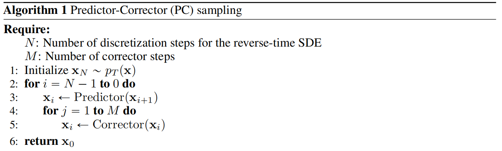
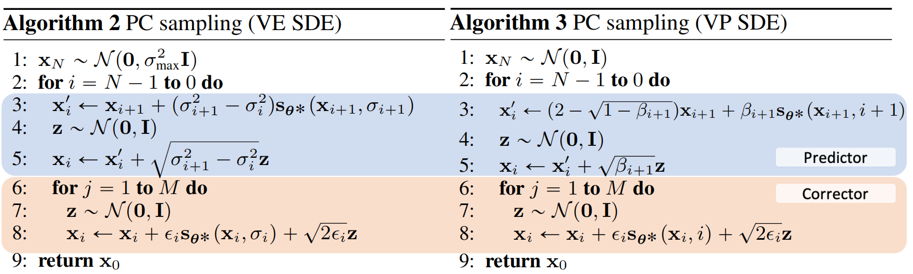

目前为止，我们已从 DDPM、SMLD 两个视角推导出了扩散模型扩散的方案。在本节内容中，我们将借助**随机微分方程**（Stochastic Differential Equation，SDE）来介绍扩散模型的第三种视角，此视角亦是前两种视角的统一格式。DDPM、SMLD 可被视作两种不同的 SDE。

微分方程在大学高等数学中有涉及。然而，较为遗憾的是，我们的教材并未给出过多微分方程的解题方法，原因在于解微分方程并无通用之法。常用的方法是通过公式的格式将方程分类，从而针对不同微分方程格式的求解。因此不同种类的微分方程，如常微分方程、随机微分方程、偏微分方程、高阶微分方程等都有不同的求解方法。因为随机微分方程的概念很重要，我们在后面会详解。
### 1.8.1 扩散模型的SDE
此前曾提及以“郎之万动力学方程”来描述布朗运动，然而此方程并非微分方程。另有一个用于描述布朗运动过程的微分方程公式，被我们称作维纳过程（Wiener process）。该过程是一个重要的独立增量过程。其对在连续时间内一个粒子于空间中的随机运动轨迹进行了描述。这种运动呈现无规则状态，即在任意短暂的时间间隔内，粒子的运动方向与距离皆为随机的，所以该微分方程叫做**随机微分方程**。
> [!维纳过程]
> 
> 维纳过程打分具体内容如下：
 在给定二阶矩过程${W(t),t>=0}$ ，如果它满足如下三个条件
> - 每一步t具有独立的增量，该过程在任一时间区间上变化的概率分布独立于其在任一的其他时间区间上变化的概率。
> - 对任意的$\Delta t>0，增量W(t+\Delta t)-W(t) \sim N(0,σ^2\Delta t）$，方差随时间区间的长度呈线性增加。
> - $W(0)=0, W(t)\sim N(0,σ^2t)$
> 则称此过程为维纳过程。有些数据设置 $\sigma=1$ ，这就是我们要关注的推理过程。此时可以得到通过变化求积分，可得：
> $$\begin{align}W(\Delta t)=\sqrt{\Delta t}N(0,I) \\ 
> \mathrm{d}W=\sqrt{\mathrm{d}t}\epsilon,\epsilon\sim N(0,I)\end{align}$$
> 这里的 $\sqrt{\mathrm{d}t}$ 你可以理解成$\mathrm{d}\sqrt{t}$，后面我们会使用这个公式。
> 后面我们使用随机过程（非二阶矩过程）时就不用大写$W$做标识了，而是用小写$w$。还要注意的是，维纳过程 $w$ 是有方向的，正向和反向的数学符号是不同的。

伊藤过程（Itô process）可看作一般化的维纳过程，它直接把“任一时间区间上的变化”理解为随机干扰。其随机微分方程的表示如下：
$$\mathrm{d}x_t = \mu (t,x)\mathrm{d}t+ \sigma(t,x)\mathrm{d}w$$
因为在我们的文章中，$\mu,\sigma$ 都有其特殊含义表均值与方差，并且不代表均值与方差函数。所以我们将伊藤过程记为如下公式
$$\mathrm{d}x_t = f(x,t)\mathrm{d}t+ g(t)\mathrm{d}w$$
由于公式的概念是通过均值与方差演变。所以其中$f(x,t)$代表漂移项也就是前面的均值； $g(t)$代表干扰强度也就是前面的方差。这里的 $g(t)$ 没有 $x$ 变量，在后面的推论我们会证明这一点。这里面还有一个隐藏的性质，因为 $g(t)$ 没有 $x$ 变量，我们可以认为 $\mathrm{d}x_t$ 是基于 $f(x,t)\mathrm{d}t$ 以 $g(t)$ 的浮动做正态摆动，即为 $\mathrm{d}x_t = \mathcal{N}(f(x,t)\mathrm{d}t, g(t))$。了解这一点我们就知道其实是有。
有些书籍会将 $x$ 变量加上写作 $g(x,t)$ 那是为了适配原始SDE形式，在当前的推理中完全可以去掉 $x$。
远在1982年，数学工作者Anderson就提出了它的逆向SDE扩散公式，表示如下：
$$\mathrm{d}x=[f(x,t)-g^2(t)s_\theta(x_t)]\mathrm{d}t+g(t)\mathrm{d}w$$
其中 $s_\theta(x_t)$ 就是前面提到的分数形式，其他的符号都可以与前面的扩散公式对应。该公式的推理过程不是本文关注的点，如需要可自行查找。如果我们照着上面的公式推导，可以将DDPM的公式推理到以上的形式，我们就可以证明我们的猜想。
这一对 SDE 公式描述了数据分布在连续时间轴上的扩散与演变：（伊藤公式）随着时间推进，噪声不断注入数据，数据分布逐渐偏离原始状态，向简单的正态分布靠近，这一过程恰似布朗运动驱动下的随机游走，同时受漂移项控制，确保整体朝着既定的噪声化方向发展；（Anderson公式）反向扩散时，SDE 则为从噪声中还原数据提供了理论支撑，依据当前噪声样本（蕴含于公式$W$中）的状态以及对过往扩散路径的“记忆”（蕴含于分数$s_\theta(x_t)$中），逐步推算出数据的去噪方向与步长，如同逆着随机潮流，找回数据的本源。这种对随机动态系统的精确刻画能力，使得 SDE 能够模拟诸多现实世界中的不确定性现象，无论是物理系统中的粒子扩散、金融市场的价格波动，还是生物种群的随机繁衍，都能找到其对应的抽象描述，为复杂系统建模奠定基石。（如果学得好，还能转行去金融，因为这是金融市场预测的数学基础。学数学管用吧。）

#### 1.8.1.1 DDPM的SDE形式
我们察觉到一个问题，微分方程是连续变化的，而我们之前推导的扩散过程如DDPM是离散的。我们如何将离散的DDPM转换成微分方程呢？换元。
首先我们列出DDPM的递归加噪公式。(因本部分的 $t$ 变量有自己的含义，我们将前面的 $t$ 改成 $i$ 都是表示第 $i$ 步的意思)
$$\begin{align}
x_i &= \sqrt{\alpha_i}x_{i-1} + \sqrt{1-\alpha_i}\epsilon_i  \\
&= \sqrt{1- \beta_i}x_{i-1} + \sqrt{\beta_i}\epsilon_i \\
\text{with}&: \epsilon_i \sim \mathcal{N}(\epsilon;0,I) 
\end{align}$$
将递归步骤的i变量，换成t变量，它最好有求微分的能力。如下：
$$\begin{align*}
t&=\frac{i}{N},\Delta t =\frac{1}{N} \\
x_i &= x_{Nt}=Fx(t) \\
N\beta_i &= \beta_{Nt} = F\beta(t)
\end{align*}$$
请注意 $Fx(t),F\beta(t)$ 是函数表示形式。这里的 $\Delta t=\frac{1}{N}$ 看起来比较怪异。但我们知道当$N$ 越大时 $t$ 越小，这就会有微分 $\Delta t$ 的概念，从而引导微分方程。从另一个角度看这种操作，就是将原来的扩散模型的$x_0$代表原始图像，$x_N$代表噪声图像，映射到0到1之间，让$x_0$代表原始图像，$x_1$ 代表噪声图像。这里是我们使用 $\beta$ 作为主要推理过程这是为了在后面凑泰勒展开。这就是“化未知为已知”的思想。注意，这里的 $Fx,F\beta$ 都是函数名，这两个函数在宋飏博士的论文中直接用 $x,\beta$表示，本人表示理解但不太认可，因为定义已经发生了变化，所以最好用其他符号做表示以免错误理解。具体推论如下：
$$\begin{align}
x_i & \rightarrow x_{t+\Delta t},x_{i-1} \rightarrow x_t \\
x_i &= \sqrt{1- \beta_i}x_{i-1} + \sqrt{\beta_i}\epsilon_i \rightarrow \\
Fx(t+\Delta t) &= \sqrt{1 - \frac{F\beta(t+\Delta t)}{N}}Fx(t)  + \sqrt{\frac{F\beta(t+\Delta t)}{N}}\epsilon_i \\
Fx(t+\Delta t) &= \sqrt{1 - F\beta(t+\Delta t)\Delta t} Fx(t)  + \sqrt{ F\beta(t+\Delta t)\Delta t }\epsilon_i
\end{align}$$
这里的箭头代表公式含义的等价代换。我们接下来我们在 $t \rightarrow 0$ 处做做泰勒展开，可以得到下面的推理
$$\begin{align}
\lim_{\Delta t \rightarrow 0} Fx(t+\Delta t) &= \sqrt{1 - F\beta(t+\Delta t)\Delta t} X_t  + \sqrt{ F\beta(t+\Delta t)\Delta t }\epsilon_i \\
&= (1 - \frac{1}{2}F\beta(t+\Delta t)\Delta t +o(\Delta t^2)) Fx(t)  + \sqrt{ F\beta(t+\Delta t)\Delta t }\epsilon_i \\
&= Fx(t) - \frac{1}{2}F\beta(t)\Delta t Fx(t) + \sqrt{ F\beta(t)\Delta t }\epsilon_i \\
\lim_{\Delta t \rightarrow 0} Fx(t+\Delta t) -Fx(t) &= - \frac{1}{2}F\beta(t)\Delta t Fx(t) + \sqrt{ F\beta(t)\Delta t }\epsilon_i \\
\mathrm{d}x=\mathrm{d}(Fx) &= - \frac{1}{2}F\beta(t)Fx(t)\mathrm{d}t + \sqrt{ F\beta(t)}\mathrm{d}w
\end{align}$$
此时我们发现DDPM与SDE伊藤过程搭配上了。根据对应的函数配对可得  $f(x,t)=-\frac{1}{2}F\beta(t)Fx(t)$ ， $g(t)=\sqrt{ F\beta(t)}$ 。如果我们将其配套到逆向扩散过程中（Anderson公式）。再根据前文DDPM与SMLD的关系，我们可得到“分数函数”与“DDPM”的转换公式 $s_\theta(x_i)=∇_x \log⁡ 𝑝(x_i)= -\frac{1}{\sqrt{1-\bar{\alpha}_i}}\epsilon_\theta$
这里要说一下，由于“分数”是个整体量。$\epsilon_0$ 由于是标准正态分布，直接随机设置个参数就可以了吧？当然不对！一定要注意，这里是 $\epsilon_0$ 代表第一次扩散的噪声，而我们此时在第$i$次。我们还用需要训练以$\theta$参数表示的神经网络来预测“分数方程”。
带入Anderson公式可得：
$$\begin{align}
\mathrm{d}x&=[f(x,t)-g^2(t)s_\theta(x_t)]\mathrm{d}t+g(t)\mathrm{d}w \\
&=[-\frac{1}{2}F\beta(t)Fx(t)+ F\beta(t)(\frac{1}{\sqrt{1-\bar{\alpha}_i}}\epsilon_\theta)]\mathrm{d}t + \sqrt{ F\beta(t)}\mathrm{d}w
\end{align}$$
因为这里是逆扩散过程，$\mathrm{d}w$ 的方向应该与扩散模型的方向相反，所以我们使用 $d\bar{w}=-\mathrm{d}w$ 表示逆扩散过程：

|          |                        正向扩散过程SDE                        |                                                        逆向扩散过程SDE                                                        |
| :------: | :-----------------------------------------------------: | :---------------------------------------------------------------------------------------------------------------------: |
|   SDE    |             伊藤公式：$\mathrm{d}x_t = f(x,t)\mathrm{d}t+ g(t)\mathrm{d}w$              |                                  Anderson公式：$\mathrm{d}x=[f(x,t)-g^2(t)s_\theta(x_t)]\mathrm{d}t+g(t)\mathrm{d}w$                                  |
| DDPM微分方程 | $\mathrm{d}x=-\frac{1}{2}F\beta(t)Fx(t)\mathrm{d}t + \sqrt{ F\beta(t)}\mathrm{d}w$ | $\mathrm{d}x=[-\frac{1}{2}F\beta(t)Fx(t)+ F\beta(t)(\frac{1}{\sqrt{1-\bar{\alpha}_i}}\epsilon_0)]\mathrm{d}t + \sqrt{ F\beta(t)}d\bar{w}$ |

#### 1.8.1.2 使用DDPM的SDE做值迭代

上文可知，在DDPM的逆向扩散SDE方程为
$$\mathrm{d}x=\mathrm{d}(Fx)=[-\frac{1}{2}F\beta(t)Fx(t)- F\beta(t)s_\theta(x_t)]\mathrm{d}t + \sqrt{ F\beta(t)}d\bar{w}$$
在最后的实际应用时，我们还是需要离散迭代方案的公式，否则循环算法代码无法书写。所以我们需要写出其对应的迭代式。我们拆开微分公式可得公式 $$\begin{align}
\mathrm{d}x &= \mathrm{d}(Fx) = Fx(t) − Fx(t−\Delta t) \\
d\bar{w} &\rightarrow W(t-\Delta t)-W(t)=- \sqrt{\Delta t}\epsilon \\
\mathrm{d}t &\rightarrow \Delta t
\end{align}$$
$Fx(t) − Fx(t−\Delta t)$相减的写法正好是符合迭代的公式。我们的思路是把$Fx(t)$ ，$Fx(t−\Delta t)$两项放在等式两边，即可以得到迭代式操作。我们可以通过**欧拉-丸山法**将微分方程转换为迭代式：

> [!欧拉-丸山法]
> 欧拉-丸山法（Euler-Maruyama discretization）是用数值求解随机微分方程（SDE）的方法。
> $\mathrm{d}x_t = f(x,t)\mathrm{d}t+ g(t)\mathrm{d}w$ 的递推公式可以表示如下：
>$$x(t)=x(t-\Delta t)+f(x,t)\Delta t + g(t)\Delta w$$

$$\begin{align}
Fx(t) − Fx(t−\Delta t) &= -F\beta(t)\Delta t[\frac{Fx(t)}{2}+s_\theta(Fx(t))] - \sqrt{ F\beta(t)\Delta t}\epsilon \\
Fx(t−\Delta t) &= Fx(t) + F\beta(t)\Delta t[\frac{Fx(t)}{2}+ s_\theta(Fx(t))] + \sqrt{ F\beta(t)\Delta t}\epsilon \\
&= Fx(t)[1+ \frac{F\beta(t)\Delta t}{2}]+ F\beta(t)\Delta ts_\theta(Fx(t)) + \sqrt{ F\beta(t)\Delta t}\epsilon
\end{align}$$
此时我们凑一个极小项 $o(\Delta t)=\frac{(F\beta(t)\Delta t)^2}{2}s_\theta(Fx(t))$，因为我们在有一个私心：倘若后面使用泰勒公式，取极限等操作，这里的极小值将会被抹平。我们可以得到：
$$\begin{align}
Fx(t−\Delta t) &= [1+ \frac{F\beta(t)\Delta t}{2}](Fx(t)+F\beta(t)\Delta ts_\theta(Fx(t))) + \sqrt{ F\beta(t)\Delta t}\epsilon - o(\Delta t)
\end{align}$$
前面我们将离散DDPM算法连续化，是为了推理出DDPM对应的SDE形式。这里为了求解，才再将SDE公式离散化。离散化的方法与前者连续化的方法一模一样。
$$\begin{align}
∆t &=1/N \\
Fx(t−∆t)&=x_{i−1},Fx(t) = x_i\\
Fβ(t)∆t &= β_i
\end{align}$$
当$N$足够大时，即连续函数采样足够密时， $o(\Delta t)=o(\frac{1}{N}) \approx 0$ 因此：
$$\begin{align}
x_{i-1} &= (1+\frac{\beta_i}{2}+o'(\beta_{i}))[x_i + \beta_i s_\theta(x_i)] + \sqrt{\beta_i}\epsilon_i - o(\frac{1}{N}) \\
& \approx \frac{1}{\sqrt{1-\beta_i}}[x_i + \beta_i s_\theta(x_i)] + \sqrt{\beta_i}\epsilon_i 
\end{align}$$
最后一步是泰勒公式的结果，就是这个我们要求的DDPM的SDE迭代式。宋飏博士论文中又介绍了另一种更直接的推理公式：
$$\begin{align}
Fx(t−\Delta t)&= Fx(t)[1+ \frac{F\beta(t)\Delta t}{2}]+ F\beta(t)\Delta ts_\theta(Fx(t)) + \sqrt{ F\beta(t)\Delta t}\epsilon \\
\rightarrow x_i &=(1+\frac{\beta_i}{2})x_i + \beta_i s_\theta(x_i) + \sqrt{\beta_i}\epsilon_i \\
&\approx[2 - (1-\frac{\beta_i}{2}+o'(\beta_i))]x_i + \beta_i s_\theta(x_i) + \sqrt{\beta_i}\epsilon_i \\
&=(2-\sqrt{1-\beta_i})x_i + \beta_i s_\theta(x_i) + \sqrt{\beta_i}\epsilon_i
\end{align}$$

从上面两个公式我们得知，分数模型真的很重要。

|          |                                     正向扩散过程SDE                                      |                                                                                     逆向扩散过程SDE                                                                                     |
| :------: | :--------------------------------------------------------------------------------: | :-------------------------------------------------------------------------------------------------------------------------------------------------------------------------------: |
|   SDE    |             伊藤公式：$\mathrm{d}x_t = f(x,t)\mathrm{d}t+ g(t)\mathrm{d}w$              |                                                 Anderson公式：$\mathrm{d}x=[f(x,t)-g^2(t)s_\theta(x_t)]\mathrm{d}t+g(t)\mathrm{d}w$                                                  |
| DDPM微分方程 | $\mathrm{d}x=-\frac{1}{2}F\beta(t)Fx(t)\mathrm{d}t + \sqrt{ F\beta(t)}\mathrm{d}w$ |                     $\mathrm{d}x=[-\frac{1}{2}F\beta(t)Fx(t)+ F\beta(t)(\frac{1}{\sqrt{1-\bar{\alpha}_i}}\epsilon_0)]\mathrm{d}t + \sqrt{ F\beta(t)}d\bar{w}$                     |
| DDPM迭代方程 |            $x_i = \sqrt{1- \beta_i}x_{i-1} + \sqrt{\beta_i}\epsilon_i$             | $x_{i-1}=\frac{1}{\sqrt{1-\beta_i}}[x_i + \beta_i s_\theta(x_i)] + \sqrt{\beta_i}\epsilon_i$或$x_{i-1}=(2-\sqrt{1-\beta_i})x_i + \beta_i s_\theta(x_i) + \sqrt{\beta_i}\epsilon_i$ |
经由这两节的阐述。DDPM 的 SDE 确保在整个扩散进程中，随机变量的方差维持恒定（$\beta<1$系人为定义妥当），此时的 SDE 被称作 variance Preserving SDE（`VP-SDE`），即“**在扩散过程中方差保持不变的随机微分方程**”。此意味着不论时间如何变迁，随机变量的波动性（亦即方差）皆保持恒定状态。这样的性质使得 VP-SDE 在某些应用领域极为有用，尤其是在需要对随机过程波动性进行控制的场景之中。此时不要认为扩散模型的随机微分方程都是VP-SDE的，下面我们介绍一种VE-SDE（variance Exploding SDE）的扩散模型的随机微分方程，这里使用用SMLD的SDE为其举例。
#### 1.8.1.3 SMLD的SDE形式
首先，我们注意到在SMLD设置中，并不存在一个真正的“前向扩散步骤”。我们在这里将加噪过程 $\tilde{x}=x+\sigma\epsilon$ 当成前向过程，当然我们在“**7.2.2 基于加噪分数优化的郎之万动力方程**”中也提到过：这里的郎之万动力方程不加噪也可以，但为了统一格式，我们设置加噪迭代公式如下，其中 $x_0$ 是加噪前的图：
$$x_i=x_{i-1}+\sqrt{\sigma_i^2-\sigma_{i-1}^2}\epsilon_{i-1},\epsilon \in \mathcal{N}(0,I),\sigma_0=0$$
该公式看起来很难理解，但是按照之前DDPM推理方式，我们知道如下的重参数化方法就是SMLD的加噪公式 $\tilde{x}=x+\sigma\epsilon$ 。
$$\begin{align}
x_i&=x_{i-1}+\sqrt{\sigma_i^2-\sigma_{i-1}^2}\epsilon_{i-1} \\
&=  x_{i-2}+\sqrt{\sigma_{i-1}^2-\sigma_{i-2}^2}\epsilon_{i-2} +\sqrt{\sigma_i^2-\sigma_{i-1}^2}\epsilon_{i-1} \\
&=x_{i-2}+\sqrt{\sigma_{i-1}^2-\sigma_{i-2}^2+\sigma_i^2-\sigma_{i-1}^2}\bar{\epsilon}_{i-2} \\
&=x_0 + \sqrt{\sigma_i^2-\sigma_{0}^2}\bar{\epsilon}_{0} \\
&=x_0 + \sigma_i \bar{\epsilon}_{0} 
\end{align}$$
和DDPM一样，我们发现加噪过程都可以优化成一步操作。同时，我们还可以借鉴DDPM的连续化的经验，将SMLD训练中的噪声尺度划分为$N$个级别。
$$\begin{align*}
t&=\frac{i}{N},\Delta t =\frac{1}{N} \\
x_i &= x_{t}=Fx(t) \\
\sigma_i &= \sigma_{t}=F\sigma(t)
\end{align*}$$
同理DDPM，这里的 $Fx,F\sigma$ 也是两个函数表示，原论文直接复用原符号，虽直观但不太合理。那么递归应该遵循一个马尔可夫链，其SDE可以做出如下推理：
$$\begin{align}
x_i&=x_{i-1}+\sqrt{\sigma_i^2-\sigma_{i-1}^2}\epsilon_{i-1} \\
\rightarrow Fx(t+\Delta t)&=Fx(t)+\sqrt{\frac{F\sigma(t+\Delta t)^2-F\sigma(t)^2}{\Delta t}}\sqrt{\Delta t}\epsilon_{t}
\end{align}$$
当 $\Delta t\rightarrow0$ 时，我们可以将公式微分化如下：
$$\mathrm{d}x=d(Fx)=\sqrt{\frac{d[F\sigma(t)^2]}{\mathrm{d}t}}\mathrm{d}w$$
该形式很简单，我们发现这里的方差没有DDPM的那样很稳定在一个区间，所以此时的SDE称之为“**方差爆炸型随机微分方程**”variance explode SDE(`VE SDE`)。由SDE模版伊藤公式 $\mathrm{d}x_t = f(x,t)\mathrm{d}t+ g(t)\mathrm{d}w$ ，可知 $f(x,t)=0,g(t)=\sqrt{\frac{d[F\sigma(t)^2]}{\mathrm{d}t}}$ 。可根据Anderson公式 $\mathrm{d}x=[f(x,t)-g^2(t)s_\theta(x_t)]\mathrm{d}t+g(t)\mathrm{d}w$ 得出SMLD对应的SDE逆扩散形式：
$$\mathrm{d}x=\mathrm{d}(Fx)=-[\frac{\mathrm{d}[F\sigma(t)^2]}{\mathrm{d}t}s_\theta(Fx(t))]\mathrm{d}t+\sqrt{\frac{\mathrm{d}[F\sigma(t)^2]}{\mathrm{d}t}}\mathrm{d}\bar{w}$$
SMLD的逆扩散方程也很容易推理。同样根据 **欧拉-丸山法** 写出迭代式：
$$\begin{align}
x(t+\Delta t) &= x(t) -[\frac{\mathrm{d}[F\sigma(t)^2]}{\mathrm{d}t}s_\theta(Fx(t))]\Delta t-\sqrt{\frac{\mathrm{d}[F\sigma(t)^2]}{\mathrm{d}t}}\Delta w\\
x(t) &= x(t+\Delta t) + [\frac{\mathrm{d}[F\sigma(t)^2]}{\mathrm{d}t}s_\theta(Fx(t))]\Delta t + \sqrt{\frac{\mathrm{d}[F\sigma(t)^2]}{\mathrm{d}t}}\Delta w \\
\rightarrow x_{i-1} &= x_i + (\sigma_i^2-\sigma_{i-1}^2)s_\theta(x_i)+\sqrt{\sigma_i^2-\sigma_{i-1}^2}\epsilon_i
\end{align}$$

因此我们可以列出再列出这张完整的表

|          |                                        正向扩散过程SDE                                         |                                                                                     逆向扩散过程SDE                                                                                     |
| :------: | :--------------------------------------------------------------------------------------: | :-------------------------------------------------------------------------------------------------------------------------------------------------------------------------------: |
|   SDE    |                伊藤公式：$\mathrm{d}x_t = f(x,t)\mathrm{d}t+ g(t)\mathrm{d}w$                 |                                                 Anderson公式：$\mathrm{d}x=[f(x,t)-g^2(t)s_\theta(x_t)]\mathrm{d}t+g(t)\mathrm{d}w$                                                  |
| DDPM微分方程 | $\mathrm{d}x=d(Fx)=-\frac{1}{2}F\beta(t)Fx(t)\mathrm{d}t + \sqrt{ F\beta(t)}\mathrm{d}w$ |                  $\mathrm{d}x=d(Fx)=[-\frac{1}{2}F\beta(t)Fx(t)+ F\beta(t)(\frac{1}{\sqrt{1-\bar{\alpha}_i}}\epsilon_0)]\mathrm{d}t + \sqrt{ F\beta(t)}d\bar{w}$                  |
| DDPM迭代方程 |               $x_i = \sqrt{1- \beta_i}x_{i-1} + \sqrt{\beta_i}\epsilon_i$                | $x_{i-1}=\frac{1}{\sqrt{1-\beta_i}}[x_i + \beta_i s_\theta(x_i)] + \sqrt{\beta_i}\epsilon_i$或$x_{i-1}=(2-\sqrt{1-\beta_i})x_i + \beta_i s_\theta(x_i) + \sqrt{\beta_i}\epsilon_i$ |
| SMLD微分方程 |    $\mathrm{d}x=d(Fx)=\sqrt{\frac{\mathrm{d}[F\sigma(t)^2]}{\mathrm{d}t}}\mathrm{d}w$    |             $\mathrm{d}x=d(Fx)=-[\frac{\mathrm{d}[F\sigma(t)^2]}{\mathrm{d}t}s_\theta(Fx(t))]\mathrm{d}t+\sqrt{\frac{d[F\sigma(t)^2]}{\mathrm{d}t}}\mathrm{d}\bar{w}$             |
| SMLD迭代方程 |               $x_i=x_{i-1}+\sqrt{\sigma_i^2-\sigma_{i-1}^2}\epsilon_{i-1}$               |                                       $x_{i-1} = x_i + (\sigma_i^2-\sigma_{i-1}^2)s_\theta(x_i)+\sqrt{\sigma_i^2-\sigma_{i-1}^2}\epsilon_i$                                       |
|          |                                                                                          |                                                                                                                                                                                   |

### 1.8.2 求解随机微分方程：预估-校正采样算法
求解随机微分方程通常是在生成阶段要做的事。按照“欧拉-丸山法”推理出来的迭代方程，自然能够一步一步地逆扩散生成图片$x_0$。使用这种方法的生成过程，理论上不存在问题，不过我们常常有一些特殊需求，比如推理得更快或者更精准等等。本部分介绍的正是除了使用“迭代方程”之外的不同采样生成方法。以下内容基于一个前提：默认分数模型$s_\theta(x)=\nabla _{x}\log p_x$已经训练完毕。 
‌预估-校正采样算法（**Predictor-Corrector Samplers**‌，PC采样）是众多采样算法中一种比较简单的方法。通过预测（Predictor）和校正（Corrector）两个阶段的迭代过程来逐步生成样本。这种方法更好地解决生成精准度的问题。预测器定义大致的逆扩散方向，矫正器微调矫正。这也就意味着预测器与矫正器需要是两个不同的预测算法。下表为PC采样的整体流程

我们带入DDPM与SMLD的迭代公式，即可得到两种采样方法。这里DDPM直接用 VP SDE表示，SMLD直接用VE SDE表示了。详细过程如下表，其中$s_{\theta*}(x_i,i)$ 就是前面训练的生成分数模型。

