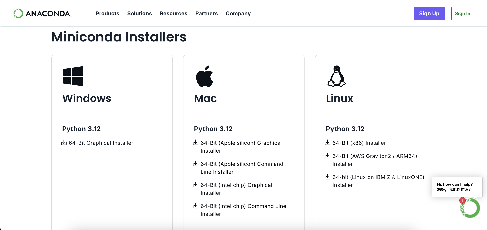
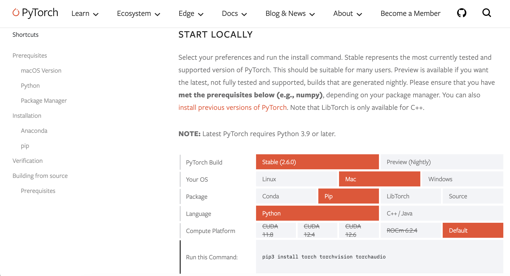
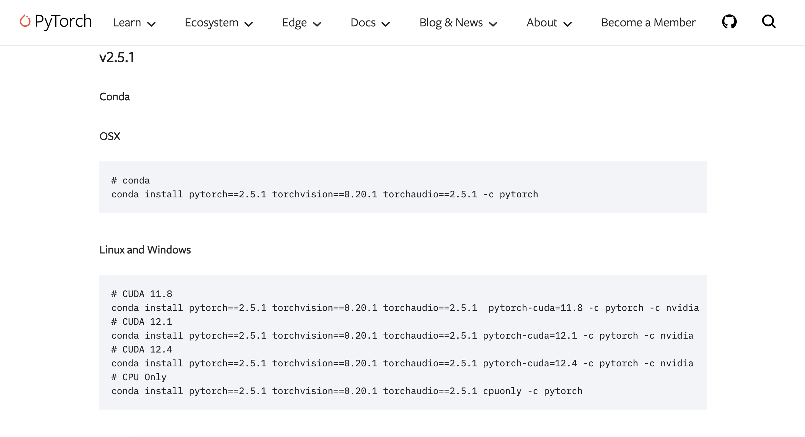
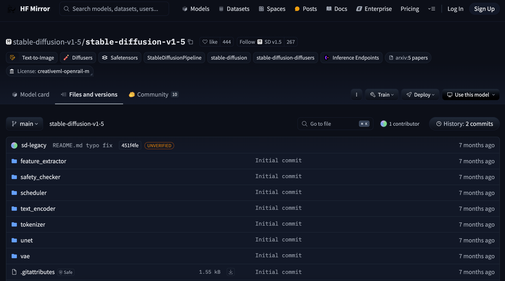
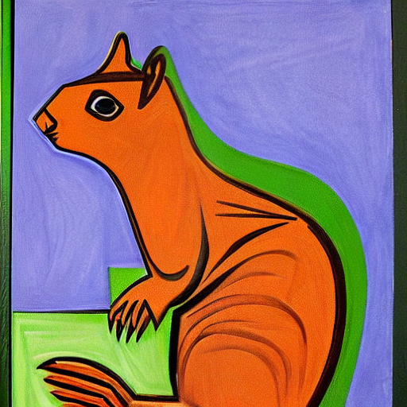

### 3.1.1 来源 
diffusers 库由 huggingface 维护，是当前最为通用的预训练扩散模型库。它的设计旨在为研究人员和开发者提供便捷，让他们能够更轻松地运用和拓展扩散模型。在 Diffusers 库出现之前，开发者主要依托CompVis 的 stable diffusion 项目（链接：[https://github.com/CompVis/stable-diffusion](https://github.com/CompVis/stable-diffusion) ）开展工作。对于像 “扩散模型” 这样具有划时代意义的项目而言，如果仅依靠原始工程进行研究与二次开发，缺乏将核心部件抽离出来的高度抽象工程项目，那么整个领域的发展进程将会极为缓慢。（老 caffe 框架就曾出现类似问题。）Diffusers 库则提供了一套模块化工具，极大地简化了流程，显著提升了工作效率 。
### 3.1.2 安装与环境设置
#### 3.1.2.1 Python 环境准备工作
Anaconda 是一个基于 Conda 的 Python 发行版。我们知道Python是编程语言环境，那么 Conda 就是一个配合 Python 语言，管理 Python 开源的库的环境管理系统。同时 Miniconda 是一个轻量级的 Anaconda 发行版，Anaconda 相当于预装很多 python 包的 Miniconda。我们在准备环境时直接下载轻量级版本 Miniconda 就可以了。如果还需要一些不存在的 python 库时，我们可以额外下载。 从 Anaconda 官方（`https://www.anaconda.com/download/success`） 我们可以下载对应的 Miniconda 安装程序。


（Miniconda 官方安装界面）

使用 Miniconda 可以方便地创建和管理多个独立的 Python 环境，每个环境可以有不同的 Python 版本和安装的包，这样可以避免不同项目之间的依赖冲突。例如，一个项目需要使用 Python 3.7 和 pytorch 1.x 版本，另一个项目需要使用 Python 3.9 和 pytorch 2.x 版本，使用 Miniconda 就可以轻松地为这两个项目创建独立的环境。
请注意，个人建议不要在 python 官方网站进行 python 环境的下载，也建议不要用系统内置的 python 环境，因为这些行为都有教训：
- 在 Windows 操作系统环境中，使用 pip 安装一些库时，我们会遇到无法安装的错误。这种错误源于Windows 没有安装对应版本的编译工具。请注意重点不是“**没有编译工具”**，而是没有“**对应版本的工具**”，这使得该问题单独解决起来很麻烦。
- 在 linux 操作系统中，python 是系统工具必须的。我建议大家不要做开发使用。我之前有位同事想升级 Ubuntu 操作系统内置的 python 的版本号，莫名其妙地把 python 卸载了。然后 Ubuntu 就崩溃了，重装都救不回来。
#### 3.1.2.2 创建环境
用 Conda 环境创建一个新的 Conda 环境做开发使用，并激活该环境。
以下是创建一个名字叫 myenv 的 Python 3.10 环境的示例：
```bash
conda create -n myenv python=3.10
conda activate myenv
``` 
通过以上步骤，就说明你已经成功安装 Miniconda 并创建一个新的名叫 myenv 的 Python 环境了。
在每次进入这个环境时，我们都需要 `conda activate myenv` 命令在终端上激活这个环境。
用 conda 命令创建的环境默认存储在一个文件夹内：
- **Windows 系统**：新创建的环境默认存储在`C:\Users\YOU\.conda\envs\`，其中 YOU 代表你的用户名
- **Linux 系统**：新创建的环境默认存储在`/home/YOU/.conda/envs/`目录下，其中 YOU 代表你的用户名。
- **macOS 系统**：新创建的环境默认存储在`/Users/YOU/miniconda3/envs/`目录下。
请注意，以上默认路径不是一直不变的，甚至不同的版本的默认路径也不相同。你可以用 `whereis python` 命令查找环境安装位置，使用方式如下：
```bash
(base) mozheng@mozhengdeMacBook-Pro envs % whereis python
python: /Users/mozheng/miniconda3/bin/python
(base) mozheng@mozhengdeMacBook-Pro envs % conda activate pytorch
(pytorch) mozheng@mozhengdeMacBook-Pro envs % whereis python
python: /Users/mozheng/miniconda3/envs/pytorch/bin/python
(pytorch) mozheng@mozhengdeMacBook-Pro envs % 
```

我们为什么必须找到创建的环境安装在哪里？因为我们在使用时很可能出现这样的问题：
- 用户主磁盘空间不够
- 用户主空间的程序读写速度极慢（常见于云主机）
- 用户主目录每关闭一次就清空一次（常见于云主机）
如果我们及时将conda环境平移到一个相对安全的文件夹，每次登录仅修复软链接或快捷方式链接。那么上述的问题将不会是什么大问题。同时我们要是觉得自己创建的工程碍眼。你甚至可以直接删掉 envs 目录先对应的环境名字的文件夹。
#### 3.1.2.3 使用 pip 安装 diffusers库
一个 conda 创建的环境有两个常用的 python 包管理器：conda 管理器与 pip 管理器。由于存在两个系统，不可避免地存在不兼容问题，所以我这里建议。除非不得已，不要换用两个软件管理器。如果你习惯用 conda ，那么请在这个环境中一直用 conda；如果你习惯用 pip，那么请在这个环境中一直用 pip。否则可能会出现无法解决的诸如软件包循环依赖等问题。
##### 配置国内源
我们首先设置 pip 国内加速为阿里源：
```bash
pip config set global.index-url https://mirrors.aliyun.com/pypi/simple
``` 
这命令是设置 pip 的全局安装源。默认情况下，pip会从官方的Python软件包索引（PyPI）下载软件包。使用这个命令，pip会首先尝试从阿里云镜像下载软件包，而不是直接从PyPI下载，这样可以提高下载速度并减少连接问题。
##### pytorch安装
根据自己的机器情况先安装 pytorch 深度学习包。你的电脑最好有 Nvidia GPU，这样我们就可以安装 GPU 版本的 pytorch 包。这样配置会令你的程序运行起来很快。当然没有也行，至于“能不能跑完”的问题你可以看看黄历的“今日运势”。我现在的电脑是 macOS 没有 Nvidia GPU，仅做编码用。

安装命令使用官方指引即可。除了官方主页 `https://pytorch.org/get-started/locally/`，我们也可以根据自己计算机的GPU的驱动版本，挑选适合自己的 pytorch 历史版本。历史版本位置：`https://pytorch.org/get-started/previous-versions/` 

>[! 还用安装CUDA吗？]
>这是有些人会说，“**我记得之前安装环境还要安装CUDA，为什么你没安装？**”对，PyTorch的确需要使用CUDA做GPU加速。但有现在还有一种方法在不安装CUDA的情况下使用GPU版本的 PyTorch 。那就是通过使用 **Triton内核** 。
>Triton内核是由OpenAI开发的，专门用于编写高效自定义深度学习基元的语言和编译器。使用Triton内核，可以在不依赖CUDA的情况下实现高效的深度学习推理。我们在用 pip 安装时，这些问题同时解决了。
##### diffusers 安装
```bash 
pip install --upgrade diffusers accelerate transformers
```
不说了，这个很简单。请记住，如果选择了用 pip 的形式安装软件包，那么最好全套都用 pip 的方式做安装。

### 3.1.3 第一个diffusers的程序
diffusers 库和 transformers 库均为Hugging Face开发的重要机器学习库，二者存在一定关联。所以 diffusers 库的代码与 transformers 库的代码很像类似。例如下面，我们的第一个程序 diffusers 程序。

```python
import os
# 添加国内加速镜像
# 或者在终端用 export HF_ENDPOINT=https://hf-mirror.com 
os.environ['HF_ENDPOINT'] = 'https://hf-mirror.com'

from diffusers import DiffusionPipeline
import torch

pipeline = DiffusionPipeline.from_pretrained("stable-diffusion-v1-5/stable-diffusion-v1-5", torch_dtype=torch.float16)

# diffusers 库与 transformers 库都适配CPU/GPU模型，如需GPU推理可打开下面注释
# pipeline.to("cuda") 

image = pipeline("An image of a squirrel in Picasso style").images[0]
image.save("squirrel_picasso.png") 
```

这个代码很有代表性，我们分段单独讲解。
#### 3.1.3.1 国内加速
```python
import os
# 添加国内加速镜像
# 或者在终端用 export HF_ENDPOINT=https://hf-mirror.com 
os.environ['HF_ENDPOINT'] = 'https://hf-mirror.com'
```
这个段代码是设置模型国内源，方便大家加速下载模型。
因为 `https://huggingface.co` 网站在国内登录存在问题，我们常用国内加速的网站做平替，就是 `https://hf-mirror.com` 。这就是这段代码的来源。不过有些时候 ，由于工程的原因，我们不方便修改内部代码。我们也可以通过直接修改环境变量，或直接写入bash脚本的方式进行设置
- 类 Linux 系统
```
export HF_ENDPOINT=https://hf-mirror.com
```
- Windows Powershell
```
$env:HF_ENDPOINT = "https://hf-mirror.com"
```

#### 3.1.3.2 加载一个模型
```python
from diffusers import DiffusionPipeline
import torch

pipeline = DiffusionPipeline.from_pretrained("stable-diffusion-v1-5/stable-diffusion-v1-5", torch_dtype=torch.float16)
```
diffusers 库是基于 pytorch 库开发的。你说 TensorFlow ？对不起，不熟。
在这里，`torch.float16` 代表的是半精度浮点数数据类型。与之相对的是 `torch.float32`（单精度浮点数）和 `torch.float64`（双精度浮点数）。`torch.float16` 每个元素占用 16 位（2 个字节）的内存空间，而 `torch.float32` 每个元素占用 32 位（4 个字节），`torch.float64` 每个元素占用 64 位（8 个字节）。设置 `torch_dtype=torch.float16`目的很明显：减少内存占用同时加速计算，当然同时会有一些精度的牺牲。
`DiffusionPipeline.from_pretrained`  的功能是从 huggingface.co 网站的 `stable-diffusion-v1-5/stable-diffusion-v1-5` 空间上下载模型做图像推理。但是我们之前设置了国内模型镜像，所以模型从 `hf-mirror.com` 下载。我们还可以进入这个网址 `https://hf-mirror.com/stable-diffusion-v1-5/stable-diffusion-v1-5` 查看这个模型的内容是有哪些。


- 类 Linux 操作系统下，模型默认下载路径是 `/home/YOU/.cache/huggingface/hub`
- Windows 操作系统下，模型默认下载路径是 `C:\Users\username\.cache\huggingface\hub`
这种默认路径的操作对于开发者的确不友好，我建议大家使用 cache_dir 参数指定模型下载路径。具体操作如下
```python
cache_dir = "./models"
# 下载模型到指定目录
pipeline = DiffusionPipeline.from_pretrained(model_name, cache_dir=cache_dir)

# 从指定目录加载模型
loaded_pipeline = DiffusionPipeline.from_pretrained(cache_dir)
```
pipeline 直译为管道流，我们借鉴comfyui的经验，我们可以将其翻译为工作流。`DiffusionPipeline.from_pretrained` 返回的是一套完整的工作流，方便我们直接使用。下面是 pipeline 工作流的结构。
```bash
>>> pipeline
StableDiffusionPipeline {
  "_class_name": "StableDiffusionPipeline",
  "_diffusers_version": "0.13.1",
  ...,
  "scheduler": [
    "diffusers",
    "PNDMScheduler"
  ],
  ...,
  "unet": [
    "diffusers",
    "UNet2DConditionModel"
  ],
  "vae": [
    "diffusers",
    "AutoencoderKL"
  ]
}
```

#### 3.1.3.3 生成一幅图片

```python
# diffusers 库与 transformers 库都适配CPU/GPU模型，如需GPU推理可打开下面注释
# pipeline.to("cuda") 

image = pipeline("An image of a squirrel in Picasso style").images[0]
image.save("squirrel_picasso.png") 
```
建立完工作流后，我们就开始生成图片了。理论上 diffusers 库与 transformers 库都适配CPU/GPU模型，但是CPU操作属实慢。所以我们常常使用带 Nvidia GPU 显卡的机器运行扩散模型的程序。如GPU做加速，请把 `pipeline.to("cuda") `注释打开。下面就是一副生成的图片。


（diffusers生成的毕加索风格的松鼠形象）

### 3.1.4 使用 diffusers 自己搭建模型
工作流的代码方式很简单，但是不适合大家修改。Diffusers 库允许用户深入到模型和调度器的细节中，进行定制开发。用户可以使用预训练的模型作为构建块，结合不同的调度器，创建自己的端到端扩散系统。例如，用户可以使用 `UNet2DModel` 和 `DDPMScheduler` 来构建一个简单的图像生成系统。我们下面的代码默认采用GPU版本了，不多赘述。

```python
import os
# 添加国内加速镜像
# 或者在终端用 export HF_ENDPOINT=https://hf-mirror.com 
os.environ['HF_ENDPOINT'] = 'https://hf-mirror.com'

from diffusers import DDPMScheduler, UNet2DModel
from PIL import Image
import torch

scheduler = DDPMScheduler.from_config("google/ddpm-cat-256")
model = UNet2DModel.from_pretrained("google/ddpm-cat-256").to("cuda")
scheduler.set_timesteps(50) # 设置50轮生成扩散

sample_size = model.config.sample_size
noise = torch.randn((1, 3, sample_size, sample_size), device="cuda")
input = noise 

for t in scheduler.timesteps:
	with torch.no_grad():
		noisy_residual = model(input, t).sample
		prev_noisy_sample = scheduler.step(noisy_residual, t, input).prev_sample
		input = prev_noisy_sample

image = (input / 2 + 0.5).clamp(0, 1) 
image = image.cpu().permute(0, 2, 3, 1).numpy()[0] 
image = Image.fromarray((image * 255).round().astype("uint8"))
``` 
`google/ddpm-cat-256` 项目是一个生成猫片的 ddpm 算法项目。
这上面的代码有两个陌生的组件：
- **调度器 scheduler**：可以认为是控制扩散模型调度的工具。当然，这些参数在推理时不建议动。如果做训练时，可以考虑酌情更改。 下面我们可以看看里面究竟有哪些信息。
```bash
>>> scheduler
DDPMScheduler {
	"_class_name": "DDPMScheduler",
	"_diffusers_version": "0.32.2",
	"beta_end": 0.02,
	"beta_schedule": "linear",
	"beta_start": 0.0001,
	"clip_sample": true,
	"clip_sample_range": 1.0,
	"dynamic_thresholding_ratio": 0.995,
	"num_train_timesteps": 1000,
	"prediction_type": "epsilon",
	"rescale_betas_zero_snr": false,
	"sample_max_value": 1.0,
	"steps_offset": 0,
	"thresholding": false,
	"timestep_spacing": "leading", 
	"trained_betas": null, 
	"variance_type": "fixed_small"
}
```

- **模型 model**：这里的model就是第一章我们在介绍时DDPM时提到的VDM。UNet2DModel 是无条件 UNet 的实现，UNet2DConditionModel 是有条件 UNet 的实现。他们的不同在于“输入信息”。
1. **无条件 UNet ，UNet2DModel，仅以噪声图像作为输入。** 在训练和推理时，模型没有额外的条件信息来指导去噪过程。例如在图像生成任务中，模型只是基于随机噪声开始逐步生成图像，生成的图像具有很大的随机性，无法对生成图像的特定属性进行控制。
2. **有条件 UNet，UNet2DConditionModel，除了噪声图像之外，还会接收额外的条件信息作为输入。** 这些条件信息可以是文本描述、类别标签、图像的一部分等。在文本到图像的生成任务中，模型会根据输入的文本描述来生成与之对应的图像，使得生成的图像能够满足特定的条件要求。我们经常说的 stable diffusion 就是有条件 UNet，因为它要额外输入生成条件。


- #### 1.3 与其他扩散模型库的对比
- ##### 1.3.1 功能特点对比
- 与其他扩散模型库相比，Diffusers 库具有更广泛的功能支持。例如，它不仅支持图像生成，还支持音频生成和 3D 结构生成。而一些其他的库可能只专注于某一个特定的领域，如只支持图像生成。 ##### 1.3.2 易用性对比 Diffusers 库的 API 设计更加简洁易用，使得用户可以更快地进行开发和实验。例如，在使用 Diffusers 库进行图像生成时，只需要几行代码就可以完成整个过程，而其他一些库可能需要更多的代码和配置。 ##### 1.3.3 性能对比 虽然 Diffusers 库注重可用性，但在性能方面也表现出色。它通过优化代码和使用高效的算法，使得模型的推理和训练速度都得到了显著提高。同时，Diffusers 库还支持分布式训练和混合精度训练，进一步提高了训练效率。 
-  ### 第三章：Diffusers 核心组件详解 #### 3.1 扩散管道（DiffusionPipeline） ##### 3.1.1 扩散管道的作用和高级抽象概念 扩散管道（DiffusionPipeline）是 Diffusers 库中的一个高级抽象组件，它封装了模型、调度器和其他必要的组件，使得用户可以方便地进行推理任务。扩散管道提供了一个统一的接口，用户只需要提供输入（如文本提示），就可以得到输出（如图像）。 扩散管道的主要作用是简化模型的使用过程，减少用户的开发工作量。例如，在使用 Stable Diffusion 进行文本到图像生成时，用户只需要使用 `StableDiffusionPipeline` 并传入文本提示，就可以得到生成的图像，而不需要关心模型的具体结构和调度器的使用细节。 ##### 3.1.2 使用扩散管道进行文本到图像生成 以下是一个使用 `StableDiffusionPipeline` 进行文本到图像生成的示例代码： ```python from diffusers import StableDiffusionPipeline import torch pipeline = StableDiffusionPipeline.from_pretrained("runwayml/stable-diffusion-v1-5", torch_dtype=torch.float16) pipeline = pipeline.to("cuda") prompt = "A beautiful landscape with mountains and a lake" image = pipeline(prompt).images[0] image.save("landscape.png") ``` 在这个示例中，我们首先从预训练模型库中加载 `StableDiffusionPipeline`，并将其移动到 GPU 上以加速推理。然后，我们定义一个文本提示 `prompt`，并将其传入管道中进行图像生成。最后，我们将生成的图像保存到本地。 ##### 3.1.3 不同类型的扩散管道及其适用场景 - **无条件图像生成管道（如 `DDPM`）**：适用于生成随机的图像，不需要输入文本提示。例如，`DDPM` 可以用于生成随机的风景图像、动物图像等。 - **文本到图像生成管道（如 `StableDiffusionTextToImage`）**：适用于根据文本提示生成图像。用户可以输入各种文本描述，如人物、场景、风格等，管道会根据这些描述生成相应的图像。 - **文本引导的图像到图像生成管道（如 `ControlNet`）**：适用于对已有的图像进行修改和编辑。用户可以提供一张图像和一个文本提示，管道会根据提示对图像进行修改，如改变图像的风格、添加特定元素等。 - **图像修复管道（如 `StableDiffusionInpainting`）**：适用于修复图像中的缺失部分。用户可以提供一张带有缺失部分的图像和一个文本提示，管道会根据提示填充缺失部分，使图像恢复完整。 #### 3.2 调度器（Schedulers） ##### 3.2.1 调度器的作用 调度器在扩散模型中起着重要的作用，它控制着噪声添加和去噪过程的节奏。在正向扩散过程中，调度器决定了每个时间步添加的噪声量；在反向去噪过程中，调度器决定了每个时间步的去噪程度。不同的调度器会影响生成结果的质量和速度。 ##### 3.2.2 常见调度器及其特点和使用示例 - **DDIMScheduler**：DDIM（Denoising Diffusion Implicit Models）调度器是一种常用的调度器，它可以在减少推理步数的情况下保持较高的生成质量。以下是一个使用 `DDIMScheduler` 的示例代码： ```python from diffusers import DDPMScheduler, UNet2DModel from PIL import Image import torch scheduler = DDPMScheduler.from_pretrained("google/ddpm-cat-256") model = UNet2DModel.from_pretrained("google/ddpm-cat-256").to("cuda") scheduler.set_timesteps(50) sample_size = model.config.sample_size noise = torch.randn((1, 3, sample_size, sample_size), device="cuda") input = noise for t in scheduler.timesteps: with torch.no_grad(): noisy_residual = model(input, t).sample prev_noisy_sample = scheduler.step(noisy_residual, t, input).prev_sample input = prev_noisy_sample image = (input / 2 + 0.5).clamp(0, 1) image = image.cpu().permute(0, 2, 3, 1).numpy()[0] image = Image.fromarray((image * 255).round().astype("uint8")) image ``` - **DDPMScheduler**：DDPMScheduler 是最基本的调度器，它按照固定的时间表添加和去除噪声。虽然它的推理速度较慢，但可以生成高质量的图像。 - **KarrasDiffusionSchedulers**：KarrasDiffusionSchedulers 是一种基于 Karras 等人提出的方法的调度器，它可以在保证生成质量的前提下显著提高推理速度。 ##### 3.2.3 如何根据不同任务选择合适的调度器 - **对于追求高质量生成结果的任务**：可以选择 `DDPMScheduler` 或 `DDIMScheduler`。这些调度器可以在较多的推理步数下生成高质量的图像，但推理速度相对较慢。 - **对于需要快速生成结果的任务**：可以选择 `KarrasDiffusionSchedulers`。这些调度器可以在较少的推理步数下生成较好的图像，推理速度较快。 #### 3.3 预训练模型（Models） ##### 3.3.1 常见的预训练模型 - **UNet2DModel**：UNet2DModel 是一种常用的卷积神经网络结构，它在图像生成任务中表现出色。UNet2DModel 具有编码器 - 解码器结构，通过跳跃连接将编码器的特征图传递到解码器，从而保留更多的细节信息。 - **AutoencoderKL**：AutoencoderKL 是一种自动编码器，它可以将图像编码为低维的潜在空间表示，然后再从潜在空间表示中解码出图像。在扩散模型中，AutoencoderKL 通常用于将图像转换为潜在空间，以减少计算量。 - **CLIPTextModel**：CLIPTextModel 是一种基于对比学习的文本编码器，它可以将文本描述转换为向量表示。在文本到图像生成任务中，CLIPTextModel 用于将文本提示编码为向量，作为扩散模型的输入。 ##### 3.3.2 以 `UNet2DModel` 为例，讲解如何加载和使用预训练模型 以下是一个使用 `UNet2DModel` 的示例代码： ```python from diffusers import UNet2DModel import torch model = UNet2DModel.from_pretrained("google/ddpm-cat-256").to("cuda") # 定义输入 sample_size = model.config.sample_size noise = torch.randn((1, 3, sample_size, sample_size), device="cuda") timestep = torch.tensor([10], device="cuda") # 前向传播 with torch.no_grad(): noisy_residual = model(noise, timestep).sample print(noisy_residual.shape) ``` 在这个示例中，我们首先从预训练模型库中加载 `UNet2DModel`，并将其移动到 GPU 上。然后，我们定义输入噪声和时间步，调用模型的前向传播方法得到预测的噪声残差。 ##### 3.3.3 如何将模型与调度器结合使用来构建自定义的扩散系统 以下是一个将 `UNet2DModel` 和 `DDPMScheduler` 结合使用的示例代码： ```python from diffusers import DDPMScheduler, UNet2DModel from PIL import Image import torch scheduler = DDPMScheduler.from_pretrained("google/ddpm-cat-256") model = UNet2DModel.from_pretrained("google/ddpm-cat-256").to("cuda") scheduler.set_timest