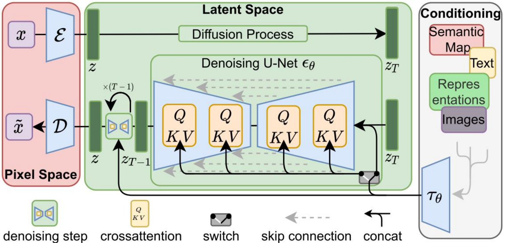
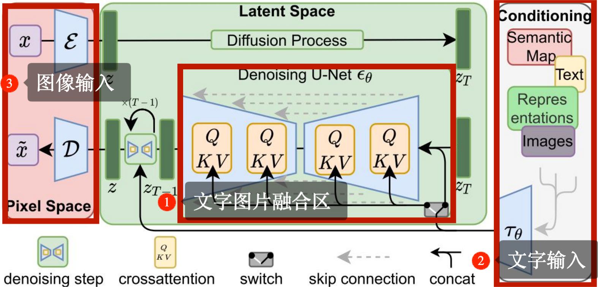
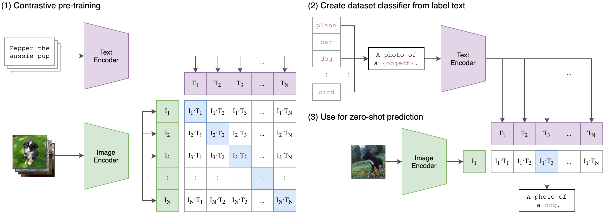
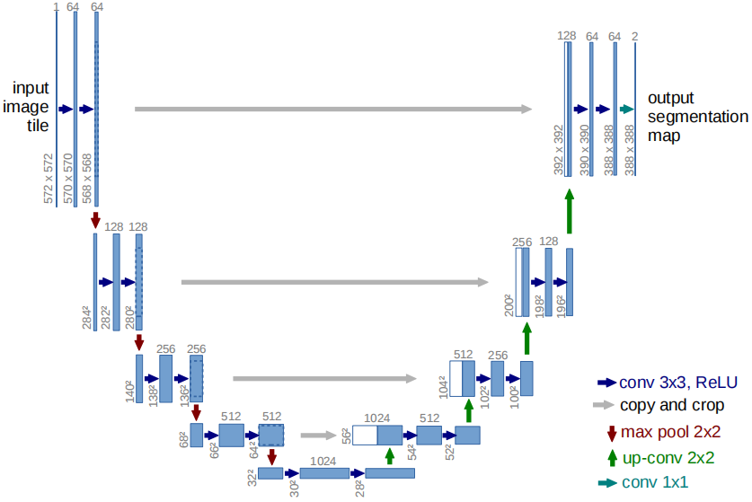

Stable Diffusion没有官方论文，本篇主要内容来自《High-Resolution Image Synthesis with Latent Diffusion Models》简称LDM。Stable Diffusion 的成功并非一人或一组织之功，而是多方协作的成果。在CVPR2022 中发表论文LDM，署名作者来自慕尼黑大学、海德堡大学和 AI 视频剪辑技术创业公司 Runway。在模型训练阶段，Stability AI 为其提供了 4000 个 A100 Ezra-1 AI 超大集群的计算资源。从贡献角度看，高校研究团队和 Runway 提供技术支持，Stability AI 则是 “金主”，提供算力 。在 GitHub 项目描述中，Stability AI 和 Runway 的贡献被视为 “平等的”。（是吧？）后来的剧本就很俗套了：出钱的资本家对新项目版权也开始了争夺大戏。（看戏吧）
Runway 官宣发布 Stable Diffusion v1.5，并在 Huggingface 分享模型权重，这一行为引发轩然大波。网友质疑其是否为官方版本，因为未在 Stability AI 看到相关公告。随后，Stability AI 法务团队要求 Huggingface 删除该新版本，称其侵犯知识产权。Runway 的 CEO 和联合创始人回应，此次发布的新版本是对他们创造、发布的原始研究的更新，并强调 Stable Diffusion 最初的研究作者来自 Runwayml 和慕尼黑大学等（并没提到Stability AI ）。随着舆论发酵，Stability AI 联系 Huggingface，撤掉了下架 v1.5 版本的请求。据猜测后期Robin Rombach、Andreas Blattmann、Dominik Lorenz 和 Patrick Esser 等离开Stability AI促成FLUX，也与这段撕逼有关。
我为什么给大家讲这段大戏？因为我们更关注的是这些项目： SD，SD1.5 ，SDXL，SD3.0，FLUX等。至于SD后期模型，因为某些原因（人都走了）本系列文章不予关心，更何况其效果已经被FLUX超越了。（Stability AI 尴尬不？）
### 3.1.1 Stable Diffusion解决了DDPM哪些问题
Stable Diffusion 的出现，无疑为图像生成领域带来了新的突破。相较于之前的DDPM（Denoising Diffusion Probabilistic Models）模型，Stable Diffusion 在多个方面进行了优化与改进。DDPM在投入实用时，会遇到如下问题：
- **采样步骤多**：DDPM 的去噪过程是一个马尔科夫链，需要大量的采样步骤，通常要扩散 1000 步左右才能生成高质量图像，导致生成速度极慢。推理公式在第一章已经提出。
- **数据维度高**：因为扩散模型在像素空间直接处理，处理的数据量巨大，对计算资源要求高。同时扩散模型的优化经常要花费数以百计的GPU时间，并且由于推理过程的连续性使得推理非常昂贵。
基于以上问题，Stable Diffusion使用了如下方法解决上面两个问题。
- **采样加速**：DDPM 在采样生成图像时，通常需要大量的迭代步骤（1000次）才能生成高质量的图片。Stable Diffusion 采用了一些改进的采样策略，如使用 DDIM（Denoising Diffusion Implicit Models）（第二章开头介绍过）等相关的采样方法，能够在较少的采样步骤下就生成质量较高的图像，以牺牲少量精度换取了几十倍的推理速度提升。
- **在潜空间操作**：DDPM 直接在图像的像素空间进行操作，处理的图像数据量巨大，计算成本高。而 Stable Diffusion 基于潜扩散模型（Latent Diffusion Models），先通过自编码器将图像压缩到低维潜空间，在潜空间中进行扩散过程。例如，在缩放尺度 $f=4$ 的条件下， 一个 512×512 的图像在潜空间中尺寸会变为 128×128，大大减少了数据量，降低了算力需求和内存占用，使生成速度显著提升。

下图是 Stabel Diffusion 的总体框架。其中绿色的区域就是**潜扩散模型**（Latent Diffusion Models）中的**潜空间**（Latent Space）。也就是说扩散模型没有预测图片，而是预测被VAE压缩的图像空间。下图中粉红色的像素空间（Pixel Space）就是一个预训练好的VAE模型，你可以认为这里的VAE是图像压缩的作用。

（通过预训练得到很好的encoder-decoder（VAE），在encoder后的空间中进行扩散操作，大大减少了整体计算量和推理开销。图片来自LDM论文）

### 3.1.2 Stable Diffusion的结构
#### 3.1.2 Stable Diffusion的多模态化：CLIP模型
DDPM 通常只是单纯的图像生成模型，对生成的图像缺乏语义层面的控制。Stable Diffusion 引入文本条件，通过 CLIP 模型将文本转化为嵌入向量。这些向量与图像的潜变量在 U-Net 网络中交互，使生成的图像能与给定文本描述对应。这实现了按文本描述生成特定内容图像的功能，极大拓展了模型的应用场景与实用性。用户因此可以更精准地控制生成图像的内容和主题。请看下面 LDM 架构图右边的红框部分

LDM同样有多模态角度做解释，就是双头多模态大模型。上图中我们看到区域3代表图像输入使用VAE预处理，区域2代表文字输入（理论上还支持其他格式的输入）使用CLIP做文本编码器。区域1就是文字与图像的融合区。在1.1中开篇就介绍了Transform模型的作用。我们可以把多种输入统一转换成Transform格式，然后利用QKV机制，用图像的Q，抓文字的KV（详细操作后面我们说明）。

>[!Stable Diffusion的文本编码器]
>文本编码器是 Stable Diffusion 实现文本到图像生成的重要桥梁。它利用预训练的语言模型CLIP（Contrastive Language - Image Pretraining），将输入的文本描述转换为向量表示。CLIP是 OpenAI 在 2021 年推出的一种基于对比学习的多模态预训练模型。整体架构如下：
>
>CLIP通过对比学习训练模型。训练时，给定一批含n组“图像 - 文本对”的数据，计算n个图像特征向量与n个文本特征向量间的余弦相似度，得到一个n×n的相似度矩阵。通过优化目标函数，我们可以让矩阵对角线上的“图像 - 文本对”相似度得分尽量高，非对角线上不匹配的“图像 - 文本对”相似度得分尽量低。
>根据上述训练策略，我们能利用CLIP模型获取图像与文本的配对关系。比如在Stable Diffusion中，输入的文本描述用CLIP模型转换为文本向量。这个向量表示蕴含文本的语义信息，例如输入“一座古老的城堡屹立在山顶”，文本编码器会把这句话转化为包含城堡、古老、山顶等语义特征的向量。之后，该向量会与图像的潜在向量融合，引导图像生成过程，确保生成的图像与输入文本描述相符。 
>

由于时代的局限，Stable Diffusion的文本解码器采用了当时最热门的CLIP模型。如今我们了解到，CLIP存在不少不足之处。这些不足直接致使Stable Diffusion出现诸多问题。比如，CLIP官方模型是将224x224像素的图像与文本进行配对。这种分辨率下的文本图像配对，直接使得Stable Diffusion对图像细节的控制能力欠佳。倘若我们想生成高分辨率图片，比如一张1536x2048的汉服少女全身图，并配以“服装上有凤凰花纹”、“人脸人手不要崩坏”、“图像要精细”、“背景房屋要丰富”、“符合亭台楼阁的雅致”等要求，以CLIP为主的Stable Diffusion执行这些操作还是有一定难度。
此外，同样因为CLIP模型的缘故，我们在编写生图提示词时，常常采用逐单词的方式描述图像。例如，若要生成“一个汉服少女”的图片，提示词可能是这样一段一段的：“a photo of woman, hanfu, chinese style, grand spectacle, wide viewing angle, high definition, big scene, snowscape, plum blossom, looking at the camera” 。 下图为利用这组提示词生成的模特图画。

（Stabel Diffusion XL模型生图样例）
我们在图片中发现了几个最明显的问题：
- 人手生成畸形 。
- 模特的眼睛有一种奇怪的不适感。
这两点在生成式图像模型中会一直存在，但想彻底解决很困难。最常见的方法就是“放大-还原”工程式做法：先将人手人脸处切出来做等比放大操作；以这张图片为基底，重新生成一张方法的人手人脸图片；缩放后再粘贴回去。由这里一点修改方案，我们也清晰地认知了大图像中小细节的生成效果的确不好。但需注意的事这种细节部位的生成和“模型的大小”、“算法的能力”有极大的关系，不要将“锅”完全甩在CLIP上面。

#### 3.1.3 Stable Diffusion扩散架构
> [!注意]
>Stable Diffusion中，使用UNet模拟DDPM的VDM（就是第一章提到的多层循环VAE），使用VAE模拟图像缩放还原到隐空间。
#### 3.1.3.1 Stable Diffusion 的 UNet 结构
> [!原始UNet]
> U-Net 网络诞生于 2015 年，由奥拉夫・罗恩伯格（Olaf Ronneberger）、菲利普・费舍尔（Philipp Fischer）和托马斯・布洛克斯（Thomas Brox）在论文《U-Net: Convolutional Networks for Biomedical Image Segmentation》中提出，获得 2015 ISBI cell tracking 第一名。最初是为了解决生物医学图像分割难题，不过因其卓越性能，很快在各类图像分割任务中崭露头角。
> 从结构上看，U-Net 呈现出独特的 “U” 字形（请看下图）。它由编码器（下采样路径）和解码器（上采样路径）两大部分构成。编码器部分类似一个 “特征提取器”，通过一系列卷积层与池化层，逐步降低图像分辨率，就像从一幅大尺寸的高清图片逐渐缩小成缩略图，但在这个过程中不断提取图像中关键的特征信息，这些特征就像是图像的 “灵魂”，包含了图像中不同物体的轮廓、纹理等重要线索。例如，在医学图像分割中，编码器能够提取出细胞、器官等的特征。而解码器部分则扮演着 “还原与整合” 的角色，它通过反卷积（上采样）操作逐步恢复图像分辨率，同时将编码器对应层级的特征 “拉过来” 进行融合，就像在拼图时，不仅根据当前的小块形状，还参考之前已经拼好的相似部分，使得分割结果更加精准，细节更加丰富。
> 
> (原始UNet网络)

下面是扩散结构的拆解图：

