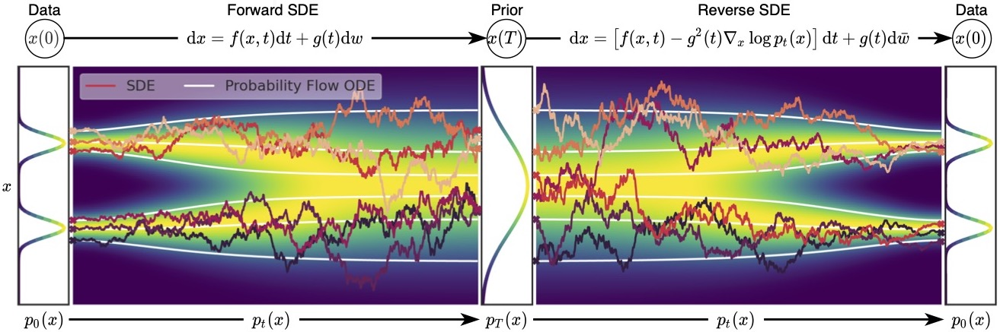

我们完整地搭建了扩散模型的整体运行套路。尽管能够生成高质量的样本，但是基于Langevin MCMC 和随机微分方程SDE求解器的采样扩散步骤极其繁重（需要1000逆扩散采样）。其核心点在于它们引入了“随机噪声”或“维纳过程”，形成“相邻两步具有相关性，两步以上没有相关性”的马尔科夫链。我们不能跳步采样，必须完整完成1000步的采样操作。这样的算法特别慢，不太符合使用要求。接下来，我们介绍一种基于概率流的常微分方程（Probability flow ODE）的采样方法，这种方法可以实现快速地进行采样计算。因为它在采样时破坏了马尔可夫性，从而在多步间的状态具有相关转换公式，产生跳步的可能性，大大地加快了生成采样。

> [!常微分方程 ODE]
‌SDE（随机微分方程）和 ODE（常微分方程）在描述系统演化时的主要区别在于是否包含随机项。随机微分方程 SDE 一词的重点是“随机”，描述了系统在随机扰动下的演化过程。“随机”的体现是公式具有随机项（这里是维纳过程），一般形式为$\mathrm{d}x(t)=f(x,t)\mathrm{d}t + g(x,t)\mathrm{d}w$。常微分方程 ODE 一词的重点是“常”，通常描述了系统在确定条件下的演化过程，不包含随机项，用于描述在给定初始条件下的系统演化，一般形式为$\mathrm{d}x(t)=f(x,t)\mathrm{d}t$。如果按照我们在大学学习过的《高等数学》形式来标记，我们可以将 ODE 记作$y' = f(t)$的极简形式。不论如何标记，我们都会发觉看到 ODE 的形式更加简单，那么我们能不能使用这个形式来做推理呢？我们重新回忆一下SDE的前向过程（伊藤公式）是：
$$\mathrm{d}x=f(x,t)\mathrm{d}t+g(t)\mathrm{d}w \tag{2.1.1}$$
对应的逆扩散过程SDE（Anderson公式，1982）为：
$$\mathrm{d}x=[f(x,t)−g(t)^2 ∇_x \log ⁡p(x)]\mathrm{d}t+g(t)\mathrm{d}w \tag{2.1.2}$$ 
>其中的 $∇_x \log ⁡p(x)$ 即用以参数 $\theta$ 代表的神经网络 $s_θ(x)$ 分数模型来拟合。现在我们考虑“采样过程能不能不要有这个难以处理的维纳过程呢？”简单地让维纳过程前 $g(t)=0$ ，让SDE直接退化成 $\mathrm{d}x=f(x,t)\mathrm{d}t$ 是没有的道理的，因此我们后面采用其他的方式进行推理。

本文内容主要源于《Score-Based Generative Modeling through Stochastic Differential Equations》
### 2.1.1 概率流ODE优化方法

> [!Fokker-Planck方程]
> 
>福克-普朗克方程（Fokker–Planck Equation，简称FP方程）原本描述粒子在势能场中受到随机力后，随时间演化的位置或是速度的分布函数 。在我们这里，FP方程是一类描述随机过程在相空间中概率密度演化规律的偏微分方程。与SDE（随机微分方程）相对应的，SDE方程包含了一个确定性部分和一个随机部分，而FP方程则从概率角度出发，描述了这些随机变量随时间演化的概率密度。
>对于d维的伊藤过程 $\mathrm{d}x(t)=f(x,t)\mathrm{d}t + G(x,t)\mathrm{d}w,t = 1,2,...,d$ ，这里是 $G(x,t)$ 就是前面说的 $g(t)$ 。其实这才是SDE的原始格式。我们为了配合公式而使用 $G(x,t)$ 做标记。给出该SDE对应的FP方程，如下：
>$$\frac{\partial p_t(x)}{\partial t}= -\sum_{i=1}^{d} \frac{\partial}{\partial \mathbf{x}_i}[f_i(x,t)p_t(x)]+\frac{1}{2}\sum_{i=1}^{d}\sum_{j=1}^{d}\frac{\partial^2}{\partial \mathbf{x}_i\partial \mathbf{x}_j}[\sum_{k=1}^{d}G_{ik}(x,t)G_{jk}(x,t)p_t(x)]$$
>其中 $p_t(𝑥)$ 是 $Fx(t)$（其中$Fx(t)$是$\mathbf{x}_t$的函数形式）的概率密度分布函数。这里面 $x$ 是向量，其他 $x$ 的形式，例如 $\mathbf{x}_i,\mathbf{x}_j$等是标量。我们利用福克-普朗克方程推理SDE，接下来我们粗略地推导一下，我们先看公式后半段：
>$$\begin{align}
& \sum_{j=1}^{d}\frac{\partial}{\partial \mathbf{x}_j}[\sum_{k=1}^{d}G_{ik}(x,t)G_{jk}(x,t)p_t(x)] \tag{}\\
=& \sum_{j=1}^{d}\frac{\partial}{\partial \mathbf{x}_j}[\sum_{k=1}^{d}G_{ik}(x,t)G_{jk}(x,t)]p_t(x) + \sum_{j=1}^{d}\sum_{k=1}^{d}G_{ik}(x,t)G_{jk}(x,t)p_t(x)\frac{\partial}{\partial \mathbf{x}_j}p_t(x) \tag{}\\
=& p_t(x)\nabla\cdot [G(x,t)G(x,t)^T]+p_t(x)G(x,t)G(x,t)^T \nabla_x \log p_t(x) \tag{}
\end{align}$$
> 这里的 $G(x,t)$ 是矩阵形式。所以福克-普朗克方程为：
> $$\begin{align}
\frac{\partial p_t(x)}{\partial t}&=-\sum_{i=1}^{d} \frac{\partial}{\partial \mathbf{x}_i}[f_i(x,t)p_t(x)]+\frac{1}{2}\sum_{i=1}^{d}\frac{\partial}{\partial \mathbf{x}_i}[\sum_{j=1}^{d}\frac{\partial}{\partial \mathbf{x}_j}[\sum_{k=1}^{d}g_{ik}(x,t)g_{jk}(x,t)p_t(x)]] \tag{}\\
&= -\sum_{i=1}^{d} \frac{\partial}{\partial \mathbf{x}_i}[f_i(x,t)p_t(x)]+\frac{1}{2}\sum_{i=1}^{d}\frac{\partial}{\partial \mathbf{x}_i}[p_t(x)\nabla\cdot (G(x,t)G(x,t)^T)+p_t(x)G(x,t)G(x,t)^T \nabla_x \log p_t(x)] \tag{}\\
&= -\sum_{i=1}^{d} \frac{\partial}{\partial \mathbf{x}_i}\big\{f_i(x,t)p_t(x)-\frac{1}{2}\big[\nabla\cdot [G(x,t)G(x,t)^T]+p_t(x)G(x,t)G(x,t)^T \nabla_x \log p_t(x)\big]p_t(x)\big\} \tag{}\\
&= -\sum_{i=1}^{d} \frac{\partial}{\partial \mathbf{x}_i}[\tilde{f}_i(x,t)p_t(x)] \tag{}
\end{align}$$
> 这里我们定义
>$$\tilde{f}(x,t):= f(x,t)-\frac{1}{2}\nabla\cdot [G(x,t)G(x,t)^T] - \frac{1}{2}G(x,t)G(x,t)^T \nabla_x \log p_t(x)$$

根据Fokker planck方程，我们知道与SDE相同边缘分布分概率流ODE（probability flow ODE，PF-ODE）公式为
$$\mathrm{d}x=\big\{f(x,t)-\frac{1}{2}\nabla\cdot [G(x,t)G(x,t)^T] - \frac{1}{2}G(x,t)G(x,t)^T \nabla_x \log p_t(x) \big\}\mathrm{d}t \tag{2.1.3}$$
在扩散模型SDE里面 $G(x,t)$ 没有 $x$，公式（2.1.3）中的项 $\nabla[G(x,t)G(x,t)^T]=0$ 。所以我们使用的PF-ODE，更常写作如下形式：
$$\mathrm{d}x=\big[f(x,t)- \frac{1}{2}g^2(t) \nabla_x \log p_t(x) \big]\mathrm{d}t \tag{2.1.4}$$
根据上一单元1.8的内容，我们可得DDPM的ODE公式即为：
$$\mathrm{d}x=[-\frac{1}{2}F\beta(t)Fx(t) - \frac{1}{2} F\beta(t)\nabla_x \log p_t(x) \big]\mathrm{d}t \tag{2.1.5}$$

宋飏博士展示了PF-ODE得到的轨迹，在每个时间点上具有与 SDE 轨迹相同的边缘分布。SDE和 PF-ODE在某种意义上是等价的。但两者在扩散过程中也有一定区别，整体的扩散过程请看下面的图像：

图像中白色光滑的线就是使用PF-ODE的作为扩散过程的记录，图像中曲折的线就是使用SDE作为扩散过程的记录。同时也从一个方面证明了：解probability flow ODE 得到的轨迹具有与SDE轨迹相同的边缘分布。
PF-ODE常微分给我们一个惊喜！公式（2.1.4） $\mathrm{d}x=\big[f(x,t)- \frac{1}{2}g^2(t) \nabla_x \log p_t(x) \big]\mathrm{d}t$ 中并没有SDE中括噪声的维纳过程的 $\mathrm{d}w$ 。这意味着，我们去掉了各个状态的马尔可夫性，让相距很远事件步的状态突然有了联系。使得原先1000步的采样可以跳步，变为几十步的采样。根据ODE的整体的思路，大大地加快了生成采样，是我们常用的采样方法。

> [!Warning]
>- **可能疑问点1：为什么去掉维纳过程的 $\mathrm{d}w$ ，就去掉了各个状态的马尔可夫性？**
>	原始SDE的“当前状态” $x_t$，相当于以“上一个状态” $x_{t-1}$（均值）为中心的（按照方差）左右摆动.。我们甚至可以通过统计画出来摆动的分布。但是“当前状态” 与 “前两个状态”关系不可预测，因为“上一个状态”只知有关系但不可预测了，与“上一个状态”有关系的“前两个状态”你更不知道了。但这里我们去除了维纳过程的 $\mathrm{d}w$ ，就让这种犹豫消失，从而去掉了各个状态的马尔可夫性。
>- **可能疑问点2： 原始的DDPM的扩散过程有1000步，因此生成采样也需要1000步。但由于PF-ODE去掉了马尔可夫性，使得采样多层联系变得可能，这1000步采样跳步运算变得可能。那么是否可以考虑用一步完成逆扩散生成呢？**
>	不行！因为每一步扩散都出现理误差。一次从头到尾的运算，本质上是将误差叠加一起处理，这样效果更不好。

### 2.1.2 DDIM
DDIM（Denoising Diffusion Implicit Models）提出的意图，即最大化使用DDPM训练的模型，因此我们在推理时尽可能维持DDPM的前提条件。同时，我们也去做一个小手脚，去掉了各个状态的马尔可夫性，以支持跳步快速采样生成操作。
#### 2.1.2.1 去马尔可夫性的DDIM
既然要去马尔可夫性，那么我们在哪里使用了马尔可夫性呢？
回顾第一单元第1.4节的内容，DDPM核心理论VDM的逆向扩散计算方法
$$q(\mathbf{x}_{t−1}|\mathbf{x}_t,\mathbf{x}_0) = \frac{q(\mathbf{x}_t|\mathbf{x}_{t−1}, \mathbf{x}_0)q(\mathbf{x}_{t−1}|\mathbf{x}_0)}{q(\mathbf{x}_t|\mathbf{x}_0)}$$

因为DDPM的马尔可夫性 $q(\mathbf{x}_{t−1}|\mathbf{x}_t,\mathbf{x}_0)$ 中，$(\mathbf{x}_t,\mathbf{x}_0),(\mathbf{x}_{t-1},\mathbf{x}_0)$ ，相互状态都无关，所以可以表示为逆向过程 $q(\mathbf{x}_{t−1}|\mathbf{x}_t)$ 。但在PF-ODE里面却不行。**如果我们一定要复用已经训练好的DDPM模型，我们需要按照DDPM的VDE推理过程再推理一遍，这是DDIM的总体思想**。
假设DDIM中，逆向去噪分布 $q_{\sigma_t}(\mathbf{x}_{t-1}|\mathbf{x}_t,\mathbf{x}_0)$ 是类似DDPM的VDE的正态分布。DDPM分布均值，方差如下（如公式（1.6.4）（1.6.5））：
$$\begin{align}
\mu_q(\mathbf{x}_t,\mathbf{x}_0)&=\frac{\sqrt{{\alpha}_t}(1-\bar{{\alpha}}_{t-1}){{x}}_t+\sqrt{\bar{{\alpha}}_{t-1}}(1-{\alpha}_t){{x}}_{0}}{1-\bar{{\alpha}}_{t}} \tag{1.6.4}  \\
σ_q^2(t)&=\frac{(1-{\alpha}_t)(1-\bar{{\alpha}}_{t-1})}{1-\bar{{\alpha}}_{t}} \tag{1.6.5}
\end{align}$$
那么我们指定DDIM均值为 $\mu(\mathbf{x}_t,\mathbf{x}_0)=m\mathbf{x}_t+k\mathbf{x}_0$ ，其中 $m,k$ 是待定系数。方差为 $\sigma_t^2$是一个人为指定的常数（因为在DDPM中的方差就是函数）。这种严格的指定在本质上就是全方位向DDPM看齐，以便复用训练好的DDPM模型。DDPM的正向扩散公式如下：
$$\mathbf{x}_t=\sqrt{\bar{\alpha}_t}\mathbf{x}_0 + \sqrt{1-\bar{\alpha}_t}\epsilon$$
因为是一步扩散公式，所以服从正态分布的噪声 $\epsilon$ 下角标模糊化处理了。
>[!Warning]
>但在DDIM论文里面， $\bar{\alpha}_t$ 写作 $\alpha_t$ ，很简单地去掉了连乘记号，但本质还是连乘 $\bar{\alpha}_t=\alpha_t$。DDIM公式记法：
> $$\mathbf{x}_t=\sqrt{\alpha_t}\mathbf{x}_0 + \sqrt{1-\alpha_t}\epsilon_t$$
> 但本人不喜欢按原文写的，大家看论文注意一下就行。
 
联立DDIM公式可得：
$$k\mathbf{x}_0+m\mathbf{x}_t+\sigma_t\epsilon_t=\mathbf{x}_{t-1}=\sqrt{\bar{\alpha}_{t-1}}\mathbf{x}_0 + \sqrt{1-\bar{\alpha}_{t-1}}{\epsilon_{t-1}}'$$
${\epsilon_{t-1}}'$加上一撇的目的，是让大家知道，左式的噪声 ${\epsilon_{t}}$ 与右式的噪声 ${\epsilon_{t-1}}'$ 不是同一个0，它的本质是随机噪声，相加或消去两种操作都不可。唯一操作方法就是从分布的角度进行配对。如下，我们消除左边的 $\mathbf{x}_t$ 可得到：
$$k\mathbf{x}_0+m(\sqrt{\bar{\alpha}_t}\mathbf{x}_0 + \sqrt{1-\bar{\alpha}_t}{\epsilon_t}'')+\sigma_t\epsilon_t=\mathbf{x}_{t-1}=\sqrt{\bar{\alpha}_{t-1}}\mathbf{x}_0 + \sqrt{1-\bar{\alpha}_{t-1}}{\epsilon_{t-1}}'$$
左边服从 $\mathcal{N}((k+m\sqrt{\bar{\alpha}_t})\mathbf{x}_0, (m^2(1-\bar{\alpha}_t)+\sigma_t^2)I)$ ，右边服从 $\mathcal{N}(\sqrt{\bar{\alpha}_{t-1}}\mathbf{x}_0, (1-\bar{\alpha}_{t-1})I)$ 。
$$\begin{align}
k+m\sqrt{\bar{\alpha}_t} &= \sqrt{\bar{\alpha}_{t-1}} \tag{}\\
m^2(1-\bar{\alpha}_t)+\sigma_t^2 &= 1-\bar{\alpha}_{t-1} \tag{}
\end{align}$$
两个参数 $k,m$ ，两个方程。解得 $k,m$。带入 $q_{\sigma_t}(\mathbf{x}_{t-1}|\mathbf{x}_t,\mathbf{x}_0)$ 公式可得：
$$\begin{align}
q_{\sigma_t}(\mathbf{x}_{t-1}|\mathbf{x}_t,\mathbf{x}_0)&=\mathcal{N}(m\mathbf{x}_t+k\mathbf{x}_0,\sigma_t^2I) \\
&=\mathcal{N}(\sqrt{\bar{\alpha}_{t-1}}\mathbf{x}_0+\sqrt{1-\bar{\alpha}_{t-1}-\sigma_t^2}\frac{\mathbf{x}_t-\sqrt{\bar{\alpha}_t}\mathbf{x}_0}{\sqrt{1-\bar{\alpha}_{t}}} ,\sigma_t^2I) \tag{2.1.6}
\end{align}$$
因为我们要跳步，我们可以记 $t-1=t'$，可得
$$q_{\sigma_t}(\mathbf{x}_{t'}|\mathbf{x}_t,\mathbf{x}_0) =\mathcal{N}(\sqrt{\bar{\alpha}_{t'}}\mathbf{x}_0+\sqrt{1-\bar{\alpha}_{t'}-\sigma_t^2}\frac{\mathbf{x}_t-\sqrt{\bar{\alpha}_t}\mathbf{x}_0}{\sqrt{1-\bar{\alpha}_{t}}} ,\sigma_t^2I) \tag{2.1.7}$$
我们要特别注意：因为我们做的是跳步迭代，我们就需要找一个比 $t$ 更小的 $t'$ 做状态描述。假如我们扩散模型总体需要要求$t=1000$个时间步正向扩散传播，那么可以让 $t'=950$ 时间点，$t''=900$ 时间点，不要认为仅仅是 $t'=t-1$ 。 因此我们可以做跳步逆扩散采样，利用 $\mathbf{x}_{t}=\sqrt{\bar{\alpha}_{t}}\mathbf{x}_0 + \sqrt{1-\bar{\alpha}_{t}}\epsilon_{t}$ 前向加噪公式，与训练好的基于DDPM噪声模型 $\epsilon_\theta(x)$，将公式（2.1.7）的 $\mathbf{x}_0$ 元素消去，可得采样递推公式：
$$\begin{align}
\mathbf{x}_{t'}&=\sqrt{\bar{\alpha}_{t'}}(\frac{\mathbf{x}_t-\sqrt{1-\bar{\alpha}_t}\epsilon_\theta(\mathbf{x}_t)}{\sqrt{\bar{\alpha}_t}})+\sqrt{1-\bar{\alpha}_{t'}-\sigma_t^2}\epsilon_\theta(\mathbf{x}_t) + \sigma_t \epsilon_t \tag{2.1.7} \\
\end{align}$$
在DDIM中，让 $\sigma_t=0$ 使得改进后的DDPM公式丧失了随机性（随机项）（这里的 $\epsilon_\theta(\mathbf{x}_t)$ 是训练出来的模型，所以没有随机性），同时也不符合马尔可夫原则。

> [! 为什么我们大胆将方差改写为0?]
> 
> 正态分布可以认为是以均值为基准，方差为区围左右横跳的采样。如果若干个正态分布连在一起，同时这若干个正态分布的均值确定，那么整体的扩散方向将会大致确定。方差设为0就是明确了扩散模型主干运动方向，主方向明确，因此可以跳步。说到这里请注意，这里有一个前提：每采样步的均值已经确定好了。在采样操作时，我们已经有个模型 $\epsilon_\theta(\mathbf{x}_t)$ ，大致还知道总体采样方向。而在加噪扩散时，我们没有明确路径，只能找一步看一步。因此加噪时，不能有这种方差直接设为0的思路。
#### 1.2.2 DDIM本质上也是一种ODE

我们发现如果公式（2.1.7）中 $\sigma_t \neq 0$  ，此公式DDPM也能用，整个推理过程中只是没有用“马尔可夫性的条件”，其余的并没违背DDPM设定。核心就在于DDIM中 $\sigma_t=0$ 。我们从这个公式进行推论可得 DDIM 递推公式如下：
$$\begin{align}
\mathbf{x}_{t-1}&=\sqrt{\bar{\alpha}_{t-1}}(\frac{\mathbf{x}_t-\sqrt{1-\bar{\alpha}_t}\epsilon_\theta(\mathbf{x}_t)}{\sqrt{\bar{\alpha}_t}})+\sqrt{1-\bar{\alpha}_{t-1}}\epsilon_\theta(\mathbf{x}_t) \\
\frac{\mathbf{x}_t}{\sqrt{\bar{\alpha}_{t}}} -\frac{\mathbf{x}_{t-1}}{\sqrt{\bar{\alpha}_{t-1}}} &= (\sqrt{\frac{1-\bar{\alpha}_t}{\bar{\alpha}_t}}-\sqrt{\frac{1-\bar{\alpha}_{t-1}}{\bar{\alpha}_{t-1}}})\epsilon_\theta(\mathbf{x}_t)
\end{align}$$
我们发现这是一个绝好的差分形式。令$\frac{\mathbf{x}_t}{\sqrt{\bar{\alpha}_{t}}}=\hat{\mathbf{x}}_t, \sqrt{\frac{1-\bar{\alpha}_t}{\bar{\alpha}_t}}=\hat{\sigma}_t$  可得 $\mathbf{x}_t=\frac{\hat{\mathbf{x}}_t}{\sqrt{\hat{\sigma}_t^2+1}}$ ，所以我们可将方程连续化，推论为：
$$\begin{align}
\hat{\mathbf{x}}_t - \hat{\mathbf{x}}_{t-1} &= (\hat{\sigma}_t-\hat{\sigma}_{t-1})\epsilon_\theta(\frac{\hat{\mathbf{x}}_t}{\sqrt{\hat{\sigma}_t^2+1}}) \\
\hat{\mathbf{x}}_t - \hat{\mathbf{x}}_{t-\Delta t} &= (\hat{\sigma}_t-\hat{\sigma}_{t-\Delta t})\epsilon_\theta(\frac{\hat{\mathbf{x}}_t}{\sqrt{\hat{\sigma}_t^2+1}}) \\
\mathrm{d}\hat{\mathbf{x}}_t &= \epsilon_\theta(\frac{\hat{\mathbf{x}}_t}{\sqrt{\hat{\sigma}^2+1}})\mathrm{d}\hat{\sigma}_t
\end{align}$$
此时我们发现DDIM的SDE形式也是个ODE。
