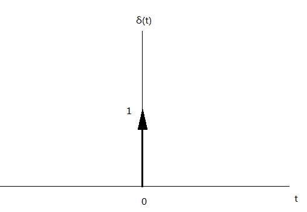
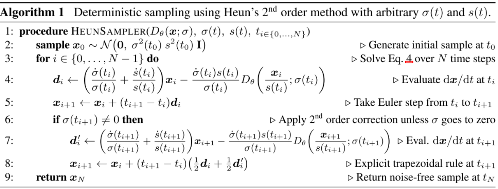
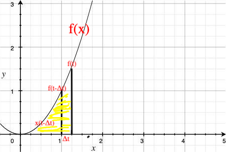
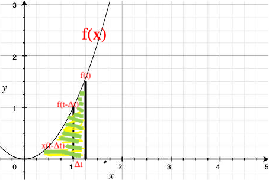

之前的工作已经把diffusion-based model统一到SDE或者ODE框架下了。但我们并没有说什么样的公式可以表示为扩散模型，什么样的公式不能表示为是扩散模型。即假设突然出现一种扩散算法，我们该如何判断这种扩散方法合理可用。接下来的系列文章，我们同样也从SDE和ODE的角度出发，给出扩散模型SDE和ODE通用表示形式。

本系列源自Nvidia的论文 **《Elucidating the Design Space of Diffusion-Based Generative Models》** ，后面简称EDM。作者认为基于扩散的生成模型的理论和实践过于复杂：基于噪声的扩散模型，基于能量的扩散模型，还有后面将会提到的基于流模型的扩散模型。因此本论文提出了一套设计，试图改善这一状况，给出扩散模型通用公式。

### 2.2.1 通用加噪公式
在上一单元中，我们知道DDPM（VP-SDE）与SMLD（VE-SDE）都是SDE公式的特解。根据VP与VE的SDE的特性，我们可以将 $\mathbf{x}$ 提出来，得出 $f(t)\mathbf{x}=f(\mathbf{x},t)$ （**你也可以认为，这种操作方式是对SDE有额外新要求**）则EDM论文中的SDE公式可改写成如下形式：
$$\mathrm{d}\mathbf{x}_t = f(t)\mathbf{x}\mathrm{d} t+ g(t)\rm \mathrm{d}w$$

我们再回顾，如果原始图像用 $\mathbf{x}_0$ 表示，那么 $t$ 步后的加噪图像可用 $\mathbf{x}_t$ 表示。如果利用SMLD做一步加噪公式，可写成如下概率分布形式：
$$\begin{align}
\mathbf{x}_t &= \mathbf{x}_0 + σ_t \epsilon \tag{} \\
p(\mathbf{x}_t|\mathbf{x}_0) &= \mathcal{N} (\mathbf{x}_t; \mathbf{x}_0, σ^2_t \mathbf{I}) \tag{}
\end{align}$$
如果使用DDPM做一步加噪公式，可写成如下概率分布形式：
$$\begin{align}
\mathbf{x}_t &= \sqrt{\bar{\alpha}_t}\mathbf{x}_0 + \sqrt{1 − \bar{\alpha}_t} \epsilon \tag{}\\
p(\mathbf{x}_t|\mathbf{x}_0) &= \mathcal{N} (\mathbf{x}_t;\sqrt{\bar{\alpha}_t}\mathbf{x}_0,\sqrt{1 − \bar{\alpha}_t}\mathbf{I}) \tag{}
\end{align}$$
EDM提出，扩散模型的通用加噪公式为：
$$p(\mathbf{x}_t|\mathbf{x}_0) = \mathcal{N} (\mathbf{x}_t; s(t)\mathbf{x}_0, s^2(t)σ^2(t)\mathbf{I}) \tag{2.2.1}$$
这里的 $σ$ 不是方差函数，$s$ 也不是分数函数，你可以当成两个普通函数即可，其中：
$$\begin{align}
s(t)&=e^{\int_0^tf(u)\mathrm{d}u} \\
σ(t)&=\sqrt{\int_0^t \frac{g^2(u)}{s^2(u)}\mathrm{d}u}
\end{align}$$

> [!Note]
> 
> 该结论证明很复杂，如果想了解详细证明过程可以去Bilibili找up主：Double童发发的视频。

如果发现了一个新的扩散方法，或者我们自己创造一种更好的扩散方法，我们都可以套用这个公式来验证这个“新的扩散方法”是否合理。有了通用加噪方法，自然有通用采样方法。

> [!Note]
> 
> 在介绍通用采样方法之前，我们发现一个问题：从 $s(t),σ(t)$ 算到 $f(t),g(t)$ 需要复杂的积分不太容易。既然 $s(t),σ(t)$ 系统与 $f(t),g(t)$ 系统相互独立且等价。我们是否可以抛弃 $f(t),g(t)$ 系统，直接用 $s(t),σ(t)$ 系统呢？完全可以！这个思路也是下面我们主要的推理过程。这里还补一下 $s(t),σ(t)$ 系统到 $f(t),g(t)$ 系统的转换公式，结论在公式（2.2.2），（2.2.3）中：
> $$\begin{align}
s(t)&=e^{\int_0^tf(u)\mathrm{d}u} \\
\ln s(t) &= \int_0^tf(u)\mathrm{d}u \\
f(t) &= \frac{s'(t)}{s(t)} \tag{2.2.2} \\
σ(t) &= \sqrt{\int_0^t \frac{g^2(u)}{s^2(u)}\mathrm{d}u} \\
σ^2(t) &= \int_0^t \frac{g^2(u)}{s^2(u)}\mathrm{d}u \\
2σ(t)σ'(t)&=\frac{g^2(t)}{s^2(t)} \\
g(t)&=s(t)\sqrt{2σ(t)σ'(t)} \tag{2.2.3}
\end{align}$$

### 2.2.2 基于PF-ODE的通用采样公式
根据福克-普朗克方程，我们知道SDE有一个**没有随机项**并且**边缘分布相同**的等价形式PF-ODE，即公式（2.2.4）：
$$\mathrm{d}\mathbf{x}=\big[f(\mathbf{x},t)- \frac{1}{2}g^2(t) \nabla_{\mathbf{x}_t} \log p_t(\mathbf{x}_t) \big]\mathrm{d}t \tag{2.2.4}$$
我们再根据 “**扩散模型通用表示：通用加噪公式**” 一节中  $s(t),σ(t)$ 系统与 $f(t),g(t)$ 系统转换公式，可将PF-ODE也换成 $s(t),σ(t)$ 系统。但这里得分数函数 $\nabla_x \log p_t(x)$ 该怎么处理？我们根据条件概率公式定义，将$p_t(x)$ 写成基于 $\mathbf{x}_0$ 累加的形式：
$$\begin{align}
p(\mathbf{x}_t) = \int_{\mathbb{R}^d} p_\text{data}(\mathbf{x}_0)p(\mathbf{x}_t|\mathbf{x}_0) \mathrm{d} \mathbf{x}_0
\end{align}$$
其中 $p_\text{data}(\mathbf{x}_0)$ 可看做原始未加噪的图像。 这里的 $\mathbf{x}_0$ 是 $\mathbb{R}^d$ 空间的 $d$ 维向量，所以积分就是要在这个区域上做。
$$\begin{align}
p(\mathbf{x}_t) &= \int_{\mathbb{R}^d} p_\text{data}(\mathbf{x}_0)\mathcal{N} (\mathbf{x}_t; s(t)\mathbf{x}_0, s^2(t)σ^2(t)\mathbf{I})\mathrm{d} \mathbf{x}_0 \tag{} \\
&= s^{-d}(t) \int_{\mathbb{R}^d} p_\text{data}(\mathbf{x}_0) \mathcal{N}(\frac{\mathbf{x}_t}{s(t)}-\mathbf{x}_0;0,σ^2(t)\mathbf{I})\mathrm{d} \mathbf{x}_0 \tag{2.2.5} 
\end{align}$$
公式（2.2.5） 是典型的对正态分布标准化的处理方式。使用两个随机分布的卷积公式（不要理解成CNN的卷积公式）相加积分内元素，得：
$$\begin{align}
p(\mathbf{x}_t) &= s^{-d}(t) \underbrace{\big[p_\text{data} * \mathcal{N}(\frac{\mathbf{x}_t}{s(t)}-\mathbf{x}_0;0,σ^2(t)\mathbf{I})\big]}_{这一串是卷积操作} \underbrace{\big( \frac{\mathbf{x}_t}{s(t)} \big)}_{这是卷积函数参数}\tag{2.2.6} 
\end{align}$$

> [! 大学概率论中的随机分布卷积公式]
> 概率论中的卷积公式主要用于计算两个独立随机变量之和的概率密度函数。例如连续型随机变量的卷积公式如下:
> 设 $X,Y$ 是两个独立的连续型随机变量，其概率密度函数分别为$f_X(x),f_Y(y)$ ，则它们的和 $Z = X + Y$ 的概率密度函数 $f_Z(z)$ 为： 
> $$f_Z(z)=\int_{-\infty}^{\infty}f_X(x)f_Y(z - x)dx$$
> 同时也可表示为:
> $$f_Z(z)=\int_{-\infty}^{\infty}f_Y(y)f_X(z - y)dy$$
> $$(f_Y * f_X)(z)=\int_{-\infty}^{\infty}f_Y(y)f_X(z - y)dy$$
> 从物理的角度看的卷积运算：
> 假设分子在x方向和y方向的速度分量是相互独立的随机变量，分别具有概率密度函数 $f_{V_x}(v_x), f_{V_y}(v_y)$ ，那么分子的合速度 $V = \sqrt{V_x^{2}+V_y^{2}}$ 的概率密度函数就可以通过对 $f_{V_x}(v_x),f_{V_y}(v_y)$ 进行某种形式的卷积运算（结合坐标变换等）来得到。因此卷积可看成相互独立的随机变量的融合。

在公式（2.2.6）中，我们发现 $p_\text{data}$ 函数本质上是原图 $\mathbf{x}_0$ ，我们可以认为 $p_\text{data}$ 是一个点 $(0,x_0)$ ，使用狄拉克 δ 函数表示。

> [!狄拉克 δ 函数]
> 狄拉克 δ 函数（Dirac δ function），也叫单位脉冲函数.它在除了零以外的点上都等于零，而其在整个定义域上的积分等于 1。用数学符号表示:
> $$\delta(x) = 0, x \neq 0, and \int_{-\infty}^{\infty}\delta(x)dx = 1$$
> 这个函数就是如图的函数。准确来说δ函数不能算是一个函数，因为满足以上条件的函数是不存在的。但我们可以认为“**标准差趋近于零**”的正态分布可以近似于这个函数。
> 

此时，在这个点下我们可以认为 $p_\text{data} \sim \mathcal{N}(\mathbf{x}_0,\xi), \xi \sim 0$ ，写成这种格式是要做正态分布结合。因此可以算出两个正态分布结合的正态分布为:
$$\begin{align}
p_\text{data} * \mathcal{N}(\frac{\mathbf{x}_t}{s(t)}-\mathbf{x}_0;0,) &= \mathcal{N}(\mathbf{x}_0,\xi)* \mathcal{N}(\frac{\mathbf{x}_t}{s(t)}-\mathbf{x}_0;0,σ^2(t)\mathbf{I}) \tag{} \\
&\sim \mathcal{N}(\frac{\mathbf{x}_t}{s(t)};0,σ^2(t)\mathbf{I}) \tag{}\\
p(\mathbf{x}_t) &= s^{-d}(t) \mathcal{N}(\frac{\mathbf{x}_t}{s(t)};0,σ^2(t)\mathbf{I}) \tag{}
\end{align}$$
请注意上面的相加为分布相加，不是简单数学意义上的相加。
在EDM原论文中， 重载定义了一个函数 $p(\mathbf{x}_t;σ(t))=\mathcal{N}(\mathbf{x}_t;0,σ^2(t)\mathbf{I})$ 它代表给一个0向量加噪方差为 $σ^2(t)\mathbf{I}$ 的噪声后，变成 $\mathbf{x}_t$ 。同理 $p(\mathbf{x}_t|\mathbf{x})=\mathcal{N}(\mathbf{x}_t;\mathbf{x},σ^2(t)\mathbf{I})$ 代表 $\mathbf{x}$ 加噪到 $\mathbf{x}_t$ 的过程。
$$\begin{align}
\nabla_{\mathbf{x}_t} \log p_t(\mathbf{x}_t) &= \nabla_{\mathbf{x}_t} \log [ s^{-d}(t) \mathcal{N}(\frac{\mathbf{x}_t}{s(t)};0,σ^2(t)\mathbf{I})] \tag{} \\
&=\nabla_{\mathbf{x}_t} \log s^{-d}(t) + \nabla_{\mathbf{x}_t} \log p(\frac{\mathbf{x}_t}{s(t)};σ(t)) \tag{} \\
&= \nabla_{\mathbf{x}_t} \log p(\frac{\mathbf{x}_t}{s(t)};σ(t)) \tag{}
\end{align}$$

再结合公式（2.2.2）、公式（2.2.3），可以直接得出 PF-ODE为以下形式：
$$\mathrm{d}\mathbf{x}_t=\big[\frac{s'(t)}{s(t)}\mathbf{x}_t - s^2(t)σ(t)σ'(t)\nabla_{\mathbf{x}_t} \log p(\frac{\mathbf{x}_t}{s(t)};σ(t))\big]\mathrm{d}t \tag{2.2.7}$$
从现在开始，我们参照公式（2.2.7），就可以针对任意⼀个已知 $s(t),σ(t)$ 的扩散公式，直接写出对应的 PF-ODE 去噪采样迭代公式了。
这里要说明下，本次重载定义的函数 $p(\mathbf{x}_t;σ(t))$ 虽然会造成理解上的歧义，但是基于DDPM和SMLD的基础知识，我们可以知道这里面要构造“分数模型”。同时，根据上一章讲解SMLD的内容，我们也可以用噪声模型求解分数模型。两者的关系为：
$$\nabla _{\tilde{x}} \log q_σ(\tilde{x}|x)=- \frac{\tilde{x} - x}{𝜎^2}$$
这里使用 $D(\mathbf{x};σ(t))$ 来记录这种去噪模型。这也就说明，公式（2.2.7）并不是EDM的重点，不能直接用于采样。下面的部分我们要介绍更重要的公式。

### 2.2.3 通用去噪采样方法
上文提到了一个去噪函数 $D(\mathbf{x};σ(t))$ 。这个去噪函数是“扩散模型”在训练阶段后得到的最后网络模型。这个去噪模型的输⼊为加噪后的图像 $\mathbf{x} = \mathbf{y}+\mathbf{n}$ ，其中 $\mathbf{y}$ 为原始图像（这里的 $\mathbf{y}$ 与前面用 $\mathbf{x}_0$ 做原始图像标记一样），$\mathbf{n}$ 为噪声，$σ$ 是噪声强度。因为噪声强度 $σ$ 随时间线性变化，所以我们可以直接设定噪声强度 $σ$ 和时间 $t$ 等价。作者在这里使用 $\mathbf{y}$ 来表示原始图片而不是 $x_0$ ，是因为这里要遵循传统机器学习的模型训练命名习惯。在传统机器学习中，原始图像可以当做ground-truth标注，常常用 $\mathbf{y}$ 来表示。所以使用L2损失函数来训练生成网络模型 $\theta$ ，得以预测原始图片:
$$\mathbb{E}_{\mathbf{y}\sim p_{data},\mathbf{n} \sim \mathcal{N}(0,σ^2
\mathbf{I})} \| D_θ(\mathbf{y} + \mathbf{n}; σ) − \mathbf{y}\|$$
我们训练这个去噪网络，在理想的情况下可以得到这样“从噪声到图片”的模型：$D_θ(\mathbf{y} + \mathbf{n}; σ) = \mathbf{y}$ ，但是我们知道这种一步到位的模型效果很差，基本上完成不了图像生成。但是我们先不要急着否认不可行性，倘若我们多执行几次，就是扩散模型的多步采样过程了。
EDM原始论文经过一系列十分复杂的推理过程，得出下面的结论：
$$\begin{align}
\nabla_{\mathbf{x}_t} \log p_t(\mathbf{x}_t) = \nabla_{\mathbf{x}_t} \log p(\frac{\mathbf{x}_t}{s(t)};σ(t)) &=  \nabla_{\mathbf{x}_t} \log \mathcal{N}(\frac{\mathbf{x}_t}{s(t)};0,σ^2(t)) \tag{}\\ 
&=\frac{D_\theta(\frac{\mathbf{x}_t}{s(t)};σ(t))-\frac{\mathbf{x}_t}{s(t)}}{s(t)σ^2(t)} \tag{2.2.8}
\end{align}$$
>[!不严谨证明理解]
>公式（2.2.8）在EDM的推理过程很复杂，但是我们突然发现这实际上是一轮正态函数处理。我们发现，引入噪声后，分数函数由 $\nabla_{\mathbf{x}_t} \log p_t(\mathbf{x}_t)$ 变成了 $\nabla_{\mathbf{x}_t} \log p_t(\mathbf{x}_t|\mathbf{y})$ 。整体分布相当于从0为均值变化成为 $\mathbf{y}$ 是均值。 因为我们的加噪起点完全变掉了。我们设 $\hat{\mathbf{x}}_t=\frac{\mathbf{x}_t}{s(t)}$  则有：
>$$\begin{align}
\nabla_{\mathbf{x}_t} \log p_t(\mathbf{x}_t|\mathbf{y}) &= \nabla_{\mathbf{x}_t} \log \mathcal{N}(\frac{\mathbf{x}_t}{s(t)};D_θ(\mathbf{y} + \mathbf{n}; σ(t)),σ^2(t)) \\
&= \frac{1}{s(t)}\nabla_{\frac{\mathbf{x}_t}{s(t)}} \log \mathcal{N}(\frac{\mathbf{x}_t}{s(t)};D_θ(\mathbf{y} + \mathbf{n}; σ(t)),σ^2(t)) \\
&= \frac{1}{s(t)}\nabla_{\hat{\mathbf{x}}_t} \log \frac{1}{\sqrt{2\pi}σ(t)} + \nabla_{\hat{\mathbf{x}}_t} (-{\frac{\hat{\mathbf{x}}_t-D_θ(\mathbf{y} + \mathbf{n}; σ(t))}{σ^2(t)}}) \\
&= \frac{D_\theta(\mathbf{y} + \mathbf{n};σ(t))-\hat{\mathbf{x}}_t}{s(t)σ^2(t)}
\end{align}$$
如果是连续迭代做去噪到最后操作，那么 $\mathbf{y} + \mathbf{n}$ 所对应的的“原加噪变量”就可以是 $\hat{\mathbf{x}}_t$，即为公式（2.2.8）的格式。同时，上式也是DDPM与SMLD的“噪声模型-分数模型”核心转换公式 $\nabla _{\tilde{x}} \log q_σ(\tilde{x}|x)=- \frac{\tilde{x} - x}{𝜎^2}$ 的统一。

如果将公式（2.2.8） 带入PF-ODE，则可以给出去噪采样的通用形式：
$$\mathrm{d}\mathbf{x}_t=\big[(\frac{s'(t)}{s(t)}+\frac{σ'(t)}{σ(t)})\mathbf{x}_t - \frac{s(t)σ'(t)}{σ(t)}D_\theta\big(\frac{\mathbf{x}_t}{s(t)};σ(t)\big) \big]\mathrm{d}t \tag{2.2.9}$$

根据公式（2.2.9），我们可以得到如下通用采样算法伪代码

与Euler法采样不同，DEM论文中使用的是Heun迭代算法。Euler 法与 Heun 法哪个更准确理论上需要实验测试，但这里Heun法略高一些。

> [!Note]
> Euler 法与 Heun 法都是用于求解常微分方程数值解的方法。
> 对于微分方程 $\mathrm{d}x_t = f(x,t)\mathrm{d}t$ ，Euler法的递推公式可以表示如下（注意自变量是$t$）：
>$$x(t)=x(t-\Delta t)+f(x,t)\Delta t$$
>这是基于 $(x, f(x,t))$ 这一点的到下一个值的求值。从流程可见，我们发现Euler法是一个矩形面积，可以认为是矩形面积公式：$S=宽*高$ 。而Heun是一个梯形面积，公式如下：
> $$x(t)=x(t-\Delta t)+\frac{1}{2}[f(x,t-\Delta t)+f(x,t)]\Delta t$$
>可以认为是一种梯形面积公式：$S = \frac{1}{2}(上底+下底)*高$ 。

(Eula法采样，可见 $\Delta t$ 的上部有一部分空余区域没有照顾到)

(Heun法采样， $\Delta t$ 的上部那一部分空余区域有一定程度的照顾)