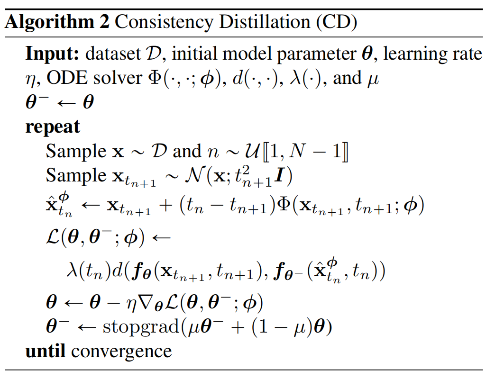

扩散模型的加噪过程，宛如在一幅细腻的画作上，轻柔地逐张覆盖透明的“噪点纸”。每添加一层，画作便愈发朦胧，直至全然化作一片杂乱无章的随机噪声。而在生成样本阶段，操作则逆向而行，需将这些“噪点纸”逐步剥离，使原本清晰的画面如破晓时分的曙光，缓缓浮现。我们可预想到，这一逆向操作相当繁琐，需要不厌其烦地反复执行。这也正是扩散模型生成样本速度迟缓的症结所在。一般而言，扩散模型要历经20到1000次的复杂计算步骤，方能生成一个较为理想的样本。如此低的效率，在那些对实时响应要求极高的场景，如实时视频渲染、即时交互设计等领域，显然难以施展拳脚，难以满足实际需求。 此前，我们探讨过DDIM跳步方案，该方案在加速图片采样生成方面，确实迈出了重要一步。然而，其采样过程仍需执行20至30个步骤，在效率提升的征途上，依旧存在提升空间。 在本节中，我们将重磅推出一种全新的采样方法。此方法有望一举攻克长期以来束缚生成式模型发展的速度与质量双重瓶颈，实现采样步骤从几十步锐减至寥寥几步的飞跃，为生成式模型领域注入全新活力。

请注意，本文的内容是采样加速，文章的前提都是已经获取了原扩散模型的分数权重 $s_\phi(x_t,t)$ 。阅读本节，大家可以了解一致性模型是什么、怎么用，以及两种一致性模型获取方法即可。后续如有需要，可以阅读 《Latent Consistency Models》，LCM-Lora等系列文章，本节是这系列文章的基础。
本节内容原理源于《Consistency Models》（后简称CM论文），依然是宋飏博士的代表作之一。 

### 2.3.1 采样加速：一致性模型
为了解决扩散模型的采样过慢的问题，CM论文提出了一致性模型。CM论文的思路，由下面的.一幅图像就可以说明清楚。

上图中，给定一个概率流常微分PF-ODE，它可以按照上一章加噪方程 $\mathrm{d}\mathbf{x}_t = f(t,\mathbf{x})\mathrm{d} t+ g(t)\rm \mathrm{d}w$ 将数据平滑地转换为噪声。然后，我们可以学习将常微分方程轨迹上的任何点（例如上图中的 $(x_{t},t),(x_{t'},t'),(x_{T},T)$ ）映射回其原点 $(x_0,0)$ 以进行生成建模。这些映射的模型称为一致性模型，因为它们的输出经过训练，对于同一轨迹上的点是一致的。“**一致性模型**”中“**一致性**”就是这个意思。
我们可以把PF-ODE想象成一条“轨迹河流”，水在这条河流中从清澈的状态（原始图像）慢慢变成浑浊状态（噪声状态）。一致性模型要做的，就是学会把河流中任何一个点（不管是清澈的水域，还是已经被噪声的浑浊水域）都准确地“导航”回河流的起点，也就是最初的清澈数据状态（原始图像）。就好像河流中的所有水域最终都能被引导回同一个源头。
#### 2.3.1.1 一致性模型的采样
在 2.1 介绍ODE的章节中，我们知道SDE前向加噪公式是
$$\mathrm{d}x=f(x,t)\mathrm{d}t+g(t)\mathrm{d}w$$
对应的反向采样PF-ODE公式为：
$$\mathrm{d}x_t=\big[f(x,t)- \frac{1}{2}g^2(t) \nabla_x \log p_t(x) \big]\mathrm{d}t$$
在这里我们设置 $f(x,t)=0,g(t)=\sqrt{2t}​$ ，就可以令PF-ODE方程变为简单的形式：
$$\mathrm{d}x_t=- t \nabla_x \log p_t(x)\mathrm{d}t=-ts_\phi(x_t,t)\mathrm{d}t \tag{2.3.1}$$
公式（2.3.1）在CM论文里被称为empirical PF-ODE。同时得到加噪SDE为：
$$\mathrm{d}x_t=\sqrt{2t}\mathrm{d}w_t \tag{2.3.2}$$

>[!Note]
>扩散模型中从原始数据 $x_0$ 到正态噪声 $x_T$，如果最后的正态噪声 $x_T \sim \mathcal{N}(\mu,\sigma)$ 那么根据第一章的内容，我们可知伊藤方程的干扰强度（方差）与分布方差有对应关系 $\sigma^2(t+\Delta t)=\sigma^2(t)+g^2(x_t)\Delta t$。当 $\Delta t \rightarrow 0$ 时，我们有
>$$\mathrm{d}\sigma^2=g^2(x)\mathrm{d}t$$

同时，如果 $f(x,t)=0,g(t)=\sqrt{2t}​$ ，那么有 $\mathrm{d}\sigma^2=2t\mathrm{d}t$ ，解得 $\sigma=t$ 。我们现在知道了CM其实是个方差膨胀VE的扩散模型，我们完全可以套用SMLD的推理方法。同时这里的偏移变量 $f(x)=0$ ，可知我们可以使用加噪公式 $x_t=x_{data}+\sigma_t \epsilon$ 。，则有 $p(x_t)=p_{\text{data}}(x) * \mathcal{N}(0,t^2\mathbf{I})$ 这里的乘积是卷积乘。与2.2 EDM一节的描述一致，这里的卷积乘同样直接地表达了训练数据与加噪条件的融合。因为 $p_{\text{data}}(x)$ 是狄拉克 δ 函数，有正态化的误差，在扩散过程中有 $p(x_t)\sim\mathcal{N}(x,t^2\mathbf{I})$。所以你会在CM原论文中看到一个极小值参数，但我们做理解时，可以忽略它的存在。
但是，我们做采样时并没有 $p_{\text{data}}(x)$ 。我们先让采样起始点 $\hat{x}_T\sim\mathcal{N}(0,T^2\mathbf{I})$ 采样。这里的T只要最后大（原扩散步骤T一般是1000，的确足够多）就可以覆盖均值的误差。如下图，右边的取样噪声方差足够大，就可以覆盖左边生成数据 $\mathcal{N}(x,t^2\mathbf{I})$ 的均值偏差。

我们再观察上图，一致性采样是一个“反复横跳”的过程：我们先从 $x_T$ 采样回到 $x_0$（论文中使用的是靠近0原点的$x_\epsilon$），然后再从 $x_0$ 点加噪到 $x_{t'}$ 点，这是第一轮；再从 $x_{t'}$ 采样回到 $x_0$，然后再从 $x_0$ 点加噪到 $x_{t}$ 点，这是第二轮；...以此左右反复跳动。
我们可以得到采样伪代码如下：

> [!为什么一致性模型多步采样是“反复横跳”]
> 这与后续神经网络模拟的方法密切相关。在理想状态下，若一致性模型训练至极佳水准（实际上几乎难以实现），仅需一步就能还原出符合标准的图片。然而，在实际应用中，这种理想情形很难达成。原因在于采样分布 $\hat{x}_T\sim\mathcal{N}(0,T^2\mathbf{I})$ 与理论分布 $x_t\sim\mathcal{N}(x,t^2\mathbf{I})$ 不仅均值存在差异，而且整体分布特征也大相径庭。但是我们可知的事，一致性模型在前几轮循环中所确定的 $x_0$​（论文中是$x_ϵ$​）虽结果欠佳，但大致方向正确。基于这个初步方向持续进行循环运算，随着过程推进，各条 “路径” 逐渐收敛，最终自然能够取得理想的效果 。

#### 2.3.1.2 一致性模型的神经网络模拟
一致性模型通过神经网络进行参数化，有两种常见实现方式。一种是简单的分段函数形式，
$$\begin{equation}
f_θ​(x,t) =
    \begin{cases}
    x & t=\xi \\
    F_θ​(x,t) & t∈(\xi,T]
    \end{cases}
\end{equation}$$
这里 $x$ 是输入，$F_θ​(x,t)$ 在可以认为是参数为 $\theta$ 的神经网络模型，他们都是一致性模型 $f_θ​(x,t)$ 的输入。$\xi$  是极小值我们可以理解为0，在CM论文中用 $\epsilon$ 表示，我们的文章系列 $\epsilon \sim\mathcal{N}(0,\mathbf{I})$ 有明确的特指 ，所以符号改成了 $\xi$ 。这种极小值的设置来自扩散模型采样过程中的除0异常：若 $\xi=0$ ，计算机在数值计算时可能会出现除以零、梯度爆炸或其他数值异常情况。这种原因在做计算机工程时很常见，后面不再论述。上式主要给大家理解用，因为分段函数不连续，CM论文中利用另一种跳跃连接的参数化方式来表示：
$$f_θ​(x,t)=c_{skip}​(t)x+c_{out}​(t)F_θ​(x,t) \tag{2.3.3}$$
特别地，这里要求 $c_{skip}​(ϵ)=1, c_{out}​(ϵ)=0$ ，为了满足一致性模型的边界条件 $f_θ​(x,ϵ)=x$ 。同时在模型训练的初始阶段，当$t$接近$ϵ$时，$c_{skip}​(t)$ 接近 1，$c_{out}​(t)$ 接近 0，意味着模型在时间趋近于0的时候输出主要由输入x决定。随着$t$增大，$c_{skip}​(t)$ 和 $c_{out}​(t)$ 的取值发生变化，$F_θ​(x,t)$ 对模型输出的影响逐渐增大。
根据一致性模型的设计，我们很快就能写出如下损失函数，即所采样状态经过一致性模型都与初始扩散（$t=\xi$）表现一致：
$$Loss(\theta)=E[||f_\theta(x,t)-x_\xi||^2]$$
这个损失函数必须算完整个过程扩散，思路简单粗暴，但不太好训练。因为每计算一次时间t时，我还要用ODE预测出最原始状态是什么。宋飏博士在论文中采用更通用的相邻两两一致性的方式做损失函数：
$$Loss(\theta)=E[||f_\theta(x_{n+1},t_{n+1})-f_{\theta^-}(\hat{x}_n,t_n)||^2] \tag{2.3.4}$$
公式（2.3.4）中，是两个相邻步骤的相减，这里使用带尖角帽的变量 $\hat{x}_n$ 是因为我们做采样操作是从 $t=T$ 算到 $t=0$ ，在算到 $x_{n+1}$ 的时候，我们需要先用PF-ODE 预测出$x_n$ 所以这里记为 $\hat{x}_n$ 。

>[!Note]
>在原论文中， 后面的那个 $f$ 使用了滑动平均参数 $\theta^-$ 。这里 $θ^-=\text{stopgradp}(µθ^- +(1-µ)θ)，0<\mu<1$ 是个单纯的为了效果更好的操作。

理论上两两一致了，整条线路的输出就一致了。但理论是理论，这样设计的缺点非常突出：所有误差都会累计。如同比萨斜塔的修建，下边歪一点没发现，修到上边直接成“危楼”了。这里的解决方案是让 $n,n+1$ 不是连续的时间步，缩短整条链的长度。（如n+1代表第200步，n代表第150步）但间隔也不要特别大，特别大又会不准确了。怎么说呢？还是得“中庸”。
#### 2.3.1.3 两种一致性模型的训练
一致性模型模型训练有两种模式：一致性蒸馏训练法（Consistency Distillation，CD）与一致性训练法（Consistency Training，CT）
**1. 一致性蒸馏训练法**（CD）
本方法是基于已经预训练好的扩散模型，如没有扩散模型的分数模型请使用CT方法。
通过数值ODE求解器在PF-ODE轨迹上生成相邻的点对，然后训练一致性模型，让它对这些点对的输出尽量一致。这样，一致性模型就能学到扩散模型的精华，生成高质量的样本。蒸馏法的损失函数与公式（2.3.4）相似
 $$L^N_{CD}​(θ,θ^−;ϕ)=E[λ(t_n​)d(f_θ​(x_{t_{n+1}}​​,t_{n+1}​),f_{θ^−}​(\hat{x}^\phi_{t_n}​​,t_n​))] \tag{2.3.5}$$
这里的 $\lambda(.)$ 是一个正实数的权重因子对损失函数没有决定性影响，可以认为是1。$d(.,.)$ 是两个值的距离度量函数。参数 $\phi$ 指的是分数模型 $s_\phi(x_t,t)$ ，因为我们需要用分数模型组成的ODE预测 $\hat{x}^\phi_{t_n}$ 。本损失函数同时用 $t,n$ 选择需要计算的时间步，整体的方案如下：当 $t \in [0,1000)$ ， $n \in [0,20)$ 时，则有 $t_0=0,t_1=50,t_2=100,...$ 

>[!empirical PF-ODE 的预测操作]
> 从 $x_{t_{n+1}}$ 到 $x_{t_n}$ 的递推公式推导如下：
> $$\begin{align}
> \mathrm{d}x_t &=-ts_\phi(x_t,t)\mathrm{d}t \tag{} \\
> x_{t+\Delta t} - x_t &= -(t+\Delta t) s_\phi(x_{t+\Delta t},t+\Delta t) (t+\Delta t -t) \tag{}\\
> \hat{x}^\phi_{t_n} &= x_{t_{n+1}} + (t_{n+1}-t_n)t_{n+1}s_\phi(x_{t_{n+1}},t_{n+1}) \tag{2.3.6}
> \end{align}$$
> CM论文中，将 $t_{n+1}s_\phi(x_{t_{n+1}},t_{n+1})$ 简化为 $\Phi(x_{t_{n+1}},t_{n+1};\phi)$

因此CD过程的伪代码如下：

**2. 一致性训练法**（CT）
本方法是不需要已经预训练好的分数模型。这里的一致性模型可以完全独立训练，核心的方法就是要推导出分数模型的平替，即下面的公式：
$$∇\log p_t(x_t)=-E[\frac{x_t-x}{t^2} | x_t ] \tag{2.3.7}$$
>[!Note]
>公式（2.3.7）的证明复杂，这里单独说明：
>$$\begin{align}
>∇_{x_t}\log p_t(x_t) &= \frac{1}{p_t(x_t)} ∇_{x_t}p_t(x_t) \tag{}\\
>&=\frac{∇_{x_t}\int p(x_t|x)p_{data}(x) dx}{p_t(x_t)} \tag{}\\
>&=\frac{\int ∇_{x_t}p(x_t|x)p_{data}(x) dx}{p_t(x_t)} \tag{}
>\end{align}$$
>用莱布尼兹法则后，宋飏博士逆用复合函数求导法则 $∇_{x_t}p(x_t|x)=∇_{x_t}\log p(x_t|x) p(x_t|x)$ 可得：
>$$\begin{align}
>∇_{x_t}\log p_t(x_t) &=\frac{\int ∇_{x_t}\log p(x_t|x) p(x_t|x) p_{data}(x) dx}{p_t(x_t)} \tag{}\\
>&= \int  ∇_{x_t}\log p(x_t|x) \frac{p(x_t|x) p_{data}(x)}{p_t(x_t)} dx \tag{}\\
>&= \int  ∇_{x_t}\log p(x_t|x) p(x|x_t) dx \tag{2.3.8}
>\end{align}$$
>从公式（2.3.8）出发，使用条件期望定义公式 $E(X|Y=y)=\int xf_X(x|Y=y)dx$ 可得：
>$$\begin{align}
>∇_{x_t}\log p_t(x_t) &=E[∇_{x_t}\log p(x_t|x)|x_t] \tag{}\\
>&=-E[\frac{x_t-x}{t^2}|x_t] \tag{}
>\end{align}$$
>
>通俗地说，这个结论与SMLD的原理一样 $x_t=x+\sigma_t\epsilon$ 两两独立无关。本质上这是一个无偏估计的转化求值 $∇_{x_t}\log p_t(x_t)=∇_{x_t}\log p_t(x_t|x)=-\frac{x_t-x}{t^2}$
>

根据公式（2.3.6）可得，得到此时 $\hat{x}_{t_n}=x_{t_{n+1}} + (t_n-t_{n+1})t_{n+1}\frac{x_{t_{n+1}}-x}{t^2_{n+1}}$ 。因为前面得到 $\sigma=t$，所以 $x_{t_n}=x+t_n\epsilon,\epsilon \sim \mathcal{N}(0,\mathbf{I})$ 。
$$\begin{align}
\hat{x}_{t_n}&=x_{t_{n+1}} + (t_n-t_{n+1})t_{n+1}\frac{x_{t_{n+1}}-x}{t^2_{n+1}} \tag{}\\
&=x+t_{n+1}\epsilon+(t_n-t_{n+1})\epsilon \tag{}\\
&= x+t_n\epsilon \tag{}
\end{align}$$
直接训练法的损失函数为：
 $$L^N_{CD}​(θ,θ^−)=E[λ(t_n​)d(f_θ​(x+{t_{n+1}}\epsilon​​,t_{n+1}​),f_{θ^−}​(x+{t_n}\epsilon​​,t_n​))] \tag{2.3.9}$$
因此CT过程的伪代码如下：

