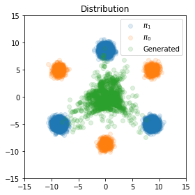

上一节系统阐述了流匹配的理论框架，但未涉及具体算法实现。本节将聚焦于矫正流（Rectified Flow）这一关键技术，该方法通过最优传输（Optimal Transport, OT）理论构建路径优化机制。根据前文所述，最优传输理论上提供了初始分布到目标分布的最短路径（直线，但学术名词是 Wasserstein 几何中的测地线），但在实际算法设计中，如何参数化这条理论最优路径并保证计算可行性仍是未解难题。本节将深入剖析矫正流的算法设计框架，揭示其如何通过连续可逆变换逼近理论最优路径，同时解决传统流模型在高维数据中的优化难题。

本文主要参考自论文《Flow Straight and Fast:  Learning to Generate and Transfer Data with Rectified Flow》，后续将简称为“RectFlow论文”。
### 2.5.1 走直线迷路了
上一篇我们提到了，从一个分布变到另一个分布，最优传输就是走直线。走直线的方法有两个：一个适用于训练，如公式（2.4.11） $\arg\min_{v} \int_0^1 \mathbb{E}[|| X_1-X_0 - v_t(X_t,\theta) ||^2] \mathrm{d} t$；一个适用于采样如ODE公式（2.4.9）$\frac{\mathrm{d}}{\mathrm{d}t} = v_t(Z_{t},\theta),Z_0\sim \pi_0$ 。
但是采样的ODE有一个很重要的问题，这个走直线方向是模型预测的，模型预测就会出现错误。RectFlow论文认为这种错误集中在交叉路径。请看下图。

上图是两个分布，三个橘色的圈是初始分布，用 $\pi_0$ 表示；三个蓝色的圈是终止分布，用 $\pi_1$ 表示。我们假设已经训练完了向量场流模型 $v_t(x,\theta)$。需要训练流匹配模型，让从 $\pi_0$ 采样的 $X_0$ 转化为服从 $\pi_1$ 分布的 $X_1$。下图中的绿色小球就是这样生成的 $X_1$。

（生成结果分布图）

从上图可知，很多算法生成的绿色小球没有在指定的 $\pi_1$ 分布上，似乎是 $X_0$ 在走直线时迷路了。这就是流匹配模型预测错误的情况。我们将这些结果的概率路径可视化，可得到下面流匹配路线图

(流匹配模型的若干采样变化路线图)

在相关研究中我们发现，采样生成路径存在着令人惊讶的现象：部分采样生成的路径并非呈直线，而是出现了明显的大转弯。
我们解释一下这种情况，下图左边紫色的部分是初始分布 $\pi_0$ ，右边红色的部分是终止分布 $\pi_1$。假设在训练时从 $\pi_0$ 取样的 $X_0$ 和从 $\pi_1$ 取样的 $X_1$ 组成的 $(X_0,X_1)$ 是随机配对。那么会有如下的配对图：

由此我们可以合理推测，那些出现偏差的采样，本质上是流模型在执行到路径分叉路口时，难以做出正确的决策。有些采样路径做了一个大转弯，有些采样直接失败。因此，一个关键问题亟待解决，即如何让流模型在类似 “**迷宫的十字路口**” 这样的情境下，能够大胆地选择直线前行；若无法走直线，至少也要确保沿着曲线能够最终到达目标分布。 RectFlow 论文就是解决这一问题而开展的研究。

### 2.5.2 模型重训
#### 2.5.2.1 针对流方向矫正的模型优化：Rectified Flow 矫正流
我们先描述一下训练阶段的循环直线矫正方案，通过这个方法可以矫正模型的流方向：
假设我们从 $\pi_0$ 里采样出 $X_0$ ，那么第一轮就有：
- 根据ODE模拟学出的flow得到 $Z^1_1=\text{ODE}(X_0)=\text{Flow}_1(X_0)$，我们叫它1-Rectified Flow。我们用得到的 $Z^1_1$ 可配得的 $(Z^1_0,Z^1_1)$ 对（其中$Z^1_0=X_0$）。这里的 $Z^1_0$ 上角标不是1次方的意思，而是第一轮编号的意思，不要理解错，下面的上角标同理。
- 继承上一轮得到的 $(Z^1_0,Z^1_1)$ ，并看成 $(X_0,X_1)$。根据公式（2.4.11） $\arg\min_{v} \int_0^1 \mathbb{E}[|| X_1-X_0 - v_t(X_t,\theta) ||^2] \mathrm{d}$ 训练新模型。根据ODE模拟学出的flow得到 $Z^2_1=\text{ODE}(Z^1_0)$ 得到 $(Z^2_0,Z^2_1)$ （其中$Z^2_0=X_0$），这就是一轮新的"2-Rectified Flow"。
- 继续计算，继承上一轮得到的 $(Z^{k-1}_0,Z^{k-1}_1)$ ，并看成（$X_0,X_1$）。根据公式（2.4.11）训练新模型。根据ODE模拟学出的flow得到 $Z^{k}_1=\text{ODE}(Z^{k-1}_0)$ 得到 $(Z^{k}_0,Z^{k}_1)$ （其中$Z^{k}_0=X_0$），这就是一轮新的"k-Rectified Flow"。

伪代码如下：
```python
# 算法2：训练（Train）
# 输入：数据Data={(x0, x1)}，其中x0来自分布π0，x1来自分布π1
# 输出：Rectified flow的模型v(x, t)
def Train(Data):
    # 初始化模型
    # initialize Model
    for x0, x1 in Data:  # 遍历数据集中的每一对样本(x0, x1)
        # 梯度清零
        Optimizer.zero_grad()  
        # 随机采样t ∈ [0, 1]，batchsize为批次大小
        t = torch.rand(batchsize)  
        # 计算损失：模型预测值与目标值(x1 - x0)的均方误差
        Loss = (Model(t * x1 + (1 - t) * x0, t) - (x1 - x0)).pow(2).mean()  
        # 反向传播计算梯度
        Loss.backward()  
        # 更新模型参数
        Optimizer.step()  
    return Model  # 返回训练好的模型

# 算法3：采样（Sample）
# 输入：Rectified flow的模型v(x, t)
# 输出：Rectified coupling (Z0, Z1)的采样结果
def Sample(Model, Data):
    coupling = []  # 初始化采样结果列表
    for x0 in Data:  # 遍历数据集中的每个x0样本
        # 使用模型的ODE求解器从x0得到x1
        x1 = model.ODE_solver(x0)  
        coupling.append((x0, x1))  # 将(x0, x1)添加到采样结果列表
    return coupling  # 返回采样结果

# 算法4：矫正（Reflow）
# 输入：数据Data={(x0, x1)}
# 输出：第K次Rectified coupling的采样结果
def Reflow(Data, K):
    Coupling = Data  # 初始重流数据为原始数据
    for k in range(1, K + 1):  # 进行K次重流操作
        # 训练模型
        Model = Train(Coupling)  
        # 使用训练好的模型进行采样
        Coupling = Sample(Model, Data)  
    return Coupling  # 返回第K次重流后的采样结果
```

为什么这种方案可以将曲线取直？
一个不恰当的比喻。 $(X_0，X_1)$ 配对可看成找对象，一般考虑男配女就可以了，但是它里面有个“天生一对”的说法。因为“天生一对”命中注定姻缘的干扰让 $X_0$ 在找对象做选择时犹犹豫豫，还会走弯路。但是 “k-Rectified Flow” 的目的就是给 $X_0$ 一次重生机会开启找对象二周目，$X_0$ 重生后直接走直线找对象。但是 “k-Rectified Flow” 中 k的次数不要太高，否者误差积累，效果会更差。

#### 2.5.2.2 针对流采样次数的模型优化：Distillation 蒸馏
上面的采样算法还有一个问题：ODE的采样步骤太多了。我们现在把ODE求解器单独提出来，看看ODE采样步骤对整体结果的影响。请看下面两幅图片。


（使用ODE进行100步插值，即从 $X_0$ 到 $X_1$ 走100步）


（使用ODE进行1步插值，即从 $X_0$ 到 $X_1$ 走1步）

我们可知，如果插值步骤较少，大概率走不到最后。如果插值步骤越多，采样步骤越多，同时资源消耗也高，时间消耗也慢。按照以往做技术的想法，我们会想找一个中间合适的值，“中庸”一下。但是这里可不会玩 “中庸”，好的算法自然是全都要。这里使用蒸馏的方法进行路径学习。蒸馏模型的损失函数如下：
$$\min_{\theta}E[ {||( Z^k_1 - Z^k_0) - v_0(Z^k_0, \theta)||}^2] \tag{2.5.1}$$
请注意，这里公式（2.5.1）与之前公式（2.4.11）不一样，因为这里向量场 $v$ 的时间默认 $t=0$ 。这样做的目的是让向量场 $v$ 一步到位。这样我们就可以较少采样步数，加快生成。
虽然损失函数相似，但Distillation和Rectified Flow有本质的区别的，Distillation只是试图加快复现 $(X_0,X_1)$ 配对关系，只会机械地模仿，就算问题无解也要“硬做”。Rectified Flow和Distillation常常组合使用：先用Rectified Flow得到比较好的配对，最后再用已经配好的配对进行Distillation。

